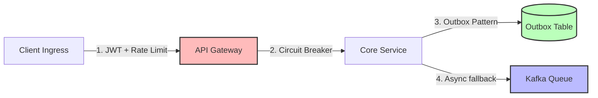

# Core Concept 00: The 45-Minute System Design Playbook

In a Staff+ system design interview, your technical expertise is evaluated alongside your **time management, communication style, and structural execution**. You have roughly 45 minutes to convert an ambiguous, open-ended prompt (e.g., *"Design Uber"*) into a highly concrete, production-grade architecture that scales to millions of users.

This playbook provides a battle-tested, time-framed framework designed to maximize your signal across all interview evaluation axes: **Requirements, Capacity Planning, High-Level Design, Technical Trade-Offs, and Resilience**.

---

## ⏱️ The 45-Minute Timeline Structure

Never start drawing architecture diagrams immediately. Managing your time block is crucial:

```
[00:00 - 00:05]  Requirement Gathering (Functional & Non-Functional)
[00:05 - 00:10]  Capacity Estimation & Sizing Constraints
[00:10 - 00:18]  High-Level Design & Core APIs
[00:18 - 00:38]  Deep-Dive: Scaling, Bottlenecks & Trade-Offs
[00:38 - 00:43]  Resilience, Security & Observability Guardrails
[00:43 - 00:45]  Wrap-Up & Quantitative Review
```

---

## 🧭 Step-by-Step Tactical Framework

### Step 1: Extract & Prioritize Requirements (0 - 5 min)

Most candidates list dozens of features and get bogged down in trivial details. A Staff+ engineer **strictly limits scope** to establish a clear architectural path.

#### A. Functional Requirements
*   Ask clarifying questions to identify the **core 2–3 user journeys** that must work.
*   *Rule of thumb*: Reject out-of-scope features explicitly. For example, if designing Uber, say: *"I will focus on passenger ride matching and real-time location tracking. I will explicitly exclude driver onboarding, rating systems, and payment processing history to ensure we deep-dive into the core scaling bottlenecks."*

#### B. Non-Functional Requirements (The Real Architecture Drivers)
Define your system boundaries using concrete metrics:
*   **Scale**: How many Daily Active Users (DAU) or Monthly Active Users (MAU)?
*   **Availability**: What is the target SLA? (e.g., $99.99\%$ availability $\rightarrow$ ~52 minutes of downtime/year).
*   **Latency**: What are the target read/write p99 response times? (e.g., p99 API latency < 100ms, write latency < 50ms).
*   **Consistency**: Does this system require strong ACID consistency (e.g., booking a seat, financial balance) or eventual consistency (e.g., user feed, view count)?

> [!TIP]
> **The Staff+ Differentiator**: Define the **Threat Model** and **SLA Boundaries** here. Ask: *"Are we designing for internal trusted services, or is this public-facing ingress requiring strict rate-limiting, DDoS mitigation, and mTLS?"*

---

### Step 2: Capacity Estimation & Constraint Sizing (5 - 10 min)

**Why do we do math?** In interviews, math is not a trivia game; it is the **justification for your design choices**. If you estimate 10 writes/sec, you do not need sharding. If you estimate 100,000 writes/sec, you must propose an LSM-tree database with horizontal partition sharding.

#### A. The Quick Conversion Guide (Memorize these)
*   $100\text{K requests / day} \approx 1.15\text{ QPS}$
*   $1\text{M requests / day} \approx 12\text{ QPS}$
*   $10\text{M requests / day} \approx 116\text{ QPS}$
*   $100\text{M requests / day} \approx 1{,}160\text{ QPS}$
*   $1\text{B requests / day} \approx 11{,}600\text{ QPS}$

#### B. Sizing Calculations Blueprint
To size any system under pressure, run these four equations:

```
1. Write QPS = (Daily Active Users * Daily Write Events) / 86,400
2. Read QPS = Write QPS * (Read-to-Write Ratio)
3. Storage / Year = Write QPS * Event Size (Bytes) * 86,400 * 365
4. Network Bandwidth = (QPS * Average Payload Size) * 8 bits
```

#### C. Concrete Example: Photo Ingestion Pipeline (e.g., Instagram)
*   **Assumptions**: $100\text{M}$ DAU. Each user uploads $1$ photo per day. Average photo size = $2\text{MB}$. Metadata = $500\text{ bytes}$.
*   **Write QPS**:
    $$\text{Write QPS} = \frac{100{,}000{,}000 \times 1}{86{,}400} \approx 1{,}150 \text{ uploads/sec}$$
    *Peak QPS (2x baseline)* = $2{,}300\text{ uploads/sec}$.
*   **Storage (Blob Storage - Photos)**:
    $$\text{Storage/day} = 100{,}000{,}000 \times 2\text{ MB} = 200\text{ TB/day}$$
    $$\text{Storage/year} \approx 200\text{ TB} \times 365 = 73\text{ PB/year}$$
*   **Storage (Metadata Database - Postgres)**:
    $$\text{Metadata/day} = 100{,}000{,}000 \times 500\text{ bytes} = 50\text{ GB/day}$$
    $$\text{Metadata/year} \approx 50\text{ GB} \times 365 = 18.25\text{ TB/year}$$
*   **Network Ingress Bandwidth**:
    $$\text{Ingress} = 1{,}150 \text{ uploads/sec} \times 2\text{ MB/upload} = 2.3\text{ GB/sec} = 18.4\text{ Gbps}$$

#### D. Architectural Action items Derived from this Math:
1.  **Ingress network capacity**: $18.4\text{ Gbps}$ cannot hit one load balancer or server. We need **Anycast DNS routing** to distribute ingress across multiple regional CDN and L4 gateway nodes.
2.  **Metadata storage scale**: $18\text{ TB/year}$ exceeds safe single-node Postgres replication limits. We must design a **sharded Postgres cluster** or choose a horizontally scalable Wide-Column NoSQL DB like **Cassandra/DynamoDB**.
3.  **Blob storage scale**: $73\text{ PB/year}$ makes traditional block storage impossible. We must use cloud **Object Storage (S3)** paired with direct-to-S3 client uploads via **Pre-signed URLs** to bypass application servers.

---

### Step 3: High-Level Design & Core APIs (10 - 18 min)

Draw the end-to-end request flow. A complete HLD requires three elements:

#### 1. The High-Level Architecture Diagram
Draw a block diagram showing:
*   **Clients** (Web, Mobile)
*   **L4/L7 Ingress** (Anycast DNS $\rightarrow$ CDN Edge $\rightarrow$ API Gateway with Rate-Limiting & Auth)
*   **Core Stateless Microservices** (Write-path API, Read-path API)
*   **Storage & Messaging Tiers** (Cache, Relational/NoSQL databases, Message Broker, Object Store)

#### 2. The Core API Contracts
Write clean REST endpoints or gRPC signatures for the primary actions. Ensure they are idempotent.
*   **Example: Photo Upload Initiation**
    ```http
    POST /v1/photos/upload-intent
    Headers:
      Authorization: Bearer <JWT>
      X-Idempotency-Key: <UUID>
    Request Body:
      {
        "file_name": "vacation.jpg",
        "content_type": "image/jpeg",
        "file_size_bytes": 2097152
      }
    Response: 201 Created
      {
        "photo_id": "photo_abc123",
        "upload_url": "https://s3.amazonaws.com/bucket/photo_abc123?AWSAccessKeyId=...",
        "expires_at": "2026-05-21T19:30:00Z"
      }
    ```

#### 3. Core Database Schemas
Model the primary tables. Explicitly define:
*   **Data Types**
*   **Indexes** (Primary, Partition, Composite, Clustering keys)
*   **Soft Delete** strategies

*   **Example: Metadata Store Table (`photos`)**
    ```sql
    CREATE TABLE photos (
        id VARCHAR(64) PRIMARY KEY, -- Opaque ID (Snowflake generated)
        owner_id VARCHAR(64) NOT NULL, -- Indexed for fast feed generation
        s3_url VARCHAR(256) NOT NULL,
        status VARCHAR(16) NOT NULL, -- PENDING_UPLOAD, ACTIVE, BLOCKED
        created_at TIMESTAMP WITH TIME ZONE DEFAULT CURRENT_TIMESTAMP NOT NULL,
        is_deleted BOOLEAN DEFAULT FALSE NOT NULL -- Soft delete marker
    );
    CREATE INDEX idx_photos_owner_created ON photos (owner_id, created_at DESC);
    ```

---

### Step 4: Making Technical Trade-Offs (18 - 38 min)

This is the core of the interview. Do not present a single option as "the correct way." A Staff+ engineer frames every system architecture as a series of deliberate choices between viable solutions.

#### How to Structure a Trade-Off Conversation
1.  **Introduce the Dilemma**: *"For our metadata storage, we have a classic conflict: do we prioritize ACID consistency or horizontal write scalability?"*
2.  **Evaluate Option A (SQL / Postgres)**:
    *   *Pros*: Strong transactions, complex join capability, mature ecosystem.
    *   *Cons*: Difficult to scale horizontally; master failover causes write downtime; expensive.
3.  **Evaluate Option B (NoSQL / DynamoDB)**:
    *   *Pros*: Horizontal partition scaling, single-digit millisecond latency at any scale, serverless operation.
    *   *Cons*: Limited query capabilities (must predict query patterns for GSI design), eventual consistency by default.
4.  **Make the Call Grounded in the Math**: *"Since our write traffic is 1,150 uploads/sec ($18\text{ TB/year}$), Postgres can handle the QPS easily on a single master. However, over 5 years, a single master will struggle with $90\text{ TB}$ of index size. Therefore, I will use PostgreSQL sharded by `owner_id` (User ID). This keeps reads local to a single shard (no cross-shard joins) while scaling writes horizontally indefinitely."*

#### Core Trade-Off Framework Reference Matrix

| Architectural Dilemma | Option A | Option B | When to Choose A | When to Choose B |
|---|---|---|---|---|
| **Consensus / Locking** | **Pessimistic Locking** | **Optimistic Concurrency (OCC)** | High contention, strict correctness required (money ledger) | Low-to-medium contention, read-heavy workloads |
| **Microservice Sagas** | **Orchestrator Saga** | **Choreography Saga** | Complex workflows, multiple steps, tight control needed | Simple workflows, high throughput, loose coupling |
| **Database Engines** | **B-Tree (Postgres)** | **LSM-Tree (Cassandra)** | Complex relational queries, high read-to-write ratio | Massive sequential write ingestion, time-series, log data |
| **Real-time Protocol** | **Server-Sent Events (SSE)** | **WebSockets** | Unidirectional server-to-client push (stock prices, feeds) | Bidirectional communication (real-time chat, multiplayer) |
| **Distributed Locks** | **Redis Redlock** | **etcd / ZooKeeper** | High throughput, best-effort locking, rate-limiting | Strict correctness, zero tolerance for double lease execution |

---

### Step 5: Resilience, Security & Observability (38 - 43 min)

To secure a Staff+ ranking, you must demonstrate **production readiness**. Dedicate 5 minutes to explaining what happens when things fail.



#### A. Security Considerations
*   **Authentication & Ingress Security**: OAuth2/PKCE tokens verified at the API Gateway. Never allow unauthenticated requests into your microservice mesh.
*   **Network Isolation**: Secure all internal microservice-to-microservice traffic using **mTLS (Mutual TLS)** with short-lived certificates issued via SPIFFE/Spire.
*   **Data Protection**: Encrypt data at rest (envelope encryption using AWS KMS / HashiCorp Vault) and in transit (TLS 1.3). Hash passwords using **Argon2id**.

#### B. Resiliency Guardrails
*   **Network Failures**: Implement **Exponential Backoff with Random Jitter** on all client and server-to-server retries to avoid self-inflicted Denial of Service (thundering herd problem).
    $$T_{\text{wait}} = 2^{\text{retry}} \times \text{Base} \pm \text{Random Jitter}$$
*   **Cascading Failures**: Wrap external HTTP integrations in **Circuit Breakers** (e.g., Resilience4j) to fail fast when downstream services are degraded, protecting your local thread pool.
*   **Durable Event Publishing**: Propose the **Transactional Outbox Pattern** to prevent dual-write bugs when updating the database and sending messages.

#### C. Observability
*   **Distributed Tracing**: Inject **OpenTelemetry correlation IDs** at the API Gateway to trace requests across asynchronous queues and microservices.
*   **Alerting**: Monitor the **Golden Signals**: Latency (p99/p50), Traffic (QPS), Errors (5xx rate), and Saturation (CPU/Memory utilization).

---

### Step 6: Wrap-Up & Quantitative Review (43 - 45 min)

Spend the final 2 minutes summarizing your architecture against the requirements:
1.  **Acknowledge remaining risks**: *"Our consistent hash ring will drop active WebSocket connections during rolling deployments, which we must mitigate using Load Balancer connection draining and client-side retry smoothing."*
2.  **Verify the scale**: *"We estimated 2,300 peak upload QPS. By using direct-to-S3 presigned URLs, we have successfully removed image payload traffic from our API Gateway. Our sharded metadata Postgres database will easily handle this write scale."*
3.  **End with authority**: Ask the interviewer if they want to zoom in on any specific failure modes or write path compactions.

---

## 💡 The "Interview Cheat Sheet" Template

Use this mental checklist during the first 10 minutes of every system design interview:

*   [ ] **Identify the bottleneck**: Is this a Read problem, a Write problem, a Concurrency problem, or a Workflow problem?
*   [ ] **State your defaults first**: Postgres (default OLTP), Redis (default Cache), Kafka (default Event Bus), REST over HTTPS/TLS (default API). Do not suggest Cassandra or Flink immediately unless the math warrants it.
*   [ ] **Calculate constraints early**: Write QPS, Read QPS, Storage per Year, Bandwidth.
*   [ ] **Proactive Security**: Auth at gateway, mTLS internally, KMS envelope encryption, rate limiting.
*   [ ] **Proactive Resiliency**: Retries with backoff + jitter, circuit breakers, outbox patterns, dead-letter queues.
