# System Design Interview Delivery Framework

> **Target audience:** Staff+ backend engineers  
> **Covers:** How to structure a 45-minute system design interview from start to finish — requirements, estimation, API, high-level design, deep dives, trade-offs

---

## The Problem With Unstructured Answers

Most candidates who struggle in system design interviews don't fail because they lack knowledge. They fail because they:
- Jump straight into drawing boxes without establishing requirements
- Never estimate scale, so they can't justify design choices
- Talk about one component for 30 minutes and run out of time
- Wait for the interviewer to guide them rather than driving

A delivery framework solves this. It gives you a repeatable structure that demonstrates seniority, manages time, and ensures you hit every dimension the interviewer is evaluating.

---

## The 45-Minute Framework

```
Phase                          Time      Goal
─────────────────────────────────────────────────────────────────
1. Requirements Clarification  5 min     Nail the scope; surface hidden constraints
2. Capacity Estimation         5 min     Justify technology choices with numbers
3. API Design                  5 min     Define the interface before internals
4. High-Level Design           10 min    Draw the skeleton; get buy-in
5. Deep Dives                  15 min    Go deep on 2–3 interesting sub-problems
6. Trade-offs & Wrap-up        5 min     Summarize decisions; show self-awareness
─────────────────────────────────────────────────────────────────
```



```mermaid
gantt
    title 45-Minute System Design Interview Timeline
    dateFormat  m
    axisFormat %M
    section Phase
    Requirements Clarification (5m) :a1, 0, 5m
    Capacity Estimation (5m)        :a2, after a1, 5m
    API Design (5m)                 :a3, after a2, 5m
    High-Level Design (10m)         :a4, after a3, 10m
    Deep Dives (15m)                :a5, after a4, 15m
    Trade-offs & Wrap-up (5m)       :a6, after a5, 5m
```

The exact timing flexes based on the problem, but this sequence is always right.


---

## Phase 1: Requirements Clarification (5 min)

Never start designing. Start by understanding **what you're actually building**.

### Functional Requirements — What the System Does

Ask about the core user actions. Drive toward a short, agreed list of features:

```
Bad: "So it's basically like Twitter, right?"

Good:
  "Let me make sure I understand the scope. There are a few things I want to nail down:
   - Are we building posting AND feed, or just one of them?
   - Do we need to support media (images, video) or text only to start?
   - What about likes, follows, replies — core or out of scope?
   I want to focus on [posting, feed, follow] for this session and park the rest."
```

**Write the functional requirements as a numbered list on the board.** This becomes your checklist for the design.

### Non-Functional Requirements — The Constraints

These drive every technology choice. Ask explicitly:

```
Scale:        "Roughly how many daily active users are we targeting?"
              "What's the read/write ratio?"
Latency:      "Is there a latency SLA? Is sub-100ms important for feed loads?"
Consistency:  "If I post a tweet, does every follower need to see it immediately,
               or is a few seconds of lag acceptable?"
Availability: "What's our target uptime — 99.9%, 99.99%?"
Durability:   "Is data loss ever acceptable? Even a few seconds on crash?"
Geo:          "Is this single-region or globally distributed?"
```

**The answers to these questions determine your entire design.** An interview about a 1M DAU system has a completely different correct answer than a 500M DAU system.

### State the Scope Explicitly

End requirements with a clear statement:
```
"OK, so we're building: [1] user posting tweets, [2] follower feed with reasonable
 latency (a few seconds is fine), [3] likes and follow counts. We're targeting
 100M DAU, mostly reads (100:1 read/write), and eventual consistency on feeds is
 acceptable. Did I capture that correctly?"
```

This forces the interviewer to confirm or correct before you spend time on the wrong problem.

---

## Phase 2: Capacity Estimation (5 min)

Numbers anchor every design choice. Without them you can't justify:
- Why you need Redis (cache hit rate math)
- Why you need sharding (write throughput exceeds single-node)
- Why you need a CDN (bandwidth numbers)

### The Estimation Template

```
Traffic:
  DAU: 100M users
  Writes: 1 tweet/user/day → 100M writes/day → 1,200 writes/sec (avg) → ~6K peak
  Reads: 100 reads/user/day → 10B reads/day → 115,000 reads/sec → ~600K peak

Storage:
  Tweet size: 300 bytes text + 100 bytes metadata = 400 bytes
  Daily storage: 100M × 400 bytes = 40 GB/day
  5-year retention: 40 GB × 365 × 5 = 73 TB (raw)
  With 3× replication: ~220 TB

Bandwidth:
  Read: 600K req/sec × 400 bytes = 240 MB/sec (text only)
  With media (avg 50KB/tweet): 30 GB/sec → CDN mandatory
```

### What Numbers Tell You

| Number | Implication |
|--------|------------|
| > 10K writes/sec | Consider sharding or Cassandra |
| > 100K reads/sec | Cache layer mandatory; read replicas |
| > 1TB/day storage | Distributed storage, tiered retention |
| > 10 GB/sec bandwidth | CDN essential |
| Tiny numbers | Single Postgres instance is probably fine |

**Say this out loud:** "At 600K read QPS, we clearly need a cache layer — a single Postgres instance can handle ~50K QPS at best. With a 95% cache hit rate, we reduce DB load to ~30K QPS which a single primary with a couple read replicas can handle."

---

## Phase 3: API Design (5 min)

Define the external interface before the internal implementation. This:
- Forces you to think about what the system actually does
- Gives you concrete endpoints to design around
- Shows the interviewer you understand API design principles

### Format

```
POST   /tweets                     Create a tweet
GET    /tweets/{id}                Fetch a tweet
GET    /users/{id}/feed            Paginated home timeline
POST   /users/{follow_id}/follow   Follow a user
DELETE /users/{follow_id}/follow   Unfollow

Key design notes:
  - Feed uses cursor-based pagination (not offset)
  - POST /tweets uses Idempotency-Key header to prevent duplicates
  - Feed is eventually consistent — no strong consistency SLA
```

Keep it to the 3–5 most important endpoints. Don't spec every field — just method, path, and one-line purpose.

---

## Phase 4: High-Level Design (10 min)

Draw the architecture. Start with the simplest possible design that satisfies functional requirements, then add complexity only where the non-functional requirements demand it.

### The Sketch Order

```
1. Client
2. Load Balancer / API Gateway
3. Application servers
4. Primary database
5. Cache layer (if needed by scale)
6. Message queue (if async processing needed)
7. Additional services (as complexity requires)
```

**Narrate as you draw:**
```
"Starting simple: clients hit our API servers through a load balancer.
 Writes go to Postgres — at 6K writes/sec that's well within Postgres range.
 
 For reads at 600K QPS, Postgres alone can't handle that — so I'll add Redis
 as a cache layer. With 95% hit rate, only 30K QPS reaches Postgres.
 
 For the feed, I'll use a fan-out-on-write approach for users with < 10K
 followers — pre-compute the feed into Redis. Celebrity accounts (10M+ followers)
 will use fan-out-on-read to avoid the fan-out write storm.
 
 I'll add Kafka here to decouple the write path — when a tweet is written,
 we publish to Kafka, and the fan-out workers consume it to update follower feeds."
```

### The Fan-Out Decision (Common Interview Thread)

```
Fan-out on write (push model):
  ✅ Feed reads are instant (pre-materialized in Redis)
  ❌ Write amplification: 1 tweet × 1M followers = 1M Redis writes
  → Use for users with < N followers

Fan-out on read (pull model):
  ✅ No write amplification
  ❌ Feed reads are expensive (merge N timelines at read time)
  → Use for celebrities / high-follower-count accounts

Hybrid (most production systems):
  → Push for normal users, pull for celebrities
  → Identify "celebrity" threshold based on your scale numbers
```

---

## Phase 5: Deep Dives (15 min)

This is where staff-level candidates differentiate themselves. You drive the deep dives, not the interviewer.

### How to Transition

After high-level:
```
"I'm happy with the skeleton. Let me go deeper on the parts I think are most
 interesting or risky. I'd like to talk about:
 1. How the fan-out service handles celebrity accounts
 2. The feed ranking and caching strategy
 3. How we handle the thundering herd on popular tweets
 
 Which of these is most interesting to you, or is there something else
 you'd like to dig into?"
```

Always give the interviewer a choice — they may have a specific area they want to probe.

### Deep Dive Template

For each component you dive into:
1. **State the problem** clearly
2. **Present 2–3 options** with trade-offs
3. **Make a recommendation** and justify it
4. **Acknowledge what you'd validate** with data/load testing

```
"The fan-out problem for celebrity accounts:

Option 1: Fan-out on write anyway (brute force)
  Pro: Simple, consistent implementation
  Con: 1M Redis writes per tweet × 1000 celebrity posts/hour = 1B writes/hour
  → Not viable at this scale

Option 2: Fan-out on read for all
  Pro: No write amplification
  Con: Reading a feed means fetching from 500 followed users' timelines,
       sorting by time — too slow at read time

Option 3: Hybrid with threshold (what I'd recommend)
  Normal users (< 10K followers): fan-out on write → feed pre-built in Redis
  Celebrities (≥ 10K followers): fan-out on read at query time, cached for 30s
  At feed read time: merge pre-built feed + real-time celebrity posts
  
  This is what Twitter actually does. The '10K threshold' should be data-driven —
  I'd A/B test to find where read latency exceeds our SLA."
```

### Staff-Level Signals to Demonstrate

- **Quantify trade-offs:** "This adds 50ms of latency but reduces DB load by 80%"
- **Mention failure modes:** "What happens if Kafka is down? We need a dead-letter queue and retry"
- **Security awareness:** "Fan-out workers must verify the user still follows the poster before writing to their feed"
- **Operational concerns:** "How do we monitor feed freshness? I'd add a p99 metric for time-to-feed"
- **Acknowledge uncertainty:** "I'd validate this with load testing before committing to this design"

---

## Phase 6: Trade-offs and Wrap-up (5 min)

End with a structured summary. This shows self-awareness and prevents the interview from just trailing off.

```
"Let me summarize the key decisions and their trade-offs:

1. Cache-aside with Redis for the feed
   Trade-off: eventual consistency (up to 30s lag on new tweets)
   We accepted this because the NFR allowed eventual consistency

2. Hybrid fan-out
   Trade-off: more complexity in the fan-out service
   We needed this to stay within write budget at 100M DAU

3. Postgres for tweet storage, sharded by user_id
   Trade-off: cross-user queries (trending, search) need secondary indexes
   I'd put Elasticsearch alongside for search — synced via Kafka

What I'd revisit with more time:
  - Media storage design (S3 + CDN architecture)
  - The notification system (push vs pull for mobile)
  - Multi-region replication for global users

Any areas you'd like to go deeper on?"
```

---

## The Delivery Anti-Patterns

These are what interviewers mark you down for:

| Anti-Pattern | What It Signals | Fix |
|-------------|----------------|-----|
| Starting to draw immediately | Junior thinking — build before scope | Always clarify requirements first |
| Waiting for interviewer to ask questions | Lack of ownership | Drive the interview yourself |
| Saying "it depends" without resolving | Avoidance | "It depends on X. Given our requirements, I'd choose Y because..." |
| One correct answer, no alternatives | Narrow thinking | Always present 2–3 options and pick one |
| Ignoring non-functional requirements | Not thinking at scale | Explicitly reference your estimates when making choices |
| Over-engineering from the start | Insecurity | Start simple, add complexity only when requirements demand it |
| Running out of time on one component | Poor time management | Set internal timers; breadth over depth in phase 4 |

---

## Scoring Rubric (What Interviewers Evaluate)

| Dimension | What They're Looking For |
|-----------|------------------------|
| **Problem Solving** | Do you break the problem down systematically? |
| **Technical Depth** | Do you understand how technologies work internally? |
| **Scale Awareness** | Do you reason with numbers and identify bottlenecks? |
| **Communication** | Is your explanation clear? Do you explain your reasoning? |
| **Trade-off Analysis** | Do you acknowledge limitations of your choices? |
| **Seniority Signal** | Do you proactively surface risks, security concerns, operational issues? |

---

## Quickstart Checklist

Before every practice session:
- [ ] I will NOT draw anything for the first 5 minutes
- [ ] I will state functional requirements as a numbered list
- [ ] I will ask explicitly about scale, latency, and consistency
- [ ] I will do a back-of-envelope calculation before choosing databases
- [ ] I will define 3–5 API endpoints before drawing the architecture
- [ ] I will present alternatives before making decisions
- [ ] I will reference my requirements/estimates when justifying choices
- [ ] I will drive the deep dives, not wait to be asked

---

*This framework applies to all system design problems. See individual problem breakdowns for how it applies to specific designs.*
