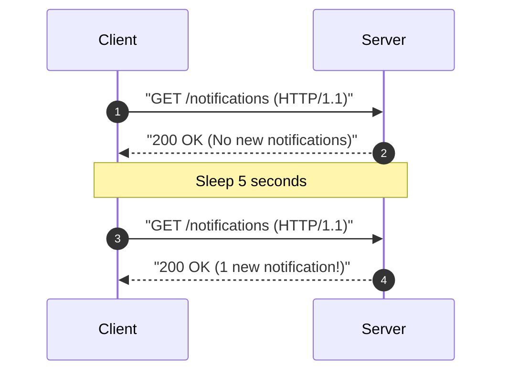
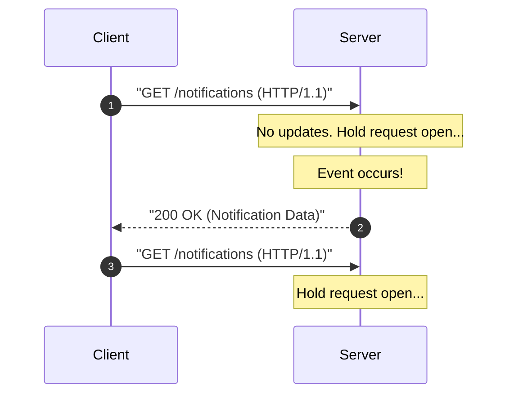
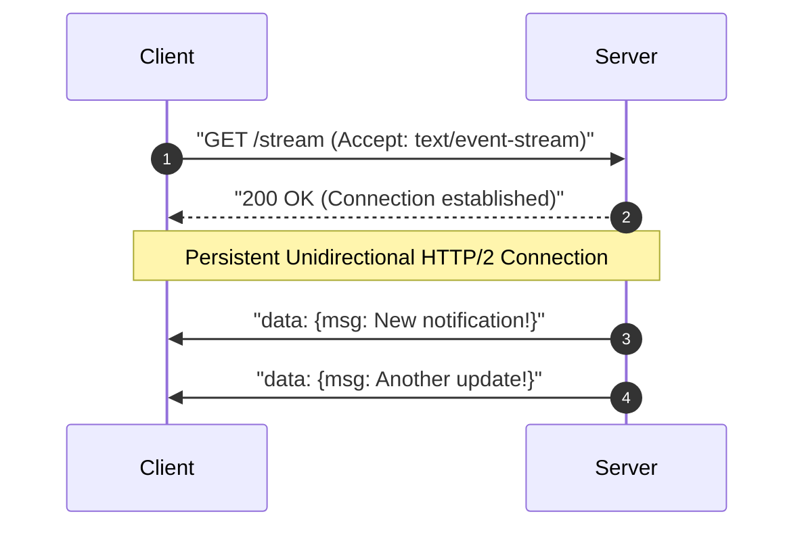
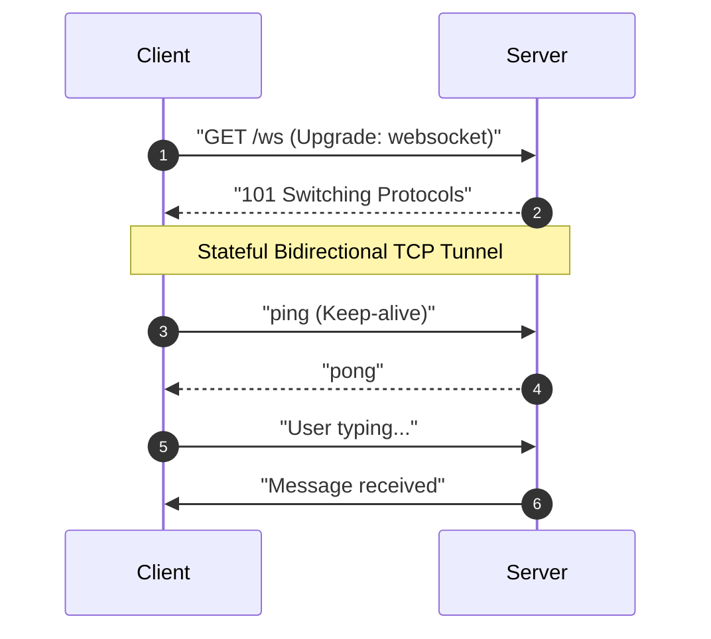
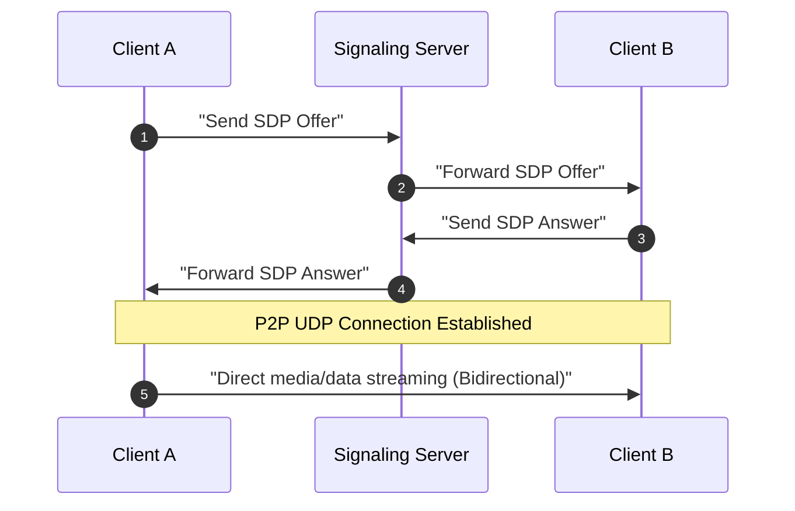
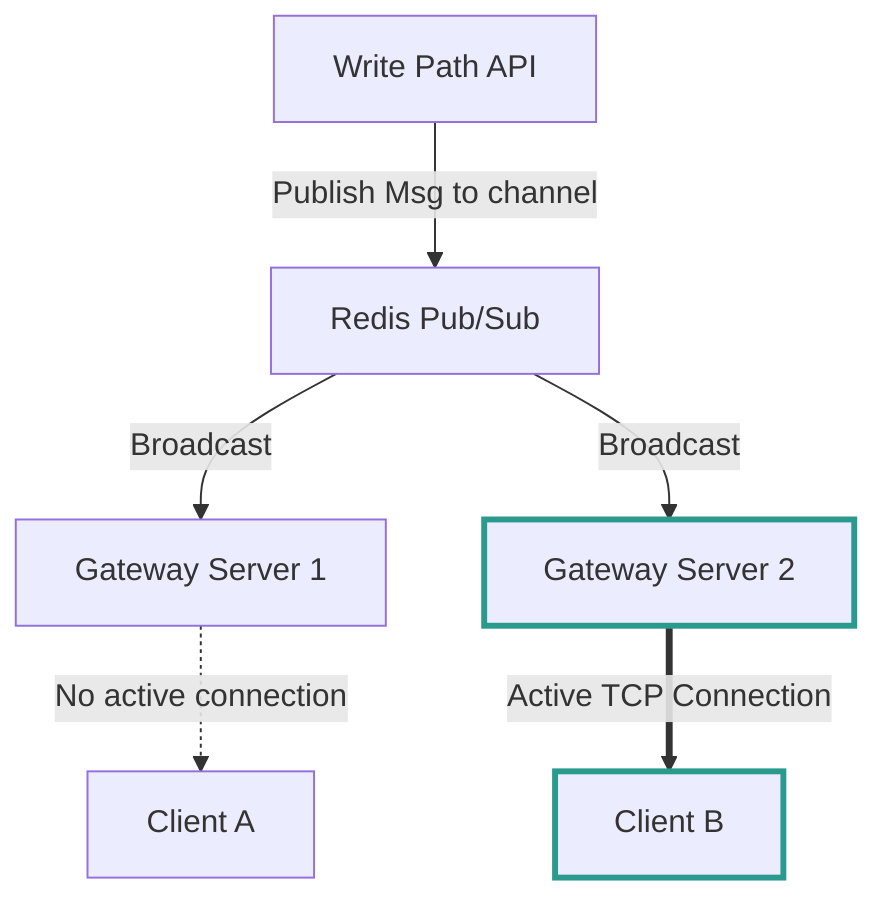
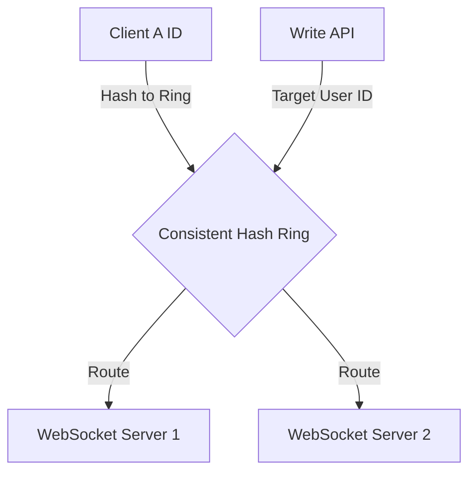

# Pattern 01: Real-time Updates

The **Real-time Updates** pattern addresses the architectural challenge of pushing immediate notifications and data changes from a server to clients as events occur, rather than waiting for the client to ask for them.

---

## 1. The Core Architecture: The Two Hops of Real-Time

When designing a real-time system, think of the system as having **two distinct communication hops**:

1.  **Hop 1: Source to Server (Ingestion):** How the system receives the event or change from the source (e.g., a driver's GPS device posting coordinate updates, or a chat client writing a message).
2.  **Hop 2: Server to Client (Push):** How the server routes and pushes that update to the specific active user(s) listening for it.

```
+---------------+     Hop 1 (Ingestion)      +------------------+     Hop 2 (Push)      +----------------+
| Ingestion Src |  =======================>  | Stateful Servers |  ==================>  | Active Clients |
| (e.g. Writer) |    Stateless REST/gRPC     |  (Gateway Nodes)  |  WebSockets/SSE/Poll |  (Web/Mobile)  |
+---------------+                            +------------------+                       +----------------+
```

---

## 2. Client-Server Connection Protocols (Hop 2 Options)

The choice of protocol determines how the server pushes data to the client. Let's explore the 5 primary options.

### A. Simple Polling (Short Polling)
*The Baseline (Pull instead of Push)*

The client repeatedly sends traditional HTTP requests to the server on a fixed schedule (e.g., every 5 seconds).



*   **Trade-offs:**
    *   **Pros:** Extremely simple; stateless; works natively with standard HTTP/1.1 and Layer 7 load balancers; no persistent connections to maintain.
    *   **Cons:** Enormous resource waste (thousands of empty requests/responses); high database load; high latency (up to the sleep interval).
    *   **Resource Equation:**
        $$\text{Total Requests/sec} = \frac{\text{Active Users}}{\text{Polling Interval (seconds)}}$$
        *Example: 10,000 active users polling every 1 second = 10,000 req/sec hitting your backend, even if 99% return no data!*

---

### B. Long Polling
*The "Hanging GET" (Semi-Push)*

The client sends an HTTP request, but the server **holds the request open** (hangs) until new data is available or a timeout occurs. Once the client receives a response, it immediately opens a new request. Long polling remains a practical fallback for delivering [asynchronous task completion status](./07_long_running_tasks.md) when WebSockets are unavailable.



*   **Trade-offs:**
    *   **Pros:** Lower latency than short polling; fallback protocol for environments blocking WebSockets.
    *   **Cons:** Server-side resource drain (each open request holds an operating system thread or file descriptor); complicated timeout and retry logic; browser limits (maximum 6 connections per domain).

---

### C. Server-Sent Events (SSE)
*The Unidirectional Stream*

A persistent, one-way connection from server to client over standard HTTP. The client initiates a connection, and the server keeps it open, sending data in a lightweight, text-based stream (`text/event-stream`).



*   **Trade-offs:**
    *   **Pros:** Lightweight and simple to implement; built-in automatic browser reconnection with last-event IDs; works over standard HTTP/2 (allowing multiplexing); built-in backpressure.
    *   **Cons:** Breaks synchronous response loops. The client cannot receive an immediate confirmation of the write. The architecture must introduce a **status poll** or **WebSocket update** to inform the user when the request completes — see [Pattern 07: Long-Running Tasks](./07_long_running_tasks.md) for the full async task completion pattern. Unidirectional only (client cannot send data back over this connection); limited browser support outside of web environments (e.g., standard iOS/Android sockets require custom wrappers); vulnerable to HTTP/1.1 connection exhaustion limits if HTTP/2 is not supported.

---

### D. WebSockets
*The Full-Duplex Champion*

A persistent, bidirectional, full-duplex connection between client and server. It starts as an HTTP request and "upgrades" to a stateful WebSocket TCP connection.



*   **Trade-offs:**
    *   **Pros:** Ultra-low latency; bidirectional communication; highly efficient framing (1-2 bytes overhead per message vs. hundreds of bytes of HTTP headers).
    *   **Cons:** Statefulness prevents simple horizontal scaling; requires Layer 4 load balancing (TCP stream routing); no automatic reconnection (must be implemented in client code); bypasses standard HTTP caching and security middleware.

---

### E. WebRTC
*The Peer-to-Peer Solution*

Direct browser-to-browser (peer-to-peer) communication. A server is only required during signaling (initial connection setup) and STUN/TURN traversal (bypassing NAT/firewalls).



*   **Trade-offs:**
    *   **Pros:** Lowest possible latency (no intermediate server hop); zero server bandwidth cost for raw media streams.
    *   **Cons:** High implementation complexity; hard to scale for multi-user scenarios (requires Selective Forwarding Units (SFUs)); firewalls and symmetric NATs block direct connections in up to 20% of cases, requiring expensive TURN relay servers.
    *   **STUN vs TURN — NAT Traversal Deep Dive:**
        *   **STUN (Session Traversal Utilities for NAT):** A lightweight protocol where the client queries a STUN server to discover its public IP and port mapping. The peer then uses this information for direct NAT hole-punching. STUN servers are cheap to operate (minimal bandwidth) and successfully establish direct P2P connections in **~80% of cases** (full-cone, restricted-cone, and port-restricted NATs).
        *   **TURN (Traversal Using Relays around NAT):** A full media relay server that forwards all traffic between peers. Required when symmetric NATs (common in enterprise networks) block direct hole-punching. TURN servers carry **100% of the media bandwidth cost**, making them 10-50x more expensive to operate than STUN. Budget rule of thumb: plan for ~20% of sessions requiring TURN relay.
        *   **ICE (Interactive Connectivity Establishment):** The umbrella framework that tries connection methods in order: host candidates → STUN (server-reflexive) → TURN (relay), selecting the lowest-latency successful path.

---

## 3. Protocol Comparison Cheat Sheet

| Metric | Simple Polling | Long Polling | Server-Sent Events (SSE) | WebSockets | WebRTC |
|---|---|---|---|---|---|
| **Direction** | Client $\rightarrow$ Server | Client $\rightarrow$ Server | Server $\rightarrow$ Client | Bidirectional | Peer-to-Peer |
| **Protocol** | Standard HTTP | Standard HTTP | Standard HTTP (HTTP/2) | Custom TCP (`ws://`) | UDP Data Channel |
| **Latency** | High | Medium | Low | Ultra-Low | Extreme Low |
| **Scaling Complexity** | Trivial | Easy | Hard (Stateful) | Very Hard (Stateful) | Extreme (Signaling/STUN/TURN) |
| **Reconnection** | Native | Manual | Native | Manual | Manual |
| **Ideal Use Case** | Trivial dashboard | Fallback socket | Tickers, live score feeds, ChatGPT streams | Chat, multiplayer gaming, collaborative editor | Video/audio calls, P2P file sharing |

---

## 4. Server-Side Push Routing & Scale (The Complex Part)

If you select a stateful protocol (WebSockets or SSE), you cannot scale horizontally by simply adding stateless server instances. If **Client A** is connected to **Server 1**, and **Server 2** receives the message intended for **Client A**, how does the message get routed to the correct server?

### Pattern A: Pushing via Pub/Sub (Broker Fan-Out)
We use a message broker (e.g., Redis Pub/Sub, Kafka, or RabbitMQ) to broadcast messages across all stateful server nodes.

1.  Each server subscribes to a shared message broker cluster.
2.  When a write occurs, the message is published to a channel (e.g., `user_123_channel`).
3.  Every server receives the broadcast, but **only** the server that holds the active TCP connection to `user_123` pushes the update down the socket.



*   **Pros:** Simple to implement; highly decoupled.
    *   **Cons:** "O(N * M)" scaling bottleneck where $N$ is the number of servers and $M$ is the number of messages. As servers grow, broadcasting wastes substantial server-to-server bandwidth.

---

### Pattern B: Pushing via Consistent Hash Routing
Instead of broadcasting to all servers, we route messages directly to the specific server holding the connection, using a Consistent Hash Ring (based on `user_id`).

1.  A Consistent Hash Ring assigns both gateway servers and `user_id`s to a 360-degree virtual ring.
2.  Both the client (when establishing a WebSocket connection) and the write-path service (when routing messages) use the same hash ring to locate the target Gateway Server.



*   **Pros:** Zero broadcast overhead; highly efficient point-to-point routing ($O(1)$).
    *   **Cons:** Server node additions or removals trigger connection rebalancing, which can drop sockets and cause reconnection storms.

### Connection Draining During Rolling Deployments

When performing rolling deployments or scaling down gateway servers, abruptly terminating a node drops all active WebSocket/SSE connections, triggering reconnection storms (see Q1 below). The solution is **connection draining**: the load balancer marks the node as "draining" so it stops accepting *new* connections, while existing connections are given a grace period (e.g., 30-60 seconds) to complete in-flight messages and gracefully close. Kubernetes supports this via `terminationGracePeriodSeconds`; AWS ALB/NLB supports deregistration delay. Always pair draining with client-side exponential backoff to smooth the reconnection curve across the remaining healthy nodes.

---

## 5. Common Deep Dives & Edge Cases

### Q1: How do you handle connection failures and reconnection storms?
When a stateful WebSocket/SSE server restarts or crashes, millions of clients will disconnect simultaneously. If they all immediately try to reconnect, they will trigger a **Distributed Denial of Service (DDoS)** attack on your gateway servers (a **Reconnection Storm**).
*   **The Solution:**
    1.  **Exponential Backoff with Jitter:** Clients must delay reconnection attempts using an exponentially increasing delay, modified by a random value (jitter) to distribute the load over time:
        $$T_{\text{wait}} = 2^{\text{attempt}} \times \text{Base Delay} + \text{Random Jitter}$$
    2.  **L4 Load Balancer Connection Throttling:** Place rate limiters at the TCP layer to reject bursty connection attempts gracefully.
    3.  **State Recovery Buffers:** Use client-side event sequences (e.g., `last_event_id`) and keep a short-term message log in Redis so clients can fetch missed updates immediately after reconnecting.

### Q2: What happens when a single user has millions of followers (The Celebrity Problem)?
If a celebrity like Cristiano Ronaldo posts an update, sending real-time pushes to 500 million followers simultaneously will crush the gateway infrastructure (a massive **Fan-Out** bottleneck).
*   **The Solution:**
    *   **Hybrid Push/Pull Model:** 
        *   **Standard Users:** Use push channels (WebSockets/SSE) for immediate delivery.
        *   **Celebrity Followers:** Do **not** push the update. Instead, when the active follower opens their feed, have the client fetch (pull) the celebrity update via an HTTP GET request, leveraging cached CDN responses.

### Q3: How do you maintain message ordering across distributed servers?
In a distributed real-time chat application, packets may take different network paths and arrive out of order (e.g., a reply arriving before the question).
*   **The Solution:**
    1.  **Distributed Sequencer:** Generate unique, monotonically increasing message IDs using a centralized system like **Snowflake IDs** or a Redis atomic counter per channel.
    2.  **Client-Side Buffering:** Have clients buffer incoming messages and sort them by their sequence ID or logical clock (e.g., Lamport Timestamps) rather than the physical time the packet was received.

---

## 6. Security Considerations

Real-time connections are long-lived and stateful, which creates a unique attack surface compared to standard request/response HTTP.

| Concern | Mitigation |
|---|---|
| **Origin Validation** | During the WebSocket upgrade handshake, validate the `Origin` header against an allowlist of trusted domains. Reject upgrades from unexpected origins to prevent Cross-Site WebSocket Hijacking (CSWSH). |
| **Authentication on Upgrade** | WebSocket connections bypass standard HTTP middleware after the initial handshake. Pass a JWT token either as a query parameter (`wss://host/ws?token=<jwt>`) or in the **first message** after connection establishment. Validate and extract claims server-side before allowing any subsequent frames. Prefer the first-message approach to avoid token leakage in server access logs. |
| **Per-Connection Rate Limiting** | A single malicious client can flood the server with messages over an open WebSocket. Enforce a per-connection message rate limit (e.g., 100 messages/sec) using a token bucket algorithm. Disconnect clients that exceed the threshold. |
| **Transport Encryption** | Always use `wss://` (WebSocket over TLS) in production — never plaintext `ws://`. This prevents man-in-the-middle attacks and ensures compatibility with modern browsers that block mixed content. |
| **SSE Security Model** | SSE connections use standard HTTP, so standard `Authorization` headers, cookies, and CORS policies apply naturally. This makes SSE's security model significantly simpler than WebSockets. |
| **Message Authorization** | Even after a connection is authenticated, validate that the user is authorized to subscribe to the specific channels or topics they request. A valid JWT does not imply access to all channels. |

> **Cross-reference:** For contention-specific security concerns (e.g., lock starvation attacks, Redis ACLs), see [Pattern 02: Dealing with Contention — Security Considerations](./02_dealing_with_contention.md).

---

## 7. Capacity Planning and Quantitative Reasoning

### WebSocket Connection Density per Server

Each WebSocket connection consumes a TCP socket (file descriptor) and a small amount of kernel and application memory. Typical per-connection overhead:

| Resource | Per Connection | Notes |
|---|---|---|
| Kernel socket buffer | ~4-8 KB | Tunable via `net.core.rmem_default` / `wmem_default` |
| Application-level state | ~1-2 KB | User ID, channel subscriptions, auth context |
| File descriptor | 1 fd | Default `ulimit -n` is often 1024 — must be raised to 100K+ |

With kernel tuning (`ulimit -n 200000`, `sysctl net.ipv4.ip_local_port_range`, epoll/kqueue), a single gateway node can sustain **50,000-100,000 concurrent WebSocket connections** depending on message throughput and available RAM.

### Fleet Sizing Formula

$$\text{Total Gateway Servers} = \left\lceil \frac{\text{Peak Active Users}}{\text{Connections per Server}} \right\rceil \times \text{Redundancy Factor}$$

**Example:**
- 10 million peak active users
- 80,000 connections per server (conservative)
- 1.25x redundancy factor (for rolling deployments and headroom)

$$\text{Servers} = \left\lceil \frac{10{,}000{,}000}{80{,}000} \right\rceil \times 1.25 = 125 \times 1.25 = \approx 157 \text{ gateway servers}$$

### Bandwidth Estimation

If each connected user receives an average of 1 push message per second at ~500 bytes per message:

$$\text{Egress per Server} = 80{,}000 \times 500\text{ B} = 40\text{ MB/s} = 320\text{ Mbps}$$

At 157 servers, total cluster egress:

$$\text{Total Egress} = 157 \times 320\text{ Mbps} \approx 50\text{ Gbps}$$

This is significant — ensure your network fabric and cloud egress budget can support this. Consider message compression (e.g., `permessage-deflate` WebSocket extension) to reduce bandwidth by 60-80% for JSON payloads.

### Key Kernel Tuning Checklist

```bash
# File descriptor limit (per process)
ulimit -n 200000

# Ephemeral port range (for outbound connections)
sysctl -w net.ipv4.ip_local_port_range="1024 65535"

# TCP connection backlog
sysctl -w net.core.somaxconn=65535

# Socket buffer sizes
sysctl -w net.core.rmem_max=16777216
sysctl -w net.core.wmem_max=16777216
```
