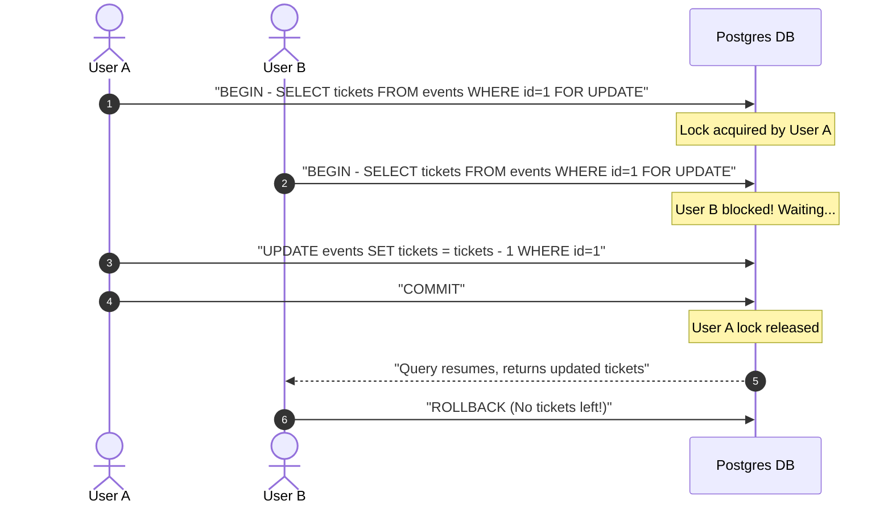
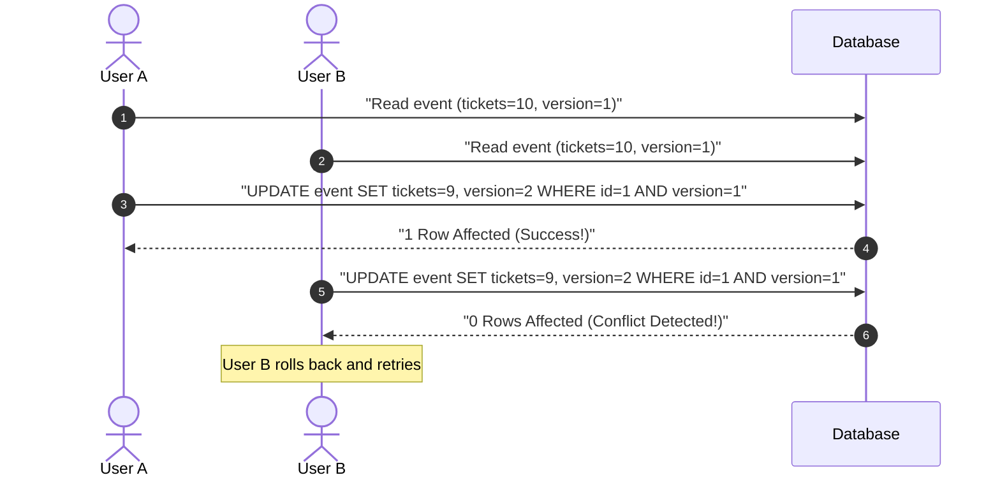
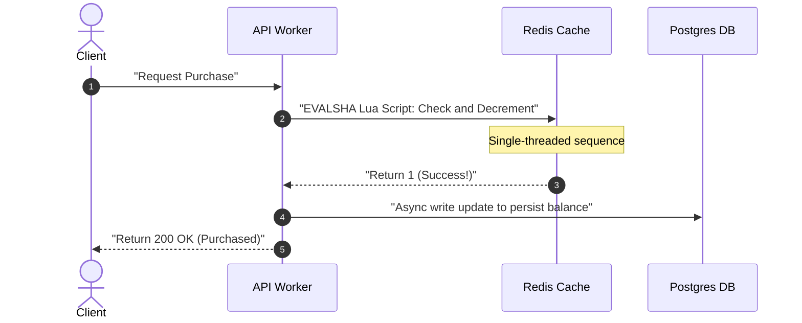
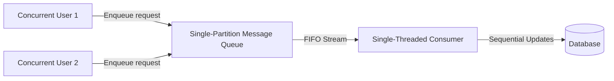

# Pattern 02: Dealing with Contention

The **Dealing with Contention** pattern is applied when multiple concurrent users, workers, or distributed threads attempt to modify or claim the exact same resource at the same time. 

Without proper architectural synchronization, systems experience **race conditions**, leading to double-bookings, negative inventory balances, incorrect financial postings, or inconsistent states.

---

## 1. Defining the Contention Spectrum

System designs handle contention based on two factors: **Contention Rate** (how frequently conflicts occur) and **Scale Requirements** (throughput vs. consistency).

```
Low Contention/High Latency Tol.                  High Contention/Scale Bottleneck
--------------------------------------------------------------------------------->
[ Pessimistic Locking ]   -->   [ Optimistic (OCC) ]   -->   [ In-Memory Atomic / Queues ]
```

---

## 2. Architectural Synchronization Strategies

There are four primary strategies for handling contention. Let's explore how each works, its sequence flow, and its trade-offs.

### A. Pessimistic Locking
*The Safe Database-Level Gatekeeper*

The system prevents conflicts by obtaining a lock on the database record before beginning a transaction, blocking all other transactions attempting to access the same record.



*   **Implementation Syntax (SQL):**
    ```sql
    BEGIN;
    SELECT inventory_count FROM products WHERE id = 456 FOR UPDATE;
    -- Application checks if inventory_count > 0 --
    UPDATE products SET inventory_count = inventory_count - 1 WHERE id = 456;
    COMMIT;
    ```
*   **Trade-offs:**
    *   **Pros:** Absolutely robust; simple; guarantees strict serializability; natively supported by relational databases (ACID).
    *   **Cons:** Extreme thread starvation under load; high database resource consumption (idle connections holding transaction slots); risk of **deadlocks** if multiple tables are locked in different orders.

*   **Deadlock Prevention Strategies:**
    *   **Consistent Lock Ordering:** Always acquire locks on tables/rows in the same deterministic order across all code paths (e.g., always lock `accounts` before `transfers`). This eliminates circular wait — one of the four Coffman conditions for deadlocks.
    *   **Lock Timeout Policies:** Set `innodb_lock_wait_timeout` (MySQL) or `lock_timeout` (Postgres) to a bounded value (e.g., 5 seconds). Transactions that cannot acquire a lock within the timeout are automatically aborted, preventing indefinite blocking.
    *   **Deadlock Detection Graphs:** InnoDB maintains a wait-for graph and automatically detects deadlock cycles, rolling back the youngest transaction. Postgres uses a similar detection mechanism triggered periodically by `deadlock_timeout` (default 1 second).
    *   **Advisory Locks (Postgres):** For application-level coordination that does not need row-level database locks, use `pg_advisory_lock(key)` and `pg_advisory_unlock(key)`. Advisory locks are lightweight, do not conflict with table-level locks, and can coordinate across transactions or sessions. They are ideal for distributed cron job deduplication or single-writer patterns.

---

### B. Optimistic Concurrency Control (OCC)
*The Version-Checked Validation*

Allows transactions to run concurrently without locks. Before committing, the database verifies that the record's version has not changed. If a conflict is detected, the transaction aborts and the application retries.



*   **Implementation Syntax (SQL):**
    ```sql
    -- Step 1: Read state
    SELECT inventory_count, version FROM products WHERE id = 456;
    -- Step 2: Update conditionally
    UPDATE products 
    SET inventory_count = inventory_count - 1, version = version + 1 
    WHERE id = 456 AND version = :current_version;
    ```
*   **Trade-offs:**
    *   **Pros:** Highly performant under low-to-medium contention; no database locks or idle waiting connections; great for read-heavy resources with sparse updates.
    *   **Cons:** Horrible under high contention (e.g., ticket booking). Massive abort/retry loops cause severe write amplification, wasting database CPU and increasing latency.

*   **Relationship to Compare-and-Swap (CAS):**
    OCC is the database-level implementation of the CPU-level **Compare-and-Swap (CAS)** primitive. The `WHERE version = :current_version` clause in the conditional UPDATE is semantically identical to a CAS operation: "only write this new value if the current value matches what I previously read." This same principle powers lock-free data structures in concurrent programming (e.g., `java.util.concurrent.atomic`, Go's `sync/atomic.CompareAndSwap`).

---

### C. In-Memory Atomic Operations
*The High-Throughput Memory Cache*

Offload the coordination to a fast, single-threaded, in-memory store like Redis. By using single-threaded execution, Redis guarantees that operations (like updating a inventory counter or checking rate limits) run atomic operations sequentially.



*   **Lua Script Example (Redis):**
    ```lua
    local key = KEYS[1]
    local decrement = tonumber(ARGV[1])
    local current = tonumber(redis.call('get', key) or "0")
    if current >= decrement then
        redis.call('decrby', key, decrement)
        return 1
    else
        return 0
    end
    ```
*   **Trade-offs:**
    *   **Pros:** Sub-millisecond latencies; extreme throughput (100k+ operations/sec); avoids heavy database transactions on the synchronous path.
    *   **Cons:** Dual-write consistency challenge (must synchronize Redis with the relational database); data loss risk if Redis restarts without AOF persistence enabled.

---

### D. Queue-Based Serialization
*The Single-Worker Pipe (Asynchronous Decoupling)*

Instead of letting threads write concurrently, convert concurrent writes into messages and push them into a single-partition message queue. A dedicated single-threaded consumer pulls messages from the queue and updates the state sequentially.



*   **Trade-offs:**
    *   **Pros:** Eliminates lock contention entirely; predictable database write profiles; protects databases from sudden spikes (natural backpressure buffer).
    *   **Cons:** Breaks synchronous response loops. The client cannot receive an immediate confirmation of the write. The architecture must introduce a **status poll** or **WebSocket update** ([Pattern 01: Real-time Updates](./01_realtime_updates.md)) to inform the user when the request completes. See also [Pattern 07: Long-Running Tasks](./07_long_running_tasks.md) for the full async completion notification pattern.

---

## 3. Concurrency Strategy Matrix

| Strategy | Safe Scale Limit | Latency | Implementation Complexity | Best Used For |
|---|---|---|---|---|
| **Pessimistic Locking** | Low (< 500 req/sec) | High | Trivial | Banking, internal ledgers, inventory with low concurrency. |
| **Optimistic (OCC)** | Medium (< 2k req/sec) | Low (No locks) | Medium | Wiki pages, profile edits, low-concurrency catalog items. |
| **In-Memory Atomic** | Very High (100k+ req/sec) | Sub-ms | High | Flash sales, Distributed counters, Rate limiters, Cart reservation. |
| **Queue Serialization** | Infinite (Buffered) | Medium (Asynchronous) | High | Concert ticket seat allocations (Ticketmaster), Ad impression counters. |

---

## 4. Advanced Interview Deep Dives

### Q1: How do you handle "Hot Keys" in distributed caches under extreme load?
If millions of users are viewing the same live auction item, the cache server holding that specific key will experience high CPU load and bandwidth exhaustion (a **Hot Key** bottleneck).
*   **The Solution:**
    1.  **Local (In-Memory) Cache Replication:** Replicate read-only hot keys into local server memory (e.g., Guava cache in the API container) with a short TTL (e.g., 1 second) to protect the central Redis cache.
    2.  **Scatter-Gather Key Sharding:** Instead of a single key `inventory:123`, split the inventory into multiple keys: `inventory:123_1`, `inventory:123_2`, ..., `inventory:123_N`. 
        *   When a client checks inventory, read and sum all shards.
        *   When a client purchases an item, randomly assign the client to a shard and decrement that shard's counter atomically.

### Q2: What is the Redlock algorithm, and when is it safe to use?
For multi-system updates, standard database transactions are impossible, requiring a **Distributed Lock**. Redis provides **Redlock**:
*   **Mechanics:**
    1.  Acquire locks across $N$ independent Redis master nodes (e.g., 5 nodes) sequentially using the same key and value.
    2.  The lock is considered acquired **only** if the client obtains the lock on a majority (e.g., 3 out of 5) of the nodes within a short timeframe (less than the lock lease duration).
    3.  If the lock is acquired, its validity duration is the original lease time minus the time taken to acquire it.
*   **The Fencing Token Critique (Martin Kleppmann):**
    The critical flaw in Redlock is the **GC pause problem**: a lock holder may be paused by a long garbage collection cycle *after* acquiring the lock but *before* completing its work. During the pause, the lease expires, and a second client acquires the lock. When the first client resumes, it believes it still holds the lock and writes stale data — violating mutual exclusion.

    The solution is **fencing tokens**: the lock service issues a monotonically increasing token with each lock acquisition. Every write to the downstream storage system must include the fencing token, and the storage **rejects any write with a token older than the latest token it has seen**:

    ```
    Client A acquires lock → fencing token = 33
    Client A paused by GC...
    Lock lease expires
    Client B acquires lock → fencing token = 34
    Client B writes to storage with token 34 → Accepted
    Client A resumes, writes to storage with token 33 → REJECTED (33 < 34)
    ```

    Redlock does not natively support fencing tokens, which is why Kleppmann argues it is unsuitable for correctness-critical distributed locks.

*   **Correct Consensus Alternatives:**
    *   **ZooKeeper:** Uses the **ZAB (ZooKeeper Atomic Broadcast)** protocol — *not* Paxos. ZAB provides sequential consistency with session-based ephemeral nodes that automatically release locks when a client disconnects or its session times out. Fencing is achievable via ZooKeeper's monotonically increasing `zxid` (transaction ID).
    *   **etcd:** Uses **Raft** consensus. Provides native lease-based locking with revision numbers that serve as fencing tokens. etcd is the modern, Kubernetes-native alternative and is often preferred for new systems over ZooKeeper.

*   **Interview Consensus:** In interviews, acknowledge that Redlock has edge cases (clock drift, GC pauses causing lease expirations before execution finishes). Use **Redis Redlock** for high-speed, best-effort locks (rate limiting, distributed cron deduplication) where occasional double-execution is tolerable. Use **ZooKeeper (ZAB) or etcd (Raft)** with fencing tokens for locks requiring strict correctness (financial transactions, leader election).

---

## 5. Security Considerations

Contention systems control access to shared resources, making them attractive targets for abuse.

| Concern | Mitigation |
|---|---|
| **Lock Starvation Attacks** | A malicious or buggy client that acquires a lock and never releases it starves all other clients. Mitigate with **mandatory lock timeouts** (TTL on Redis locks, `lock_timeout` in Postgres, session timeouts in ZooKeeper). No lock should ever be held indefinitely. |
| **Redis Security** | Redis has no authentication by default. Enable `requirepass` at minimum. For production, use **Redis 6+ ACLs** to restrict commands per user (e.g., deny `FLUSHALL`, `CONFIG`). Always encrypt connections with **TLS** (`tls-port 6380`) to prevent credential and data sniffing. |
| **Distributed Lock Credential Leakage** | Lock keys often encode resource identifiers (e.g., `lock:order:12345`). If Redis is exposed without TLS, attackers can enumerate active resources. Use opaque hashed keys and restrict network access to internal VPCs. |
| **Audit Logging for Contention Events** | Log who acquired each lock, the acquisition timestamp, hold duration, and release reason (explicit release vs. timeout expiry). This creates an audit trail for debugging contention incidents and detecting abuse patterns. |
| **Queue Poisoning** | In queue-based serialization, a malformed message can crash the consumer and block all subsequent processing (head-of-line blocking). Use **dead-letter queues (DLQ)** and message validation to isolate bad messages. |

> **Cross-reference:** For real-time connection security (WebSocket origin validation, per-connection rate limiting), see [Pattern 01: Real-time Updates — Security Considerations](./01_realtime_updates.md).

---

## 6. Observability and Monitoring

Contention issues are notoriously difficult to reproduce in development. Production observability is essential.

### Key Metrics to Track

| Metric | Source | Alert Threshold (Example) |
|---|---|---|
| **Lock wait time (p99)** | Postgres `pg_stat_activity.wait_event_type = 'Lock'`, MySQL `SHOW ENGINE INNODB STATUS` | > 500ms |
| **Lock timeout count** | Application error logs, `innodb_row_lock_time_avg` | > 10/min |
| **OCC retry count** | Application retry loop metrics | > 3 retries per operation (indicates high contention) |
| **Redis `EVALSHA` latency (p99)** | Redis `SLOWLOG`, application-side timers | > 5ms |
| **Queue depth** | Kafka consumer lag, SQS `ApproximateNumberOfMessages` | Growing monotonically (consumer falling behind) |
| **Deadlock count** | Postgres `pg_stat_database.deadlocks`, InnoDB deadlock detector logs | Any non-zero count |

### Detecting Deadlocks in Production

*   **Postgres:** Query `pg_stat_activity` to find blocked sessions and join with `pg_locks` to identify the blocking PID. Enable `log_lock_waits = on` and set `deadlock_timeout` to log deadlock occurrences with full query context.
    ```sql
    SELECT blocked.pid AS blocked_pid,
           blocked.query AS blocked_query,
           blocking.pid AS blocking_pid,
           blocking.query AS blocking_query
    FROM pg_stat_activity blocked
    JOIN pg_locks bl ON bl.pid = blocked.pid
    JOIN pg_locks kl ON kl.locktype = bl.locktype
        AND kl.relation = bl.relation AND kl.pid != bl.pid
    JOIN pg_stat_activity blocking ON blocking.pid = kl.pid
    WHERE NOT bl.granted;
    ```
*   **MySQL InnoDB:** Run `SHOW ENGINE INNODB STATUS\G` and inspect the `LATEST DETECTED DEADLOCK` section. Enable `innodb_print_all_deadlocks = ON` to log all deadlocks to the error log.

> **Cross-reference:** For scaling database reads to reduce contention pressure, see [Pattern 04: Scaling Reads](./04_scaling_reads.md). For scaling writes via sharding, see [Pattern 05: Scaling Writes](./05_scaling_writes.md).
