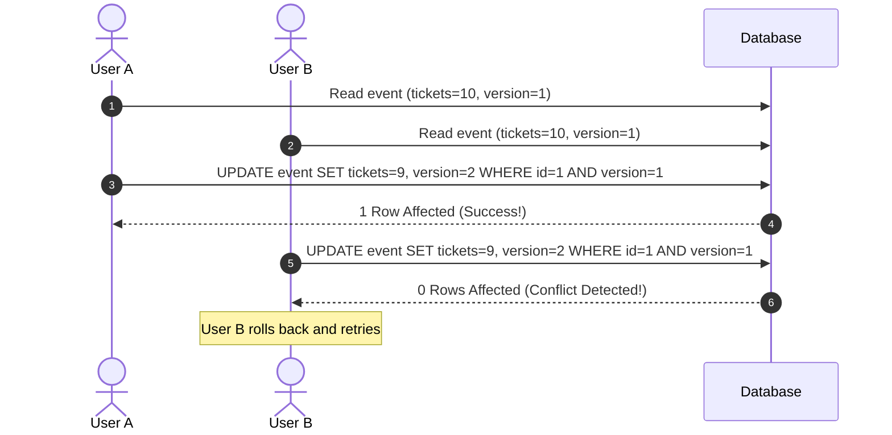
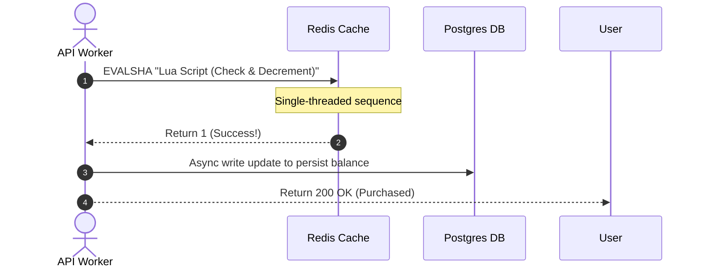
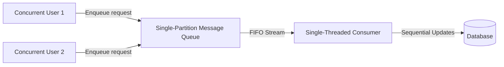

# Pattern 02: Dealing with Contention

The **Dealing with Contention** pattern is applied when multiple concurrent users, workers, or distributed threads attempt to modify or claim the exact same resource at the same time. 

Without proper architectural synchronization, systems experience **race conditions**, leading to double-bookings, negative inventory balances, incorrect financial postings, or inconsistent states.

---

## 1. Defining the Contention Spectrum

System designs handle contention based on two factors: **Contention Rate** (how frequently conflicts occur) and **Scale Requirements** (throughput vs. consistency).

```
Low Contention/High Latency Tol.                  High Contention/Scale Bottleneck
--------------------------------------------------------------------------------->
[ Pessimistic Locking ]   -->   [ Optimistic (OCC) ]   -->   [ In-Memory Atomic / Queues ]
```

---

## 2. Architectural Synchronization Strategies

There are four primary strategies for handling contention. Let's explore how each works, its sequence flow, and its trade-offs.

### A. Pessimistic Locking
*The Safe Database-Level Gatekeeper*

The system prevents conflicts by obtaining a lock on the database record before beginning a transaction, blocking all other transactions attempting to access the same record.

```mermaid
sequenceDiagram
    autonumber
    actor U1 as User A
    actor U2 as User B
    participant DB as Postgres DB

    U1->>DB: BEGIN; SELECT tickets FROM events WHERE id=1 FOR UPDATE;
    Note over DB: Lock acquired by User A
    U2->>DB: BEGIN; SELECT tickets FROM events WHERE id=1 FOR UPDATE;
    Note over DB: User B blocked! Waiting...
    U1->>DB: UPDATE events SET tickets = tickets - 1 WHERE id=1;
    U1->>DB: COMMIT;
    Note over DB: User A lock released
    DB-->>U2: Query resumes, returns updated tickets
    U2->>DB: ROLLBACK (No tickets left!);
```

*   **Implementation Syntax (SQL):**
    ```sql
    BEGIN;
    SELECT inventory_count FROM products WHERE id = 456 FOR UPDATE;
    -- Application checks if inventory_count > 0 --
    UPDATE products SET inventory_count = inventory_count - 1 WHERE id = 456;
    COMMIT;
    ```
*   **Trade-offs:**
    *   **Pros:** Absolutely robust; simple; guarantees strict serializability; natively supported by relational databases (ACID).
    *   **Cons:** Extreme thread starvation under load; high database resource consumption (idle connections holding transaction slots); risk of **deadlocks** if multiple tables are locked in different orders.

---

### B. Optimistic Concurrency Control (OCC)
*The Version-Checked Validation*

Allows transactions to run concurrently without locks. Before committing, the database verifies that the record's version has not changed. If a conflict is detected, the transaction aborts and the application retries.



*   **Implementation Syntax (SQL):**
    ```sql
    -- Step 1: Read state
    SELECT inventory_count, version FROM products WHERE id = 456;
    -- Step 2: Update conditionally
    UPDATE products 
    SET inventory_count = inventory_count - 1, version = version + 1 
    WHERE id = 456 AND version = :current_version;
    ```
*   **Trade-offs:**
    *   **Pros:** Highly performant under low-to-medium contention; no database locks or idle waiting connections; great for read-heavy resources with sparse updates.
    *   **Cons:** Horrible under high contention (e.g., ticket booking). Massive abort/retry loops cause severe write amplification, wasting database CPU and increasing latency.

---

### C. In-Memory Atomic Operations
*The High-Throughput Memory Cache*

Offload the coordination to a fast, single-threaded, in-memory store like Redis. By using single-threaded execution, Redis guarantees that operations (like updating a inventory counter or checking rate limits) run atomic operations sequentially.



*   **Lua Script Example (Redis):**
    ```lua
    local key = KEYS[1]
    local decrement = tonumber(ARGV[1])
    local current = tonumber(redis.call('get', key) or "0")
    if current >= decrement then
        redis.call('decrby', key, decrement)
        return 1
    else
        return 0
    end
    ```
*   **Trade-offs:**
    *   **Pros:** Sub-millisecond latencies; extreme throughput (100k+ operations/sec); avoids heavy database transactions on the synchronous path.
    *   **Cons:** Dual-write consistency challenge (must synchronize Redis with the relational database); data loss risk if Redis restarts without AOF persistence enabled.

---

### D. Queue-Based Serialization
*The Single-Worker Pipe (Asynchronous Decoupling)*

Instead of letting threads write concurrently, convert concurrent writes into messages and push them into a single-partition message queue. A dedicated single-threaded consumer pulls messages from the queue and updates the state sequentially.



*   **Trade-offs:**
    *   **Pros:** Eliminates lock contention entirely; predictable database write profiles; protects databases from sudden spikes (natural backpressure buffer).
    *   **Cons:** Breaks synchronous response loops. The client cannot receive an immediate confirmation of the write. The architecture must introduce a **status poll** or **WebSocket update** (Pattern 01) to inform the user when the request completes.

---

## 3. Concurrency Strategy Matrix

| Strategy | Safe Scale Limit | Latency | Implementation Complexity | Best Used For |
|---|---|---|---|---|
| **Pessimistic Locking** | Low (< 500 req/sec) | High | Trivial | Banking, internal ledgers, inventory with low concurrency. |
| **Optimistic (OCC)** | Medium (< 2k req/sec) | Low (No locks) | Medium | Wiki pages, profile edits, low-concurrency catalog items. |
| **In-Memory Atomic** | Very High (100k+ req/sec) | Sub-ms | High | Flash sales, Distributed counters, Rate limiters, Cart reservation. |
| **Queue Serialization** | Infinite (Buffered) | Medium (Asynchronous) | High | Concert ticket seat allocations (Ticketmaster), Ad impression counters. |

---

## 4. Advanced Interview Deep Dives

### Q1: How do you handle "Hot Keys" in distributed caches under extreme load?
If millions of users are viewing the same live auction item, the cache server holding that specific key will experience high CPU load and bandwidth exhaustion (a **Hot Key** bottleneck).
*   **The Solution:**
    1.  **Local (In-Memory) Cache Replication:** Replicate read-only hot keys into local server memory (e.g., Guava cache in the API container) with a short TTL (e.g., 1 second) to protect the central Redis cache.
    2.  **Scatter-Gather Key Sharding:** Instead of a single key `inventory:123`, split the inventory into multiple keys: `inventory:123_1`, `inventory:123_2`, ..., `inventory:123_N`. 
        *   When a client checks inventory, read and sum all shards.
        *   When a client purchases an item, randomly assign the client to a shard and decrement that shard's counter atomically.

### Q2: What is the Redlock algorithm, and when is it safe to use?
For multi-system updates, standard database transactions are impossible, requiring a **Distributed Lock**. Redis provides **Redlock**:
*   **Mechanics:**
    1.  Acquire locks across $N$ independent Redis master nodes (e.g., 5 nodes) sequentially using the same key and value.
    2.  The lock is considered acquired **only** if the client obtains the lock on a majority (e.g., 3 out of 5) of the nodes within a short timeframe (less than the lock lease duration).
    3.  If the lock is acquired, its validity duration is the original lease time minus the time taken to acquire it.
*   **Interview Consensus:** In interviews, acknowledge that Redlock has edge cases (clock drift, GC pauses causing lease expirations before execution finishes). Recommend using ZooKeeper (which relies on CP consensus via Paxos/Raft and sessions) for locks requiring strict mathematical correctness, and Redis Redlock for high-speed, general-purpose locks.
