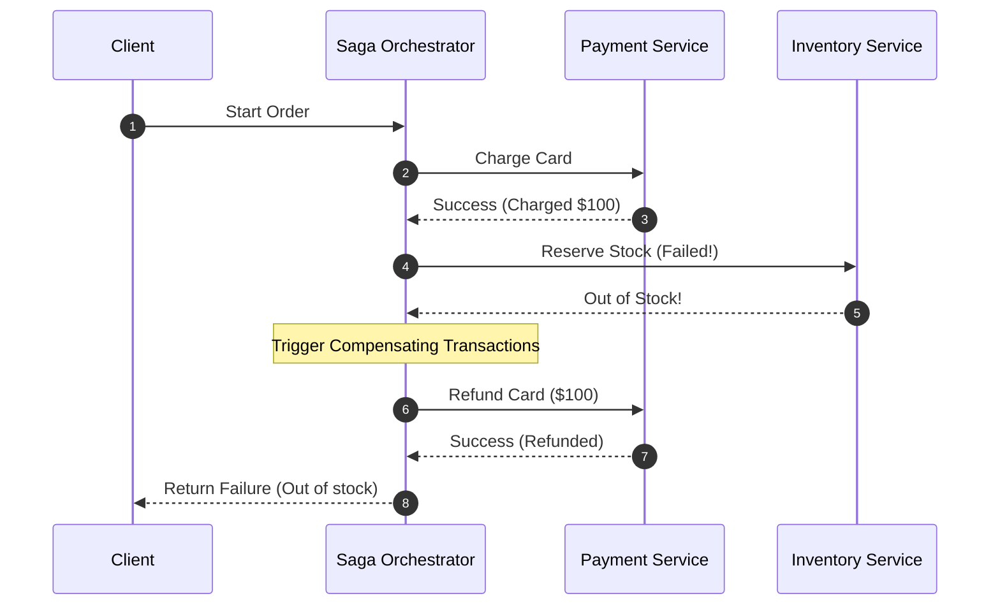
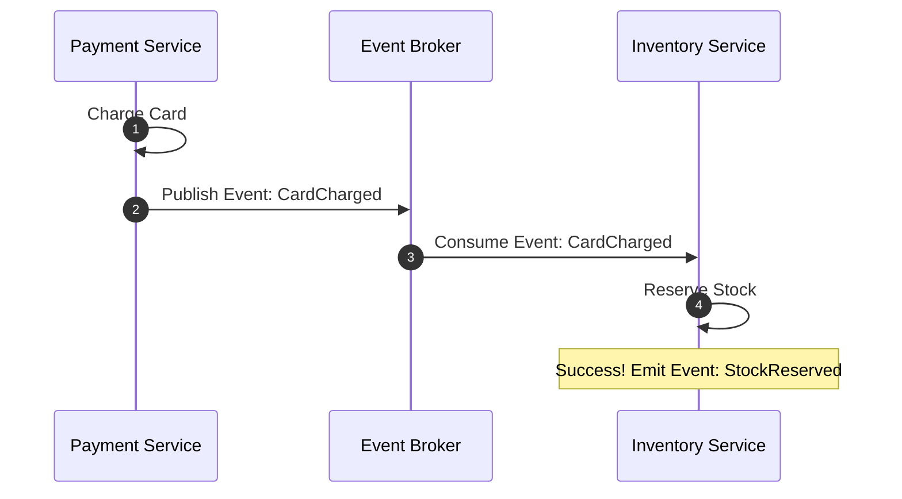
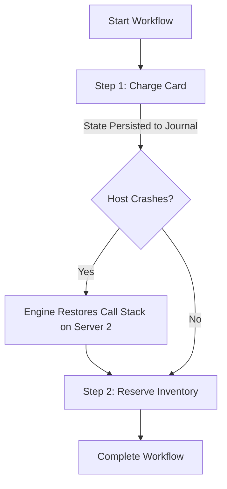
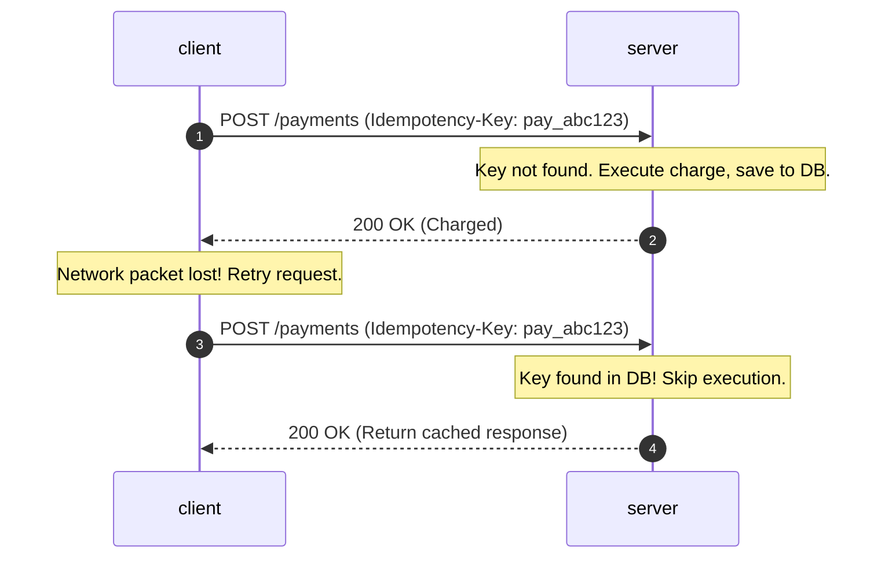

# Pattern 03: Multi-Step Processes

The **Multi-Step Processes** pattern is used to handle complex, asynchronous, and failure-prone workflows that span multiple services or external APIs. 

In a distributed microservice architecture, standard database transactions (ACID) are impossible. When an action involves multiple operations (e.g., charging a card, reserving inventory, booking shipping, and sending an email), the system must guarantee eventual consistency and robust recovery, even in the event of hardware crashes or network partitions.

---

## 1. The Distributed Transaction Dilemma

Consider a standard e-commerce order process:

```
+------------+     (1) Charge Card     +-----------------+
|            | ----------------------> | Payment Gateway |
|            |                         +-----------------+
|            |     (2) Reserve Items   +-----------------+
| Order Flow | ----------------------> | Inventory Serv. |
|            |                         +-----------------+
|            |     (3) Book Courier    +-----------------+
|            | ----------------------> | Shipping Serv.  |
+------------+                         +-----------------+
```

If **Step 1** (Payment) and **Step 2** (Inventory) succeed, but **Step 3** (Shipping) fails due to a network timeout, what happens to the user's money and the reserved stock? 
*   **The Baseline Approach:** Single-server synchronous orchestrator. If a step fails, try to call the preceding steps' API rollback endpoints in a catch block.
*   **Why the Baseline Fails:** If the orchestrator itself crashes or loses power mid-execution, the rollback is never triggered, leaving the system in a permanently inconsistent state (e.g., money charged, but no order placed).

---

## 2. Advanced Multi-Step Coordination Patterns

To scale and secure multi-step processes, systems use three main patterns.

### A. The Saga Pattern (Orchestration vs. Choreography)
A Saga is a sequence of local transactions. Each transaction updates the database within a single service. If a step fails, the Saga runs **compensating transactions** (reversal updates) to undo the previous changes.

#### Option 1: Orchestration-based Saga (Centralized)
A dedicated central orchestrator service coordinates the execution of all steps. It instructs services to execute local transactions and is responsible for initiating rollbacks if a step fails.



*   **Trade-offs:**
    *   **Pros:** Easy to understand; centralizes state and logic; simple to audit.
    *   **Cons:** Central point of failure; orchestrator can become a bottleneck; tight coupling between the orchestrator and sub-services.

---

#### Option 2: Choreography-based Saga (Decentralized/Event-Driven)
There is no central coordinator. Services listen to a message queue and trigger their local transactions in response to events published by other services.



*   **Trade-offs:**
    *   **Pros:** Highly decoupled; no single point of failure; natural fit for asynchronous, event-driven microservices.
    *   **Cons:** Very hard to debug and visualize; risk of circular event dependencies; complex rollback flows (each service must listen to and handle all potential failure events).

---

### B. Durable Execution Engines (Workflow Engines)
For business-critical, long-running processes, design your system around **Durable Execution Engines** (e.g., **Temporal**, **AWS Step Functions**, or **Netflix Conductor**).

These systems use event sourcing histories to record the execution state of your code at every step. If the host server executing the workflow crashes mid-step, the engine automatically migrates and resumes the execution on another server **exactly** where it left off, maintaining local variables and call stacks.



*   **Trade-offs:**
    *   **Pros:** Guarantees successful completion of complex code flows; built-in timeout, retries, and sleep operations (can sleep a workflow for 30 days safely); eliminates complex state tracking tables.
    *   **Cons:** Introduces new architectural dependencies; workflow code must be strictly deterministic (cannot use randomized logic or system timestamps directly without wrappers); high infrastructure overhead.

---

## 3. Idempotency & Retries (The Critical Guardrails)

Every multi-step architecture requires two strict policies to prevent duplicate actions under network retries.

### A. Idempotency Keys
In distributed networks, "at-least-once" delivery guarantees mean duplicate requests **will** occur. If an API times out, the client will retry the request.
*   **The Solution:** The client generates a unique **Idempotency Key** (usually a UUID) for the transaction. The server checks this key before executing the write.



*   **Implementation Mechanics:**
    *   Store idempotency keys in a fast, ACID-compliant database (e.g., Redis with TTL or Postgres with a unique constraint index).
    *   Include a `status` field: `PENDING`, `COMPLETED`, `FAILED`. If a duplicate request arrives while the status is `PENDING`, reject it or block until the first completes (avoids concurrent race conditions).

### B. Retry with Exponential Backoff and Jitter
When a sub-service is down, retrying immediately can overload the failing service (causing a retry storm). Use exponential backoff (e.g., waiting 1s, 2s, 4s, 8s) combined with random noise (jitter) to distribute the retry load.

---

## 4. Multi-Step Coordination Matrix

| Metric | Monolithic Orchestrator | Saga Choreography | Saga Orchestration | Durable Engines (Temporal) |
|---|---|---|---|---|
| **Coordination** | Synchronous | Event-Driven | Command-Driven | Event Sourced |
| **State Storage** | Application Memory | Decentralized DBs | Centralized Saga DB | Central Engine Log |
| **Complexity** | Low | High | Medium | High |
| **Fault Tolerance** | Low | High | Medium | Extreme |
| **Best Used For** | Simple internally owned APIs | Event-driven microservices | Multi-service updates | Multi-day processes, RAG ingestion pipelines |

---

## 5. Advanced Interview Deep Dives

### Q1: What happens if a Compensating Transaction (Rollback) fails?
If a Saga attempts to refund a credit card, but the payment gateway returns a `500 Server Error`, the system is left in an inconsistent state.
*   **The Solution:**
    1.  **Retry Queues:** Route the failed compensating transaction to a persistent retry queue with a long backoff window.
    2.  **Dead-Letter Queues (DLQs):** If retries are exhausted (e.g., the user's card was cancelled), move the message to a DLQ.
    3.  **Human Operations Console:** Build a dashboard and automated alerting system (e.g., PagerDuty) to notify human operators to resolve the inconsistency manually (e.g., customer support wire transfers).

### Q2: How do you handle "Out-of-Order" Saga Events?
Due to network delays, a `CancelOrder` event might arrive at a microservice *before* the corresponding `CreateOrder` event has completed processing.
*   **The Solution (State Machine Guardrails):**
    *   Maintain a state version or timestamp in your record.
    *   If a `CancelOrder` event arrives first, create a record with the status `CANCELLED` (or a sentinel flag).
    *   When the late `CreateOrder` event finally arrives, check the status first: if it is already marked as `CANCELLED`, discard the create event.
