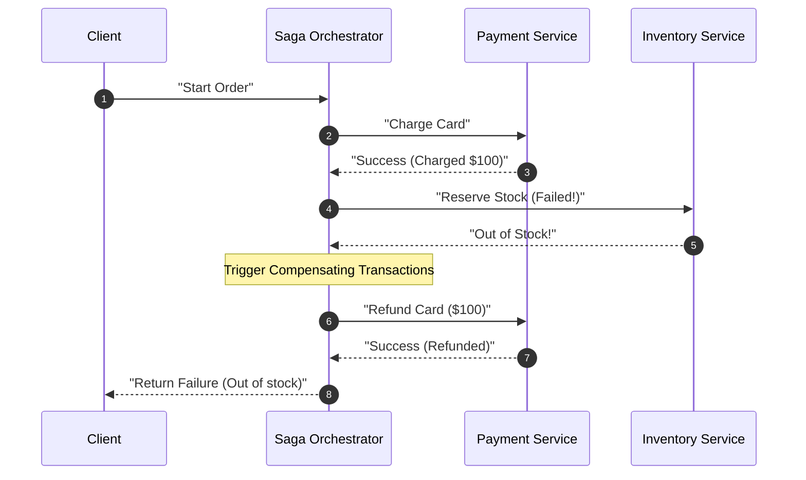
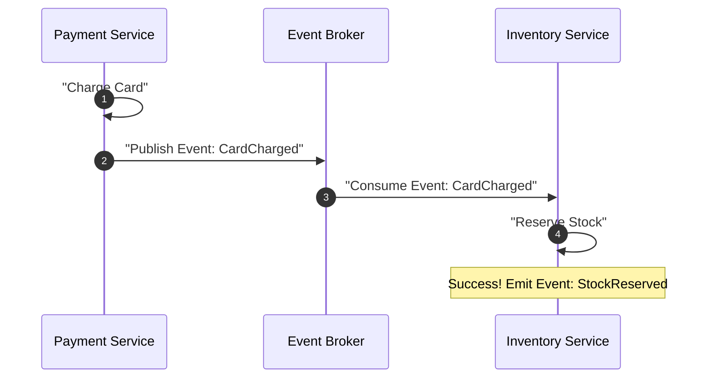
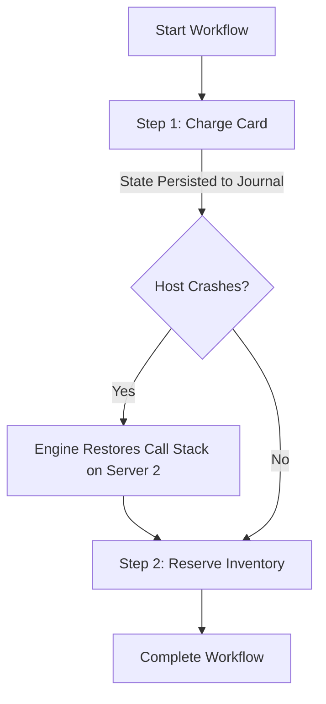
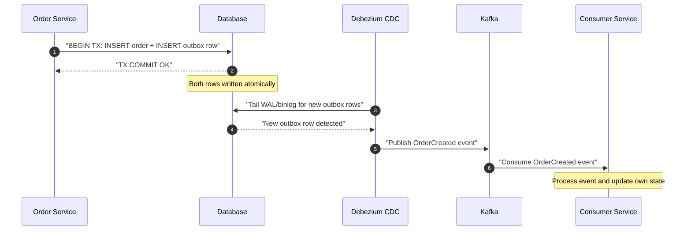
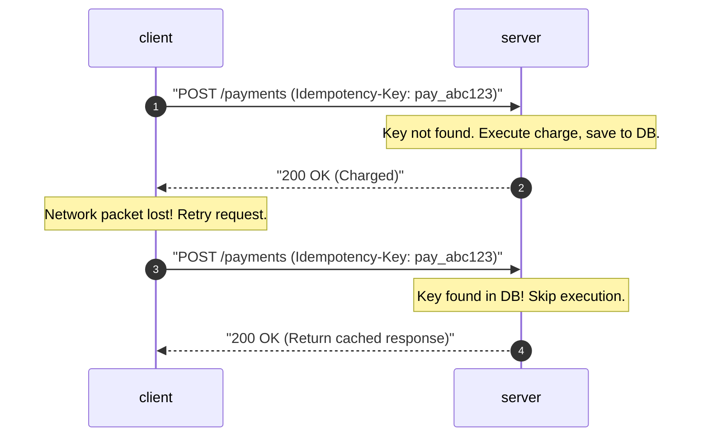

# Pattern 03: Multi-Step Processes

The **Multi-Step Processes** pattern is used to handle complex, asynchronous, and failure-prone workflows that span multiple services or external APIs. 

In a distributed microservice architecture, standard database transactions (ACID) are impossible. When an action involves multiple operations (e.g., charging a card, reserving inventory, booking shipping, and sending an email), the system must guarantee eventual consistency and robust recovery, even in the event of hardware crashes or network partitions.

---

## 1. The Distributed Transaction Dilemma

Consider a standard e-commerce order process:

```
+------------+     (1) Charge Card     +-----------------+
|            | ----------------------> | Payment Gateway |
|            |                         +-----------------+
|            |     (2) Reserve Items   +-----------------+
| Order Flow | ----------------------> | Inventory Serv. |
|            |                         +-----------------+
|            |     (3) Book Courier    +-----------------+
|            | ----------------------> | Shipping Serv.  |
+------------+                         +-----------------+
```

If **Step 1** (Payment) and **Step 2** (Inventory) succeed, but **Step 3** (Shipping) fails due to a network timeout, what happens to the user's money and the reserved stock? 
*   **The Baseline Approach:** Single-server synchronous orchestrator. If a step fails, try to call the preceding steps' API rollback endpoints in a catch block.
*   **Why the Baseline Fails:** If the orchestrator itself crashes or loses power mid-execution, the rollback is never triggered, leaving the system in a permanently inconsistent state (e.g., money charged, but no order placed).

---

## 2. Advanced Multi-Step Coordination Patterns

To scale and secure multi-step processes, systems use three main patterns.

### Why Not Two-Phase Commit (2PC)?

Before exploring Sagas, it's worth understanding why the classical distributed transaction protocol — **Two-Phase Commit (2PC)** — is unsuitable for modern microservice architectures.

2PC uses a **coordinator** that orchestrates a two-phase protocol across all participating services:
1.  **Prepare Phase:** The coordinator asks each participant to "prepare" (acquire locks, validate data). Each participant responds with `VOTE_COMMIT` or `VOTE_ABORT`.
2.  **Commit Phase:** If all participants voted commit, the coordinator sends a global `COMMIT`. Otherwise, it sends `ABORT`.

**Why 2PC fails at scale:**

| Problem | Impact |
|---|---|
| **Blocking Protocol** | All participants **hold database locks** during the prepare phase, waiting for the coordinator's decision. If the coordinator is slow or crashes, locks are held indefinitely, blocking other transactions. |
| **Single Point of Failure** | The coordinator is a single point of failure. If it crashes after sending `PREPARE` but before sending `COMMIT`, participants are stuck in an uncertain state (the "in-doubt" problem). |
| **Reduced Availability** | Per the CAP theorem, 2PC sacrifices availability for consistency. Any single participant failure or network partition causes the entire transaction to abort. |
| **Latency** | The protocol requires at minimum 2 round trips (prepare + commit) across all participants, adding significant latency as participants increase. |

> In a system with $n$ participants, a single 2PC transaction requires $2n$ network messages (prepare + commit to each). With 5 services at 50ms per hop, the minimum coordination overhead is $2 \times 5 \times 50\text{ms} = 500\text{ms}$ — and that's without accounting for lock contention.

This is why distributed systems use **Sagas** — which trade strong consistency for availability and partition tolerance, achieving **eventual consistency** through compensating transactions.

### A. The Saga Pattern (Orchestration vs. Choreography)
A Saga is a sequence of local transactions. Each transaction updates the database within a single service. If a step fails, the Saga runs **compensating transactions** (reversal updates) to undo the previous changes.

#### Option 1: Orchestration-based Saga (Centralized)
A dedicated central orchestrator service coordinates the execution of all steps. It instructs services to execute local transactions and is responsible for initiating rollbacks if a step fails.



*   **Trade-offs:**
    *   **Pros:** Easy to understand; centralizes state and logic; simple to audit.
    *   **Cons:** Central point of failure; orchestrator can become a bottleneck; tight coupling between the orchestrator and sub-services.

---

#### Option 2: Choreography-based Saga (Decentralized/Event-Driven)
There is no central coordinator. Services listen to a message queue and trigger their local transactions in response to events published by other services.



*   **Trade-offs:**
    *   **Pros:** Highly decoupled; no single point of failure; natural fit for asynchronous, event-driven microservices.
    *   **Cons:** Very hard to debug and visualize; risk of circular event dependencies; complex rollback flows (each service must listen to and handle all potential failure events).

---

### B. Durable Execution Engines (Workflow Engines)
For business-critical, long-running processes, design your system around **Durable Execution Engines** (e.g., **Temporal**, **AWS Step Functions**, or **Netflix Conductor**).

These systems use event sourcing histories to record the execution state of your code at every step. If the host server executing the workflow crashes mid-step, the engine automatically migrates and resumes the execution on another server **exactly** where it left off, maintaining local variables and call stacks.



*   **Trade-offs:**
    *   **Pros:** Guarantees successful completion of complex code flows; built-in timeout, retries, and sleep operations (can sleep a workflow for 30 days safely); eliminates complex state tracking tables.
    *   **Cons:** Introduces new architectural dependencies; workflow code must be strictly deterministic (cannot use randomized logic or system timestamps directly without wrappers); high infrastructure overhead.

---

### C. Transactional Outbox Pattern

When a service needs to both **write to its database** and **publish an event** to a message broker (e.g., Kafka), it faces the **dual-write problem**: these are two separate I/O operations with no shared transaction boundary. If the DB write succeeds but the Kafka publish fails (or vice versa), the system is left in an inconsistent state.

The **Transactional Outbox** solves this by writing both the business data and the event into the **same database** within a **single ACID transaction**. The event is stored in a dedicated `outbox` table. A separate process (typically a CDC connector like **Debezium**) tails the database's WAL/binlog and publishes outbox rows to Kafka.



*   **Trade-offs:**
    *   **Pros:** Atomic guarantee — no dual-write risk; works with any relational database; the outbox table serves as an audit log of all published events.
    *   **Cons:** Added latency from CDC polling interval (typically 100ms–1s); the outbox table grows continuously and requires periodic cleanup (DELETE or partitioned table rotation); CDC connectors add operational complexity.

> **Cross-reference:** The Transactional Outbox pattern is also the mechanism behind CDC-based synchronization in [Pattern 04: Scaling Reads](./04_scaling_reads.md) (CQRS section) and is essential for reliable event publishing in [Pattern 05: Scaling Writes](./05_scaling_writes.md).

---

### D. Job Queue Architecture

For operations too slow for an synchronous HTTP request (video encoding, ML inference, report generation, bulk email):

```
HTTP Request:
  POST /videos/upload
  → Validate, store to S3, create job record
  → Return immediately: {job_id: "abc123", status: "queued"}

Client polls or subscribes:
  GET /jobs/abc123 → {status: "processing", progress: 45}
  GET /jobs/abc123 → {status: "complete", result_url: "..."}
```

```sql
CREATE TABLE jobs (
    id           UUID PRIMARY KEY,
    type         TEXT NOT NULL,      -- 'video_transcode', 'report_generate'
    status       TEXT NOT NULL,      -- queued|processing|complete|failed
    payload      JSONB NOT NULL,     -- input parameters
    result       JSONB,              -- output when complete
    created_at   TIMESTAMPTZ DEFAULT now(),
    started_at   TIMESTAMPTZ,
    completed_at TIMESTAMPTZ,
    attempts     INT DEFAULT 0,
    error        TEXT
);
```

Workers must be **idempotent** — message queues deliver at-least-once:
```python
def transcode_video(job_id, video_url):
    job = db.get_job(job_id)
    if job.status == 'complete':
        return job.result  # already done
    
    updated = db.execute("""
        UPDATE jobs SET status='processing', started_at=now(), attempts=attempts+1
        WHERE id=%s AND status='queued'
    """, job_id)
    if updated.rowcount == 0:
        return  # another worker already claimed it
    
    try:
        result = ffmpeg.transcode(video_url)
        db.execute("UPDATE jobs SET status='complete', result=%s WHERE id=%s", result, job_id)
    except Exception as e:
        db.execute("UPDATE jobs SET status='failed', error=%s WHERE id=%s", str(e), job_id)
        raise  # re-queue for retry
```

Messages that fail repeatedly get routed to a **Dead Letter Queue (DLQ)** for inspection:
```
Worker fails 3 times on message → message moves to DLQ topic
  → Ops team can inspect, fix, and replay
  → Prevents poison pill messages from blocking the queue
```

---

### E. Cron Jobs and Scheduled Tasks

For recurring processing: generating reports, sending digest emails, cleaning up expired data.

**Requirements:**
- **Exactly-once execution** per schedule tick (two instances shouldn't both run the same job)
- **Visibility** into last run, duration, errors
- **Missed run detection** (if a job was missed during downtime, catch up or skip?)

**Simple: Database-Backed Scheduler**

```sql
CREATE TABLE scheduled_jobs (
    id          UUID PRIMARY KEY,
    name        TEXT UNIQUE,
    cron_expr   TEXT NOT NULL,           -- "0 0 * * *" = midnight daily
    last_run    TIMESTAMPTZ,
    next_run    TIMESTAMPTZ NOT NULL,
    locked_by   TEXT,                    -- worker ID holding the lock
    locked_at   TIMESTAMPTZ
);

-- Worker claims a job atomically
UPDATE scheduled_jobs
SET locked_by = 'worker-1', locked_at = now()
WHERE name = 'daily_report'
  AND next_run <= now()
  AND (locked_by IS NULL OR locked_at < now() - INTERVAL '10 minutes')
RETURNING *;
-- 0 rows → another worker got it; skip
-- 1 row  → run the job
```

**Production: Dedicated Schedulers**
- **Celery Beat** (Python, backed by Redis or RabbitMQ)
- **Temporal Schedules** (durable, exactly-once, survives restarts)
- **AWS EventBridge Scheduler** (managed, serverless)
- **Kubernetes CronJob** (for containerized tasks)

---

### F. AI Agent Pipeline Architecture

Multi-step AI agent workflows have unique characteristics: LLM calls are expensive and slow (1–30s each), tool results may be cached, and the pipeline must handle partial failure gracefully.

**Pipeline structure:**
```
Input → [Understand intent (LLM, 2s)] → [Plan (LLM, 3s)] → [Execute tools (1-10s each)] → [Synthesize (LLM, 5s)] → Output
```

**Durable agent execution — checkpoint pattern:**

```python
class AgentRun:
    def __init__(self, run_id: str):
        self.run_id = run_id
    
    def get_or_compute(self, step: str, fn: callable):
        """Return cached step result if exists, otherwise compute and cache."""
        cached = db.get_step_result(self.run_id, step)
        if cached:
            return cached
        result = fn()
        db.save_step_result(self.run_id, step, result)
        return result

def run_agent(run_id, user_query):
    agent = AgentRun(run_id)
    
    # Each step checkpointed — restart resumes from last checkpoint
    intent = agent.get_or_compute("understand_intent",
        lambda: llm.call(f"Understand: {user_query}"))
    
    plan = agent.get_or_compute("plan",
        lambda: llm.call(f"Plan steps for: {intent}"))
    
    tool_results = []
    for i, step in enumerate(plan.steps):
        result = agent.get_or_compute(f"tool_{i}",
            lambda: execute_tool(step))
        tool_results.append(result)
    
    return agent.get_or_compute("synthesize",
        lambda: llm.call(f"Synthesize: {tool_results}"))
```

**Human-in-the-loop** for high-stakes agent actions (sending emails, making purchases, modifying files):

```python
async def agent_step_requiring_approval(action, payload, run_id):
    # Pause the workflow, request approval
    approval_id = db.create_approval_request(run_id, action, payload)
    notification.send(admin, f"Agent wants to {action}: {payload}")
    
    # Wait for human approval (Temporal signal or polling)
    approval = await wait_for_signal(f"approval:{approval_id}", timeout=3600)
    
    if approval.approved:
        return execute_action(action, payload)
    else:
        raise ActionRejected(approval.reason)
```

See [Pattern 01: Real-Time Updates](./01_realtime_updates.md) for streaming intermediate agent steps (tool calls, thinking) to the client over SSE.

---

## 3. Idempotency & Retries (The Critical Guardrails)

Every multi-step architecture requires two strict policies to prevent duplicate actions under network retries.

### A. Idempotency Keys
In distributed networks, "at-least-once" delivery guarantees mean duplicate requests **will** occur. If an API times out, the client will retry the request.
*   **The Solution:** The client generates a unique **Idempotency Key** (usually a UUID) for the transaction. The server checks this key before executing the write.



*   **Implementation Mechanics:**
    *   Store idempotency keys in a fast, ACID-compliant database (e.g., Redis with TTL or Postgres with a unique constraint index).
    *   Include a `status` field: `PENDING`, `COMPLETED`, `FAILED`. If a duplicate request arrives while the status is `PENDING`, reject it or block until the first completes (avoids concurrent race conditions).

### B. Retry with Exponential Backoff and Jitter
When a sub-service is down, retrying immediately can overload the failing service (causing a retry storm). Use exponential backoff (e.g., waiting 1s, 2s, 4s, 8s) combined with random noise (jitter) to distribute the retry load.

---

## 4. Multi-Step Coordination Matrix

| Metric | Monolithic Orchestrator | Saga Choreography | Saga Orchestration | Durable Engines (Temporal) |
|---|---|---|---|---|
| **Coordination** | Synchronous | Event-Driven | Command-Driven | Event Sourced |
| **State Storage** | Application Memory | Decentralized DBs | Centralized Saga DB | Central Engine Log |
| **Complexity** | Low | High | Medium | High |
| **Fault Tolerance** | Low | High | Medium | Extreme |
| **Best Used For** | Simple internally owned APIs | Event-driven microservices | Multi-service updates | Multi-day processes, RAG ingestion pipelines |

---

## 5. Advanced Interview Deep Dives

### Q1: What happens if a Compensating Transaction (Rollback) fails?
If a Saga attempts to refund a credit card, but the payment gateway returns a `500 Server Error`, the system is left in an inconsistent state.
*   **The Solution:**
    1.  **Retry Queues:** Route the failed compensating transaction to a persistent retry queue with a long backoff window.
    2.  **Dead-Letter Queues (DLQs):** If retries are exhausted (e.g., the user's card was cancelled), move the message to a DLQ.
    3.  **Human Operations Console:** Build a dashboard and automated alerting system (e.g., PagerDuty) to notify human operators to resolve the inconsistency manually (e.g., customer support wire transfers).

*   **Compensation Ordering:** Compensations must execute in **reverse order** of the original forward transactions. If the forward saga ran `Payment → Inventory → Shipping`, the compensation must run `Undo Shipping → Undo Inventory → Undo Payment`. Running compensations out of order can violate business invariants (e.g., releasing reserved inventory before cancelling the shipment that depends on it).

*   **Compensation Side Effects:** Be aware that some compensating transactions produce **externally visible side effects** that cannot be undone. For example:
    *   A refund triggers a "Your order has been cancelled" notification email — even if the order was never actually confirmed from the customer's perspective.
    *   A payment reversal may appear on the customer's bank statement as a charge-then-refund pair.
    *   **Mitigation:** Use **semantic locks** — mark the saga step as `PENDING` rather than `COMPLETED` until the entire saga succeeds. Only send customer-facing notifications (emails, push) after the saga reaches a terminal state.

### Q2: How do you handle "Out-of-Order" Saga Events?
Due to network delays, a `CancelOrder` event might arrive at a microservice *before* the corresponding `CreateOrder` event has completed processing.
*   **The Solution (State Machine Guardrails):**
    *   Maintain a state version or timestamp in your record.
    *   If a `CancelOrder` event arrives first, create a record with the status `CANCELLED` (or a sentinel flag).
    *   When the late `CreateOrder` event finally arrives, check the status first: if it is already marked as `CANCELLED`, discard the create event.

---

## 6. Security Considerations

Multi-step processes introduce unique attack surfaces because they span multiple services and persist state over long durations.

### Idempotency Key Spoofing
Idempotency keys must be **scoped to the authenticated user**. Without this, an attacker who discovers or guesses another user's idempotency key can hijack their cached response or block their transaction.
*   **Mitigation:** Store idempotency keys as a composite key of `(user_id, idempotency_key)`. Validate ownership on every request.

### Replay Attacks
Idempotency keys that never expire allow an attacker to replay a captured request indefinitely.
*   **Mitigation:** Enforce a **TTL** on idempotency keys (e.g., 24–72 hours). After expiration, the key is purged, and the same request would be treated as a new operation. Combine with request signing (HMAC) and timestamp validation.

### Saga State Tampering
Saga execution state (current step, completed steps, compensation status) must **never** be trusted from client input. If a client can manipulate saga state, they could skip payment steps or prevent compensations from running.
*   **Mitigation:** Store all saga state **server-side** (in the orchestrator's database or the workflow engine's journal). The client should only hold opaque references (e.g., a saga ID), never the state itself.

### Event Injection
In choreography-based sagas, a malicious actor with access to the event broker could inject fake events (e.g., a forged `PaymentSucceeded` event).
*   **Mitigation:** Sign events with HMAC or use mutual TLS between services. Consumers should validate event signatures before processing.

---

## 7. Observability and Monitoring

Multi-step processes are inherently difficult to debug because failures can occur at any step across multiple services. Robust observability is non-negotiable.

### Distributed Tracing with Correlation IDs
Propagate a unique **correlation ID** (trace ID) across every step of the saga using [OpenTelemetry](https://opentelemetry.io/). This allows you to reconstruct the full execution path of a single transaction across all participating services.
*   Every log line, metric, and event should include the correlation ID.
*   Use structured logging (JSON) so traces can be queried in systems like Jaeger, Datadog, or Grafana Tempo.

### Key Metrics to Track

| Metric | What It Tells You | Alert Threshold (Example) |
|---|---|---|
| **Saga Completion Rate** | Percentage of sagas reaching a terminal success state | < 99% over 5 minutes |
| **Compensation Trigger Rate** | How often compensations are invoked (indicates upstream failure rates) | > 5% of all sagas |
| **Average Saga Duration** | End-to-end latency of the multi-step process | p99 > 30 seconds |
| **DLQ Size** | Number of messages in the Dead Letter Queue (unresolvable failures) | > 0 for critical queues |
| **Idempotency Key Collision Rate** | Frequency of duplicate request detection | Spike may indicate retry storms |

### Circuit Breakers for Downstream Calls
Wrap each downstream service call within a **circuit breaker** (e.g., using [Resilience4j](https://resilience4j.readme.io/) or Hystrix). If a downstream service begins failing consistently, the circuit breaker trips to `OPEN`, and the saga immediately triggers compensations rather than waiting for timeouts.

> **Cross-references:**
> *   For real-time monitoring of saga state changes, see [Pattern 01: Real-Time Updates](./01_realtime_updates.md) — use WebSockets/SSE to push saga status to client dashboards.
> *   For handling write contention when multiple sagas compete for the same resource, see [Pattern 02: Dealing with Contention](./02_dealing_with_contention.md).
> *   For long-running sagas (e.g., multi-day approval workflows), see [Pattern 07: Long-Running Tasks](./07_long_running_tasks.md).
> *   For AI agent pipeline patterns, see [Pattern 10: Agent Infrastructure](./10_agent_infrastructure.md).

---

## 8. Failure Recovery Patterns

### Retry with Exponential Backoff

```python
def retry_with_backoff(fn, max_attempts=5, base_delay=1.0):
    for attempt in range(max_attempts):
        try:
            return fn()
        except TransientError as e:
            if attempt == max_attempts - 1:
                raise
            delay = base_delay * (2 ** attempt) + random.uniform(0, 1)
            time.sleep(delay)
```

### Circuit Breaker

Stop hammering a failing downstream service — fail fast and trigger compensations immediately:

```python
class CircuitBreaker:
    def __init__(self, failure_threshold=5, recovery_timeout=60):
        self.failures = 0
        self.state = "closed"  # closed=normal, open=failing, half_open=testing
        self.last_failure = None
    
    def call(self, fn):
        if self.state == "open":
            if time.time() - self.last_failure > self.recovery_timeout:
                self.state = "half_open"
            else:
                raise CircuitOpen("Service unavailable")
        try:
            result = fn()
            if self.state == "half_open":
                self.state = "closed"
                self.failures = 0
            return result
        except Exception:
            self.failures += 1
            self.last_failure = time.time()
            if self.failures >= self.failure_threshold:
                self.state = "open"
            raise
```

Wrap each downstream service call within a circuit breaker (e.g., [Resilience4j](https://resilience4j.readme.io/)). If a downstream service begins failing consistently, the circuit breaker trips to `OPEN` and the saga immediately triggers compensations rather than waiting for timeouts.

### Quick Reference

| Problem | Pattern |
|---------|---------|
| Atomic write + event publish | Transactional outbox |
| Long-running async task | Job queue + polling |
| Multi-service transaction | Saga (choreography or orchestration) |
| Complex workflow with branching | Temporal / Step Functions |
| Repeated task scheduling | Cron + distributed lock |
| Failing downstream service | Circuit breaker |
| Duplicate message processing | Idempotency key / status check |
| AI agent crash recovery | Checkpoint pattern / Temporal |
