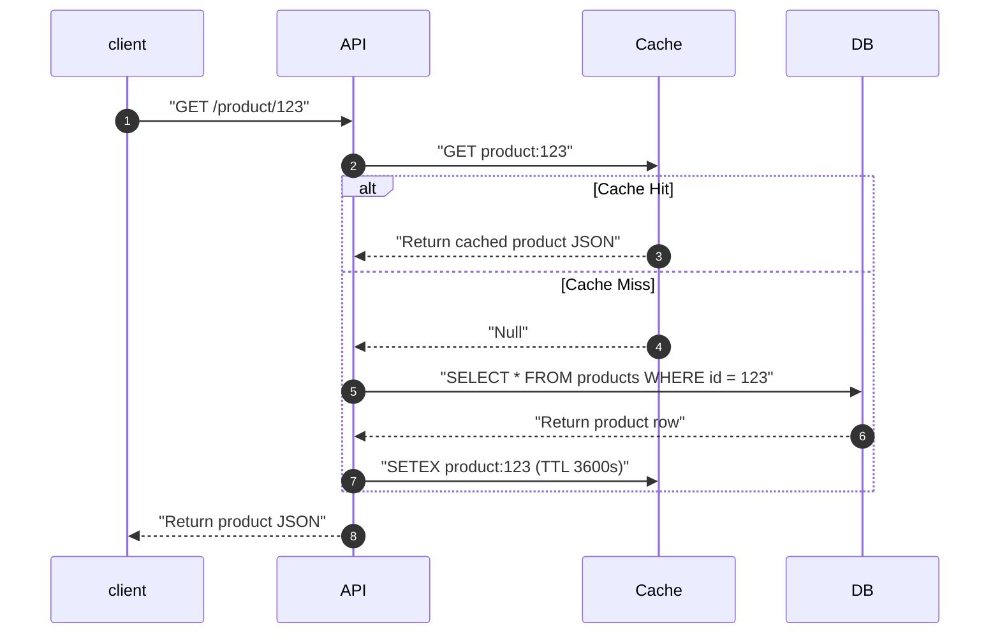
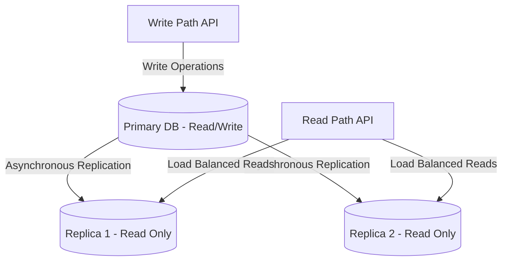
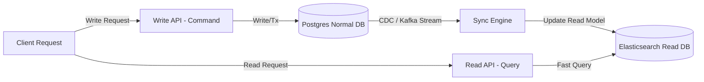

# Pattern 04: Scaling Reads

The **Scaling Reads** pattern is applied when a system experiences high read throughput relative to write throughput (e.g., social media feeds, search engines, product catalogs). 

In such systems, the database becomes a bottleneck due to disk I/O, heavy query CPU utilization, or complex multi-table `JOIN` operations. The goal is to design an architecture that optimizes data retrieval with sub-millisecond latencies.

**The read latency hierarchy (fastest to slowest):**

```
In-process cache (L1):   < 1 µs   (local dict/hashmap in application memory)
Redis / Memcached:        0.1–1 ms (network hop, in-memory)
Read replica (same DC):   1–10 ms  (network + disk)
Primary DB:               2–50 ms  (network + disk + lock contention)
Cross-region DB:          50–200 ms (geography)
```

The goal: serve the maximum fraction of reads from the fastest, cheapest tier.

---

## 1. The Scaling Hierarchy for Reads

When scaling reads, follow the architectural scaling hierarchy:

```
[ Denormalize / Index ] --> [ Read Replicas ] --> [ Caching (Redis/CDN) ] --> [ CQRS Pattern ]
```

---

## 2. Core Architectural Scaling Strategies

Let's explore the key strategies for scaling reads, including sequence flows and trade-offs.

### A.0 In-Process Cache (L1 — Application-Level)

Cache hot objects directly in application server memory. **Zero network cost.**

```python
from cachetools import TTLCache

# Per-process cache: 1000 objects, max 60s TTL
_config_cache = TTLCache(maxsize=1000, ttl=60)

def get_feature_flags():
    if "flags" in _config_cache:
        return _config_cache["flags"]
    flags = remote_config_service.fetch()
    _config_cache["flags"] = flags
    return flags
```

**Best for:** Rarely-changing reference data (feature flags, config, country codes), objects needed on every request, per-request deduplication (DataLoader pattern).

**Limitation:** Each application server has its own copy — invalidation requires broadcasting to all servers. Accept stale data with short TTLs, or skip L1 for data requiring immediate consistency.

---

### A. Caching Strategies (Distributed Cache — Redis/Memcached)
Caching places a high-speed memory layer (e.g., Redis or Memcached) in front of the database.



*   **Cache Invalidation Patterns:**
    1.  **Cache-Aside (Lazy Loading):** Application queries cache first. On miss, it queries DB, populates cache, and returns (as shown above). *Highly efficient for sparse access, but first-time reads have higher latency.*
    2.  **Write-Through:** Application writes to cache and DB simultaneously. *Guarantees fresh data, but increases write latency.*
    3.  **Write-Behind (Write-Back):** Application writes to cache immediately, and cache asynchronously flushes writes to DB. *Extreme write throughput, but risks data loss on cache crash.*
    4.  **Read-Through:** The cache itself is responsible for fetching data from the DB on a miss (the application only ever talks to the cache). *Simplifies application code and centralizes cache-population logic, but couples the cache layer to the data source and makes cache configuration more complex.*

*   **Cache Key Design:**
    ```python
    # Bad: too coarse (one cache miss invalidates everything)
    redis.get("all_events")
    
    # Bad: too fine (very low hit rate)
    redis.get(f"event:{id}:field:name")
    
    # Good: logical object boundary
    redis.get(f"event:{id}")           # full event object
    redis.get(f"user:{id}:feed")       # user's precomputed feed
    redis.get(f"search:{hash(query)}") # search result set
    ```

*   **Cache Hit Rate Math:**
    ```
    Target: 95% cache hit rate
    At 100K reads/sec:
      Cache hits: 95K/sec (served from Redis at < 1ms)
      Cache misses: 5K/sec (hit database)
    
    Postgres can handle 10K–50K QPS on a well-indexed table
    → 5K/sec database load is comfortable
    
    If cache hit rate drops to 80%:
      Cache misses: 20K/sec → database potentially stressed
      → Add more cache nodes or increase TTL
    ```

*   **Cache Warming Strategies:**
    On cold starts, new deployments, or after a full cache flush, the cache is empty and all requests become cache misses — effectively a self-inflicted **cache stampede**. To mitigate this:
    1.  **Background Warmer Job:** Run an async job at startup that queries the DB for the top-N hot keys (based on access frequency logs or a static hot-key list) and pre-populates the cache before the service begins accepting traffic.
    2.  **Deployment-Aware Warming:** During rolling deployments, warm the new instance's local cache from the outgoing instance's cache (or from a shared Redis cluster) before routing traffic to it.
    3.  **Lazy Warm with Request Coalescing:** Accept a brief cold period, but combine with the **Mutex Locking** pattern (see Q1 below) to ensure only one request populates each key.

---

### B. Database Read Replication (Horizontal Scale)
We separate the write path from the read path by creating a single Primary database (handling writes) and multiple Read Replicas (handling reads). Writes propagate to replicas asynchronously.



*   **The Replication Lag Challenge:**
    Because replication is asynchronous, a **Replication Lag** exists (typically milliseconds to seconds). If a user writes data and immediately refreshes the page, the read query might land on a replica that hasn't received the write yet, making the write appear "lost".
*   **The Solution (Read-Your-Own-Writes Consistency):**
    *   **User Pinning:** Route reads to the Primary DB for a short window (e.g., 5 seconds) after a write occurs, or if the request comes from the user who performed the write.
    *   **Version Comparison:** Pass a version or update timestamp in the user's session. If the replica's replication status is behind that timestamp, force the query to hit the Primary database.

---

### C. CQRS (Command Query Responsibility Segregation)
For advanced systems, completely separate the write data model (Commands) from the read data model (Queries). The write database is optimized for ACID normalization (e.g., Postgres), while the read database is optimized for search and queries (e.g., Elasticsearch or DynamoDB).



*   **Change Data Capture (CDC):** Systems like **Debezium** listen to the database binlog/WAL and stream updates to a message broker (Kafka), ensuring the read models remain synchronized. See [Pattern 03: Multi-Step Processes](./03_multi_step_processes.md) for the Transactional Outbox pattern, which uses CDC to solve the dual-write problem.

*   **The Eventual Consistency Window:**
    After a write is committed to the write DB, the read model (e.g., Elasticsearch) may be stale for a window of **milliseconds to seconds** — the time it takes for CDC to capture the change, publish it to Kafka, and for the sync engine to update the read DB.

    For most users this is invisible. But for the **writing user** who just submitted an update, seeing stale data is jarring ("I just edited my profile, but the old name still shows").

*   **Solution — Read-Your-Own-Writes in CQRS:**
    Apply the same technique described in the Read Replication section above: route the **writing user's** subsequent read requests to the **write database** for a short window (e.g., 5–10 seconds) after their write. Other users continue reading from the optimized read model.

    Alternatively, use [Pattern 01: Real-Time Updates](./01_realtime_updates.md) (WebSockets/SSE) to push read-model update notifications to the client. Once the client receives a "sync complete" event, it can safely read from the query store.

---

### D. Materialized Views

A **Materialized View** is a database-level read optimization that stores the result of a complex query as a physical table. Unlike a regular view (which re-executes the query each time), a materialized view is pre-computed and can be indexed.

```sql
-- Postgres example: pre-compute a product catalog with aggregated review stats
CREATE MATERIALIZED VIEW product_catalog_mv AS
SELECT
    p.id, p.name, p.price,
    COUNT(r.id) AS review_count,
    AVG(r.rating) AS avg_rating
FROM products p
LEFT JOIN reviews r ON r.product_id = p.id
GROUP BY p.id, p.name, p.price;

-- Refresh on schedule (e.g., every 5 minutes via pg_cron)
REFRESH MATERIALIZED VIEW CONCURRENTLY product_catalog_mv;
```

*   **Trade-offs:**
    *   **Pros:** Eliminates expensive `JOIN` and aggregation overhead at read time; can be indexed like a regular table; simple to implement within a single database.
    *   **Cons:** Data is stale between refreshes; `REFRESH MATERIALIZED VIEW` acquires locks (use `CONCURRENTLY` to allow reads during refresh, but it requires a unique index); storage cost of duplicated data.

*   **Best For:** Dashboards, analytics, reporting queries, and any read-heavy query that involves multi-table joins or aggregations that rarely change.

> **Materialized Views vs. CQRS:** A materialized view is a lightweight, single-database alternative to full CQRS. Use materialized views when the read optimization can be expressed as a SQL query within the same database. Use CQRS when the read model requires a fundamentally different storage engine (e.g., Elasticsearch for full-text search).

---

## 2.5 Read Scaling Decision Tree

```
Is content the same for all users (public)?
  YES → CDN (start here; cheapest and most impactful)
  NO  → continue

Is the data small and hot (< 1GB, accessed constantly)?
  YES → In-process cache (L1) for per-server hot objects
  MAYBE → Redis (shared cache across all servers)

Does the data change frequently?
  NO  → Cache with long TTL (hours/days)
  YES → Cache with short TTL + invalidate on write

Is the query expensive (join, aggregation)?
  YES → Materialized view or denormalize to avoid the join
  NO  → Read replica is sufficient

Is personalization required?
  NO  → CDN + Redis covers most cases
  YES → Read replica (can't cache personalized data at CDN)

Is read volume > 50K QPS?
  YES → CQRS / separate read store
  NO  → Read replicas + Redis probably sufficient

Quick sizing guide:
  < 1K QPS    → Single Postgres instance
  1K–10K QPS  → Add Redis cache (cache-aside)
  10K–100K QPS → Redis + read replicas
  > 100K QPS  → CDN + Redis + read replicas + materialized views
  > 1M QPS    → CQRS + dedicated read store (Cassandra, Redis Cluster)
```

---

## 3. Read Optimization Comparison

| Strategy | Speed Limit | Latency | Data Consistency | Main Complexity |
|---|---|---|---|---|
| **Caching (Aside)** | Extreme (RAM) | Sub-ms | Eventual (Stale TTLs) | Cache invalidation, stampede handling. |
| **Read Replicas** | High (Horizontal DBs) | Low | Eventual (Replica Lag) | Routing writes vs reads, lag mitigation. |
| **Denormalization** | Medium | Medium | Immediate | Write path update overhead (write amplification). |
| **CQRS** | High | Low | Eventual | Sync latency, dual data store operations. |

---

## 4. Critical Caching Pitfalls & Deep Dives

### Q1: What is a Cache Stampede (Thundering Herd), and how do you prevent it?
A **Cache Stampede** occurs when a highly popular cache key expires (e.g., the homepage configuration). Suddenly, thousands of concurrent requests read the key, find a cache miss, and simultaneously hit the database, causing database CPU spikes and server crashes.
*   **The Solutions:**
    1.  **Mutex Locking (Single-Flight Pattern):** When a cache miss occurs, the server acquires a lightweight distributed lock for that key. Only the thread with the lock queries the database and updates the cache. Other threads block or sleep briefly, then re-check the cache.
    2.  **Probabilistic Early Expiration (XFetch):** Programmatically expire the cache early based on a probability distribution as requests approach the TTL, allowing a single background worker thread to warm the cache before it officially expires.
    3.  **Background Cache Warmer:** Never let critical keys expire. Use a cron job or worker queue to re-query the DB and update the cache keys asynchronously in the background.

### Q2: Detail the difference between Cache Penetration and Cache Avalanche.
*   **Cache Penetration:**
    *   *The Problem:* Clients query keys that **never exist** in the system (e.g., looking up random non-existent product IDs `GET /product/-9999`). Since these keys are missing from both cache and database, every request bypasses the cache and hits the database directly.
    *   *The Solution:* 
        1.  **Bloom Filters:** Maintain a space-efficient Bloom Filter in memory that records all valid product IDs. If the Bloom Filter says a key doesn't exist, reject the request immediately without hitting the cache or DB.
        2.  **Cache Null Values:** Cache the missing key with a short TTL (e.g., 5 minutes) and a value of `null` or `empty`.
*   **Cache Avalanche:**
    *   *The Problem:* A large cluster of cache keys are set with the exact same expiration time. When that time arrives, they all expire simultaneously, dropping the overall cache hit rate and overloading the database.
    *   *The Solution:*
        *   **Jitter Expirations:** Always add a random offset (entropy/jitter) to your cache TTLs:
            $$\text{TTL} = \text{Base TTL} + \text{Random Offset (seconds)}$$

---

## 5. Security Considerations

Caching and read replication introduce security surfaces that are often overlooked.

### Cache Poisoning and Data Leakage
If cache keys do not incorporate **authorization context**, User A's private data could be served to User B.
*   **Mitigation:** Include the user ID (or role/tenant ID) in the cache key for any user-specific data:
    ```
    cache_key = f"user:{user_id}:profile:{profile_id}"
    ```
    For shared/public data, use keys without user scope but ensure the underlying query enforces access controls.

### Cache Key Enumeration
Predictable cache keys (e.g., `product:1`, `product:2`, `product:3`) allow attackers to enumerate and probe for data.
*   **Mitigation:** For sensitive resources, use non-sequential identifiers (UUIDs) as cache keys. Rate-limit cache lookups. Never expose internal cache keys in API responses.

### Replica Security
Read replicas must enforce the **same access controls** as the primary database. A common misconfiguration is exposing replicas on a less restricted network segment or with weaker authentication.
*   **Mitigation:** Apply identical firewall rules, TLS requirements, and role-based access policies to all replicas. Audit replica access logs independently.

### CDN Cache Security
When using CDN edge caches, ensure `Cache-Control` headers are correctly set for authenticated endpoints. A misconfigured CDN can cache and serve a response containing private data to any subsequent requestor.
*   **Mitigation:** Set `Cache-Control: private, no-store` for authenticated responses. Use `Vary: Authorization` headers where appropriate.

---

## 6. Capacity Planning and Quantitative Reasoning

### Cache Hit Rate Math
The cache hit rate directly determines how much load reaches the database:

$$\text{DB Load} = \text{Total Requests/sec} \times (1 - \text{Hit Rate})$$

| Scenario | Total req/sec | Hit Rate | DB req/sec |
|---|---|---|---|
| No cache | 10,000 | 0% | 10,000 |
| Moderate cache | 10,000 | 90% | 1,000 |
| Well-tuned cache | 10,000 | 95% | 500 |
| Hot-key optimized | 10,000 | 99% | 100 |

A 5% improvement in hit rate (90% → 95%) **halves** the DB load. This is why cache optimization has outsized returns.

### Working Set Sizing
Estimate whether your hot data fits in a single Redis node:

$$\text{Cache Size} = \text{Number of Hot Items} \times \text{Avg Item Size}$$

*   **Example:** 1M product listings × 2KB each = **2 GB** — comfortably fits in a single Redis node (typical max: 25–50 GB).
*   **Example:** 50M user sessions × 5KB each = **250 GB** — requires a Redis Cluster with sharding across multiple nodes.

> **Rule of thumb:** If your working set exceeds 70% of a single Redis node's memory, plan for sharding. Redis Cluster supports up to 1,000 nodes.

### Replication Lag Estimates

| Database | Typical Async Replication Lag | Under Heavy Write Load |
|---|---|---|
| PostgreSQL | 10–100ms | 500ms–2s |
| MySQL (GTID) | 10–50ms | 200ms–1s |
| Aurora (AWS) | ~10–20ms (shared storage) | ~50ms |

> For read-your-writes consistency, a safe "read from primary" window is $2 \times \text{p99 replication lag}$. For Postgres under normal load, this is approximately $2 \times 100\text{ms} = 200\text{ms}$, but a conservative production setting is 3–5 seconds to account for load spikes.

### CQRS Sync Latency Budget
The end-to-end latency from write commit to read model update in a CQRS system:

$$\text{Sync Latency} = \text{CDC Capture} + \text{Kafka Publish} + \text{Consumer Processing} + \text{Read DB Write}$$

Typical breakdown: 100ms (CDC) + 10ms (Kafka) + 50ms (processing) + 20ms (ES index) = **~180ms** end-to-end.

---

> **Cross-references:**
> *   For write-side scaling strategies that complement these read patterns, see [Pattern 05: Scaling Writes](./05_scaling_writes.md).
> *   For handling cache invalidation in real-time, see [Pattern 01: Real-Time Updates](./01_realtime_updates.md).
> *   For contention issues when multiple writers invalidate the same cache key, see [Pattern 02: Dealing with Contention](./02_dealing_with_contention.md).
> *   For caching large binary objects (images, videos), see [Pattern 06: Large Blobs](./06_large_blobs.md).
