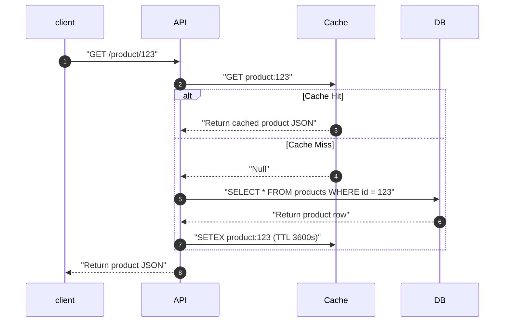
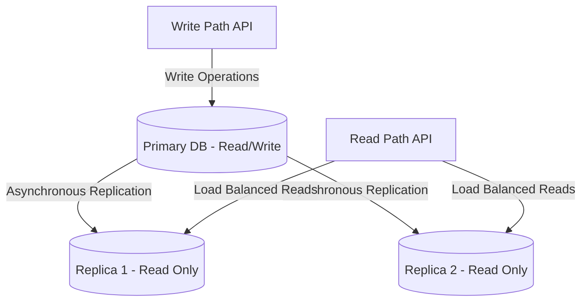
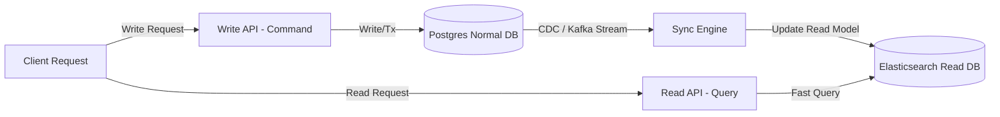

# Pattern 04: Scaling Reads

The **Scaling Reads** pattern is applied when a system experiences high read throughput relative to write throughput (e.g., social media feeds, search engines, product catalogs). 

In such systems, the database becomes a bottleneck due to disk I/O, heavy query CPU utilization, or complex multi-table `JOIN` operations. The goal is to design an architecture that optimizes data retrieval with sub-millisecond latencies.

---

## 1. The Scaling Hierarchy for Reads

When scaling reads, follow the architectural scaling hierarchy:

```
[ Denormalize / Index ] --> [ Read Replicas ] --> [ Caching (Redis/CDN) ] --> [ CQRS Pattern ]
```

---

## 2. Core Architectural Scaling Strategies

Let's explore the key strategies for scaling reads, including sequence flows and trade-offs.

### A. Caching Strategies (The First Line of Defense)
Caching places a high-speed memory layer (e.g., Redis or Memcached) in front of the database.



*   **Cache Invalidation Patterns:**
    1.  **Cache-Aside (Lazy Loading):** Application queries cache first. On miss, it queries DB, populates cache, and returns (as shown above). *Highly efficient for sparse access, but first-time reads have higher latency.*
    2.  **Write-Through:** Application writes to cache and DB simultaneously. *Guarantees fresh data, but increases write latency.*
    3.  **Write-Behind (Write-Back):** Application writes to cache immediately, and cache asynchronously flushes writes to DB. *Extreme write throughput, but risks data loss on cache crash.*

---

### B. Database Read Replication (Horizontal Scale)
We separate the write path from the read path by creating a single Primary database (handling writes) and multiple Read Replicas (handling reads). Writes propagate to replicas asynchronously.



*   **The Replication Lag Challenge:**
    Because replication is asynchronous, a **Replication Lag** exists (typically milliseconds to seconds). If a user writes data and immediately refreshes the page, the read query might land on a replica that hasn't received the write yet, making the write appear "lost".
*   **The Solution (Read-Your-Own-Writes Consistency):**
    *   **User Pinning:** Route reads to the Primary DB for a short window (e.g., 5 seconds) after a write occurs, or if the request comes from the user who performed the write.
    *   **Version Comparison:** Pass a version or update timestamp in the user's session. If the replica's replication status is behind that timestamp, force the query to hit the Primary database.

---

### C. CQRS (Command Query Responsibility Segregation)
For advanced systems, completely separate the write data model (Commands) from the read data model (Queries). The write database is optimized for ACID normalization (e.g., Postgres), while the read database is optimized for search and queries (e.g., Elasticsearch or DynamoDB).



*   **Change Data Capture (CDC):** Systems like **Debezium** listen to the database binlog/WAL and stream updates to a message broker (Kafka), ensuring the read models remain synchronized.

---

## 3. Read Optimization Comparison

| Strategy | Speed Limit | Latency | Data Consistency | Main Complexity |
|---|---|---|---|---|
| **Caching (Aside)** | Extreme (RAM) | Sub-ms | Eventual (Stale TTLs) | Cache invalidation, stampede handling. |
| **Read Replicas** | High (Horizontal DBs) | Low | Eventual (Replica Lag) | Routing writes vs reads, lag mitigation. |
| **Denormalization** | Medium | Medium | Immediate | Write path update overhead (write amplification). |
| **CQRS** | High | Low | Eventual | Sync latency, dual data store operations. |

---

## 4. Critical Caching Pitfalls & Deep Dives

### Q1: What is a Cache Stampede (Thundering Herd), and how do you prevent it?
A **Cache Stampede** occurs when a highly popular cache key expires (e.g., the homepage configuration). Suddenly, thousands of concurrent requests read the key, find a cache miss, and simultaneously hit the database, causing database CPU spikes and server crashes.
*   **The Solutions:**
    1.  **Mutex Locking (Single-Flight Pattern):** When a cache miss occurs, the server acquires a lightweight distributed lock for that key. Only the thread with the lock queries the database and updates the cache. Other threads block or sleep briefly, then re-check the cache.
    2.  **Probabilistic Early Expiration (XFetch):** Programmatically expire the cache early based on a probability distribution as requests approach the TTL, allowing a single background worker thread to warm the cache before it officially expires.
    3.  **Background Cache Warmer:** Never let critical keys expire. Use a cron job or worker queue to re-query the DB and update the cache keys asynchronously in the background.

### Q2: Detail the difference between Cache Penetration and Cache Avalanche.
*   **Cache Penetration:**
    *   *The Problem:* Clients query keys that **never exist** in the system (e.g., looking up random non-existent product IDs `GET /product/-9999`). Since these keys are missing from both cache and database, every request bypasses the cache and hits the database directly.
    *   *The Solution:* 
        1.  **Bloom Filters:** Maintain a space-efficient Bloom Filter in memory that records all valid product IDs. If the Bloom Filter says a key doesn't exist, reject the request immediately without hitting the cache or DB.
        2.  **Cache Null Values:** Cache the missing key with a short TTL (e.g., 5 minutes) and a value of `null` or `empty`.
*   **Cache Avalanche:**
    *   *The Problem:* A large cluster of cache keys are set with the exact same expiration time. When that time arrives, they all expire simultaneously, dropping the overall cache hit rate and overloading the database.
    *   *The Solution:*
        *   **Jitter Expirations:** Always add a random offset (entropy/jitter) to your cache TTLs:
            $$\text{TTL} = \text{Base TTL} + \text{Random Offset (seconds)}$$
