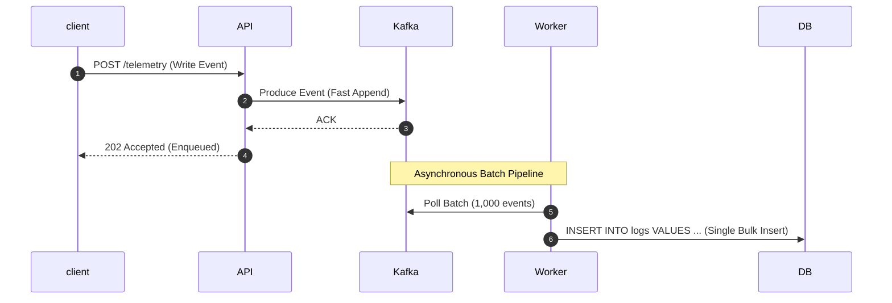
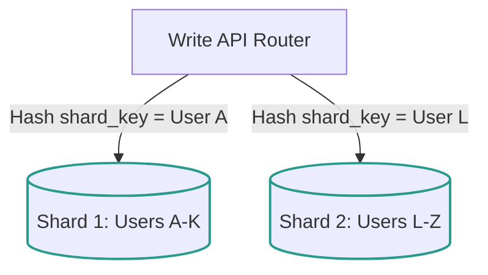

# Pattern 05: Scaling Writes

The **Scaling Writes** pattern is applied when a system experiences high write throughput or massive ingestion volumes (e.g., IoT sensor clickstreams, ad impressions, financial ledger logs, tracking telemetry). 

Unlike read workloads, writes cannot be easily resolved with standard caching (since every write must persist safely). Heavy write traffic saturates database disk I/O, consumes database transaction threads, and degrades indexing performance.

---

## 1. The Scaling Hierarchy for Writes

To scale database write performance, systems shift coordination from synchronous disk I/O to asynchronous sharding and memory-buffered flows:

```
[ LSM Storage Engines ] --> [ Write Buffering (Queues) ] --> [ Horizontal Database Sharding ]
```

---

## 2. Core Architectural Scaling Strategies

Let's explore the key strategies for scaling writes, including sequence flows and trade-offs.

### A. Write Buffering & Asynchronous Processing
Instead of writing directly to the database synchronously, offload incoming writes to a high-throughput, partitioned event stream (e.g., **Apache Kafka** or **AWS Kinesis**). Database consumer workers then pull batches of events and write them to the database in aggregated transactions.



*   **Trade-offs:**
    *   **Pros:** Absorbs sudden write spikes seamlessly; converts bursty write traffic into a flat, predictable database load; decouples API latency from database disk speeds.
    *   **Cons:** Breaks synchronous feedback loops (e.g., client does not know immediately if the database write succeeded); eventual consistency model.

---

### B. Horizontal Database Sharding
Sharding partitions a single logical database table across multiple physically independent database instances. Each instance is called a **Shard** and contains a subset of the data.



*   **Sharding Strategies:**
    1.  **Hash-Based Sharding:** Apply a cryptographic hash function to a sharding key (e.g., `hash(user_id) % Number of Shards`). *Provides highly uniform data distribution, but makes adding database nodes complex (requires re-sharding).*
    2.  **Range-Based Sharding:** Assign ranges of keys to specific shards (e.g., `A-K` to Shard 1, `L-Z` to Shard 2). *Simple, but highly vulnerable to hotspotting (e.g., if most active users have names starting with 'S').*
*   **The Cross-Shard Challenge:**
    Queries that do not include the sharding key must scan all database shards simultaneously (Scatter-Gather), which is extremely slow. Cross-shard joins or distributed transactions across shards are highly inefficient and should be avoided in design.

---

### C. Write-Optimized Storage Engines (LSM-Tree vs. B-Tree)
Relational databases (like PostgreSQL and MySQL) use **B-Tree** structures. B-Trees require random page writes to update records, which incurs heavy disk seek latency.
*   **Log-Structured Merge-Tree (LSM-Tree):** Write-heavy databases (like **Cassandra**, **ScyllaDB**, **RocksDB**, or **InfluxDB**) use LSM-Trees.
    1.  Writes are appended sequentially in memory to a sorted cache called the **MemTable** and written to a sequential commit log (WAL) for durability.
    2.  Once the MemTable fills, it is flushed sequentially to disk as a sorted, immutable **SSTable (Sorted String Table)**.
    3.  A background thread periodically runs **Compaction** to merge and clean duplicate keys across SSTables.

```
[ incoming Write ] ──> [ Commit Log (Append-Only) ]
            │
            └──> [ MemTable (In-Memory Sorted structure) ]
                         │  (Once full, sequential flush)
                         ▼
                 [ SSTables on Disk (Immutable files) ]
```

*   **Why it matters in interviews:** If an interviewer describes a system with extreme write volumes (e.g., IoT trackers or system log metrics), reject B-Tree relational databases immediately. Propose a Cassandra/Wide-Column LSM-tree database.

---

## 3. Write Scaling Trade-Off Matrix

| Strategy | Write Capacity | Latency | Data Consistency | Main Complexity |
|---|---|---|---|---|
| **Write Buffering** | High (Decoupled) | Medium (Async) | Eventual | Handing client response, consumer failures. |
| **Sharding** | Massive (Scales with nodes) | Low | Strong (Per Shard) | Re-sharding, hot key sharding, no cross-shard queries. |
| **LSM Databases** | Very High (Sequential Disk) | Low | Tunable (Cassandra) | Write amplification, read path performance tuning. |

---

## 4. Critical Write Bottlenecks & Deep Dives

### Q1: How do you select a good Sharding Key in interviews?
Selecting the wrong sharding key is one of the most common reasons systems fail under write-heavy loads.
*   **The Bad Choices:**
    *   **Timestamp:** If you shard by `timestamp`, all writes for the current minute will hit the exact same shard (the one holding the active time range), overloading it while other shards sit idle.
    *   **Geolocation:** If you shard by `city`, a massive event in New York will overwhelm the NYC shard, while the shard for a smaller town sits unused.
*   **The Good Choices:**
    *   **High-Cardinality Entity IDs:** Sharding by `user_id` or `device_id` combined with a hash function distributes writes uniformly across all available shards.
    *   **Composite Sharding Keys:** Combine a partition key with a bucketing factor (e.g., `user_id + (timestamp % N)`) to distribute highly active single users across multiple shards.

### Q2: How do you generate unique, highly scalable database IDs without auto-increment collisions?
If you shard your databases, standard database auto-incrementing IDs will collide (e.g., Shard 1 and Shard 2 both generating ID `101`).
*   **The Solution (Snowflake ID Architecture):**
    Generate a 64-bit unique ID in application memory using a decentralized coordinator format (Twitter Snowflake style):
    
```
+------------------------------------+--------------------------+------------------------+
| 41-bit Timestamp (Millisec epoch)  | 10-bit Node/Machine ID   | 12-bit Sequence Number |
+------------------------------------+--------------------------+------------------------+
```

*   **Why it works:**
    *   **41-bit Timestamp:** Provides custom epoch time (lasts for 69 years).
    *   **10-bit Node/Machine ID:** Uniquely identifies up to 1024 servers, preventing collisions across shards.
    *   **12-bit Sequence Number:** Generates up to 4096 unique IDs per millisecond per machine.
    *   **Result:** Chronologically sortable, 64-bit integers generated entirely without network coordination.
