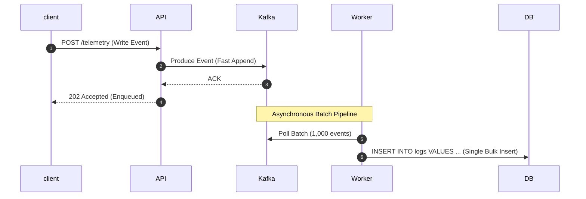
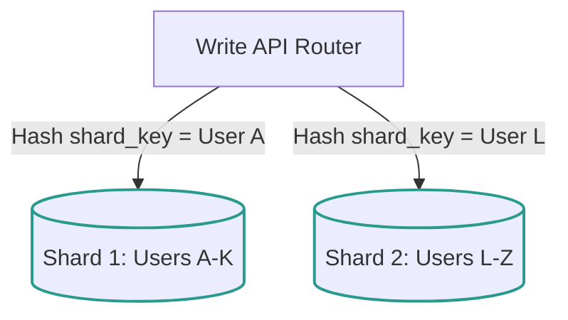
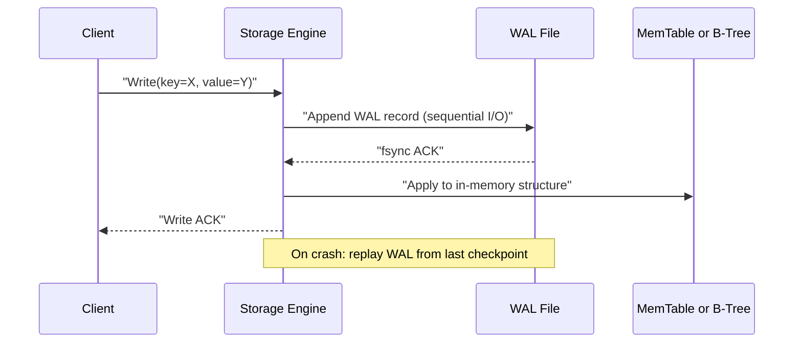

# Pattern 05: Scaling Writes

The **Scaling Writes** pattern is applied when a system experiences high write throughput or massive ingestion volumes (e.g., IoT sensor clickstreams, ad impressions, financial ledger logs, tracking telemetry). 

Unlike read workloads, writes cannot be easily resolved with standard caching (since every write must persist safely). Heavy write traffic saturates database disk I/O, consumes database transaction threads, and degrades indexing performance.

---

## 1. The Scaling Hierarchy for Writes

To scale database write performance, systems shift coordination from synchronous disk I/O to asynchronous sharding and memory-buffered flows:

```
[ LSM Storage Engines ] --> [ Write Buffering (Queues) ] --> [ Horizontal Database Sharding ]
```

---

## 2. Core Architectural Scaling Strategies

Let's explore the key strategies for scaling writes, including sequence flows and trade-offs.

### A. Write Buffering & Asynchronous Processing
Instead of writing directly to the database synchronously, offload incoming writes to a high-throughput, partitioned event stream (e.g., **Apache Kafka** or **AWS Kinesis**). Database consumer workers then pull batches of events and write them to the database in aggregated transactions.



*   **Trade-offs:**
    *   **Pros:** Absorbs sudden write spikes seamlessly; converts bursty write traffic into a flat, predictable database load; decouples API latency from database disk speeds.
    *   **Cons:** Breaks synchronous feedback loops (e.g., client does not know immediately if the database write succeeded); eventual consistency model.

---

### B. Horizontal Database Sharding
Sharding partitions a single logical database table across multiple physically independent database instances. Each instance is called a **Shard** and contains a subset of the data.



*   **Sharding Strategies:**
    1.  **Hash-Based Sharding:** Apply a cryptographic hash function to a sharding key (e.g., `hash(user_id) % Number of Shards`). *Provides highly uniform data distribution, but makes adding database nodes complex (requires re-sharding).*
    2.  **Range-Based Sharding:** Assign ranges of keys to specific shards (e.g., `A-K` to Shard 1, `L-Z` to Shard 2). *Simple, but highly vulnerable to hotspotting (e.g., if most active users have names starting with 'S').*
*   **The Cross-Shard Challenge:**
    Queries that do not include the sharding key must scan all database shards simultaneously (Scatter-Gather), which is extremely slow. Cross-shard joins or distributed transactions across shards are highly inefficient and should be avoided in design.

*   **Resharding Mechanics:**
    Adding or removing physical shards without downtime is one of the hardest operational problems in distributed databases.
    *   **Virtual Shards / Consistent Hashing:** Instead of mapping keys directly to physical nodes, map them to a large ring of **virtual shards** (e.g., 4096 virtual shards across 8 physical nodes). When a node is added, only a fraction of virtual shards are reassigned — minimizing data movement. Systems like **DynamoDB** and **Cassandra** use this internally.
    *   **Automatic Range Splitting:** Databases like **CockroachDB** and **TiDB** automatically detect when a range (shard) exceeds a size threshold (e.g., 512 MB) and split it into two child ranges, rebalancing across nodes. **Vitess** provides a sharding middleware layer for MySQL that supports dynamic resharding with online schema changes.
    *   **Key Insight:** Prefer systems with built-in automatic resharding (CockroachDB, Vitess) over manual shard management when operational complexity is a concern.

*   **Shard Failure and Recovery:**
    *   **Replica Promotion:** Each shard should have at least one synchronous or semi-synchronous replica. When the primary shard fails, a health-check system (e.g., orchestrator, etcd-based leader election) promotes the replica to primary. See [Pattern 02](./02_dealing_with_contention.md) for distributed locking patterns used during leader election.
    *   **Split-Brain Detection:** If a network partition causes both the old primary and the promoted replica to accept writes, a **fencing token** or **epoch number** mechanism is used. The old primary must be fenced off (its writes rejected) by checking epoch numbers at the storage layer.
    *   **Quorum Writes:** In leaderless systems (e.g., Cassandra), use quorum consistency (`W + R > N`) to tolerate node failures without explicit failover.

---

### C. Write-Optimized Storage Engines (LSM-Tree vs. B-Tree)
Relational databases (like PostgreSQL and MySQL) use **B-Tree** structures. B-Trees require random page writes to update records, which incurs heavy disk seek latency.
*   **Log-Structured Merge-Tree (LSM-Tree):** Write-heavy databases (like **Cassandra**, **ScyllaDB**, **RocksDB**, or **InfluxDB**) use LSM-Trees.
    1.  Writes are appended sequentially in memory to a sorted cache called the **MemTable** and written to a sequential commit log (WAL) for durability.
    2.  Once the MemTable fills, it is flushed sequentially to disk as a sorted, immutable **SSTable (Sorted String Table)**.
    3.  A background thread periodically runs **Compaction** to merge and clean duplicate keys across SSTables.

```
[ incoming Write ] ──> [ Commit Log (Append-Only) ]
            │
            └──> [ MemTable (In-Memory Sorted structure) ]
                         │  (Once full, sequential flush)
                         ▼
                 [ SSTables on Disk (Immutable files) ]
```

*   **Why it matters in interviews:** If an interviewer describes a system with extreme write volumes (e.g., IoT trackers or system log metrics), reject B-Tree relational databases immediately. Propose a Cassandra/Wide-Column LSM-tree database.

#### LSM-Tree Amplification Trade-Offs

LSM-Trees optimize writes at the expense of three forms of amplification that are critical to understand and tune:

*   **Read Amplification:** A point read may need to check the MemTable, then each level of SSTables from newest to oldest until the key is found. In the worst case with $L$ levels and $T$ tables per level, a read touches $O(L \times T)$ files.
    *   **Mitigation — Bloom Filters:** Each SSTable maintains an in-memory Bloom filter. Before performing a disk read, the system checks the filter, which answers "definitely not present" or "possibly present" with a configurable false-positive rate (typically 1%). This eliminates ~99% of unnecessary disk reads.
    *   **Mitigation — Block Cache:** Frequently accessed SSTable blocks are cached in memory (RocksDB's `block_cache`), reducing repeated disk I/O.

*   **Write Amplification:** Compaction rewrites data multiple times as it migrates through levels. In **Leveled Compaction** (default in RocksDB), a single logical write is physically rewritten **10–30×** over its lifetime. This is the dominant cost for SSDs, directly impacting drive endurance and write throughput.
    *   **Size-Tiered vs. Leveled Compaction:** Size-tiered compaction (Cassandra default) has lower write amplification (~4–10×) but higher space amplification. Leveled compaction has higher write amplification but guarantees bounded space usage and faster reads.
    *   **Key interview insight:** When asked "what are the downsides of LSM-Trees?", write amplification wearing out SSDs is the Staff+ answer.

*   **Space Amplification:** During compaction, both the old and new SSTables coexist temporarily on disk. Additionally, deleted keys (tombstones) persist until compacted away. A system may use **1.1–2×** the logical data size on disk at any given time.
    *   **Tombstone Management:** Deleted keys are not immediately removed — they are marked with tombstones that must propagate through all levels during compaction before space is reclaimed.

---

### D. Write-Ahead Log (WAL)

The WAL is the foundational durability mechanism shared by both B-Tree and LSM-Tree storage engines. It ensures that **no acknowledged write is ever lost**, even during a crash.

*   **How it works:**
    1.  Every write operation is first **appended** to a sequential, append-only log file on disk (the WAL).
    2.  Only after the WAL entry is persisted does the engine apply the change to the in-memory data structure (B-Tree page buffer or LSM MemTable).
    3.  On crash recovery, the engine replays all WAL entries written since the last checkpoint to reconstruct the in-memory state.



*   **WAL Sync Modes — The Durability vs. Performance Trade-Off:**

    | Sync Mode | Mechanism | Durability | Throughput Impact |
    |---|---|---|---|
    | **fsync per write** | Each write issues an `fsync()` to flush the OS page cache to disk | Strongest — zero data loss on crash | Slowest — each write waits for disk I/O (~0.1–1ms per fsync on SSD) |
    | **Batch fsync** | Buffer multiple writes and issue a single `fsync()` every N milliseconds (e.g., every 10ms) | Slight risk — up to N ms of writes may be lost on crash | 5–10× higher throughput than per-write fsync |
    | **No fsync (OS-managed)** | Rely on OS to flush page cache | Weak — minutes of data can be lost on crash or power failure | Highest throughput, but unsuitable for durable systems |

    *   **PostgreSQL** defaults to `fsync = on` (per commit). Setting `synchronous_commit = off` enables batch mode.
    *   **RocksDB** offers `WriteOptions::sync` per write and `WAL_ttl_seconds` for WAL lifecycle management.
    *   **Key insight:** In interviews, always mention the WAL when discussing crash recovery. It is the answer to "how do you ensure writes survive a server crash?"

---

## 3. Write Scaling Trade-Off Matrix

| Strategy | Write Capacity | Latency | Data Consistency | Main Complexity |
|---|---|---|---|---|
| **Write Buffering** | High (Decoupled) | Medium (Async) | Eventual | Handing client response, consumer failures. See [Pattern 07](./07_long_running_tasks.md) for async task processing of buffered writes. |
| **Sharding** | Massive (Scales with nodes) | Low | Strong (Per Shard) | Re-sharding, hot key sharding, no cross-shard queries. |
| **LSM Databases** | Very High (Sequential Disk) | Low | Tunable (Cassandra) | Write amplification, read path performance tuning. |

### Back-of-Envelope: Write Throughput by Engine Type

Use these numbers to anchor system design estimates and justify technology choices:

$$\text{PostgreSQL (B-Tree)} \approx 5{,}000 - 10{,}000 \text{ writes/sec per node}$$
$$\text{Cassandra (LSM-Tree)} \approx 50{,}000 - 100{,}000+ \text{ writes/sec per node}$$
$$\text{Kafka (Append-Only Log)} \approx 1{,}000{,}000 \text{ messages/sec per partition}$$

*   **Example calculation:** An IoT platform ingesting 500K sensor events/sec:
    *   With Kafka as a write buffer: $$\lceil 500{,}000 / 1{,}000{,}000 \rceil = 1 \text{ Kafka partition (minimum)}$$ — but use 10+ partitions for consumer parallelism.
    *   With Cassandra as the storage layer: $$\lceil 500{,}000 / 80{,}000 \rceil \approx 7 \text{ Cassandra nodes}$$ — add replication factor 3 → ~21 nodes total.
    *   With PostgreSQL (if forced): $$\lceil 500{,}000 / 8{,}000 \rceil \approx 63 \text{ shards}$$ — operationally prohibitive, confirming LSM-Tree is the right choice.

---

## 4. Critical Write Bottlenecks & Deep Dives

### Q1: How do you select a good Sharding Key in interviews?
Selecting the wrong sharding key is one of the most common reasons systems fail under write-heavy loads.
*   **The Bad Choices:**
    *   **Timestamp:** If you shard by `timestamp`, all writes for the current minute will hit the exact same shard (the one holding the active time range), overloading it while other shards sit idle.
    *   **Geolocation:** If you shard by `city`, a massive event in New York will overwhelm the NYC shard, while the shard for a smaller town sits unused.
*   **The Good Choices:**
    *   **High-Cardinality Entity IDs:** Sharding by `user_id` or `device_id` combined with a hash function distributes writes uniformly across all available shards.
    *   **Composite Sharding Keys:** Combine a partition key with a bucketing factor (e.g., `user_id + (timestamp % N)`) to distribute highly active single users across multiple shards.

### Q2: How do you generate unique, highly scalable database IDs without auto-increment collisions?
If you shard your databases, standard database auto-incrementing IDs will collide (e.g., Shard 1 and Shard 2 both generating ID `101`).
*   **The Solution (Snowflake ID Architecture):**
    Generate a 64-bit unique ID in application memory using a decentralized coordinator format (Twitter Snowflake style):
    
```
+------------------------------------+--------------------------+------------------------+
| 41-bit Timestamp (Millisec epoch)  | 10-bit Node/Machine ID   | 12-bit Sequence Number |
+------------------------------------+--------------------------+------------------------+
```

*   **Why it works:**
    *   **41-bit Timestamp:** Provides custom epoch time (lasts for 69 years).
    *   **10-bit Node/Machine ID:** Uniquely identifies up to 1024 servers, preventing collisions across shards.
    *   **12-bit Sequence Number:** Generates up to 4096 unique IDs per millisecond per machine.
    *   **Result:** Chronologically sortable, 64-bit integers generated entirely without network coordination.

---

## 5. Security Considerations

Write-heavy systems expose unique security surfaces due to sharded routing layers, high-throughput ingestion endpoints, and distributed storage.

*   **SQL Injection in Sharding Layers:**
    Sharding middleware (e.g., ProxySQL, Vitess VTGate) routes queries based on the shard key. If the shard key is derived from user input without parameterized queries, an attacker can inject SQL that is forwarded to the wrong shard or causes unintended cross-shard operations. **Always use parameterized queries at the routing layer**, not just at the application layer.

*   **Encryption at Rest per Shard:**
    Each shard should use independent encryption keys (envelope encryption with AWS KMS or HashiCorp Vault). If a single shard's disk is compromised, only that shard's data is exposed. Rotate keys on a per-shard schedule without requiring full cluster downtime.

*   **Audit Logging for Write Operations:**
    Every mutating operation should produce an immutable audit record containing: timestamp, authenticated principal, operation type, affected shard, and a hash of the payload. Store audit logs in a separate, append-only system (e.g., a dedicated Kafka topic or immutable S3 bucket with Object Lock) to prevent tampering.

*   **Rate Limiting at Ingestion:**
    High-throughput write endpoints are prime targets for denial-of-service attacks. Apply per-tenant and per-IP rate limits at the API gateway layer before writes reach Kafka or the database. See [Pattern 04](./04_scaling_reads.md) for complementary read-side rate limiting strategies.

---

## 6. Observability and Monitoring

Write-heavy systems fail in subtle ways — compaction falling behind, replication lag growing, or a single hot shard silently degrading. Proactive monitoring is essential.

*   **Key Metrics to Track:**

    | Metric | What It Measures | Alert Threshold (Example) |
    |---|---|---|
    | **Write Latency p99** | Tail latency of individual write operations | > 50ms for LSM, > 100ms for B-Tree |
    | **WAL Size / Growth Rate** | WAL accumulation rate — a growing WAL means checkpoints are falling behind | WAL size > 2× normal baseline |
    | **Compaction Backlog** | Number of pending compaction tasks (LSM-Tree) | > 20 pending compactions sustained for 5 min |
    | **Replication Lag** | Time delay between primary and replica writes | > 5 seconds for synchronous replicas |
    | **Queue Consumer Lag** | Messages produced but not yet consumed (Kafka/SQS) | Lag growing for > 2 min continuously |
    | **Shard Size Skew** | Ratio of largest shard to smallest shard | Skew ratio > 2:1 |
    | **Disk I/O Utilization** | Percentage of disk bandwidth consumed by writes and compaction | > 80% sustained |

*   **Alerting Philosophy:**
    *   Use **rate-of-change alerts** over absolute thresholds. A WAL that is 1GB is fine if stable; a WAL growing at 100MB/min signals a checkpoint failure.
    *   Correlate compaction backlog with write latency p99 — if both spike simultaneously, compaction is the bottleneck.
    *   Monitor **per-shard metrics** independently. Aggregate metrics can mask a single shard in distress.
