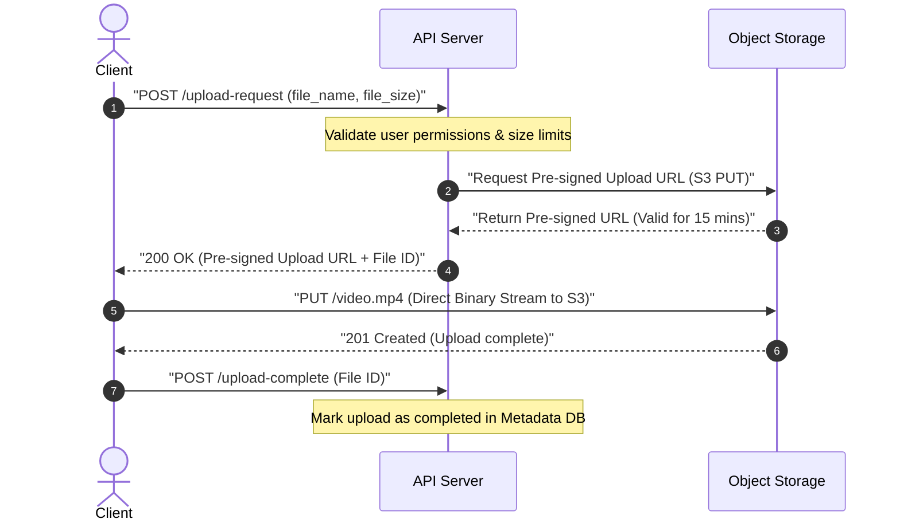
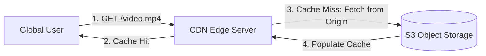

# Pattern 06: Large Blobs

The **Large Blobs** pattern is applied when a system needs to ingest, store, process, and serve large binary large objects (BLOBs) such as high-resolution images, videos, audio recordings, virtual machine disk images, or large data datasets.

---

## 1. Why Databases Fail for Large Blobs

A common system design anti-pattern is storing binary blobs (using the `BYTEA` or `BLOB` column types) directly in database tables. This fails at scale because:
*   **Buffer Pool Pollution:** Databases cache active tables in memory (RAM). Large binary files fill up the buffer pool, evicting indexes and lightweight text records, which severely degrades standard query performance.
*   **Backup & Migration Overhead:** Backing up a 10TB database containing text data is manageable. Backing up a 10TB database containing 9.9TB of raw video files is extremely slow, complex, and expensive.
*   **Expensive Storage:** Database disks are typically highly performant, expensive SSDs (e.g., AWS EBS gp3 or io2). Using premium SSD storage for cold video files is financially wasteful.

---

## 2. Core Architectural Scaling Strategies

To store large media files efficiently, systems decouple storage and delegate streaming directly between clients and specialized storage infrastructures.

### A. Pre-Signed URLs (Direct Client Ingestion)
To prevent your API gateway and application servers from becoming network bandwidth or CPU bottlenecks, **never** route file uploads through your application servers. Instead, use **Pre-Signed URLs**.

*   **Trade-offs:**
    *   **Pros:** Application servers consume zero CPU or network bandwidth during uploads; infinite horizontal scale (delegated to cloud providers like Amazon S3 or Google Cloud Storage); extremely secure (time-limited access).
    *   **Cons:** Application server cannot validate the binary contents *during* the upload (e.g., checking if the file is corrupted or contains malware). Verification must be handled asynchronously post-upload.

---

### B. CDN Edge Delivery & Caching (Read Path)
For fast global distribution, front your object storage with a **Content Delivery Network (CDN)** like Cloudflare or AWS CloudFront. 

*   **Edge Caching Mechanics:**
    CDNs cache files at **Point of Presence (PoP)** edge servers closer to the user. Subsequent requests for the same media file bypass your origin storage completely, reducing origin network costs and latency.

---

### C. Multipart & Parallel Uploads
If a user uploads a single 10GB file over a standard connection and the network drops at 9.9GB, the entire upload is lost and must be restarted.
*   **The Solution:** Use **Multipart Uploads**.
    1.  The client requests a multipart upload initialization.
    2.  The application server generates a set of pre-signed URLs (one for each 5MB–100MB chunk).
    3.  The client uploads all chunks **in parallel** directly to the object storage.
    4.  If one chunk fails, the client only retries that specific chunk.
    5.  Once all chunks are uploaded, the client sends a complete request, and the object store merges the chunks into the single master blob on the server side.

---

### D. Dynamic Video Chunking (HLS/DASH Streaming)
Instead of serving a single massive 2GB video file, real-time video streaming services (like YouTube or Netflix) use dynamic adaptive streaming protocols like **HLS (HTTP Live Streaming)** or **DASH**:
1.  When a file is uploaded, a background transcoder worker breaks the video down into thousands of small **2-10 second chunks** (usually `.ts` or `.m4s` files) and generates an index file (manifest file `.m3u8` or `.mpd`).
2.  The transcoder outputs these chunks in varying resolutions (360p, 720p, 1080p, 4K).
3.  The client's video player fetches the manifest index, then fetches the video chunks sequentially.
4.  If network speeds drop, the player automatically switches and requests lower-resolution chunks for the next 2-second window, preventing buffering.

---

## 3. Large Blob Storage & Delivery Matrix

| Architecture Component | Primary Purpose | Cost Profile | Latency Profile |
|---|---|---|---|
| **Metadata DB (Postgres/Dynamo)** | Stores file pointers, names, user IDs, S3 URLs. | Low (Highly optimized text records) | Microseconds |
| **Object Storage (S3/GCS)** | Cold/Warm raw binary stream storage. | Lowest per-GB tier storage | Milliseconds |
| **CDN (Cloudflare/CloudFront)** | Global read caching closer to users. | Moderate (Based on egress traffic) | Sub-millisecond (At edge) |
| **Transcoder (FFmpeg Workers)** | Resizing, encoding, chunking (HLS). | High (Compute intensive) | Asynchronous |

---

## 4. Advanced Interview Deep Dives

### Q1: How do you secure private large assets (e.g., paid video courses) behind a CDN?
If you place media assets in public S3 buckets, anyone can copy the URL and share it. Fronting S3 with a CDN still risks users bypassing authentication unless locked down.
*   **The Solution:**
    1.  **Private S3 Buckets:** Set S3 bucket policies to **only** allow access from your CDN's Origin Access Identity (OAI) or Origin Access Control (OAC). Block all direct public internet requests to S3.
    2.  **Pre-Signed Cookies:** Instead of signing every single 2-second HLS video chunk URL individually (which generates high CPU overhead), have the application server set a secure, signed **CDN Cookie** on the client browser upon authentication.
    3.  **CDN Edge Verification:** When the client requests video chunks from the CDN, the CDN edge server verifies the signature of the cookie locally. If the cookie is valid and unexpired, the CDN serves the cached file; otherwise, it rejects the request at the edge.

### Q2: What is "Origin Shielding" in high-scale CDN architectures?
If a popular video goes viral globally, thousands of CDN edge servers around the world might simultaneously experience cache misses. If all those edge servers query your origin S3 storage at the same time, it can cause a **Cache Stampede** on your origin storage, incurring massive egress costs and throttling.
*   **The Solution (Origin Shielding):**
    Introduce a centralized, high-capacity cache layer (the Origin Shield) between your global edge CDN servers and your primary S3 bucket. All edge cache misses route first to this shield cache. The shield pools requests, fetches the asset from S3 once, caches it, and distributes it to the edge nodes, protecting S3 from duplicate reads.
