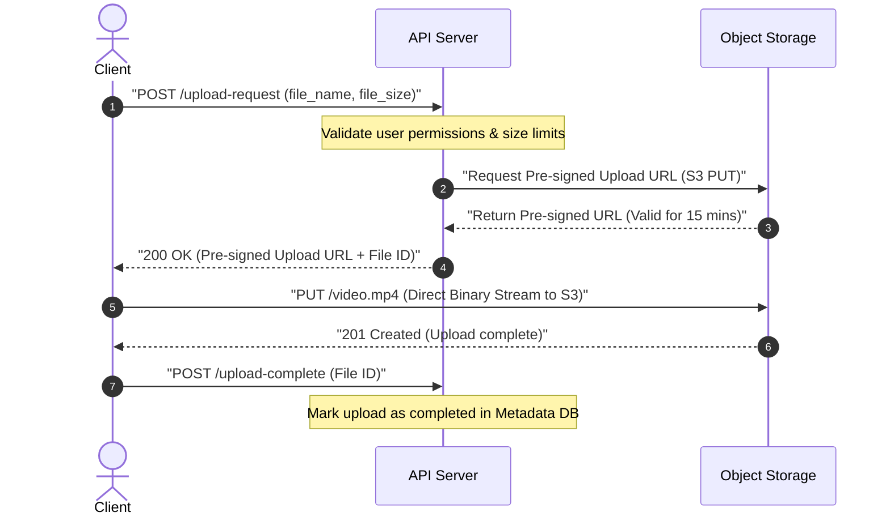
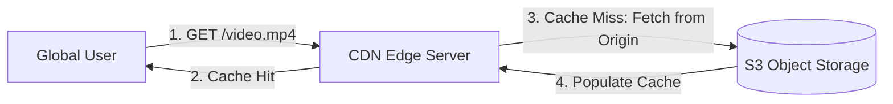

# Pattern 06: Large Blobs

The **Large Blobs** pattern is applied when a system needs to ingest, store, process, and serve large binary large objects (BLOBs) such as high-resolution images, videos, audio recordings, virtual machine disk images, or large data datasets.

---

## 1. Why Databases Fail for Large Blobs

A common system design anti-pattern is storing binary blobs (using the `BYTEA` or `BLOB` column types) directly in database tables. This fails at scale because:
*   **Buffer Pool Pollution:** Databases cache active tables in memory (RAM). Large binary files fill up the buffer pool, evicting indexes and lightweight text records, which severely degrades standard query performance.
*   **Backup & Migration Overhead:** Backing up a 10TB database containing text data is manageable. Backing up a 10TB database containing 9.9TB of raw video files is extremely slow, complex, and expensive.
*   **Expensive Storage:** Database disks are typically highly performant, expensive SSDs (e.g., AWS EBS gp3 or io2). Using premium SSD storage for cold video files is financially wasteful.

---

## 2. Core Architectural Scaling Strategies

To store large media files efficiently, systems decouple storage and delegate streaming directly between clients and specialized storage infrastructures.

### A. Pre-Signed URLs (Direct Client Ingestion)
To prevent your API gateway and application servers from becoming network bandwidth or CPU bottlenecks, **never** route file uploads through your application servers. Instead, use **Pre-Signed URLs**.



*   **Trade-offs:**
    *   **Pros:** Application servers consume zero CPU or network bandwidth during uploads; infinite horizontal scale (delegated to cloud providers like Amazon S3 or Google Cloud Storage); extremely secure (time-limited access).
    *   **Cons:** Application server cannot validate the binary contents *during* the upload (e.g., checking if the file is corrupted or contains malware). Verification must be handled asynchronously post-upload.

*   **Async Upload Validation Pipeline (Staff+ Follow-Up):**

    Since the application server is bypassed during direct-to-S3 uploads, you **must** build an asynchronous post-upload validation pipeline. This is one of the most common Staff+ level follow-up questions for the pre-signed URL pattern.

    ```mermaid
    sequenceDiagram
        autonumber
        participant S3 as Object Storage
        participant Event as Event Notification
        participant Worker as Validation Worker
        participant Scanner as Virus Scanner
        participant DB as Metadata DB
        participant Notify as Notification Service
        actor Client as Client

        S3->>Event: "S3 PutObject event triggered"
        Event->>Worker: "Invoke Lambda or poll SQS queue"
        Worker->>S3: "Download blob for inspection"
        Worker->>Scanner: "Run ClamAV or cloud-native scan"
        Scanner-->>Worker: "CLEAN or INFECTED result"
        Worker->>Worker: "Validate format via magic bytes and file structure"
        alt Validation Passed
            Worker->>DB: "UPDATE status = VALIDATED"
            Worker->>Notify: "Send success via WebSocket or webhook"
            Notify-->>Client: "Upload validated and ready"
        else Validation Failed
            Worker->>S3: "Delete infected or invalid blob"
            Worker->>DB: "UPDATE status = REJECTED with reason"
            Worker->>Notify: "Send rejection via WebSocket or webhook"
            Notify-->>Client: "Upload rejected with reason"
        end
    ```

    *   The notification step can use [Pattern 01 (Real-time Updates)](./01_realtime_updates.md) — push upload status to the client over a WebSocket channel rather than forcing them to poll.
    *   The validation worker itself is a classic [Pattern 07 (Long-Running Tasks)](./07_long_running_tasks.md) use case — decouple heavy compute (virus scanning, format validation) from the request path.

---

### B. CDN Edge Delivery & Caching (Read Path)
For fast global distribution, front your object storage with a **Content Delivery Network (CDN)** like Cloudflare or AWS CloudFront. 



*   **Edge Caching Mechanics:**
    CDNs cache files at **Point of Presence (PoP)** edge servers closer to the user. Subsequent requests for the same media file bypass your origin storage completely, reducing origin network costs and latency.

---

### C. Multipart & Parallel Uploads
If a user uploads a single 10GB file over a standard connection and the network drops at 9.9GB, the entire upload is lost and must be restarted.
*   **The Solution:** Use **Multipart Uploads**.
    1.  The client requests a multipart upload initialization.
    2.  The application server generates a set of pre-signed URLs (one for each 5MB–100MB chunk).
    3.  The client uploads all chunks **in parallel** directly to the object storage.
    4.  If one chunk fails, the client only retries that specific chunk.
    5.  Once all chunks are uploaded, the client sends a complete request, and the object store merges the chunks into the single master blob on the server side.

*   **Incomplete Multipart Upload Cleanup:**
    Abandoned multipart uploads (where the client crashes mid-upload or never sends the complete request) still incur storage charges for the uploaded parts. **You are charged for parts that were never assembled.** Configure an S3 Lifecycle Policy to automatically abort incomplete multipart uploads:

    ```json
    {
      "Rules": [{
        "ID": "AbortIncompleteMultipartUploads",
        "Status": "Enabled",
        "Filter": {},
        "AbortIncompleteMultipartUpload": {
          "DaysAfterInitiation": 7
        }
      }]
    }
    ```

    > Without this policy, orphaned parts accumulate silently and can represent significant hidden costs at scale.

*   **Resumable Uploads for Unreliable Networks:**
    For mobile clients or users on flaky connections, consider the **tus** open protocol (`tus.io`) or the **GCS Resumable Upload API**. These protocols allow the client to query the server for the last successfully received byte offset and resume from that exact point — no re-uploading of already-transferred data. This is especially critical for large uploads (multi-GB) over cellular networks where connection drops are frequent.

---

### D. Dynamic Video Chunking (HLS/DASH Streaming)
Instead of serving a single massive 2GB video file, real-time video streaming services (like YouTube or Netflix) use dynamic adaptive streaming protocols like **HLS (HTTP Live Streaming)** or **DASH**:
1.  When a file is uploaded, a background transcoder worker breaks the video down into thousands of small **2-10 second chunks** (usually `.ts` or `.m4s` files) and generates an index file (manifest file `.m3u8` or `.mpd`).
2.  The transcoder outputs these chunks in varying resolutions (360p, 720p, 1080p, 4K).
3.  The client's video player fetches the manifest index, then fetches the video chunks sequentially.
4.  If network speeds drop, the player automatically switches and requests lower-resolution chunks for the next 2-second window, preventing buffering.

---

### E. Content-Addressable Storage (Deduplication)
When many users upload identical or near-identical files (e.g., the same profile photo, the same PDF, the same Docker layer), naive storage assigns each upload a unique key and stores a full copy. Content-addressable storage eliminates this waste.

*   **How It Works:**
    1.  The client computes a **SHA-256 hash** of the file content before uploading.
    2.  The client sends the hash to the API server as part of the upload request.
    3.  The API server checks if an object with that hash as its storage key already exists.
    4.  If the key exists → **skip the upload entirely** (instant dedup). Return a reference to the existing object.
    5.  If the key does not exist → proceed with the normal pre-signed URL upload flow, using the hash as the object key.

*   **Trade-offs:**

    | Aspect | Benefit | Cost |
    |---|---|---|
    | **Storage** | Massive savings — identical files stored only once | None |
    | **Upload Latency** | Skip upload entirely for duplicates (instant) | Must compute SHA-256 client-side before upload begins |
    | **Integrity** | Hash doubles as a checksum for corruption detection | Extremely rare hash collisions (SHA-256: $$2^{-256}$$ probability) |
    | **Deletion** | N/A | Requires reference counting — cannot delete a blob until all references are removed |

*   **Real-World Use Cases:**
    *   **Dropbox:** Uses content-addressable chunks to deduplicate files across all users, saving petabytes of storage.
    *   **Docker / OCI Container Registries:** Each image layer is stored by its content hash (digest). Pushing an image with layers that already exist on the registry skips those layers entirely.
    *   **Git:** Every object (blob, tree, commit) is stored by its SHA-1 hash, enabling natural deduplication across branches and clones.

## 3. Large Blob Storage & Delivery Matrix

| Architecture Component | Primary Purpose | Cost Profile | Latency Profile |
|---|---|---|---|
| **Metadata DB (Postgres/Dynamo)** | Stores file pointers, names, user IDs, S3 URLs. | Low (Highly optimized text records) | Microseconds |
| **Object Storage (S3/GCS)** | Cold/Warm raw binary stream storage. | Lowest per-GB tier storage | Milliseconds |
| **CDN (Cloudflare/CloudFront)** | Global read caching closer to users. | Moderate (Based on egress traffic) | Sub-millisecond (At edge) |
| **Transcoder (FFmpeg Workers)** | Resizing, encoding, chunking (HLS). | High (Compute intensive) | Asynchronous |

---

## 4. Advanced Interview Deep Dives

### Q1: How do you secure private large assets (e.g., paid video courses) behind a CDN?
If you place media assets in public S3 buckets, anyone can copy the URL and share it. Fronting S3 with a CDN still risks users bypassing authentication unless locked down.
*   **The Solution:**
    1.  **Private S3 Buckets:** Set S3 bucket policies to **only** allow access from your CDN's Origin Access Identity (OAI) or Origin Access Control (OAC). Block all direct public internet requests to S3.
    2.  **Pre-Signed Cookies:** Instead of signing every single 2-second HLS video chunk URL individually (which generates high CPU overhead), have the application server set a secure, signed **CDN Cookie** on the client browser upon authentication.
    3.  **CDN Edge Verification:** When the client requests video chunks from the CDN, the CDN edge server verifies the signature of the cookie locally. If the cookie is valid and unexpired, the CDN serves the cached file; otherwise, it rejects the request at the edge.

### Q2: What is "Origin Shielding" in high-scale CDN architectures?
If a popular video goes viral globally, thousands of CDN edge servers around the world might simultaneously experience cache misses. If all those edge servers query your origin S3 storage at the same time, it can cause a **Cache Stampede** on your origin storage, incurring massive egress costs and throttling.
*   **The Solution (Origin Shielding):**
    Introduce a centralized, high-capacity cache layer (the Origin Shield) between your global edge CDN servers and your primary S3 bucket. All edge cache misses route first to this shield cache. The shield pools requests, fetches the asset from S3 once, caches it, and distributes it to the edge nodes, protecting S3 from duplicate reads.

---

## 5. Security Considerations

Large blob systems have a uniquely large attack surface because untrusted binary data flows directly from clients to storage, bypassing application servers.

### Pre-Signed URL Scope (Principle of Least Privilege)
*   **Always** scope pre-signed URLs to the minimum required permissions:
    *   **Action:** `PUT` only (never `GET` or `DELETE` on upload URLs).
    *   **Key Prefix:** Restrict the URL to a specific S3 key prefix (e.g., `uploads/{user_id}/{uuid}`) so a malicious client cannot overwrite other users' files.
    *   **Size Limit:** Set `Content-Length` conditions (e.g., max 5GB) to prevent abuse of storage quotas.
    *   **Expiration:** Keep TTLs short (5–15 minutes). A leaked URL becomes useless quickly.

### Content-Type Validation (Never Trust the Client)
*   Clients can set any `Content-Type` header (e.g., claiming a `.exe` is `image/jpeg`). **Always validate server-side** by inspecting the file's **magic bytes** (the first few bytes of the file that identify its format):
    *   JPEG: `FF D8 FF`
    *   PNG: `89 50 4E 47`
    *   PDF: `25 50 44 46`
*   Reject files where the magic bytes do not match the declared Content-Type. This prevents stored XSS attacks where an attacker uploads an HTML file disguised as an image.

### Malware Scanning
*   Integrate virus scanning into the async validation pipeline (see Section 2A above).
*   **Open-source:** ClamAV running on dedicated scanner instances behind an SQS queue.
*   **Cloud-native:** AWS GuardDuty Malware Protection for S3 (automatic scanning on upload), Google Cloud Security Command Center.
*   **Key design decision:** Files should be quarantined (not publicly accessible) until the scan completes and returns CLEAN.

### Signed Cookies vs Signed URLs

| Mechanism | Best For | Why |
|---|---|---|
| **Signed URLs** | Single-file downloads, sharing links with external users | Each URL is self-contained with its own signature and expiry |
| **Signed Cookies** | Streaming (HLS/DASH), accessing many related assets | One authentication event grants access to all chunks under a path prefix — avoids signing thousands of individual chunk URLs |

*   For HLS video streaming with 1,000+ chunks, signed cookies reduce authentication overhead from O(n) signature generations to O(1).

---

## 6. Capacity Planning and Quantitative Reasoning

Back-of-envelope math is critical for large blob systems because storage and egress costs dominate the infrastructure budget.

### Storage Cost Tiers (AWS S3, us-east-1, as of 2024)

| Tier | Cost per GB/month | Access Pattern | Use Case |
|---|---|---|---|
| S3 Standard | ~\$0.023 | Frequently accessed | Active video library, recent uploads |
| S3 Infrequent Access (IA) | ~\$0.0125 | Accessed < 1x/month | Older content, user archives |
| S3 Glacier Instant Retrieval | ~\$0.004 | Rarely accessed, ms retrieval | Compliance archives, cold backups |
| S3 Glacier Deep Archive | ~\$0.00099 | Accessed 1-2x/year, 12hr retrieval | Legal holds, regulatory archives |

> **Lifecycle policies** should automatically transition blobs from Standard → IA → Glacier based on access patterns. A well-tuned policy can reduce storage costs by 60-80%.

### CDN Cache Hit Ratio
*   A well-configured CDN achieves a **95%+ cache hit ratio** for popular content.
*   At 95% hit rate, your origin (S3) only serves **5% of total requests** — a 20x reduction in origin load and egress.
*   Cache hit ratio depends on: TTL settings, content popularity distribution (Zipf's law), number of PoPs, and cache eviction policies.

### Egress Cost Analysis

| Path | Cost per GB |
|---|---|
| S3 Direct to Internet | ~\$0.09 |
| CloudFront (on-demand) | ~\$0.085 |
| CloudFront (reserved capacity) | ~\$0.025–\$0.040 |
| CloudFront (cache hit — no origin egress) | \$0.00 origin cost |

### Worked Example: Video Platform Egress

$$\text{Daily views} = 1{,}000{,}000$$
$$\text{Avg video size} = 500 \text{ MB}$$
$$\text{Total egress (no caching)} = 10^6 \times 0.5 \text{ GB} = 500{,}000 \text{ GB/day} = 500 \text{ TB/day}$$
$$\text{Cost without CDN caching} = 500{,}000 \times \$0.085 = \$42{,}500/\text{day}$$
$$\text{Cost with 95\% CDN cache hit} = 500{,}000 \times 0.05 \times \$0.085 = \$2{,}125/\text{day}$$

> The 95% cache hit ratio reduces daily egress costs from **\$42,500 to \$2,125** — a **20x cost reduction**. This is why CDN configuration is not optional for any media-heavy platform.

### Cross-Pattern References
*   **[Pattern 01 (Real-time Updates)](./01_realtime_updates.md):** Use WebSocket channels to push upload status (UPLOADING → VALIDATING → VALIDATED/REJECTED) and transcoding progress to clients in real time, rather than requiring them to poll.
*   **[Pattern 07 (Long-Running Tasks)](./07_long_running_tasks.md):** Video transcoding (upload → message queue → FFmpeg worker pool → multiple resolution outputs → update metadata DB) is a textbook long-running task. Use dead-letter queues for failed transcoding jobs and idempotency keys to prevent duplicate processing.
