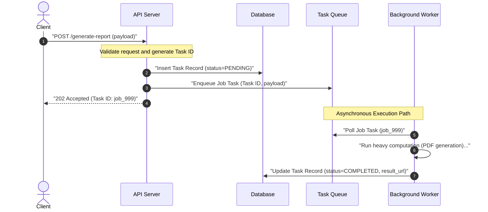
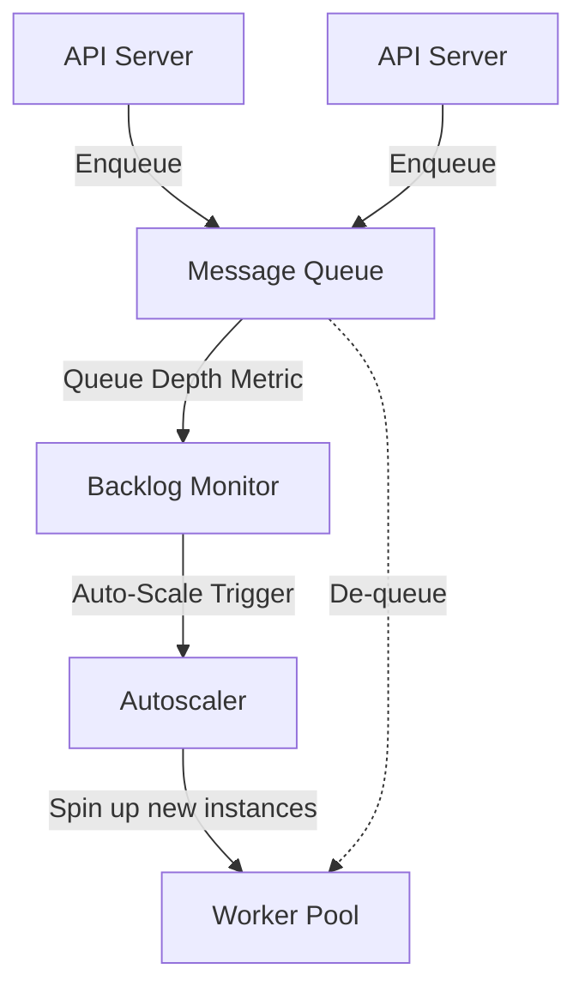
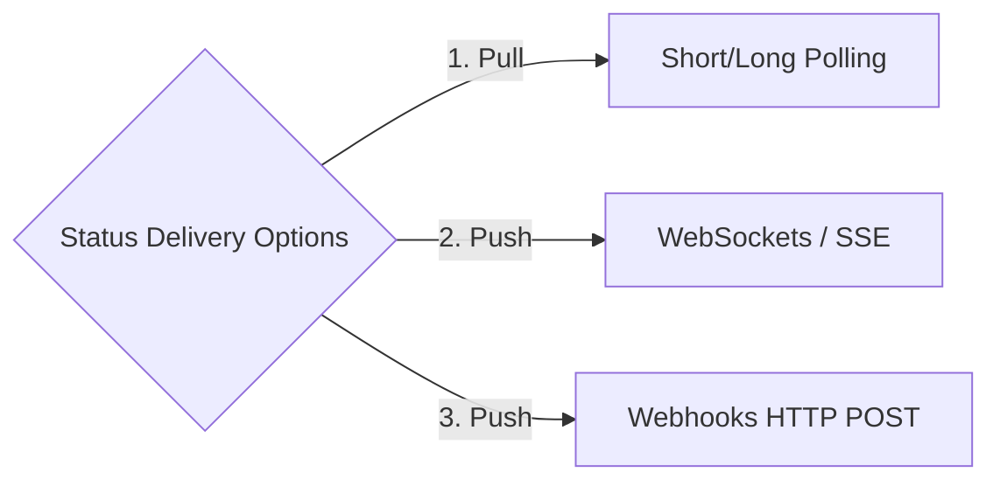

# Pattern 07: Long-Running Tasks

The **Long-Running Tasks** pattern is used to decouple heavy, resource-intensive, or slow operations (e.g., video encoding, PDF report compilation, massive database exports, machine learning inference, bulk email campaigns) from the synchronous HTTP request-response cycle.

Keeping these operations on the synchronous API path blocks execution threads, causes gateway socket timeouts, and degrades the user experience.

---

## 1. The Asynchronous Task Lifecycle

When an API receives a request for a heavy operation, it immediately returns an HTTP status code **`202 Accepted`** along with a unique `task_id`, offloading the work to a background queue.



---

## 2. Core Architectural Scaling Components

Let's break down the three structural pillars required to build a resilient, long-running task system.

### A. The Message Broker & Task Queue
The queue acts as a buffer between the API servers and the worker nodes.
*   **Simple Task Queues (FIFO):** Platforms like **Celery** (Python), **Sidekiq** (Ruby), or **BullMQ** (Node.js) backed by **Redis** or **RabbitMQ**. *Best for general-purpose asynchronous jobs.*
*   **Streaming Logs:** Systems like **Apache Kafka** or **AWS Kinesis**. *Best when jobs need to be processed in order, replayed, or read by multiple independent consumer groups.*
*   **Cloud Managed Queues:** Systems like **AWS SQS**. *No infrastructure maintenance, handles scaling automatically.*

---

### B. Worker Pools (Independent Compute Scale)
API servers are typically network-bound (handling request parsing and database queries), while Worker servers are heavily **CPU-bound** or **Memory-bound**.
*   **Independent Scaling:** Decouple your worker infrastructure from your API container instances. Workers should be auto-scaled independently based on **Queue Backlog Size** (Queue Depth) or **Backlog Age** rather than standard CPU/memory metrics.



---

### C. Job Status Delivery Mechanisms
Once the background worker finishes the task, how does the client discover that the file is ready? There are three standard patterns:



1.  **Client Polling (Pull):** The client periodically calls `GET /tasks/job_999` to check the status. *Very simple, but wastes resources and increases overall latency.*
2.  **WebSocket/SSE Push (Push):** The worker publishes a completion event to a Redis channel. The Gateway WebSocket Server catches the event and pushes a notification directly down the active socket connection to the client (combining [Pattern 01](./01_realtime_updates.md)). *Best for interactive Web/Mobile UIs.*
3.  **Webhooks (Push):** When submitting the task, the client provides a callback URL (e.g., `https://client.com/callback`). When the worker finishes, the system sends an HTTP POST request containing the result to that URL. *Best for developer-facing public APIs and B2B systems.*

---

## 3. Asynchronous Coordination Matrix

| Metric | Client Polling | WebSocket / SSE Push | Webhooks (Callback) |
|---|---|---|---|
| **Initiator** | Client | Server | Server |
| **Connection Cost** | Low (Ephemeral HTTP) | High (Persistent sockets) | Low (Ephemeral client HTTP) |
| **Best Used For** | Basic dashboard loaders | Real-time interactive UIs | B2B integrations, payment gateways |
| **Complexity** | Trivial | High | Medium (Requires retry logic) |

---

## 4. Resilience Guardrails & Deep Dives

### Q1: How do you handle Poison Pills and transient task failures?
If a worker pulls a task that contains corrupt input (a **Poison Pill**), it will crash. If the queue re-delivers the exact same message, the next worker will also crash, potentially bringing down your entire worker pool sequentially.
*   **The Solution (Dead-Letter Queues & Max Retry Limits):**
    1.  **Explicit Try-Catch blocks:** Wrap worker code in strong exception catching handlers.
    2.  **Retry Limit Policies:** Configure the queue broker to track the delivery count (`redelivery_count`). Allow a maximum of 3 or 5 retries.
    3.  **Dead-Letter Queue (DLQ):** Once retries are exhausted, move the corrupted message to a separate queue (the DLQ). Alert developers to inspect and debug the poison pill manually.

```
[ Queue Broker ] ──> (Deliver 1) ──> [ Worker ] (Crashes!)
        │
  (Redelivery 3)
        │
        ▼
[ Retry Limit Exhausted ] ──> [ Dead-Letter Queue (DLQ) ] ──> [ Dev Alert ]
```

### Q2: How do you guarantee Task Idempotency in Worker Pools?
In distributed environments, tasks might be delivered to workers multiple times due to consumer acknowledgement timeouts (e.g., a worker completes a 10-minute task but crashes just before sending the ACK to the queue).
*   **The Solution:**
    *   Store a unique **Task ID** in a relational database or distributed state store (e.g., Redis).
    *   When a worker picks up a task, it wraps its execution inside an atomic transaction:
        ```sql
        UPDATE task_records 
        SET status = 'PROCESSING', worker_id = 'worker_a' 
        WHERE id = 'job_999' AND status = 'PENDING';
        ```
    *   If the query affects **0 rows**, it means the task is already being processed or completed by another worker. The worker should discard the message immediately.

*   **Visibility Timeout (SQS Model):**
    When a worker receives a message from the queue, the message becomes **invisible** to other consumers for a configurable duration (the visibility timeout, e.g., 300 seconds). If the worker doesn't send an ACK (delete the message) within that window, the message **reappears** in the queue and is delivered to another worker. This is the mechanism behind at-least-once delivery.
    *   Set the visibility timeout to **2× the expected task duration** to avoid premature re-delivery.
    *   For variable-duration tasks, workers should periodically **extend the visibility timeout** (heartbeat) while still processing.

*   **Exactly-Once Semantics:**
    True exactly-once delivery is impossible in distributed systems. The practical formula is:
    $$\text{Exactly-Once Processing} = \text{At-Least-Once Delivery} + \text{Idempotent Processing}$$
    The queue guarantees at-least-once delivery (via visibility timeout and re-delivery). The worker guarantees idempotency (via the conditional UPDATE pattern above or by using a separate idempotency key in Redis with `SET task:{id}:lock NX EX 600`). See [Pattern 02](./02_dealing_with_contention.md) for distributed locking patterns that complement idempotent processing.

---

## 5. Security Considerations

Long-running task systems execute arbitrary workloads asynchronously, often with elevated privileges. This creates a unique attack surface.

*   **Task Payload Validation and Sanitization:**
    Never trust the task payload. Validate all fields against a strict schema before enqueueing. If the payload includes file paths, URLs, or shell arguments, sanitize them to prevent path traversal, SSRF, or command injection attacks. Reject payloads exceeding a maximum size (e.g., 256 KB) to prevent queue flooding.

*   **Worker Isolation:**
    *   **Containerized Execution:** Run each task in an isolated container (e.g., AWS Fargate, Kubernetes Job) with a read-only filesystem, no network egress by default, and resource limits (CPU, memory, wall-clock time).
    *   **Sandboxing Untrusted Code:** If the system executes user-provided code (e.g., serverless functions, data transformations), use gVisor, Firecracker microVMs, or WebAssembly sandboxes to prevent breakout.
    *   **Principle of Least Privilege:** Workers should have the minimum IAM permissions required for their specific task type. A PDF-generation worker should not have access to the payments database.

*   **Secrets Management:**
    Tasks that need API keys, database credentials, or tokens should never receive secrets in the task payload. Instead, workers fetch secrets at runtime from a secrets manager (e.g., AWS Secrets Manager, HashiCorp Vault) using their IAM role. Secrets are cached in-memory for the task duration and never written to disk or logs.

---

## 6. Observability and Monitoring

Asynchronous systems are notoriously hard to debug because failures are decoupled from the original request. Robust observability is non-negotiable.

*   **Key Metrics to Track:**

    | Metric | What It Measures | Alert Threshold (Example) |
    |---|---|---|
    | **Queue Depth** | Number of messages waiting to be processed | > 10,000 messages sustained for 5 min |
    | **Task Latency p99** | End-to-end time from enqueue to completion (99th percentile) | > 2× the expected task duration |
    | **Failure Rate** | Percentage of tasks ending in ERROR status | > 5% over a 10-min window |
    | **DLQ Size** | Number of messages in the Dead-Letter Queue | Any non-zero value triggers an alert |
    | **Worker Utilization** | Percentage of workers actively processing tasks | < 20% (over-provisioned) or > 90% (under-provisioned) |
    | **Retry Rate** | Percentage of tasks requiring retries | > 10% indicates systemic issues |

*   **Graceful Shutdown Sequence:**
    When a worker receives `SIGTERM` (e.g., during a deployment or scale-down), it must not drop the current task:
    1.  **Stop polling** the queue for new tasks.
    2.  **Finish the current task** (or checkpoint progress and release the message back to the queue).
    3.  **Send the ACK** for the completed task.
    4.  **Drain connections** and exit cleanly.
    *   Set the Kubernetes `terminationGracePeriodSeconds` to be longer than the maximum expected task duration.

*   **Distributed Tracing:**
    Propagate a **trace ID** from the original API request through the queue message and into the worker. This allows correlating a user action ("I clicked Export") with the downstream task execution, queue wait time, and completion event. Use OpenTelemetry to instrument the full lifecycle.

---

## 7. Quantitative Reasoning

### Back-of-Envelope: Worker Pool Sizing

Use these estimates to size your worker pool during system design interviews.

*   **Given:** A video encoding task takes ~2 minutes per job. You have 10 workers.
    $$\text{Throughput per worker} = \frac{60 \text{ sec}}{120 \text{ sec/job}} = 0.5 \text{ jobs/min} = 30 \text{ jobs/hour}$$
    $$\text{Total throughput} = 10 \text{ workers} \times 30 \text{ jobs/hour} = 300 \text{ jobs/hour}$$

*   **Scaling question:** If peak demand is 1,000 jobs/hour:
    $$\text{Workers needed} = \lceil 1{,}000 / 30 \rceil = 34 \text{ workers}$$
    With auto-scaling headroom (20% buffer): ~41 workers at peak.

*   **Queue as a buffer:** If 1,000 jobs arrive in a 10-minute burst but you only have 10 workers:
    *   Workers process: $10 \times 5 = 50$ jobs in 10 minutes.
    *   Queue absorbs: $1{,}000 - 50 = 950$ jobs buffered.
    *   Drain time: $950 / (10 \times 0.5) = 190$ minutes ≈ 3.2 hours to clear the backlog.
    *   **Insight:** This is where auto-scaling based on queue depth is critical. Scale to 34 workers and drain in ~30 minutes instead.

*   **Cost consideration:** If each worker runs on a `c5.large` instance ($0.085/hr):
    $$\text{Cost to process 1,000 jobs} = 34 \text{ workers} \times 0.56 \text{ hr} \times \$0.085 \approx \$1.62$$
    Use spot instances for non-urgent tasks to reduce costs by 60–70%.
