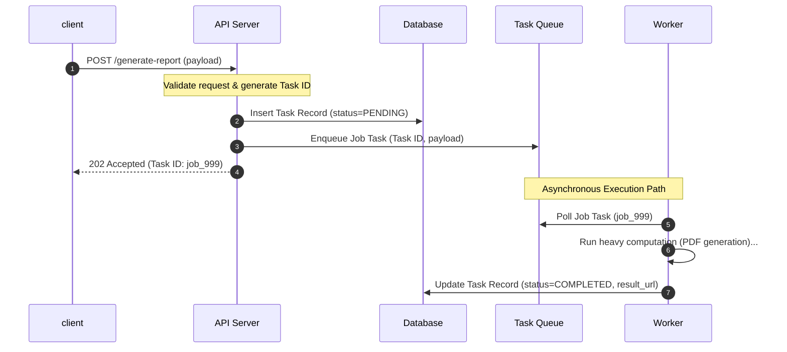
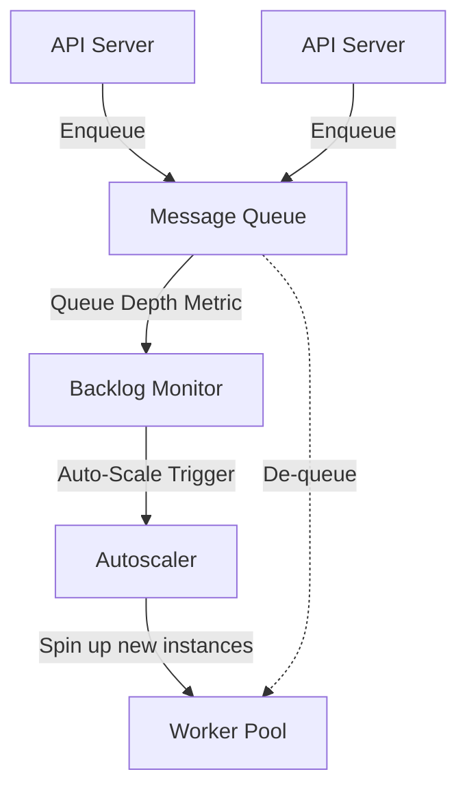
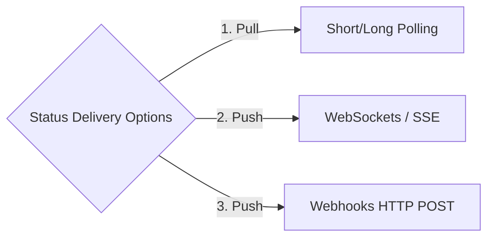

# Pattern 07: Long-Running Tasks

The **Long-Running Tasks** pattern is used to decouple heavy, resource-intensive, or slow operations (e.g., video encoding, PDF report compilation, massive database exports, machine learning inference, bulk email campaigns) from the synchronous HTTP request-response cycle.

Keeping these operations on the synchronous API path blocks execution threads, causes gateway socket timeouts, and degrades the user experience.

---

## 1. The Asynchronous Task Lifecycle

When an API receives a request for a heavy operation, it immediately returns an HTTP status code **`202 Accepted`** along with a unique `task_id`, offloading the work to a background queue.



---

## 2. Core Architectural Scaling Components

Let's break down the three structural pillars required to build a resilient, long-running task system.

### A. The Message Broker & Task Queue
The queue acts as a buffer between the API servers and the worker nodes.
*   **Simple Task Queues (FIFO):** Platforms like **Celery** (Python), **Sidekiq** (Ruby), or **BullMQ** (Node.js) backed by **Redis** or **RabbitMQ**. *Best for general-purpose asynchronous jobs.*
*   **Streaming Logs:** Systems like **Apache Kafka** or **AWS Kinesis**. *Best when jobs need to be processed in order, replayed, or read by multiple independent consumer groups.*
*   **Cloud Managed Queues:** Systems like **AWS SQS**. *No infrastructure maintenance, handles scaling automatically.*

---

### B. Worker Pools (Independent Compute Scale)
API servers are typically network-bound (handling request parsing and database queries), while Worker servers are heavily **CPU-bound** or **Memory-bound**.
*   **Independent Scaling:** Decouple your worker infrastructure from your API container instances. Workers should be auto-scaled independently based on **Queue Backlog Size** (Queue Depth) or **Backlog Age** rather than standard CPU/memory metrics.



---

### C. Job Status Delivery Mechanisms
Once the background worker finishes the task, how does the client discover that the file is ready? There are three standard patterns:



1.  **Client Polling (Pull):** The client periodically calls `GET /tasks/job_999` to check the status. *Very simple, but wastes resources and increases overall latency.*
2.  **WebSocket/SSE Push (Push):** The worker publishes a completion event to a Redis channel. The Gateway WebSocket Server catches the event and pushes a notification directly down the active socket connection to the client (combining Pattern 01). *Best for interactive Web/Mobile UIs.*
3.  **Webhooks (Push):** When submitting the task, the client provides a callback URL (e.g., `https://client.com/callback`). When the worker finishes, the system sends an HTTP POST request containing the result to that URL. *Best for developer-facing public APIs and B2B systems.*

---

## 3. Asynchronous Coordination Matrix

| Metric | Client Polling | WebSocket / SSE Push | Webhooks (Callback) |
|---|---|---|---|
| **Initiator** | Client | Server | Server |
| **Connection Cost** | Low (Ephemeral HTTP) | High (Persistent sockets) | Low (Ephemeral client HTTP) |
| **Best Used For** | Basic dashboard loaders | Real-time interactive UIs | B2B integrations, payment gateways |
| **Complexity** | Trivial | High | Medium (Requires retry logic) |

---

## 4. Resilience Guardrails & Deep Dives

### Q1: How do you handle Poison Pills and transient task failures?
If a worker pulls a task that contains corrupt input (a **Poison Pill**), it will crash. If the queue re-delivers the exact same message, the next worker will also crash, potentially bringing down your entire worker pool sequentially.
*   **The Solution (Dead-Letter Queues & Max Retry Limits):**
    1.  **Explicit Try-Catch blocks:** Wrap worker code in strong exception catching handlers.
    2.  **Retry Limit Policies:** Configure the queue broker to track the delivery count (`redelivery_count`). Allow a maximum of 3 or 5 retries.
    3.  **Dead-Letter Queue (DLQ):** Once retries are exhausted, move the corrupted message to a separate queue (the DLQ). Alert developers to inspect and debug the poison pill manually.

```
[ Queue Broker ] ──> (Deliver 1) ──> [ Worker ] (Crashes!)
        │
  (Redelivery 3)
        │
        ▼
[ Retry Limit Exhausted ] ──> [ Dead-Letter Queue (DLQ) ] ──> [ Dev Alert ]
```

### Q2: How do you guarantee Task Idempotency in Worker Pools?
In distributed environments, tasks might be delivered to workers multiple times due to consumer acknowledgement timeouts (e.g., a worker completes a 10-minute task but crashes just before sending the ACK to the queue).
*   **The Solution:**
    *   Store a unique **Task ID** in a relational database or distributed state store (e.g., Redis).
    *   When a worker picks up a task, it wraps its execution inside an atomic transaction:
        ```sql
        UPDATE task_records 
        SET status = 'PROCESSING', worker_id = 'worker_a' 
        WHERE id = 'job_999' AND status = 'PENDING';
        ```
    *   If the query affects **0 rows**, it means the task is already being processed or completed by another worker. The worker should discard the message immediately.
