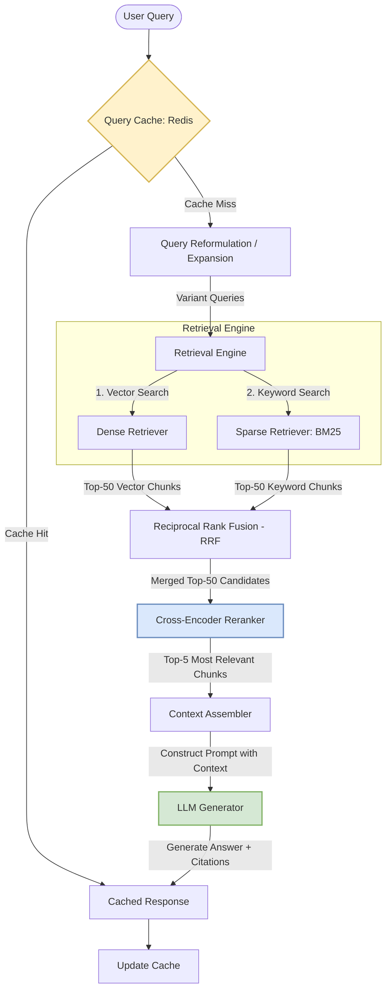

# RAG Systems — Design for Production

> **Target audience:** Staff+ backend engineers  
> **Covers:** RAG architecture, chunking, retrieval, reranking, hybrid search, context assembly, evaluation, production scale

---

## What Is RAG?

**Retrieval-Augmented Generation (RAG)** combines a retrieval system (search) with an LLM (generation). Instead of relying only on the model's training data, RAG fetches relevant documents at query time and injects them into the prompt.

```
Without RAG:
  Q: "What is our Q3 2025 revenue?"
  A: "I don't have access to your financial data." (correct but useless)

With RAG:
  Q: "What is our Q3 2025 revenue?"
  Retrieve: [financial_report_q3_2025.pdf chunk]
  A: "Based on the Q3 2025 financial report, revenue was $142M, up 23% YoY." ✓
```

RAG is the foundation of: enterprise search, document Q&A, customer support bots, coding assistants, and any system where the LLM needs access to private or recent knowledge.

---

## RAG Architecture Overview

```
INDEXING PIPELINE (offline):
  Documents → Chunking → Embedding model → Vector DB + BM25 index

QUERY PIPELINE (online):
  User query
    → Embed query
    → Retrieve top-K chunks (vector + BM25)
    → Rerank candidates
    → Assemble context
    → LLM generates answer with context
    → Return answer + source citations
```

### Indexing Pipeline (Offline)

```mermaid
flowchart TD
    Raw[Raw Documents: PDF, DOCX, HTML] --> Parser[Document Parser]
    Parser --> Chunker[Chunking Service]
    
    subgraph Chunking Strategies
        Chunker -->|Fixed-size| Fixed[Fixed-size with Overlap]
        Chunker -->|Semantic| Sem[Semantic Boundaries]
        Chunker -->|Hierarchical| Hier[Hierarchical: Parent-Child]
    end
    
    Hier -->|Child Chunk (128t)| Embed[Embedding Model]
    Hier -->|Parent Chunk (512t)| Meta[Metadata Decorator]
    Fixed --> Embed
    Fixed --> Meta
    Sem --> Embed
    Sem --> Meta
    
    Embed -->|Vectors| VDB[(Vector Database)]
    Meta -->|JSON Chunks & Metadata| ES[(Sparse Index: BM25/Elasticsearch)]
    
    style VDB fill:#f9f,stroke:#333,stroke-width:2px
    style ES fill:#bbf,stroke:#333,stroke-width:2px
```

### Query Pipeline (Online)



---


## Stage 1: Document Ingestion and Chunking

Raw documents must be split into chunks before embedding — an embedding model handles 256–8192 tokens, not a 500-page PDF.

### Chunking Strategies

**Fixed-size with overlap (baseline):**
```python
def chunk_fixed(text: str, chunk_size=512, overlap=50) -> list[str]:
    tokens = tokenizer.encode(text)
    chunks = []
    for i in range(0, len(tokens), chunk_size - overlap):
        chunk = tokenizer.decode(tokens[i:i + chunk_size])
        chunks.append(chunk)
    return chunks
```

**Semantic chunking (better quality):**
Split at natural boundaries (paragraph, sentence, section heading) rather than fixed token count:
```python
def chunk_semantic(text: str, max_tokens=512) -> list[str]:
    paragraphs = text.split("\n\n")
    chunks = []
    current = ""
    for para in paragraphs:
        if count_tokens(current + para) > max_tokens:
            if current:
                chunks.append(current.strip())
            current = para
        else:
            current += "\n\n" + para
    if current:
        chunks.append(current.strip())
    return chunks
```

**Hierarchical chunking (best for retrieval + context):**
- Small chunks (128 tokens) for high-precision retrieval
- Parent chunks (512 tokens) injected into LLM context for coherence
- Retrieve by small chunk, return parent chunk to LLM

```python
class HierarchicalChunker:
    def chunk(self, text) -> list[dict]:
        parents = self.split_by_section(text)  # 512 tokens each
        result = []
        for parent in parents:
            children = self.split_fixed(parent.content, size=128)  # 128 tokens
            for child in children:
                result.append({
                    "child_text": child,    # embedded and retrieved
                    "parent_text": parent,  # injected into LLM prompt
                    "parent_id": parent.id
                })
        return result
```

### Chunk Metadata

Always store metadata with chunks for filtering and citation:

```python
chunk = {
    "id": "doc123_chunk_47",
    "text": "Redis sorted sets maintain ordered data...",
    "embedding": [...],  # 1536 floats
    "metadata": {
        "source_doc_id": "doc123",
        "filename": "redis-deep-dive.md",
        "section": "Key Capabilities",
        "page": 3,
        "created_at": "2025-01-15",
        "author": "Engineering Team",
        "doc_type": "internal_wiki"
    }
}
```

---

## Stage 2: Retrieval

### Dense Retrieval (Vector Search)

Embed the query, find nearest chunks in vector space:

```python
def dense_retrieve(query: str, top_k: int = 50) -> list[Chunk]:
    query_embedding = embed_model.embed(query)
    results = vector_db.search(
        vector=query_embedding,
        limit=top_k,
        filter={"doc_type": "internal_wiki"}  # optional metadata filter
    )
    return results
```

Good for: semantic similarity, paraphrasing, concept matching  
Bad for: exact keyword matches, product names, code identifiers

### Sparse Retrieval (BM25 / Keyword)

Classic TF-IDF based retrieval:

```python
from rank_bm25 import BM25Okapi

def sparse_retrieve(query: str, top_k: int = 50) -> list[Chunk]:
    tokenized_query = query.lower().split()
    scores = bm25_index.get_scores(tokenized_query)
    top_indices = np.argsort(scores)[::-1][:top_k]
    return [chunks[i] for i in top_indices]
```

Good for: exact matches, proper nouns, code, SKUs  
Bad for: synonyms, semantic similarity

### Hybrid Search (Best of Both)

Merge dense and sparse results using **Reciprocal Rank Fusion (RRF)**:

```python
def hybrid_retrieve(query: str, top_k: int = 10) -> list[Chunk]:
    dense_results = dense_retrieve(query, top_k=50)
    sparse_results = sparse_retrieve(query, top_k=50)
    
    return rrf_merge(dense_results, sparse_results, k=60, top_k=top_k)

def rrf_merge(list_a, list_b, k=60, top_k=10):
    scores = defaultdict(float)
    for rank, chunk in enumerate(list_a):
        scores[chunk.id] += 1 / (k + rank + 1)
    for rank, chunk in enumerate(list_b):
        scores[chunk.id] += 1 / (k + rank + 1)
    
    merged_ids = sorted(scores, key=scores.get, reverse=True)[:top_k]
    chunk_map = {c.id: c for c in list_a + list_b}
    return [chunk_map[id] for id in merged_ids]
```

**Hybrid retrieval is the production default** — pure dense and pure sparse both leave significant quality on the table.

### Query Expansion and Reformulation

Improve recall by generating multiple query variants:

```python
def expanded_retrieve(query: str) -> list[Chunk]:
    # Generate query variants
    variants = llm.generate(f"""Generate 3 alternative phrasings of this question:
    '{query}'
    Return as JSON array.""")
    
    all_queries = [query] + json.loads(variants)
    
    # Retrieve for each variant, deduplicate
    all_results = []
    seen_ids = set()
    for q in all_queries:
        for chunk in hybrid_retrieve(q, top_k=20):
            if chunk.id not in seen_ids:
                all_results.append(chunk)
                seen_ids.add(chunk.id)
    
    return all_results[:50]
```

---

## Stage 3: Reranking

Initial retrieval (ANN search) optimizes for speed. Reranking optimizes for relevance using a more expensive cross-encoder model.

```python
def rerank(query: str, candidates: list[Chunk], top_n: int = 5) -> list[Chunk]:
    # Cross-encoder scores each (query, document) pair jointly
    # Much more accurate than embedding dot product
    results = cohere.rerank(
        query=query,
        documents=[c.text for c in candidates],
        model="rerank-english-v3.0",
        top_n=top_n
    )
    return [candidates[r.index] for r in results.results]
```

**Why reranking matters:**
- ANN retrieves top-50 candidates based on approximate vector similarity
- Cross-encoder reads both query and document together → understands nuance
- Typically improves NDCG@5 by 10–30% over pure vector retrieval

**Latency trade-off:** Cross-encoder is O(N) over candidates (each scored independently). Keep candidate set small (50–100) and rerank to top-5 for LLM context.

**Open-source rerankers:** BGE-reranker, mxbai-rerank, Jina Reranker  
**Managed:** Cohere Rerank, Voyage Rerank

---

## Stage 4: Context Assembly

Pack retrieved chunks into the LLM prompt efficiently:

```python
def assemble_context(query: str, chunks: list[Chunk], max_context_tokens=4000) -> str:
    context_parts = []
    used_tokens = 0
    
    for chunk in chunks:  # already ranked best-first
        chunk_tokens = count_tokens(chunk.text)
        if used_tokens + chunk_tokens > max_context_tokens:
            break
        context_parts.append(f"[Source: {chunk.metadata['filename']}]\n{chunk.text}")
        used_tokens += chunk_tokens
    
    return "\n\n---\n\n".join(context_parts)

def rag_query(query: str) -> dict:
    chunks = rerank(query, hybrid_retrieve(query, top_k=50), top_n=5)
    context = assemble_context(query, chunks)
    
    messages = [
        {"role": "system", "content": """You are a helpful assistant.
Answer the user's question using ONLY the provided context.
If the context doesn't contain the answer, say so explicitly.
Always cite your sources using [Source: filename] notation."""},
        {"role": "user", "content": f"Context:\n{context}\n\nQuestion: {query}"}
    ]
    
    response = llm.chat(messages)
    return {
        "answer": response.content,
        "sources": [c.metadata["filename"] for c in chunks],
        "chunks_used": len(chunks)
    }
```

### Context Placement Matters

LLMs have "lost in the middle" bias — they pay more attention to content at the beginning and end of context. Put the most relevant chunks first and last.

---

## Production Architecture

### Full RAG System Diagram

```
┌─────────────────────────────────────────────────────────────┐
│                    INDEXING PIPELINE                         │
│                                                              │
│  Documents → Parser → Chunker → Embedder → Vector DB        │
│  (S3/GCS)   (PDF,     (semantic  (batch    (Qdrant/pgvector) │
│              DOCX,     + hier.)   API)                       │
│              HTML)                         BM25 Index        │
│                                            (Elasticsearch)   │
└─────────────────────────────────────────────────────────────┘

┌─────────────────────────────────────────────────────────────┐
│                    QUERY PIPELINE                            │
│                                                              │
│  User Query                                                  │
│      │                                                       │
│      ├──► Query Cache (Redis) ──► [HIT] return cached answer │
│      │                                                       │
│      ├──► Embed query (embedding model)                      │
│      │                                                       │
│      ├──► Dense retrieve (Vector DB)  ─┐                     │
│      ├──► Sparse retrieve (BM25/ES)   ─┼──► RRF merge        │
│      │                                 │                     │
│      ├──► Rerank (cross-encoder)  ◄───┘                      │
│      │                                                       │
│      ├──► Assemble context                                   │
│      │                                                       │
│      ├──► LLM (with context + query)                        │
│      │                                                       │
│      └──► Response + Sources                                │
└─────────────────────────────────────────────────────────────┘
```

### Caching

```python
# Cache at multiple levels
def cached_rag(query: str, user_id: str) -> dict:
    # L1: Exact query cache (30-min TTL)
    cache_key = f"rag:exact:{sha256(query)}"
    if cached := redis.get(cache_key):
        return json.loads(cached)
    
    # L2: Semantic cache (find similar past queries)
    query_embedding = embed(query)
    similar = vector_db.search("query_cache", query_embedding, limit=1, threshold=0.95)
    if similar and similar[0].score > 0.95:
        return similar[0].metadata["response"]
    
    # Cache miss: run full RAG
    result = rag_query(query)
    
    # Store in both caches
    redis.setex(cache_key, 1800, json.dumps(result))
    vector_db.upsert("query_cache", query_embedding, {"response": result})
    
    return result
```

---

## RAG Evaluation

### Metrics

**Retrieval quality:**
- **Recall@K:** What fraction of relevant documents are in the top-K retrieved?
- **Precision@K:** What fraction of top-K retrieved are relevant?
- **MRR (Mean Reciprocal Rank):** How highly ranked is the first relevant result?

**Generation quality:**
- **Faithfulness:** Does the answer only use facts from the retrieved context?
- **Answer relevance:** Does the answer address the question?
- **Context relevance:** Are the retrieved chunks actually relevant to the question?

**Framework:** RAGAS provides automated metrics using LLM-as-judge:

```python
from ragas import evaluate
from ragas.metrics import faithfulness, answer_relevancy, context_recall

results = evaluate(
    dataset=eval_dataset,  # {question, contexts, answer, ground_truth}
    metrics=[faithfulness, answer_relevancy, context_recall]
)
print(results)
# {'faithfulness': 0.87, 'answer_relevancy': 0.92, 'context_recall': 0.79}
```

### Common Failure Modes

| Failure | Symptom | Fix |
|---------|---------|-----|
| Missing chunks | "I don't know" when answer exists | More chunks retrieved, better chunking |
| Wrong chunks | Hallucinated answer | Improve embedding quality, add reranking |
| Lost in context | Ignores middle chunks | Move key content to start/end |
| Prompt injection | Agent takes malicious action | Sanitize retrieved content |
| Stale data | Outdated answers | More frequent re-indexing |
| Chunk boundary splits key info | Answer missing critical detail | Adjust chunk size, increase overlap |

---

## Interview Quick Reference

| Question | Answer |
|----------|--------|
| Why not just embed the whole document? | Embedding models have token limits; chunking improves retrieval precision |
| Dense vs sparse retrieval? | Dense finds semantic matches; sparse finds exact terms; hybrid is best |
| Why rerank after vector search? | ANN is approximate and ignores query-document interaction; cross-encoder is more accurate |
| How to handle stale documents? | Scheduled re-indexing pipeline; incremental updates via CDC |
| How to evaluate RAG? | RAGAS metrics: faithfulness, answer relevancy, context recall |
| How to handle multi-hop questions? | Chain retrievals; first retrieve, generate sub-question, retrieve again |
| Prompt injection via RAG? | Sanitize chunks before injecting; use content delimiters; validate model actions |

---

*Previous: [08 - Agent Fundamentals](./08_agent_fundamentals.md)*  
*Next: [10 - Agent Infrastructure](./10_agent_infrastructure.md)*

