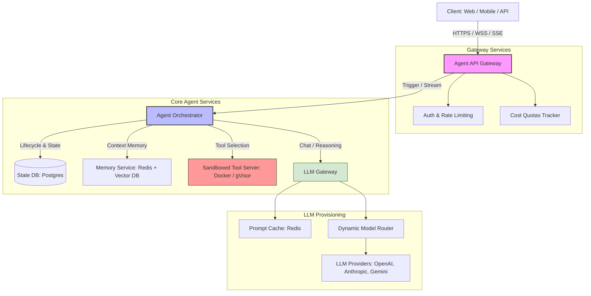
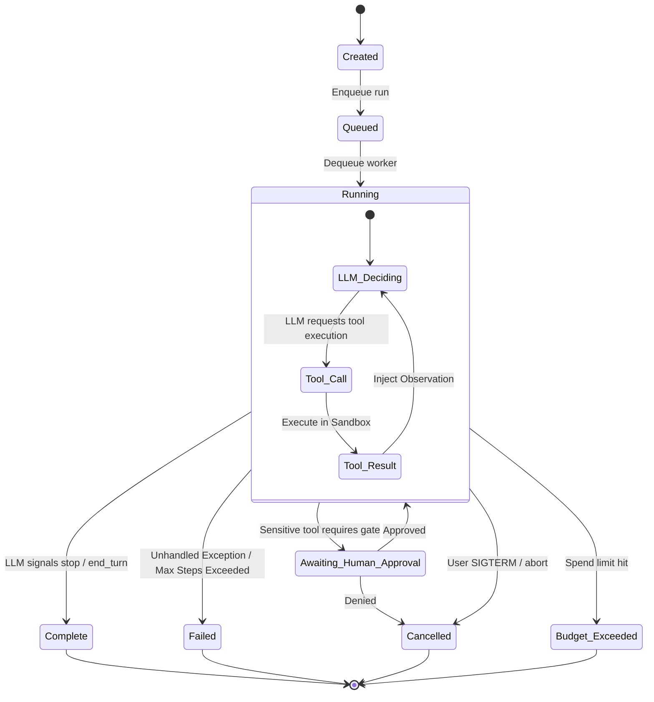

# Agent Infrastructure — Production Systems Design

> **Target audience:** Staff+ backend engineers  
> **Covers:** Agent runtime architecture, observability, sandboxed execution, multi-tenant isolation, LLM gateway, cost management, failure handling

---

## The Agent Infrastructure Stack

Production agents need far more than an LLM call in a loop. The infrastructure stack:

```
┌─────────────────────────────────────────────────────────────┐
│                    Client (Web / API)                        │
└──────────────────────────┬──────────────────────────────────┘
                           │ REST / WebSocket / SSE
┌──────────────────────────▼──────────────────────────────────┐
│                    Agent API Gateway                         │
│   (auth, rate limiting, cost quotas, request routing)        │
└──────────────────────────┬──────────────────────────────────┘
                           │
┌──────────────────────────▼──────────────────────────────────┐
│                    Agent Orchestrator                        │
│   (run lifecycle, step execution, state management)          │
└────┬──────────────┬──────────────┬───────────────────────────┘
     │              │              │
     ▼              ▼              ▼
  LLM Gateway   Tool Server   Memory Service
  (model routing (sandboxed   (vector DB +
   cost tracking  execution)   key-value)
   caching)
     │
     ▼
  LLM Providers
  (OpenAI, Anthropic, Gemini, Self-hosted)
```



---


## LLM Gateway

A centralized proxy for all LLM API calls. Essential for production multi-tenant systems.

### Responsibilities

```python
class LLMGateway:
    def call(self, model: str, messages: list, user_id: str, run_id: str) -> Response:
        # 1. Authentication: is this user allowed to use this model?
        self.check_quota(user_id, model)
        
        # 2. Rate limiting: per-user and global LLM provider rate limits
        self.rate_limiter.check(user_id, model)
        
        # 3. Prompt cache check (exact match)
        cached = self.prompt_cache.get(messages)
        if cached:
            self.track_cache_hit(user_id, run_id)
            return cached
        
        # 4. Model routing (fallback chain)
        primary_model = model
        fallback_models = self.get_fallbacks(model)
        
        for attempt_model in [primary_model] + fallback_models:
            try:
                response = self.providers[attempt_model].call(messages)
                break
            except (RateLimitError, ModelOverloaded):
                continue
        
        # 5. Cost tracking
        cost = calculate_cost(attempt_model, response.usage)
        self.ledger.record(user_id, run_id, cost, response.usage)
        
        # 6. Logging (for compliance, debugging, fine-tuning)
        self.logger.log(user_id, run_id, messages, response, cost)
        
        # 7. Cache the response
        self.prompt_cache.set(messages, response, ttl=3600)
        
        return response
```

### Model Routing Policy

```python
ROUTING_POLICY = {
    # Route by task complexity
    "simple_classification": "claude-haiku-4-5",    # cheapest
    "tool_use":              "claude-sonnet-4-6",   # balanced
    "complex_reasoning":     "claude-opus-4-6",     # most capable
    
    # Fallback chain for availability
    "fallback_chain": {
        "gpt-4o":           ["gpt-4o-mini", "claude-sonnet-4-6"],
        "claude-sonnet-4-6": ["gpt-4o", "claude-haiku-4-5"],
    }
}
```

### Cost Quotas Per Tenant

```sql
CREATE TABLE tenant_quotas (
    tenant_id       UUID PRIMARY KEY,
    monthly_budget  DECIMAL(10,2) NOT NULL,  -- USD
    daily_budget    DECIMAL(10,2),
    current_month_spend DECIMAL(10,2) DEFAULT 0,
    current_day_spend   DECIMAL(10,2) DEFAULT 0,
    quota_reset_day INT DEFAULT 1
);

CREATE TABLE llm_usage_log (
    id          UUID PRIMARY KEY,
    tenant_id   UUID REFERENCES tenants(id),
    user_id     UUID,
    run_id      UUID,
    model       TEXT,
    input_tokens INT,
    output_tokens INT,
    cost_usd    DECIMAL(10,6),
    created_at  TIMESTAMPTZ DEFAULT now()
);
```

---

## Agent Run Lifecycle

### Run States

```
created → queued → running → [tool_call → tool_result →]* → complete
                          ↘ failed
                          ↘ cancelled
                          ↘ budget_exceeded
                          ↘ awaiting_human_approval
```



```sql

CREATE TABLE agent_runs (
    id              UUID PRIMARY KEY,
    tenant_id       UUID NOT NULL,
    user_id         UUID NOT NULL,
    agent_type      TEXT NOT NULL,
    status          TEXT NOT NULL DEFAULT 'created',
    input           JSONB NOT NULL,
    output          JSONB,
    total_steps     INT DEFAULT 0,
    total_tokens    INT DEFAULT 0,
    total_cost_usd  DECIMAL(10,6) DEFAULT 0,
    started_at      TIMESTAMPTZ,
    completed_at    TIMESTAMPTZ,
    error           TEXT,
    created_at      TIMESTAMPTZ DEFAULT now()
);

CREATE TABLE agent_steps (
    id          UUID PRIMARY KEY,
    run_id      UUID NOT NULL REFERENCES agent_runs(id),
    step_number INT NOT NULL,
    step_type   TEXT NOT NULL,  -- 'llm_call' | 'tool_call' | 'tool_result'
    input       JSONB NOT NULL,
    output      JSONB,
    latency_ms  INT,
    tokens_used INT,
    cost_usd    DECIMAL(10,6),
    created_at  TIMESTAMPTZ DEFAULT now(),
    UNIQUE (run_id, step_number)
);
```

### Run Execution

```python
class AgentRunner:
    def run(self, run_id: str) -> None:
        run = db.get_run(run_id)
        db.update_run(run_id, status="running", started_at=datetime.now())
        
        try:
            messages = self.build_initial_messages(run)
            step_num = 0
            
            while True:
                # LLM call
                response = self.llm_gateway.call(
                    model=run.config.model,
                    messages=messages,
                    user_id=run.user_id,
                    run_id=run_id
                )
                
                self.record_step(run_id, step_num, "llm_call", messages, response)
                step_num += 1
                
                # Check termination
                if response.stop_reason == "end_turn":
                    db.update_run(run_id, status="complete", output=response.content)
                    break
                
                if step_num >= MAX_STEPS:
                    raise MaxStepsExceeded()
                
                # Execute tool calls
                for tool_call in response.tool_calls:
                    result = self.execute_tool(run, tool_call, step_num)
                    self.record_step(run_id, step_num, "tool_result", tool_call, result)
                    step_num += 1
                    messages.extend([
                        {"role": "assistant", "content": response},
                        {"role": "tool", "tool_call_id": tool_call.id, "content": str(result)}
                    ])
        
        except BudgetExceeded as e:
            db.update_run(run_id, status="budget_exceeded", error=str(e))
        except Exception as e:
            db.update_run(run_id, status="failed", error=str(e))
            raise
```

---

## Sandboxed Tool Execution

When agents can execute code or interact with files, **isolation is mandatory**. An agent executing untrusted LLM-generated code on your production server is a critical security risk.

### Code Execution Sandbox

```python
class CodeExecutionSandbox:
    """Executes code in isolated container with strict resource limits."""
    
    def execute(self, code: str, language: str, timeout: int = 30) -> dict:
        # Spin up isolated container (Docker / gVisor / Firecracker)
        container = docker.run(
            image=f"sandbox-{language}:latest",
            command=["run_code", code],
            mem_limit="256m",           # Memory cap
            cpu_quota=50000,            # 50% of one CPU
            network_mode="none",        # No network access!
            read_only=True,             # Read-only filesystem
            timeout=timeout,
            user="sandboxuser",         # Non-root user
            security_opt=["no-new-privileges:true"],
            cap_drop=["ALL"]            # Drop all Linux capabilities
        )
        
        return {
            "stdout": container.stdout[:10000],  # cap output
            "stderr": container.stderr[:2000],
            "exit_code": container.exit_code,
            "execution_time_ms": container.duration_ms
        }
```

**Never execute agent-generated code without:**
- Network isolation (no outbound calls from sandbox)
- Filesystem isolation (no access to host filesystem)
- Resource limits (CPU, memory, time)
- Non-root execution
- gVisor or similar for system call filtering

### Tool Permission Model

Not all tools should be available to all agents at all times. Use a capability-based permission system:

```python
TOOL_PERMISSIONS = {
    "read_file":      {"requires_approval": False, "scope": "user_workspace"},
    "write_file":     {"requires_approval": True,  "scope": "user_workspace"},
    "execute_code":   {"requires_approval": False, "scope": "sandbox_only"},
    "send_email":     {"requires_approval": True,  "allowlist": "user_contacts"},
    "web_search":     {"requires_approval": False, "scope": "public_internet"},
    "database_query": {"requires_approval": False, "scope": "read_only"},
    "database_write": {"requires_approval": True,  "scope": "user_data_only"},
}

def can_use_tool(agent_run: AgentRun, tool_name: str) -> bool:
    perm = TOOL_PERMISSIONS[tool_name]
    
    if perm.get("requires_approval"):
        # Check if user pre-approved this tool for this run
        return agent_run.approved_tools and tool_name in agent_run.approved_tools
    
    return True  # auto-approved
```

---

## Multi-Tenant Isolation

Multiple tenants sharing the same agent infrastructure must be fully isolated:

### Data Isolation

```python
class TenantIsolatedVectorDB:
    def search(self, tenant_id: str, query_vec, limit: int):
        # Always filter by tenant — never allow cross-tenant retrieval
        return vector_db.search(
            vector=query_vec,
            filter={"tenant_id": {"$eq": tenant_id}},  # hard filter, not optional
            limit=limit
        )
    
    def upsert(self, tenant_id: str, doc_id: str, vector, payload):
        # Always tag with tenant_id
        vector_db.upsert(
            id=f"{tenant_id}:{doc_id}",  # namespaced ID
            vector=vector,
            payload={**payload, "tenant_id": tenant_id}  # always tagged
        )
```

### Compute Isolation

```python
class TenantRateLimiter:
    def check(self, tenant_id: str, operation: str) -> None:
        limits = self.get_plan_limits(tenant_id)
        
        key = f"rate:{tenant_id}:{operation}:{current_minute()}"
        count = redis.incr(key)
        redis.expire(key, 60)
        
        if count > limits[operation]:
            raise TenantRateLimitExceeded(
                f"Tenant {tenant_id} exceeded {operation} limit: {count}/{limits[operation]}"
            )
```

---

## Observability

Agents are black boxes by default. Observability is what makes them debuggable and trustworthy.

### Distributed Tracing

Every agent run generates a trace spanning multiple LLM calls, tool executions, and DB queries:

```python
from opentelemetry import trace

tracer = trace.get_tracer("agent-runtime")

def execute_step(run_id: str, step: dict) -> dict:
    with tracer.start_as_current_span("agent.step") as span:
        span.set_attribute("run.id", run_id)
        span.set_attribute("step.type", step["type"])
        span.set_attribute("step.number", step["number"])
        
        if step["type"] == "llm_call":
            with tracer.start_as_current_span("llm.call") as llm_span:
                llm_span.set_attribute("model", step["model"])
                llm_span.set_attribute("input_tokens", step["input_tokens"])
                result = call_llm(step)
                llm_span.set_attribute("output_tokens", result.usage.output_tokens)
                return result
```

### Key Metrics

```python
METRICS = {
    # Run metrics
    "agent.run.duration_ms":     Histogram,  # end-to-end run latency
    "agent.run.step_count":      Histogram,  # steps per run (efficiency)
    "agent.run.cost_usd":        Histogram,  # cost distribution
    "agent.run.success_rate":    Gauge,      # fraction completing successfully
    
    # LLM metrics
    "llm.call.latency_ms":       Histogram,  # per model
    "llm.tokens.input":          Counter,    # token consumption
    "llm.tokens.output":         Counter,
    "llm.cache.hit_rate":        Gauge,      # prompt cache effectiveness
    
    # Tool metrics  
    "tool.execution.latency_ms": Histogram,  # per tool name
    "tool.error_rate":           Gauge,      # per tool name
    
    # Safety metrics
    "agent.harmful_output_rate": Gauge,      # content moderation hits
    "agent.prompt_injection_attempts": Counter,
}
```

### Prompt and Response Logging

Log all LLM interactions for debugging, compliance, and fine-tuning:

```python
def log_llm_interaction(run_id, step_num, messages, response, metadata):
    # Write to append-only log store (S3 + Athena for querying)
    record = {
        "run_id": run_id,
        "step_num": step_num,
        "timestamp": datetime.now().isoformat(),
        "model": metadata["model"],
        "messages": messages,  # full prompt
        "response": response.content,
        "usage": response.usage,
        "cost_usd": metadata["cost"],
    }
    s3.put_object(
        Bucket="agent-logs",
        Key=f"runs/{run_id}/{step_num}.json",
        Body=json.dumps(record)
    )
```

**Retention policy:** Keep full prompt logs for 30 days (debugging), aggregated metrics forever, PII-scrubbed summaries for 1 year (compliance).

---

## Failure Handling and Recovery

### Checkpoint-Based Recovery

```python
class CheckpointedAgent:
    def get_or_run_step(self, run_id: str, step_key: str, fn: callable):
        """If this step was already completed (e.g., before crash), return cached result."""
        cached = db.get_step_result(run_id, step_key)
        if cached:
            return cached["output"]
        
        output = fn()
        db.save_step_result(run_id, step_key, {"output": output})
        return output

# Usage: agent restarts from last checkpoint, not from scratch
def run_research_agent(run_id: str, query: str):
    agent = CheckpointedAgent()
    
    searches = agent.get_or_run_step(run_id, "initial_search",
        lambda: [web_search(q) for q in generate_queries(query)])
    
    analysis = agent.get_or_run_step(run_id, "analysis",
        lambda: llm.analyze(searches))
    
    report = agent.get_or_run_step(run_id, "report",
        lambda: llm.write_report(analysis))
    
    return report
```

### Graceful Degradation

```python
def robust_tool_call(tool_name: str, args: dict, run_id: str) -> dict:
    try:
        return tools[tool_name](**args)
    except ToolTimeout:
        # Return partial result if available, or graceful failure message
        return {"error": f"{tool_name} timed out", "partial": True}
    except ToolRateLimited:
        # Agent can decide to wait or skip this tool
        return {"error": "rate_limited", "retry_after": 60}
    except ToolError as e:
        # Log for monitoring but don't crash the run
        metrics.increment("tool.error", tags={"tool": tool_name})
        return {"error": str(e), "tool": tool_name}
```

---

## Interview Quick Reference

| Component | Design Choice |
|-----------|--------------|
| LLM calls | Centralized gateway with cost tracking, caching, fallbacks |
| Code execution | Isolated container (Docker/gVisor), no network, resource limits |
| Tool permissions | Capability-based, approval required for destructive actions |
| Multi-tenancy | Namespace isolation at vector DB, rate limits per tenant |
| Observability | OpenTelemetry traces + metrics + prompt logs to S3 |
| Failure recovery | Checkpoint each step; restart resumes from last checkpoint |
| Cost control | Per-tenant budget quotas + real-time spend tracking |
| Prompt injection | Content sanitization + tool allowlists + human approval gates |

---

*Previous: [09 - RAG Systems](./09_rag_systems.md)*  

*End of AI Agents section*
