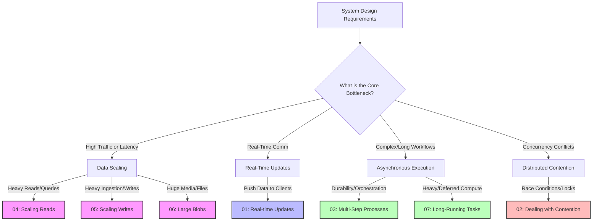
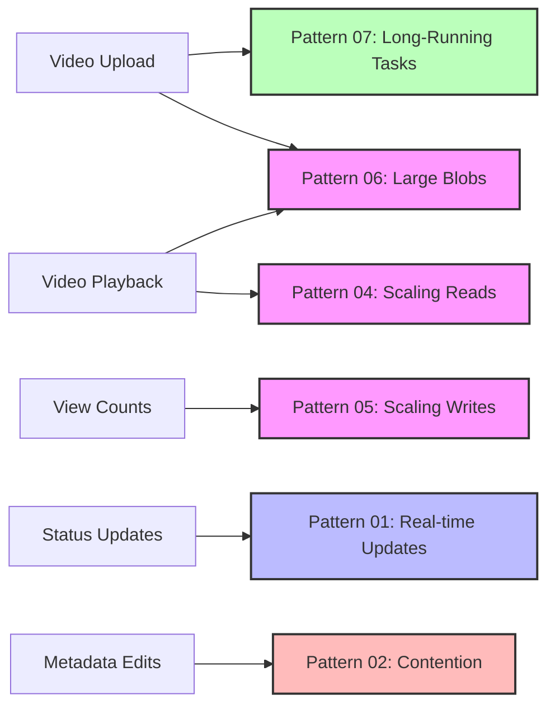

# System Design Patterns: The Pattern Matching Framework

Welcome to the **System Design Patterns** repository! This framework is designed to help you move away from memorizing complete system design templates (like "Design Netflix" or "Design Uber") and instead focus on **pattern matching**. 

In real-world software engineering and in system design interviews, most complex problems decompose into a set of standard, recurring architectural challenges. By mastering these 7 core patterns, you can quickly identify the technical trade-offs, choose the right tools, and formulate robust, scalable architectures under pressure.

---

## The 7 Core System Design Patterns

Here is an overview of the 7 patterns covered in this collection. Click on any pattern to access its comprehensive technical deep dive, diagrams, and trade-off matrices.

| # | Pattern | Core Architectural Problem | Common Interview Use Cases |
|---|---|---|---|
| **01** | **[Real-time Updates](./01_realtime_updates.md)** | Pushing instant events or data changes from servers to active clients with low latency. | Chat apps (WhatsApp), Live Tickers (Robinhood), GPS tracking (Uber), Collaborative editors (Google Docs). |
| **02** | **[Dealing with Contention](./02_dealing_with_contention.md)** | Resolving race conditions and coordination bottlenecks when multiple users/processes modify the same resource concurrently. | Ticket booking (Ticketmaster), Flash sales, Distributed counters, Ride matching, Ad click aggregation. |
| **03** | **[Multi-Step Processes](./03_multi_step_processes.md)** | Coordinating complex, asynchronous, distributed workflows across multiple microservices that must guarantee durability and error recovery. | E-commerce checkout, Document ingestion pipelines (RAG), Financial ledger postings, User onboarding. |
| **04** | **[Scaling Reads](./04_scaling_reads.md)** | Optimizing database and system query architectures to support extreme read-to-write ratios and sub-millisecond latencies. | Social media feeds (Twitter), Search engines, Product catalogs, User profile lookups. |
| **05** | **[Scaling Writes](./05_scaling_writes.md)** | Designing high-throughput write paths that can absorb bursts of incoming traffic without degrading database health. | IoT sensor ingestion, Analytics clickstreams, Chat history logging, Financial transaction recording. |
| **06** | **[Large Blobs](./06_large_blobs.md)** | Storing, processing, and delivering massive binary objects efficiently without clogging application servers or database transactions. | Video streaming (Netflix), Photo sharing (Instagram), Large PDF statements, ML model weights. |
| **07** | **[Long-Running Tasks](./07_long_running_tasks.md)** | Decoupling heavy, non-blocking computations from the main API request-response path to maintain fast response times. | Video encoding, PDF report generation, Massive bulk email campaigns, Machine Learning inference. |

---

## How to Apply the Framework in an Interview

During an interview, your goal is to transition from **Requirements Gathering** to **High-Level Design** by recognizing which of these patterns apply. Use the following three-step process:

### Step 1: Detect the Pattern Indicators
Listen for key functional and non-functional requirements that signal a specific pattern:
*   *"Users need to see driver locations move on a map in real-time"* $\rightarrow$ **Pattern 01: Real-time Updates**
*   *"Only one customer can purchase the exact same seat"* $\rightarrow$ **Pattern 02: Dealing with Contention**
*   *"Order fulfillment involves payment, inventory reservation, shipping, and email notifications"* $\rightarrow$ **Pattern 03: Multi-Step Processes**
*   *"Our platform has 100,000 reads for every 1 write"* $\rightarrow$ **Pattern 04: Scaling Reads**

### Step 2: Establish the Simple Baseline (The "MSRP" Principle)
Start by proposing a straightforward, standard solution. For example:
*   For **Real-time Updates**: Suggest **HTTP Simple Polling**.
*   For **Contention**: Suggest a database-level **Pessimistic Lock (`SELECT ... FOR UPDATE`)**.
*   For **Multi-Step Processes**: Suggest synchronous API calls from a **monolithic orchestration service**.

*Always state the trade-offs of the baseline first before scaling!* This demonstrates mature engineering judgment and prevents over-engineering.

### Step 3: Scale Under Bottlenecks (Introduce the Pattern Components)
When the interviewer pushes you to scale (e.g., *"What happens if there are 10 million concurrent active users?"* or *"What if the payment gateway fails midway?"*), swap in the advanced architectural components defined in these pattern documents. 

For instance, swap Simple Polling for **WebSockets with a Consistent Hash Routing Ring and Redis Pub/Sub**, or swap database-level locking for **Optimistic Concurrency Control (OCC)** or **decentralized Redis Atomic counters**.

---

## Worked Example: Composing Patterns in an Interview

Most interview questions don't map to a single pattern — they require **composing multiple patterns** together. Recognizing which patterns apply and how they interact is what separates Senior from Staff+ level answers.

**Example Prompt:** *"Design a Video Sharing Platform (like YouTube)"*

| System Requirement | Pattern | Specific Techniques |
|---|---|---|
| Users upload large video files (up to 10GB) | **[Pattern 06: Large Blobs](./06_large_blobs.md)** | Pre-signed URLs for direct-to-S3 upload, multipart and resumable uploads for reliability, CDN edge delivery with HLS chunking for playback |
| Uploaded videos must be transcoded into multiple resolutions | **[Pattern 07: Long-Running Tasks](./07_long_running_tasks.md)** | Async transcoding pipeline: S3 upload event → SQS/Kafka queue → FFmpeg worker pool → output 360p/720p/1080p/4K chunks → update metadata DB |
| View counts must handle millions of concurrent increments | **[Pattern 05: Scaling Writes](./05_scaling_writes.md)** | Write-buffered ingestion: client view events → Kafka topic → batch aggregation every 30s → bulk UPDATE to Postgres/DynamoDB |
| Video metadata and search must be fast at global scale | **[Pattern 04: Scaling Reads](./04_scaling_reads.md)** | Redis cache for hot video metadata, CDN for static assets, read replicas for search queries, denormalized read models |
| Users see real-time upload progress and transcoding status | **[Pattern 01: Real-time Updates](./01_realtime_updates.md)** | WebSocket push notifications: upload progress bar, transcoding stage updates (QUEUED → PROCESSING → COMPLETE), live view count tickers |
| Multiple editors can update video title and description concurrently | **[Pattern 02: Dealing with Contention](./02_dealing_with_contention.md)** | Optimistic concurrency control (OCC) with version numbers on video metadata rows to detect and resolve conflicting edits |

> **Interview Tip:** Start by listing the functional requirements, then map each one to a pattern. This shows the interviewer you have a structured decomposition framework rather than reciting a memorized answer.

---

*Select a pattern file above to begin deep diving into the specific architecture, trade-offs, and Mermaid flowcharts!*
