# System Design: AI Coding Agent (Cursor / GitHub Copilot)

Design a production-grade **AI-powered coding agent** — an IDE-integrated system that provides real-time code completions, multi-file edits, codebase-aware chat, and autonomous tool-using agentic workflows — at Google scale.

---

## Step 1: Requirements (0 – 5 min)

### Functional Requirements

| # | User Journey | Description |
|---|---|---|
| **F1** | **Inline Code Completion** | As the user types, the agent predicts and suggests the next lines of code in real time (ghost text), triggered on every keystroke or pause. |
| **F2** | **Chat-Based Code Generation** | The user describes a task in natural language ("add pagination to this API"). The agent generates a multi-file code diff applied directly to the workspace. |
| **F3** | **Codebase-Aware Context** | The agent understands the *entire* codebase — not just the open file. It retrieves relevant files, symbols, types, and documentation to construct context. |
| **F4** | **Agentic Tool Use** | The agent can autonomously read files, write files, run terminal commands, search the web, and iterate on its own output in a loop until the task is complete. |
| **F5** | **Streaming Responses** | All LLM responses stream token-by-token to the IDE with sub-200ms time-to-first-token (TTFT). |

**Explicitly out of scope:** IDE/editor implementation, syntax highlighting, Git integration, deployment pipelines, team collaboration features.

### Non-Functional Requirements

| Attribute | Target |
|---|---|
| **Scale** | 10M DAU developers, 50M+ completion requests/day, 5M+ chat requests/day |
| **Latency — Completions** | Time-to-first-token (TTFT) < 200ms (p50), < 500ms (p99). Total completion < 1s. |
| **Latency — Chat/Agent** | TTFT < 500ms (p50). Full response streaming at 30+ tokens/sec. |
| **Availability** | 99.95% — completions are latency-critical; degraded mode = disable completions, keep chat. |
| **Security** | User code is proprietary IP. Zero-retention policy: code context is never persisted or used for training. All transit encrypted. SOC 2 Type II. |
| **Context Quality** | Agent responses must reflect current workspace state — stale context causes incorrect edits that erode trust. |

> [!IMPORTANT]
> **The core design challenge**: An LLM has a finite context window (128K–1M tokens). A typical codebase has 10M+ tokens. The system must select the *right* 50K–200K tokens of context for every request. **Context construction is the make-or-break quality differentiator.**

---

## Step 2: Capacity Estimation (5 – 10 min)

### Completion Requests (Latency-Critical Hot Path)

```
DAU                     = 10M developers
Avg completions / user / day = 500 (triggered on pauses, tab presses)
Daily completions       = 5 billion
Completion QPS          = 5B / 86,400 ≈ 58,000 QPS
Peak (working hours, 8h window) = 58K × 3 ≈ 175,000 QPS
```

### Chat / Agent Requests

```
Avg chat requests / user / day = 50
Daily chat requests     = 500M
Chat QPS                = 500M / 86,400 ≈ 5,800 QPS
Peak                    ≈ 17,000 QPS
```

### LLM Inference Compute

```
Completion: avg 100 input tokens + 50 output tokens = 150 tokens
  → 175K QPS × 150 tokens = 26M tokens/sec at peak

Chat: avg 10,000 input tokens + 2,000 output tokens = 12,000 tokens
  → 17K QPS × 12,000 tokens = 204M tokens/sec at peak

Total inference: ~230M tokens/sec at peak
```

### GPU Fleet Sizing (Order of Magnitude)

```
Assume: Model serving on H100 GPUs
  Completion model (small, ~7B params): ~5,000 tokens/sec per GPU
  Chat model (large, ~70B+ params): ~1,000 tokens/sec per GPU

Completion fleet: 26M / 5,000 ≈ 5,200 GPUs
Chat fleet: 204M / 1,000 ≈ 204,000 tokens/sec → but with batching
  Effective with continuous batching: ~10,000 tokens/sec/GPU → 20,400 GPUs

Total GPU fleet: ~25,000 GPUs (with batching efficiency + headroom)
```

> [!IMPORTANT]
> This is the **dominant cost center** — GPU inference at $2–3/GPU-hour means ~$1.5M/day in compute. Every optimization (smaller models for completions, caching, speculative decoding, prompt compression) has massive cost impact.

### Codebase Index Storage

```
Avg codebase: 50,000 files × 200 lines × 80 chars = ~800 MB source
Avg indexed repos per user: 3 active
Embedding dimensions: 768 (code embedding model)
Chunks per repo: 50K files × 5 chunks/file = 250K chunks
Embedding storage per repo: 250K × 768 × 4 bytes = 768 MB

Total indexed repos: ~30M (10M users × 3)
Total embedding storage: 30M × 768 MB = 23 PB (!)
```

This is prohibitive to store centrally for all users. **Indexes must be computed on-demand or cached with aggressive eviction.** Active user indexes (~1M concurrent): ~768 TB — feasible with distributed storage.

---

## Step 3: High-Level Design (10 – 18 min)

### Architecture Diagram

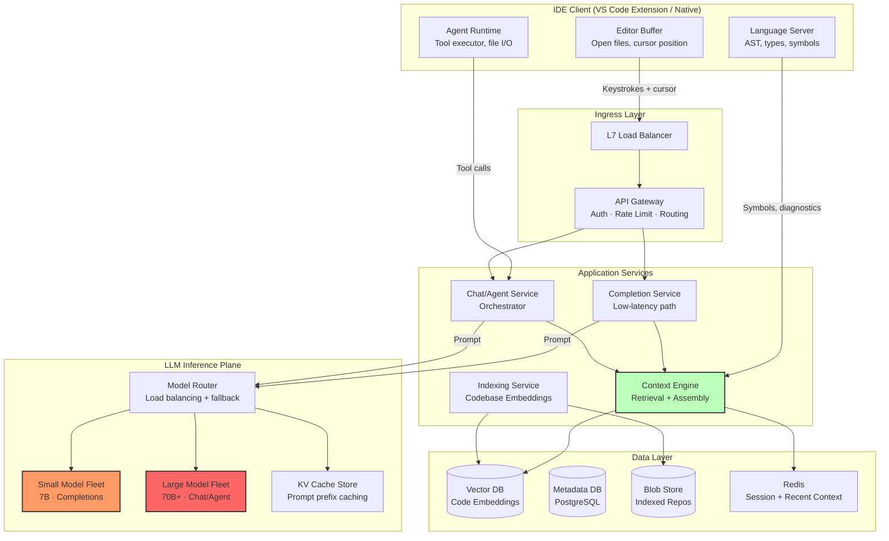

### Request Flows

#### Flow 1: Inline Completion (< 1 second total)

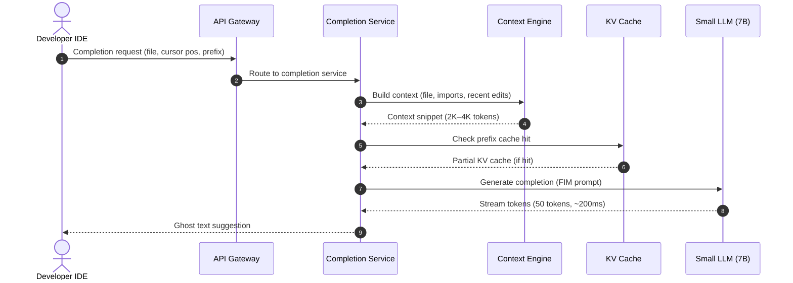

#### Flow 2: Agentic Chat (Multi-Turn, Tool Use)

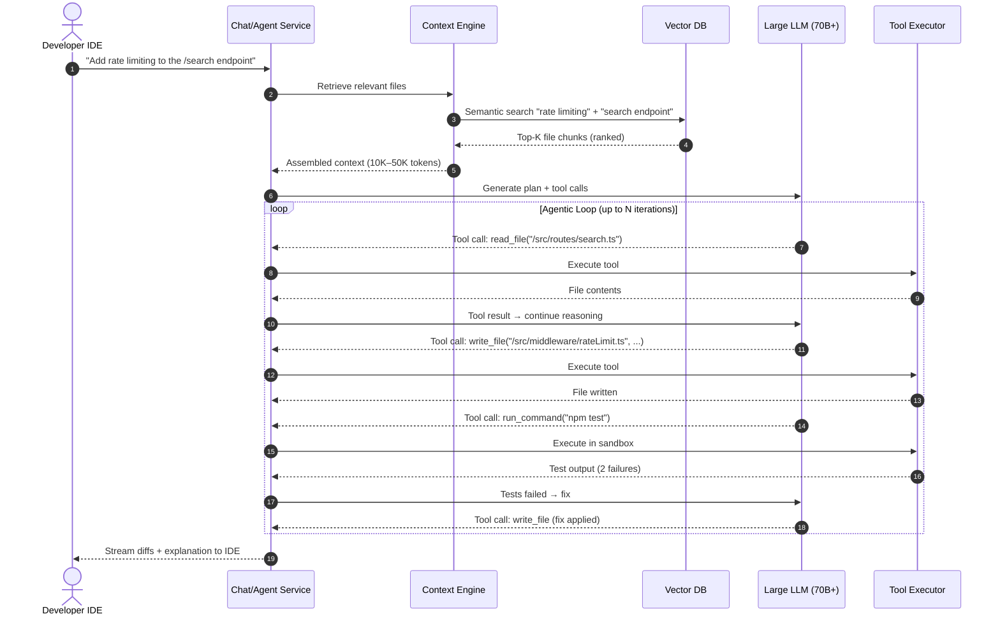

### Core API Contracts

#### 1. Completion Request

```http
POST /v1/completions
Headers:
  Authorization: Bearer <session-token>
  X-Request-ID: <UUID>
Request Body:
  {
    "session_id": "sess_abc",
    "file_path": "src/api/search.ts",
    "language": "typescript",
    "prefix": "function handleSearch(req: Request) {\n  const query = req.query.",
    "suffix": "\n  return results;\n}",
    "cursor_offset": 156,
    "max_tokens": 64,
    "context_hints": {
      "open_files": ["src/api/search.ts", "src/types.ts"],
      "recent_edits": [{"file": "src/types.ts", "range": "L10-L25"}],
      "imports": ["import { SearchParams } from '../types';"]
    }
  }
Response: 200 OK (Streaming SSE)
  data: {"token": "searchTerm", "finish_reason": null}
  data: {"token": ";\n  const results = await db.search(searchTerm", "finish_reason": null}
  data: {"token": ");", "finish_reason": "stop"}
```

#### 2. Chat / Agent Request

```http
POST /v1/chat
Headers:
  Authorization: Bearer <session-token>
Request Body:
  {
    "session_id": "sess_abc",
    "conversation_id": "conv_xyz",
    "message": "Add input validation to the search handler",
    "workspace": {
      "root": "/Users/dev/myproject",
      "active_file": "src/api/search.ts",
      "selection": {"start": {"line": 5, "col": 0}, "end": {"line": 15, "col": 0}}
    },
    "tools_enabled": ["read_file", "write_file", "run_command", "search_codebase"],
    "model_preference": "large"
  }
Response: 200 OK (Streaming SSE)
  data: {"type": "thinking", "content": "I'll read the search handler first..."}
  data: {"type": "tool_call", "tool": "read_file", "args": {"path": "src/api/search.ts"}}
  data: {"type": "tool_result", "content": "...file contents..."}
  data: {"type": "text", "content": "I'll add Zod validation..."}
  data: {"type": "file_edit", "path": "src/api/search.ts", "diff": "...unified diff..."}
  data: {"type": "done", "usage": {"input_tokens": 12400, "output_tokens": 850}}
```

---

## Step 4: Deep Dive — Scaling, Bottlenecks & Trade-Offs (18 – 38 min)

### Deep Dive 1: Context Engine (The Quality Differentiator)

This is the most critical component. An LLM with wrong context produces wrong code. An LLM with perfect context produces excellent code.

#### The Context Construction Pipeline

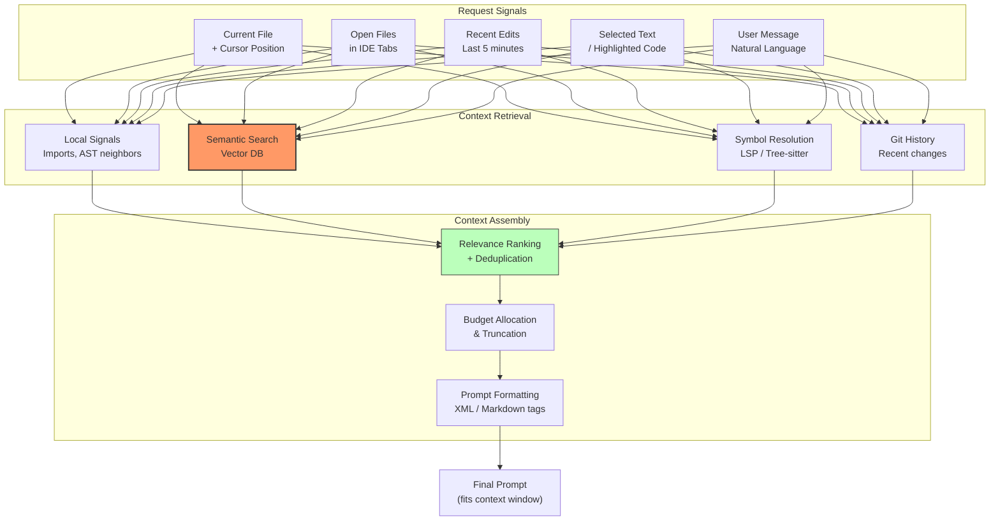

#### Context Sources (Ordered by Signal Strength)

| Priority | Source | Signal Strength | Token Cost | Retrieval Latency |
|---|---|---|---|---|
| **1 (Highest)** | Current file + cursor neighborhood (±200 lines) | Very high | 500–2K tokens | 0ms (client-side) |
| **2** | Imported/referenced files (follow `import` statements) | High | 1K–5K tokens | <10ms (local resolve) |
| **3** | Open editor tabs | High | 1K–3K tokens | 0ms (client-side) |
| **4** | Recent edits (last 5 min diff) | High | 500–2K tokens | 0ms (client-side) |
| **5** | Semantic search results (vector DB) | Medium-High | 2K–10K tokens | 20–50ms |
| **6** | Symbol definitions (types, interfaces, function signatures) | Medium | 1K–5K tokens | 10–30ms (LSP) |
| **7** | File tree structure | Low-Medium | 500–1K tokens | 0ms |
| **8** | README / documentation | Low | 1K–3K tokens | 10ms |
| **9** | Git blame / recent commits | Low | 500–1K tokens | 20ms |

#### Context Budget Allocation

With a 128K token context window, allocate budget by request type:

```
Completion Request (speed-critical, small model):
  ┌──────────────────────────────────────────┐
  │ System prompt:           200 tokens      │
  │ Current file (FIM):    2,000 tokens      │
  │ Imports/references:    1,000 tokens      │
  │ Recent edits:            500 tokens      │
  │ Output budget:           300 tokens      │
  │ ─────────────────────────────────────── │
  │ Total:                ~4,000 tokens      │
  └──────────────────────────────────────────┘

Chat/Agent Request (quality-critical, large model):
  ┌──────────────────────────────────────────┐
  │ System prompt:         1,000 tokens      │
  │ Conversation history:  5,000 tokens      │
  │ Current file:          3,000 tokens      │
  │ Semantic search results: 15,000 tokens   │
  │ Symbol definitions:    5,000 tokens      │
  │ Open tabs (summaries):  3,000 tokens     │
  │ File tree:              1,000 tokens     │
  │ Tool results (accumulated): 20,000 tokens│
  │ Output budget:          8,000 tokens     │
  │ ─────────────────────────────────────── │
  │ Total:               ~61,000 tokens      │
  └──────────────────────────────────────────┘
```

#### Retrieval-Augmented Generation (RAG) for Code

**Step 1: Chunk the codebase.**

Naively chunking by fixed token count breaks semantic boundaries. Instead, use **AST-aware chunking**:

```
File: src/api/search.ts (500 lines)

AST-Aware Chunks:
  Chunk 1: import statements (lines 1-15)        → embedding₁
  Chunk 2: SearchParams interface (lines 17-30)   → embedding₂
  Chunk 3: handleSearch function (lines 32-80)     → embedding₃
  Chunk 4: buildQuery helper (lines 82-120)        → embedding₄
  Chunk 5: formatResults function (lines 122-160)  → embedding₅
```

Each chunk preserves a complete semantic unit (function, class, interface, import block). Chunks include:
- The code itself
- A natural language docstring/summary (generated by a small LLM at indexing time)
- File path and symbol names as metadata

**Step 2: Embed and index.**

```
For each chunk:
  embedding = code_embedding_model.encode(chunk.code + chunk.summary)
  vector_db.upsert(
    id = f"{repo_id}:{file_path}:{chunk_id}",
    vector = embedding,            # 768-dim
    metadata = {
      file_path, language, symbols, line_range, last_modified
    }
  )
```

**Step 3: Query at request time.**

```python
def retrieve_context(user_message: str, current_file: str, k: int = 20):
    # Combine user query with code context for better retrieval
    query = f"{user_message}\n\nCurrent file: {current_file[:500]}"
    query_embedding = code_embedding_model.encode(query)
    
    # Hybrid search: semantic + keyword (BM25)
    semantic_results = vector_db.search(query_embedding, top_k=k)
    keyword_results = full_text_index.search(extract_identifiers(user_message), top_k=k)
    
    # Reciprocal Rank Fusion to merge results
    merged = reciprocal_rank_fusion(semantic_results, keyword_results)
    
    # Deduplicate and respect token budget
    return truncate_to_budget(merged, max_tokens=15000)
```

**Trade-off: Semantic search vs. grep/keyword search:**

| | Semantic Search (Embeddings) | Keyword Search (BM25 / ripgrep) |
|---|---|---|
| **"add rate limiting"** | Finds `rateLimit.ts`, `middleware.ts` even without exact term | Only finds files containing "rate" or "limiting" |
| **"fix the bug in auth"** | Finds auth-related code broadly | Finds files with "auth" string — may miss relevant tests |
| **`handleSearch` function** | May miss (embeddings are fuzzy) | Exact match — finds instantly |
| **Latency** | 20–50ms (ANN search) | 5–10ms (inverted index) |

**Decision: Hybrid search (semantic + keyword) with Reciprocal Rank Fusion.** Both retrieval methods compensate for each other's weaknesses.

---

### Deep Dive 2: Codebase Indexing Pipeline

When a user opens a project, we must index it for semantic search. This is a **write-heavy, latency-sensitive pipeline** — the user expects context-aware responses within seconds of opening a project.

#### Indexing Architecture

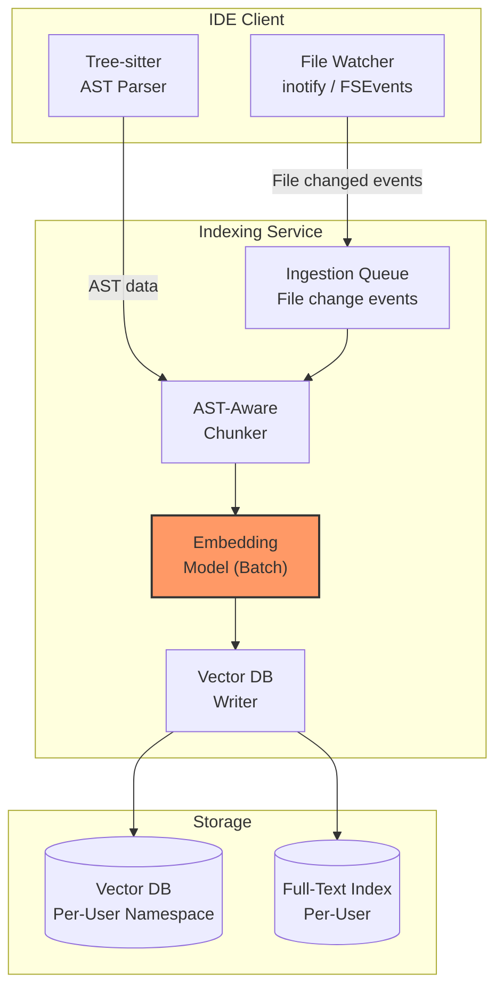

#### Indexing Strategies

| Strategy | When Used | Latency | Resource Cost |
|---|---|---|---|
| **Full index** | First time opening a project | 30s–5min (depending on size) | High (embed all files) |
| **Incremental index** | File saved / created / deleted | < 1s per file | Low (embed changed chunks only) |
| **Real-time buffer index** | User is actively editing (unsaved) | < 100ms | Minimal (local in-memory only) |

**Full indexing pipeline (background):**

```
50,000 files × 5 chunks/file = 250,000 chunks
Embedding model throughput: ~10,000 chunks/sec (batched on GPU)
Full index time: 250K / 10K = 25 seconds
```

**Incremental indexing (real-time):**

When a file is saved:
1. Re-parse the AST → identify changed chunks.
2. Re-embed only the changed chunks (~5 chunks per file edit).
3. Upsert into vector DB (< 10ms per chunk).
4. Total latency: < 100ms for a single file save.

#### Where Does the Index Live?

| Option | Pros | Cons |
|---|---|---|
| **Client-side (local)** | Zero latency, zero server cost, full privacy | Can't share across devices, limited by client hardware |
| **Server-side (per-user namespace)** | Cross-device sync, server-grade vector DB | 23 PB storage for all users (prohibitive), network latency |
| **Hybrid (★)** | Best of both worlds | Complexity |

**Decision: Hybrid.**
- **Local index** for the active workspace — stored on the developer's machine using a lightweight embedded vector DB (e.g., SQLite-vec, FAISS flat). Zero-latency retrieval.
- **Server-side index** for recently active projects — cached on the server for cross-device access and for cases where the client is a thin web IDE.
- **Index eviction**: Server-side indexes evicted after 7 days of inactivity. Re-indexed on next session (25-second background job).

---

### Deep Dive 3: LLM Inference at Scale

#### Model Strategy: Two-Tier Architecture

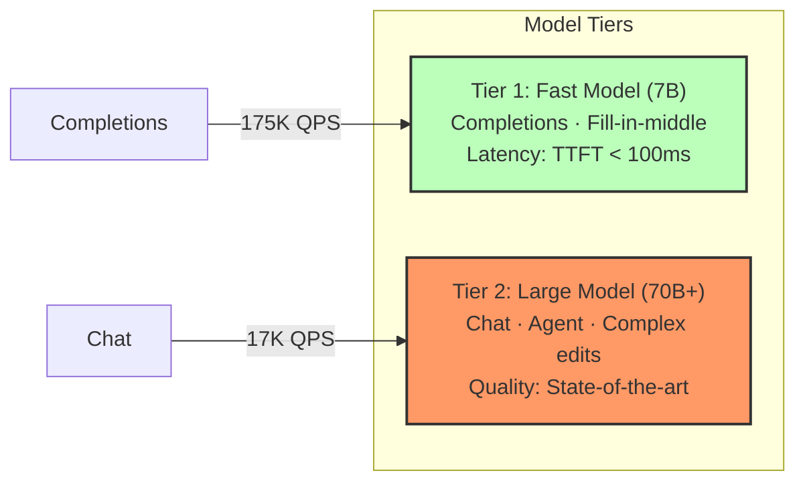

| | Tier 1: Fast Model | Tier 2: Large Model |
|---|---|---|
| **Use case** | Inline completions, single-line suggestions | Multi-file edits, agent tasks, complex reasoning |
| **Model size** | 7B parameters | 70B+ parameters (or MoE equivalent) |
| **Context window** | 4K–8K tokens | 128K–1M tokens |
| **TTFT target** | < 100ms | < 500ms |
| **Throughput / GPU** | ~5,000 tokens/sec | ~1,000 tokens/sec |
| **Prompt format** | Fill-in-Middle (FIM): `<PRE>...code before cursor...<SUF>...code after...<MID>` | Chat format with system prompt, context, tools |

#### Inference Optimizations

**1. KV Cache / Prefix Caching**

Most completion requests from the same file share a large common prefix (system prompt + file header + imports). Caching the KV activations for this prefix avoids redundant computation.

```
Request 1: [System Prompt][File Header][imports][function body line 1-50]|cursor
Request 2: [System Prompt][File Header][imports][function body line 1-50, +1 char]|cursor

KV cache hit: 95% of tokens are identical → reuse KV cache
Only compute attention for the new/changed tokens

Speedup: 3–5x reduction in TTFT for sequential completions in the same file
```

**Implementation:**
- Maintain a **per-session KV cache** keyed by `hash(prompt_prefix)`.
- Store in GPU HBM (fast) or offload to CPU DRAM / NVMe (larger capacity).
- Evict LRU caches when GPU memory pressure exceeds 80%.

**2. Speculative Decoding**

Use a tiny draft model (1B params) to generate K candidate tokens, then verify them in a single forward pass of the main model. Accepted tokens are "free" — rejected tokens are discarded.

```
Draft model (1B):  generates 5 tokens: [const, result, =, await, db]
Main model (7B):   verifies in one pass: [const ✓, result ✓, =, ✓ await ✓, db ✓]
                   → All 5 accepted. 5 tokens generated in 1 forward pass instead of 5.

Typical acceptance rate: 70–85%
Effective throughput improvement: 2–3×
```

**3. Continuous Batching (vLLM / TensorRT-LLM)**

Naively, a GPU serves one request at a time. With continuous batching:
- New requests are added to the batch as soon as any slot frees up (a request finishes).
- GPU utilization jumps from ~30% (naive) to ~85% (continuous batching).
- Throughput per GPU increases 3–4×.

```
Naive batching:
  [Req1 ████████░░░░░░░░]  GPU idle while waiting for batch
  [Req2 ██████░░░░░░░░░░]
  [Req3 ████████████░░░░]

Continuous batching:
  [Req1 ████████]
  [Req2 ██████]-[Req4 ████████]     ← Req4 joins as Req2 finishes
  [Req3 ████████████]
  GPU utilization: ~85%
```

**4. Request Cancellation (Critical for Completions)**

Users type faster than LLM inference. If a user types 3 more characters while a completion is in-flight, the previous request is stale. The IDE must **cancel** the previous request immediately.

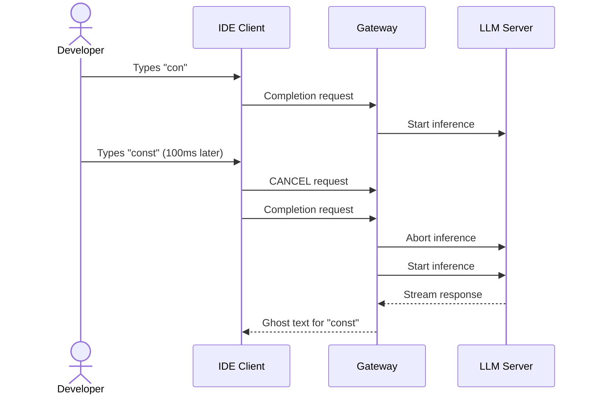

**Implementation:**
- The IDE client uses **HTTP/2 stream reset (RST_STREAM)** or WebSocket cancel message.
- The inference server aborts the generation loop and frees the KV cache slot immediately.
- Without cancellation, the GPU wastes cycles on stale requests — at 175K QPS, this is catastrophic.

#### Debouncing at the Client

Don't send a completion request on every keystroke. Use a **debounce** strategy:

```
Debounce rules:
  1. Wait 150ms after last keystroke before sending request
  2. If user is mid-word (no space/newline), wait for word boundary
  3. Cancel any in-flight request before sending a new one
  4. If user pressed Tab (accepting), don't send new completion for 500ms
```

This reduces effective completion QPS by 60–70% (from 500K raw keystrokes/sec to 175K actual requests).

---

### Deep Dive 4: The Agentic Loop

The agent doesn't just generate text — it **acts**. It reads files, writes code, runs tests, and iterates autonomously.

#### Agent Execution Model

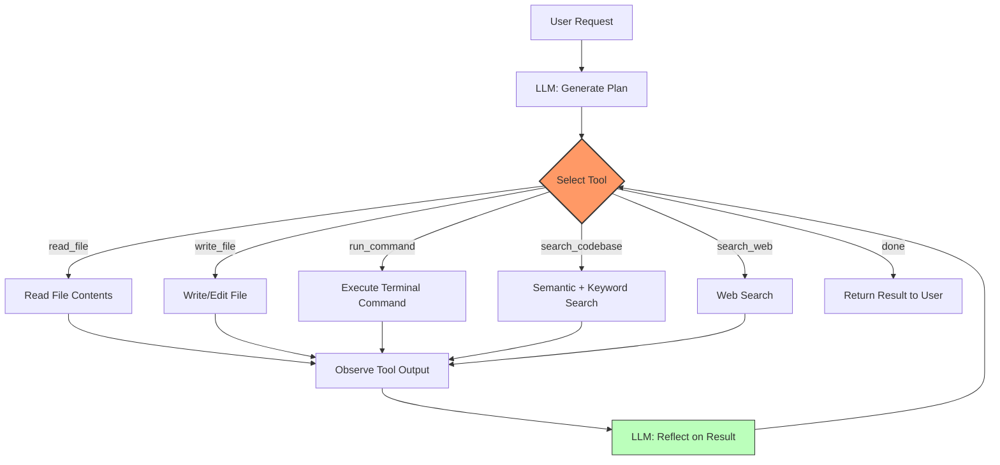

#### Tool Definitions

```json
{
  "tools": [
    {
      "name": "read_file",
      "description": "Read the contents of a file in the workspace",
      "parameters": {
        "path": "string (relative to workspace root)",
        "start_line": "int (optional)",
        "end_line": "int (optional)"
      }
    },
    {
      "name": "write_file",
      "description": "Create or overwrite a file with new contents",
      "parameters": {
        "path": "string",
        "content": "string",
        "description": "string (explanation of the change)"
      }
    },
    {
      "name": "edit_file",
      "description": "Apply a targeted edit to an existing file",
      "parameters": {
        "path": "string",
        "target_content": "string (exact text to replace)",
        "replacement_content": "string"
      }
    },
    {
      "name": "run_command",
      "description": "Run a shell command in the workspace",
      "parameters": {
        "command": "string",
        "cwd": "string (optional, relative path)"
      }
    },
    {
      "name": "search_codebase",
      "description": "Semantic and keyword search across the codebase",
      "parameters": {
        "query": "string",
        "file_pattern": "string (optional glob)"
      }
    }
  ]
}
```

#### Guardrails and Safety

The agent runs tool calls autonomously. Without guardrails, it could run destructive commands or enter infinite loops.

| Risk | Mitigation |
|---|---|
| **Destructive commands** (`rm -rf /`, `DROP TABLE`) | Command allowlist/denylist. Destructive commands require user confirmation. Sandbox all commands. |
| **Infinite loop** (agent keeps calling tools without converging) | Hard cap: max 25 tool calls per request. Timeout: 5 minutes total. Cost cap: max 200K tokens per request. |
| **Incorrect file edits** | All edits presented as diffs for user review. Edits are applied in a virtual overlay — not committed until user approves. |
| **Sensitive data exfiltration** | Tool calls cannot make outbound network requests (except search_web via proxy). File reads are sandboxed to workspace. |
| **Cost explosion** | Per-user daily token budget. Alert at 80% usage. Hard cutoff at 100%. |

#### Context Window Management in Long Agent Sessions

A complex agentic task might require 15+ tool calls, each adding tool results to the conversation. The context window fills up:

```
Turn 1:  User message (200 tokens) + System prompt (1000) = 1,200
Turn 2:  LLM reasoning (500) + tool_call: read_file → result (3,000) = 4,700
Turn 3:  LLM reasoning (300) + tool_call: search → result (5,000) = 10,000
Turn 4:  LLM reasoning (800) + tool_call: read_file → result (4,000) = 14,800
...
Turn 12: Accumulated context = 95,000 tokens (approaching 128K limit!)
```

**Solution: Progressive context compression.**

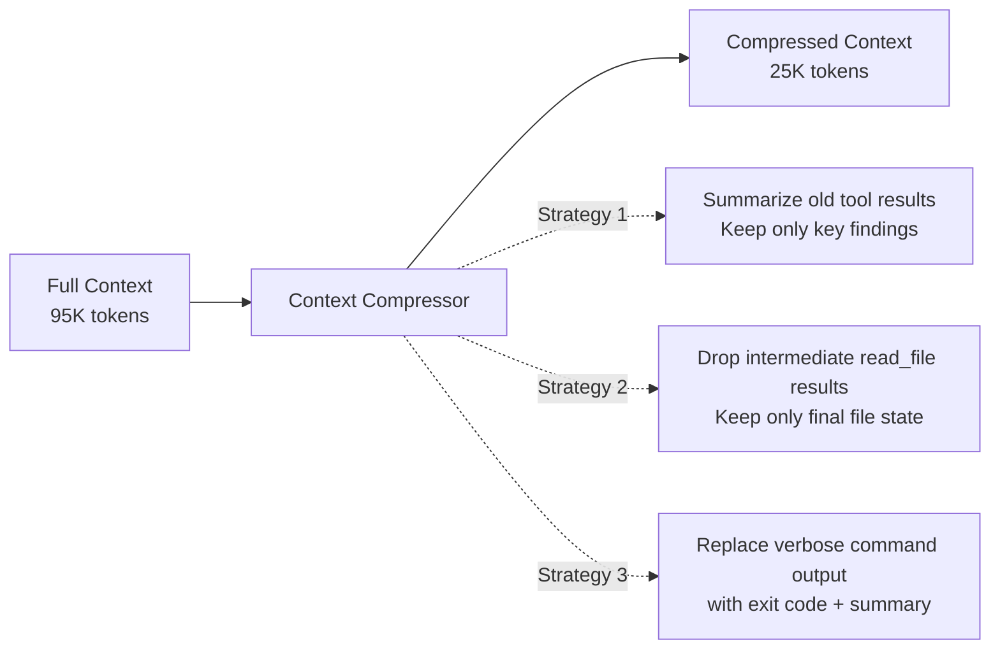

**Implementation:**
1. When context exceeds 70% of window: trigger compression.
2. A secondary LLM call summarizes old tool results into concise findings.
3. Replace verbose tool outputs with summaries. Keep the last 3 tool results in full.
4. Always preserve: system prompt, user's original request, current file state, and last 3 turns.

---

### Deep Dive 5: Completion Quality — Fill-in-the-Middle (FIM)

Standard left-to-right language models can only predict what comes next. For code completions, we need to predict code that fits **between** existing code (the cursor is in the middle of a file).

#### FIM Prompt Format

```
<|fim_prefix|>
import express from 'express';
import { validateInput } from './validation';

export function handleSearch(req: Request, res: Response) {
  const query = req.query.
<|fim_suffix|>
  
  const results = await db.search(query, { limit: 20 });
  return res.json(results);
}
<|fim_middle|>
```

The model generates tokens to fill the `<|fim_middle|>` slot, producing:

```
searchTerm as string;
  if (!query) {
    return res.status(400).json({ error: 'Missing search term' });
  }
```

**Key: The suffix provides crucial context.** The model knows the next line uses `query` and calls `db.search()`, so it infers the correct variable name and type.

#### Completion Acceptance Rate as the North Star Metric

```
Acceptance Rate = Completions Accepted by User / Completions Shown
                 
Industry benchmarks:
  GitHub Copilot:  ~30% acceptance rate
  Good threshold:  >25% (users find it helpful)
  Bad threshold:   <15% (users disable the feature)
```

Low acceptance rate means the model is wasting GPU cycles generating suggestions nobody wants. Improving context quality directly improves acceptance rate.

---

### Deep Dive 6: Streaming Architecture

Every LLM response streams token-by-token. The end-to-end streaming pipeline must minimize time-to-first-token (TTFT) and maintain smooth token delivery.

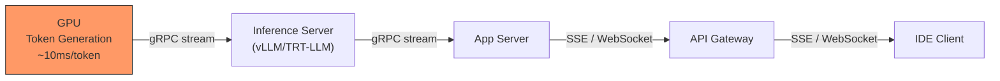

#### Protocol Choice: SSE vs WebSocket

| | Server-Sent Events (SSE) | WebSocket |
|---|---|---|
| **Direction** | Server → Client only | Bidirectional |
| **Resumability** | Built-in (Last-Event-ID) | Must implement manually |
| **HTTP compatibility** | Works with HTTP/2, CDNs, proxies | Requires upgrade, breaks some proxies |
| **Multiplexing** | Multiple SSE streams on one HTTP/2 connection | One logical connection |
| **Best for** | Completions (unidirectional stream) | Agent mode (bidirectional tool calls) |

**Decision:**
- **SSE** for completions (simple, unidirectional, H2-compatible).
- **WebSocket** for agent sessions (bidirectional: server streams tokens, client sends cancellation/tool confirmations).

#### Backpressure and Token Buffering

If the network is slower than token generation, tokens buffer on the server. With 175K concurrent completion streams:

```
Token generation rate: 50 tokens/sec per request
Token size: ~6 bytes average
Per-stream buffer: 50 × 6 = 300 bytes/sec (trivial)
Total buffer memory: 175K × 300 = 52.5 MB (negligible)
```

No backpressure concern for typical completions. For long agent responses (2000+ tokens), implement a per-stream buffer cap of 64KB with flow control.

---

### Deep Dive 7: Multi-Tenancy and Data Isolation

Every user's code is proprietary. Strict data isolation is non-negotiable.

#### Isolation Architecture

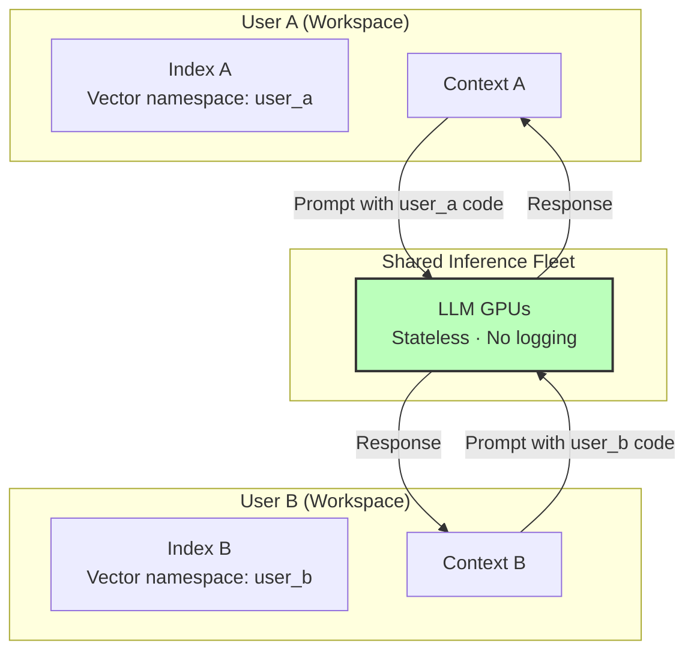

| Layer | Isolation Mechanism |
|---|---|
| **Vector DB** | Per-user namespace / tenant ID prefix on all keys. ACL enforcement at query time. |
| **KV Cache** | Per-session cache keyed by `session_id`. Evicted on session end. Never shared across users. |
| **LLM Inference** | Stateless — prompts flow through, no code is persisted. GPU memory cleared between requests (continuous batching handles this). |
| **Logs** | Code content is **never logged**. Only metadata (latency, token count, model version) is logged. |
| **Network** | All traffic encrypted with TLS 1.3. mTLS between internal services. |

#### Zero-Retention Policy

```
Data lifecycle:
  1. User code arrives via TLS → held in memory for request processing
  2. Context assembled in memory → sent to LLM inference
  3. LLM generates response in GPU memory → streamed back
  4. Request completes → all code content purged from memory
  5. No code is written to disk, logs, or telemetry
  
Retained (metadata only):
  - Request timestamp, latency, token counts
  - Model version, acceptance/rejection signal
  - Error codes (no error messages containing code)
```

---

## Step 5: Resilience, Security & Observability (38 – 43 min)

### Security Architecture

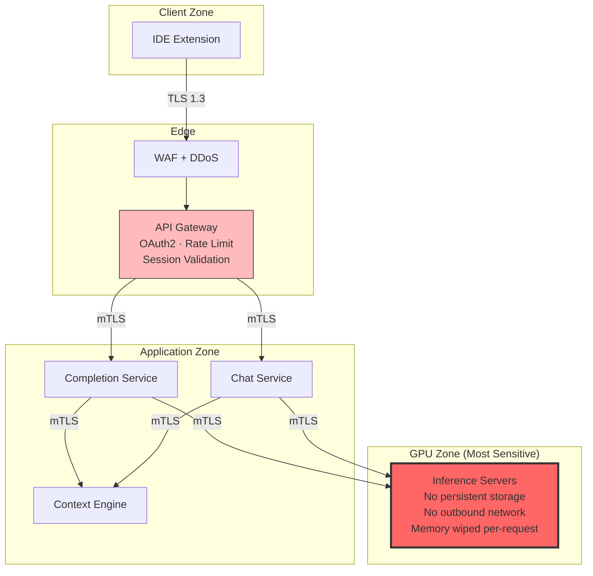

| Threat | Mitigation |
|---|---|
| **Prompt injection** (user code contains adversarial prompts) | Structured prompt templates with clear delimiters. Code is placed in `<user_code>` XML tags. System prompt is hardened against injection. |
| **Model exfiltration** | Models served behind inference API only. No direct GPU access. Model weights encrypted at rest. |
| **Cross-tenant data leak** | Per-user namespace isolation. Session-scoped KV caches. Zero-retention policy. |
| **Abuse (crypto mining via run_command)** | Commands sandboxed with cgroups + seccomp. CPU/memory/time limits. Network egress blocked for tool execution. |
| **Token theft** | Short-lived session tokens (1 hour). Refresh via OAuth2 PKCE. Token binding to device fingerprint. |

### Resilience

| Failure Mode | Impact | Mitigation |
|---|---|---|
| **LLM inference fleet partial failure** | Reduced throughput | Model router detects unhealthy instances via health checks. Auto-drain and re-route. Over-provision by 20%. |
| **Primary model unavailable** | No completions/chat | **Model fallback chain**: Primary (70B) → Secondary (30B) → Small (7B) → Cached responses → Graceful degradation message. |
| **Vector DB unavailable** | No semantic search | Fall back to keyword search (ripgrep) + local file context only. Quality degrades but system remains functional. |
| **Network partition (client ↔ server)** | No AI features | IDE continues functioning as a normal editor. Local completion cache serves recent suggestions. |
| **GPU OOM** | Individual request fails | Request-level memory budgeting. Reject requests with context > 100K tokens. Circuit breaker on inference errors. |

### Observability

| Metric | Description | Alert Threshold |
|---|---|---|
| **TTFT p50 / p99** | Time to first token (completions) | p50 > 200ms or p99 > 800ms |
| **Acceptance Rate** | % of shown completions accepted by user | < 20% (7-day rolling avg) |
| **GPU Utilization** | Across inference fleet | < 40% (over-provisioned, wasting $) or > 90% (throttling risk) |
| **Context Retrieval Latency** | Vector DB + assembly time | p99 > 100ms |
| **Agent Loop Length** | Avg tool calls per agent request | > 20 (possible stuck loop) |
| **Token Budget Usage** | Avg tokens per request by type | Completions > 8K or Chat > 100K (context bloat) |
| **Error Rate** | Failed requests / total | > 1% triggers P1 |
| **Request Cancellation Rate** | % of completion requests cancelled before response | > 70% (debounce too aggressive or inference too slow) |

---

## Step 6: Wrap-Up & Quantitative Review (43 – 45 min)

### Architecture Summary

| Requirement | How Addressed |
|---|---|
| **175K completion QPS** | Small 7B FIM model fleet with speculative decoding + prefix KV caching. Client debouncing + request cancellation reduces waste. |
| **TTFT < 200ms (completions)** | Prefix caching reuses 95% of KV computation. Speculative decoding 2–3× speedup. Local context assembly (no network hop for context). |
| **Codebase awareness** | Hybrid index: local AST-aware chunking + embedded vector DB. Semantic + keyword hybrid search with Reciprocal Rank Fusion. |
| **Agentic tool use** | LLM-driven tool loop with read/write/run/search tools. Sandboxed execution. Max 25 iterations with progressive context compression. |
| **Security / Privacy** | Zero-retention policy. Per-user namespace isolation. No code in logs. TLS everywhere. Hardened prompt templates. |
| **10M DAU** | Two-tier model architecture (7B for speed, 70B+ for quality). ~25K GPU fleet with continuous batching at 85% utilization. |

### Cost Optimization Levers

| Lever | Impact | Savings |
|---|---|---|
| **Prefix KV caching** | 3–5× fewer FLOPs per completion | ~60% compute reduction |
| **Speculative decoding** | 2–3× throughput improvement | ~50% fewer GPUs needed |
| **Client debouncing** | 60–70% fewer requests sent | Proportional compute savings |
| **Request cancellation** | Abort stale inferences immediately | ~30% GPU reclaim |
| **Smaller model for completions** | 7B vs 70B = 10× less compute | Dominant savings for 175K QPS path |
| **Prompt compression** | Remove redundant whitespace, comments | 10–20% token reduction |

### Key Risks

1. **Context quality is everything.** If retrieval returns irrelevant files, the LLM generates wrong code, users lose trust, and acceptance rate plummets. Continuous evaluation of retrieval quality is critical.
2. **GPU cost at scale.** ~25K GPUs at $2.50/hr = $1.5M/day. Every 10% efficiency gain saves $55M/year.
3. **Latency sensitivity.** Developers are extremely latency-sensitive. A 200ms→500ms regression in TTFT causes measurable drop in feature usage.

### Patterns Used

| Pattern | Where Applied |
|---|---|
| **[Pattern 01: Real-Time Updates](../Patterns/01_realtime_updates.md)** | SSE/WebSocket streaming of LLM tokens to IDE client |
| **[Pattern 04: Scaling Reads](../Patterns/04_scaling_reads.md)** | Local + server-side codebase index caching. Prefix KV cache for inference. |
| **[Pattern 07: Long-Running Tasks](../Patterns/07_long_running_tasks.md)** | Agentic loop with multi-turn tool calls, sandboxed command execution |
| **[Tech: Redis](../Key_Technologies/01-redis.md)** | Session state, recent context cache, rate limiting |
| **[Tech: Vector Databases](../Key_Technologies/12-vector-databases.md)** | Code embedding storage and ANN retrieval for semantic codebase search |
| **[Tech: Kafka](../Key_Technologies/03-kafka.md)** | Telemetry pipeline, index update events |
