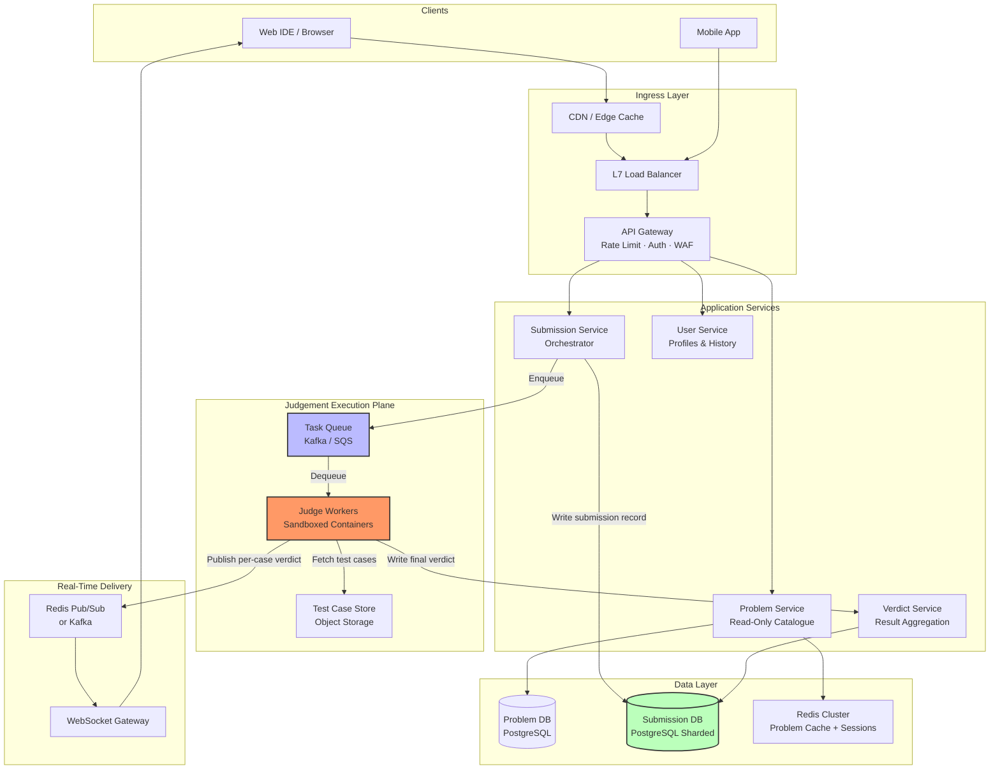
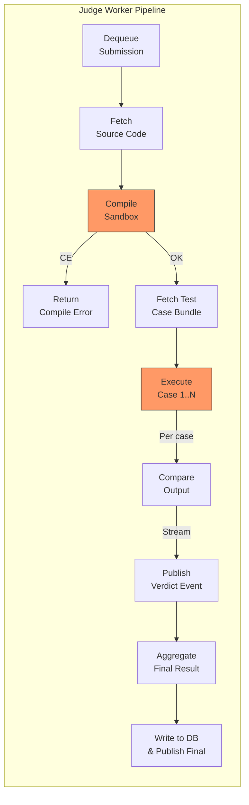
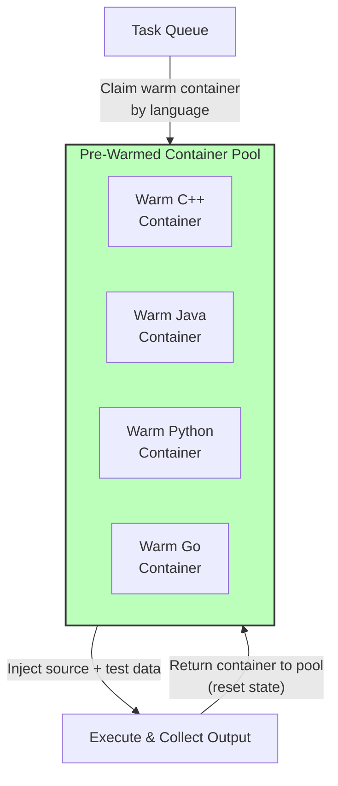
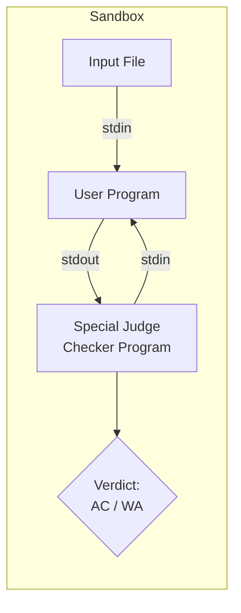
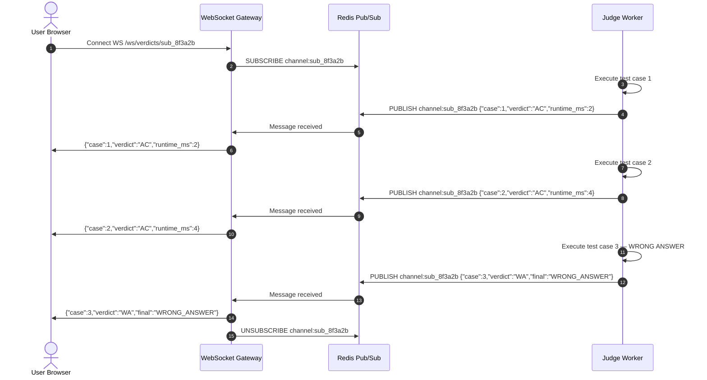
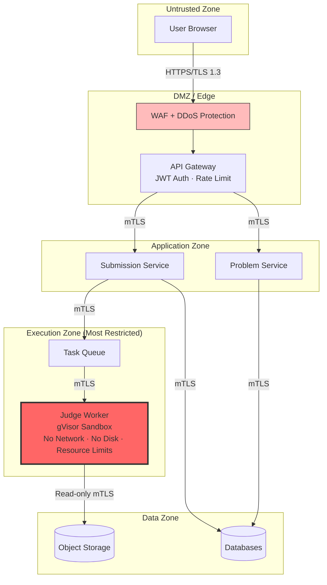

# System Design: Online Code Judge (LeetCode / HackerRank / Google Code Jam)

Design a production-grade **Online Code Judgement** platform that allows users to write code against programming problems, submit solutions, and receive automated verdicts (Accepted, Wrong Answer, Time Limit Exceeded, etc.) — all at Google scale.

---

## Step 1: Requirements (0 – 5 min)

### Functional Requirements

| # | User Journey | Description |
|---|---|---|
| **F1** | **Browse & Read Problems** | Users browse a catalogue of coding problems with descriptions, constraints, examples, and difficulty tags. |
| **F2** | **Write & Submit Code** | Users write code in a web IDE, select a language (C++, Java, Python, Go, Rust, …), and submit for judgement. |
| **F3** | **Automated Judgement** | System compiles the code, runs it against a hidden test suite, and returns a per-test-case verdict with overall result. |
| **F4** | **Real-Time Verdict Streaming** | Users see verdicts appear test-by-test in real time (not a single bulk response). |
| **F5** | **Submission History** | Users can view past submissions, verdicts, runtime statistics, and accepted solutions. |

**Explicitly out of scope:** Contests/leaderboard ranking, problem creation admin portal, plagiarism detection, code collaboration/multiplayer editing.

### Non-Functional Requirements

| Attribute | Target |
|---|---|
| **Scale** | 50M registered users, 5M DAU, peak during contests |
| **Throughput** | Sustain 10K concurrent submissions/sec during peak (contest spike) |
| **Latency** | Problem page load < 100ms (p99). Verdict returned within 10 seconds for typical problems (p99). |
| **Availability** | 99.95% SLA for problem browsing; 99.9% for judgement pipeline (degraded mode acceptable). |
| **Consistency** | Verdicts must be **strongly consistent** — a submission must never silently change verdict after delivery. |
| **Security** | User code is **untrusted and adversarial**. Must prevent: sandbox escape, resource abuse, network access, filesystem snooping. |
| **Multi-language** | Support ≥ 10 languages with per-language time/memory multipliers. |

---

## Step 2: Capacity Estimation (5 – 10 min)

### Submission Throughput

```
DAU = 5M
Avg submissions / user / day = 10
Daily submissions = 50M

Baseline QPS = 50M / 86,400 ≈ 580 submissions/sec
Peak QPS (contest spike, 20x) ≈ 10,000 submissions/sec
```

### Per-Submission Compute Budget

```
Avg test cases per problem   = 20
Avg execution time per case  = 200ms (with 2s hard cap)
Avg compile time             = 2s
Total wall-clock per submission ≈ 2s + (20 × 0.2s) = 6s
```

### Worker Pool Sizing (Peak)

$$\text{Workers needed} = \frac{\text{Peak QPS} \times \text{Avg execution time}}{\text{Parallelism per worker}} = \frac{10{,}000 \times 6\text{s}}{1} = 60{,}000 \text{ concurrent execution slots}$$

With container overcommit and 80% utilization target:

$$\text{Sandbox VMs/containers} \approx \lceil 60{,}000 / 0.8 \rceil = 75{,}000 \text{ containers at peak}$$

> [!IMPORTANT]
> This is the *dominant cost center* — the sandboxed execution fleet. At non-peak (580 QPS), we need only ~4,350 containers. **Auto-scaling on queue depth** is critical.

### Storage

```
Avg source code size         = 2 KB
Avg verdict metadata         = 500 bytes
Submission record            ≈ 3 KB

Storage/day  = 50M × 3 KB = 150 GB/day
Storage/year = 150 GB × 365 ≈ 55 TB/year
```

Problem assets (descriptions, images, editorial content): ~10 GB total (static, CDN-cached).

Test case data (inputs + expected outputs): ~500 GB total across all problems. Read-heavy, rarely mutated.

### Bandwidth

```
Ingress (submissions)  = 580 QPS × 2 KB = 1.16 MB/s baseline (trivial)
Egress (verdict pushes + problem reads) dominates:
  Problem page reads = 5M DAU × 20 pages/day / 86,400 ≈ 1,160 QPS × 50 KB ≈ 58 MB/s

CDN absorbs 95%+ of this. Origin bandwidth is manageable.
```

---

## Step 3: High-Level Design (10 – 18 min)

### Architecture Diagram



### Core API Contracts

#### 1. Submit Code

```http
POST /v1/submissions
Headers:
  Authorization: Bearer <JWT>
  X-Idempotency-Key: <UUID>
Request Body:
  {
    "problem_id": "two-sum",
    "language": "cpp",
    "source_code": "#include <vector>\nclass Solution { ... };"
  }
Response: 202 Accepted
  {
    "submission_id": "sub_8f3a2b",
    "status": "QUEUED",
    "ws_channel": "/ws/verdicts/sub_8f3a2b"
  }
```

#### 2. Get Submission Verdict (Polling Fallback)

```http
GET /v1/submissions/sub_8f3a2b
Response: 200 OK
  {
    "submission_id": "sub_8f3a2b",
    "status": "ACCEPTED",
    "runtime_ms": 12,
    "memory_kb": 5200,
    "test_results": [
      {"case_id": 1, "verdict": "AC", "runtime_ms": 2},
      {"case_id": 2, "verdict": "AC", "runtime_ms": 4},
      ...
    ],
    "submitted_at": "2026-05-28T17:00:00Z"
  }
```

#### 3. Real-Time Verdict Stream (WebSocket)

```
WS /ws/verdicts/sub_8f3a2b

Server pushes:
  {"case_id": 1, "verdict": "AC", "runtime_ms": 2}
  {"case_id": 2, "verdict": "AC", "runtime_ms": 4}
  ...
  {"final_verdict": "ACCEPTED", "runtime_ms": 12, "memory_kb": 5200}
```

#### 4. Get Problem Detail

```http
GET /v1/problems/two-sum
Response: 200 OK (Cacheable: max-age=3600)
  {
    "problem_id": "two-sum",
    "title": "Two Sum",
    "difficulty": "easy",
    "description_html": "...",
    "constraints": {"time_limit_ms": 2000, "memory_limit_mb": 256},
    "sample_test_cases": [
      {"input": "[2,7,11,15], 9", "expected_output": "[0,1]"}
    ],
    "tags": ["array", "hash-table"],
    "accepted_count": 3200000,
    "submission_count": 8500000
  }
```

### Core Database Schemas

#### Problems Table (PostgreSQL — single master, few thousand rows)

```sql
CREATE TABLE problems (
    id          VARCHAR(64)   PRIMARY KEY,        -- slug: "two-sum"
    title       VARCHAR(256)  NOT NULL,
    difficulty  VARCHAR(16)   NOT NULL,            -- easy, medium, hard
    description TEXT          NOT NULL,            -- Markdown/HTML
    constraints JSONB         NOT NULL,            -- {"time_limit_ms": 2000, "memory_limit_mb": 256}
    test_suite_path VARCHAR(512) NOT NULL,         -- S3 path to test case bundle
    tags        TEXT[]        NOT NULL DEFAULT '{}',
    accepted_count   BIGINT  DEFAULT 0,
    submission_count BIGINT  DEFAULT 0,
    is_active   BOOLEAN       DEFAULT TRUE,
    created_at  TIMESTAMPTZ   DEFAULT NOW(),
    updated_at  TIMESTAMPTZ   DEFAULT NOW()
);
CREATE INDEX idx_problems_difficulty ON problems (difficulty);
CREATE INDEX idx_problems_tags ON problems USING GIN (tags);
```

#### Submissions Table (PostgreSQL — sharded by `user_id`)

```sql
CREATE TABLE submissions (
    id          VARCHAR(64)   PRIMARY KEY,         -- Snowflake ID
    user_id     VARCHAR(64)   NOT NULL,            -- SHARD KEY
    problem_id  VARCHAR(64)   NOT NULL,
    language    VARCHAR(16)   NOT NULL,
    source_code TEXT          NOT NULL,
    status      VARCHAR(32)   NOT NULL,            -- QUEUED, COMPILING, RUNNING, ACCEPTED, WRONG_ANSWER, TLE, MLE, RE, CE, SE
    verdict     JSONB,                             -- Per-case results array
    runtime_ms  INT,
    memory_kb   INT,
    created_at  TIMESTAMPTZ   DEFAULT NOW()
);
-- Fast user history lookup (shard-local)
CREATE INDEX idx_submissions_user_problem ON submissions (user_id, problem_id, created_at DESC);
-- Analytics: problem acceptance rates (cross-shard query via async aggregation)
CREATE INDEX idx_submissions_problem_status ON submissions (problem_id, status);
```

---

## Step 4: Deep Dive — Scaling, Bottlenecks & Trade-Offs (18 – 38 min)

### Deep Dive 1: The Judgement Pipeline (The Core Bottleneck)

This is the heart of the system. A single submission traverses: **Queue → Compile → Execute per test case → Aggregate → Deliver verdict**.



#### Sandbox Execution — The Hardest Part

User code is **untrusted and adversarial**. The sandbox must prevent:

| Threat | Mitigation |
|---|---|
| **Fork bomb / infinite loop** | `cgroup` CPU limit (e.g., 2s wall-clock, 2s CPU-time hard kill via `SIGKILL`) |
| **Memory exhaustion** | `cgroup` memory limit (e.g., 256 MB + OOM killer) |
| **Filesystem access** | Read-only root filesystem. `tmpfs` for `/tmp` only. Mount only input/output files. |
| **Network access** | `seccomp` profile blocking all network syscalls (`socket`, `connect`, `bind`, `sendto`) |
| **Syscall abuse** | Strict `seccomp-bpf` allowlist: only `read`, `write`, `mmap`, `brk`, `exit_group`, etc. |
| **Process spawning** | `cgroup` PID limit (e.g., max 5 processes) |
| **Sandbox escape** | Run inside **gVisor (runsc)** or **Firecracker microVM** for kernel-level isolation |

#### Trade-Off: gVisor vs Firecracker vs Bare Containers

| | **gVisor (runsc)** | **Firecracker microVM** | **Bare Docker + seccomp** |
|---|---|---|---|
| **Isolation** | User-space kernel intercept. Strong. | Full VM-level isolation. Strongest. | Kernel-shared. Weakest. |
| **Startup time** | ~50–100ms | ~125ms (microVM boot) | ~10ms |
| **Overhead** | ~10–15% runtime penalty | ~5% runtime penalty | Negligible |
| **Syscall coverage** | Incomplete for some languages | Full Linux kernel | Full Linux kernel |
| **Best for** | Multi-tenant SaaS judges | Competition platforms, highest security | Internal trusted workloads only |

**Decision**: Use **gVisor** as default for general submissions (good isolation, low startup). For contest mode with adversarial participants, promote to **Firecracker** microVMs.

#### Execution Ordering Strategy — Short-Circuit Evaluation

Running all 20 test cases serially wastes compute if case 1 fails:

```
Strategy: Run test cases sequentially. On first WRONG_ANSWER / TLE / MLE / RE:
  → STOP execution immediately
  → Return verdict with the failing case number
  → Saves 50-80% of compute on failed submissions
```

For **Accepted** submissions where we need runtime/memory stats, run all cases and report the maximum.

#### Language-Specific Time Multipliers

Different languages have different constant-factor performance. To ensure fairness:

| Language | Time Multiplier | Memory Multiplier |
|---|---|---|
| C / C++ | 1.0× | 1.0× |
| Java | 2.0× | 2.0× |
| Python 3 | 5.0× | 2.0× |
| Go | 1.5× | 1.5× |
| Rust | 1.0× | 1.0× |
| JavaScript | 3.0× | 2.0× |

If a problem has a 2-second time limit in C++, Python submissions get $2 \times 5 = 10$ seconds.

---

### Deep Dive 2: Scaling the Execution Fleet

At peak (10K submissions/sec × 6s each = 60K concurrent executions), we need a massive, elastic container fleet.

#### Architecture: Pre-warmed Container Pool

Cold-starting a gVisor container with a language runtime takes 2–5 seconds. This is unacceptable at scale.



**How it works:**
1. Maintain a **pool of pre-booted, idle containers** per language, each with the compiler/runtime pre-loaded.
2. When a submission arrives, **claim** a warm container from the pool for its language.
3. **Inject** the source code file and test case input into the container via a mounted `tmpfs`.
4. Execute, collect output, compare against expected output.
5. **Reset** the container state (wipe `tmpfs`, reset cgroups counters) and return to pool.
6. If the pool is empty for a language, cold-start a new container (queue provides backpressure).

**Scaling signals (Kubernetes HPA or custom autoscaler):**

| Metric | Scale-Up Trigger | Scale-Down Trigger |
|---|---|---|
| Queue Depth per language | > 500 messages for 30s | < 50 messages for 5 min |
| Queue Message Age | Oldest message > 5s | Oldest message < 1s |
| Container pool utilization | > 85% claimed | < 30% claimed |

#### Multi-Region Deployment

```
                    ┌─────────────────┐
       US-West      │  Judge Fleet    │  ← Closest to user
       Cluster      │  10K containers │
                    └────────┬────────┘
                             │ Kafka partition routing
                    ┌────────┴────────┐
       US-East      │  Judge Fleet    │
       Cluster      │  10K containers │
                    └────────┬────────┘
                             │
                    ┌────────┴────────┐
       EU-West      │  Judge Fleet    │
       Cluster      │  8K containers  │
                    └─────────────────┘
```

Submissions are routed to the **nearest regional judge fleet** to minimise latency. Test case bundles are replicated to all regions via object storage replication (S3 cross-region).

---

### Deep Dive 3: Task Queue Design

#### Trade-Off: Kafka vs SQS vs Custom Priority Queue

| | **Kafka** | **SQS** | **Custom Redis Priority Queue** |
|---|---|---|---|
| **Ordering** | Per-partition FIFO | Best-effort FIFO | Strict priority ordering |
| **Scaling** | Excellent (partition-level) | Auto-scaling | Manual |
| **Priority support** | Via separate topics | Via separate queues | Native (sorted sets) |
| **Replay / audit** | Yes (retention-based) | No (consumed = deleted) | No |
| **Latency** | ~5ms | ~20–50ms | ~1ms |

**Decision**: **Kafka** with topic-per-region and partitions-per-language. Kafka's retention gives us replay capability for debugging and re-judging.

```
Topic: judge-submissions-us-west
  Partition 0: C++ submissions
  Partition 1: Java submissions
  Partition 2: Python submissions
  ...
```

#### Priority Lanes (Contest Mode)

During contests, we need two priority tiers:
1. **High-priority lane**: Contest submissions (strict SLA: verdict < 10s)
2. **Low-priority lane**: Practice submissions (best-effort: verdict < 30s)

Implemented via **separate Kafka topics** with dedicated consumer groups and fleet allocations:
- 70% of fleet allocated to high-priority during contests
- 30% allocated to low-priority
- Dynamically rebalanced when contest ends

---

### Deep Dive 4: Test Case Management

#### Storage Architecture

```
s3://judge-testcases/
  └── problems/
      └── two-sum/
          ├── manifest.json          # {"num_cases": 20, "version": 3, "checker": "exact_match"}
          ├── input/
          │   ├── 01.in              # Small cases first (for fast short-circuit)
          │   ├── 02.in
          │   └── 20.in             # Large stress test last
          └── output/
              ├── 01.out
              ├── 02.out
              └── 20.out
```

#### Caching Strategy

Test cases are **read-heavy, write-rare** (only modified when problem authors update them). This is a perfect fit for aggressive caching:

1. **Layer 1 — Local disk on judge workers**: Each worker node has an NVMe SSD cache of recently-used test case bundles. Cache key: `{problem_id}:{version}`. Eviction: LRU with 50 GB cap.
2. **Layer 2 — Regional object storage**: S3 or GCS with cross-region replication. Source of truth.
3. **Invalidation**: When a problem's test suite is updated, publish a `test-suite-updated` event via Kafka. Workers evict the stale version from local cache on next fetch.

```
Judge Worker receives submission for "two-sum":
  1. Check local NVMe cache for "two-sum:v3" → HIT → use cached bundle
  2. MISS → fetch from regional S3 → cache locally → execute
```

This reduces S3 read traffic by 95%+ (most problems are submitted repeatedly).

---

### Deep Dive 5: Verdict Comparison — Custom Checkers

Not all problems use simple exact-match comparison. Common verdict modes:

| Mode | Description | Example |
|---|---|---|
| **Exact Match** | Byte-for-byte comparison after trimming trailing whitespace | Most algorithmic problems |
| **Float Tolerance** | Accept if $|output - expected| < \epsilon$ (e.g., $10^{-6}$) | Geometry, probability problems |
| **Special Judge** | A custom checker program validates the output | "Print any valid answer" problems |
| **Interactive** | Judge program interacts with user program via stdin/stdout pipes | Binary search games, adaptive queries |

**Special Judge** and **Interactive** judges run as separate sandboxed processes alongside the user's program. They must be equally sandboxed (they're authored by problem setters, not end users, but defense-in-depth applies).



---

### Deep Dive 6: Real-Time Verdict Delivery

Users want to see verdicts appear test-by-test live. This combines **Pattern 01 (Real-Time Updates)** with **Pattern 07 (Long-Running Tasks)**.

#### Architecture



**Trade-off: Redis Pub/Sub vs Kafka for real-time delivery:**
- **Redis Pub/Sub**: Fire-and-forget. If the WebSocket Gateway is briefly disconnected, messages are lost. But per-case verdicts are ephemeral (final verdict is persisted in DB). Simpler. Lower latency (~1ms).
- **Kafka**: Durable. But adds ~5ms latency and is overkill for ephemeral per-case updates.

**Decision**: Redis Pub/Sub for per-case streaming. The **final verdict** is always written to the database. If the WebSocket disconnects mid-stream, the client falls back to polling `GET /v1/submissions/{id}`.

#### WebSocket Gateway Scaling

At 10K submissions/sec with average 6s execution, we have ~60K concurrent WebSocket connections (one per active submission).

- Each WebSocket gateway node can handle ~50K concurrent connections.
- 2–3 gateway nodes per region with L4 load balancing (sticky by connection).
- Gateway nodes subscribe to Redis Pub/Sub channels dynamically as clients connect.

---

### Deep Dive 7: Problem Browsing — Scaling Reads

Problem browsing is **extremely read-heavy** (100:1 read-to-write ratio). Only a few thousand problems exist.

#### Caching Strategy (Three Layers)

```
Layer 1: CDN Edge Cache (CloudFlare / Fastly)
  └── Cache problem pages with max-age=3600, stale-while-revalidate=86400
  └── 95%+ of problem page reads served from CDN edge

Layer 2: Redis Cluster
  └── Full problem catalogue cached in Redis as JSON blobs
  └── Key: problem:{problem_id}  TTL: 1 hour
  └── Problem list with filtering cached as sorted sets by difficulty

Layer 3: PostgreSQL (Source of Truth)
  └── Single master with 2 read replicas
  └── Only hit on cache miss (~0.1% of requests)
```

Acceptance rate counters (`accepted_count`, `submission_count`) are **eventually consistent**: updated via async batch aggregation from the submission database every 60 seconds.

---

### Deep Dive 8: Re-Judging at Scale

When a problem's test cases are updated or a bug is found in the judge, we must **re-judge** thousands of submissions:

```
Scenario: Problem "two-sum" test cases updated.
  Total historical submissions: 8.5M
  Re-judge all ACCEPTED submissions: ~3.2M

  At 10K submissions/sec capacity: 320 seconds (5.3 minutes) to re-judge all
  At reduced priority (1K/sec): 53 minutes
```

**Implementation:**
1. Trigger re-judge via admin API → emits a `re-judge-batch` event.
2. A batch processor reads all affected submission IDs from the database.
3. Submissions are re-enqueued on the **low-priority Kafka topic** to avoid impacting live submissions.
4. Results overwrite the existing verdict in the submission database.
5. Users are notified via email/notification if their verdict changed (e.g., AC → WA).

---

## Step 5: Resilience, Security & Observability (38 – 43 min)

### Security Architecture (Defense in Depth)



#### Source Code Sanitization

Before enqueueing, validate the submission:
- **Max source code size**: 64 KB (reject larger submissions immediately)
- **Language allowlist**: Only accept declared languages from the supported set
- **No binary uploads**: Source code must be valid UTF-8 text
- **Rate limiting**: Max 10 submissions per user per minute (sliding window via Redis)

#### Sandbox Security (The Crown Jewel)

```
┌──────────────────────────────────────────────────────────┐
│  Host OS (Kubernetes Node)                               │
│  ┌────────────────────────────────────────────────────┐  │
│  │  gVisor (runsc) — User-Space Kernel                │  │
│  │  ┌──────────────────────────────────────────────┐  │  │
│  │  │  Container                                   │  │  │
│  │  │  ┌────────────────────────────────────────┐  │  │  │
│  │  │  │  seccomp-bpf profile:                 │  │  │  │
│  │  │  │  ALLOW: read, write, mmap, brk,       │  │  │  │
│  │  │  │         exit_group, clock_gettime      │  │  │  │
│  │  │  │  DENY:  socket, connect, fork (>5),   │  │  │  │
│  │  │  │         execve, ptrace, mount          │  │  │  │
│  │  │  │                                        │  │  │  │
│  │  │  │  cgroup limits:                        │  │  │  │
│  │  │  │  • CPU: 2 seconds wall-clock           │  │  │  │
│  │  │  │  • Memory: 256 MB hard limit           │  │  │  │
│  │  │  │  • PIDs: max 5                         │  │  │  │
│  │  │  │  • Disk: 10 MB tmpfs only              │  │  │  │
│  │  │  │  • Network: NONE                       │  │  │  │
│  │  │  │                                        │  │  │  │
│  │  │  │  Filesystem: read-only rootfs          │  │  │  │
│  │  │  │  + tmpfs /sandbox (source + I/O)       │  │  │  │
│  │  │  └────────────────────────────────────────┘  │  │  │
│  │  └──────────────────────────────────────────────┘  │  │
│  └────────────────────────────────────────────────────┘  │
└──────────────────────────────────────────────────────────┘
```

### Resilience Guardrails

| Failure Mode | Mitigation |
|---|---|
| **Judge worker crash mid-execution** | Kafka consumer offset not committed → message redelivered to another worker. Submission status remains `RUNNING` → timeout watchdog marks as `SYSTEM_ERROR` after 60s and re-enqueues once. |
| **Verdict DB write failure** | Worker retries with exponential backoff. Idempotent write: `INSERT ... ON CONFLICT (id) DO UPDATE SET status = $1 WHERE status != 'ACCEPTED'`. |
| **Kafka broker failure** | Multi-broker cluster with replication factor 3, `min.insync.replicas=2`. Producers use `acks=all`. |
| **Redis Pub/Sub node failure** | Clients fall back to polling. Redis Cluster with automatic failover. Ephemeral data only — no durability needed. |
| **Contest traffic spike (20x)** | Pre-scale execution fleet 30 minutes before contest start based on registration count. Queue absorbs burst. Degrade practice submissions to lower priority. |
| **Poison pill submission (crashes compiler)** | Max 3 retries per submission. After exhaustion → `SYSTEM_ERROR` verdict + alert to on-call. Submission moved to DLQ. |

### Observability

| Metric | Description | Alert Threshold |
|---|---|---|
| **Queue Depth** | Pending submissions per language partition | > 5,000 for > 30s |
| **Verdict Latency p99** | End-to-end time from submit to final verdict | > 15s |
| **Sandbox OOM Rate** | % of executions killed by OOM | > 20% (may indicate limit misconfiguration) |
| **Compilation Failure Rate** | % of submissions with CE verdict | > 60% (may indicate toolchain issue) |
| **System Error Rate** | % of submissions with SE verdict | > 1% triggers P1 alert |
| **WebSocket Connection Count** | Active WS connections per gateway | > 80% of capacity |
| **Test Case Cache Hit Rate** | Local NVMe cache hits / total fetches | < 80% (cache may be too small) |

**Distributed Tracing**: Inject OpenTelemetry `trace_id` at API Gateway. Propagate through Kafka message headers into judge workers. Trace the full lifecycle: `Submit → Queue Wait → Compile → Execute × N → Verdict Write → WS Delivery`.

---

## Step 6: Wrap-Up & Quantitative Review (43 – 45 min)

### Architecture Summary Against Requirements

| Requirement | How Addressed |
|---|---|
| **10K peak submissions/sec** | Kafka partitioned queue + auto-scaling gVisor container fleet (75K containers at peak). Short-circuit evaluation saves 50–80% compute. |
| **Verdict < 10s (p99)** | Pre-warmed container pool eliminates cold-start. Local NVMe test case cache. Short-circuit on first failure. |
| **50M users, 5M DAU** | Problem reads via CDN (95% cache hit). Submissions DB sharded by `user_id`. |
| **Security (untrusted code)** | gVisor sandbox + seccomp-bpf + cgroup resource limits + no network + read-only filesystem. Defense-in-depth with Firecracker option. |
| **Real-time verdicts** | Redis Pub/Sub → WebSocket Gateway with polling fallback. |
| **Strong consistency for verdicts** | Idempotent DB writes. Kafka `acks=all` with replication. No verdict mutation after delivery. |
| **Multi-language** | Per-language Kafka partitions, pre-warmed container pools, language-specific time/memory multipliers. |

### Key Risks & Future Work

1. **Interactive problems** add bidirectional I/O complexity between judge and user processes — requires careful pipe management and deadlock prevention.
2. **Cost optimization**: At 75K containers peak, compute cost is significant. Spot/preemptible instances for practice submissions can reduce cost by 60–70%.
3. **Plagiarism detection**: Out of scope, but could be added as an async post-processing pipeline using code similarity hashing (Moss/JPlag style) on accepted submissions.

### Patterns Used in This Design

| Pattern | Where Applied |
|---|---|
| **[Pattern 01: Real-Time Updates](../Patterns/01_realtime_updates.md)** | WebSocket verdict streaming via Redis Pub/Sub |
| **[Pattern 04: Scaling Reads](../Patterns/04_scaling_reads.md)** | CDN + Redis cache for problem catalogue |
| **[Pattern 05: Scaling Writes](../Patterns/05_scaling_writes.md)** | Kafka-buffered submission ingestion, sharded submission DB |
| **[Pattern 07: Long-Running Tasks](../Patterns/07_long_running_tasks.md)** | Asynchronous judge worker execution with queue backpressure |