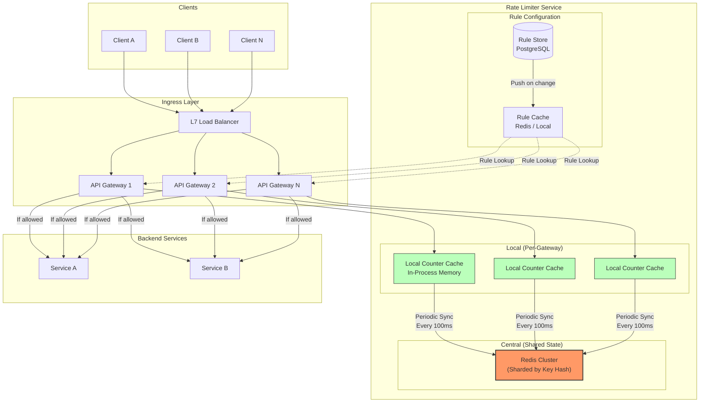
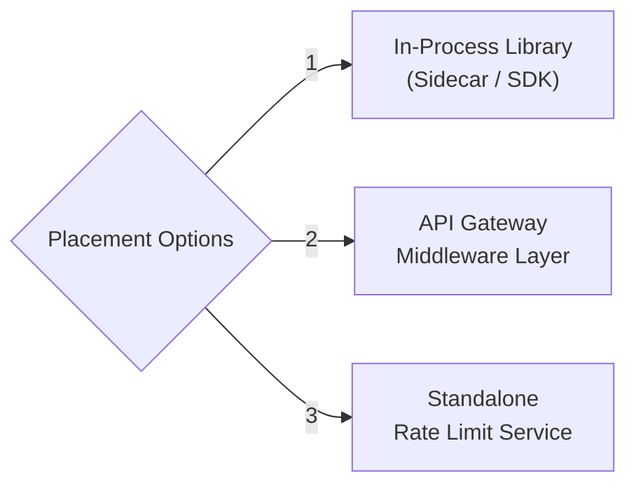
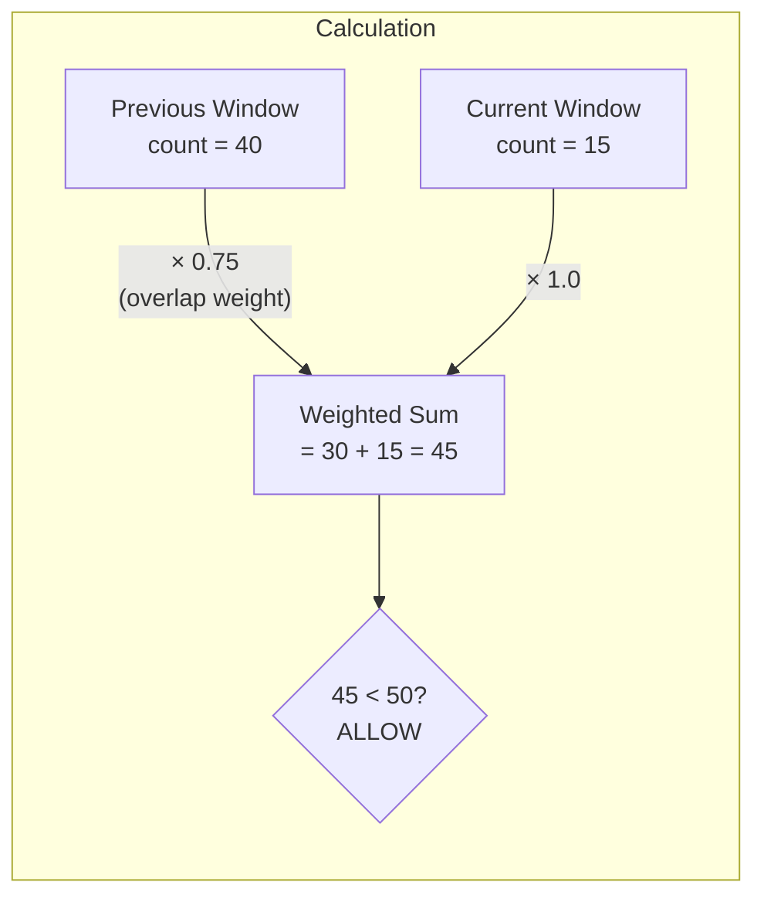
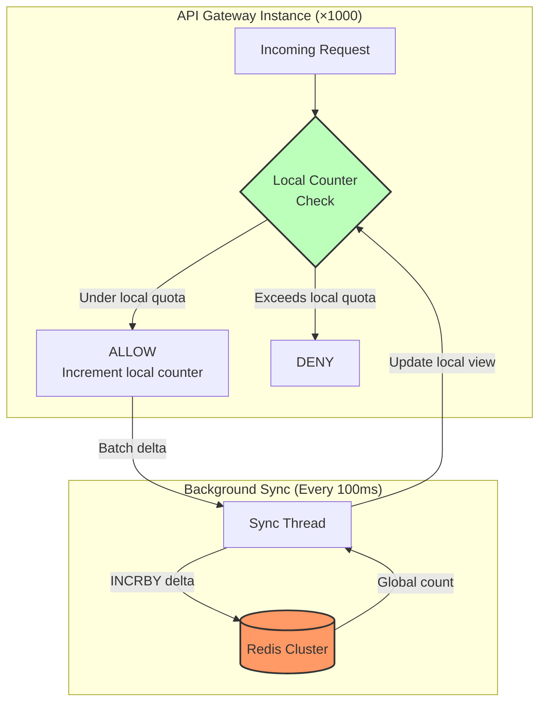
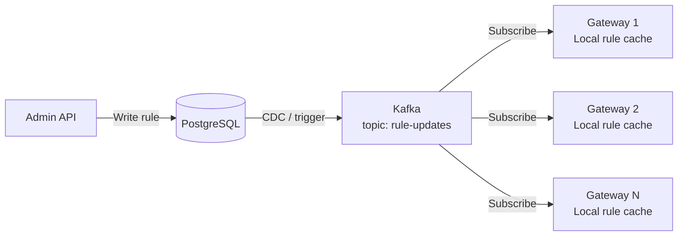
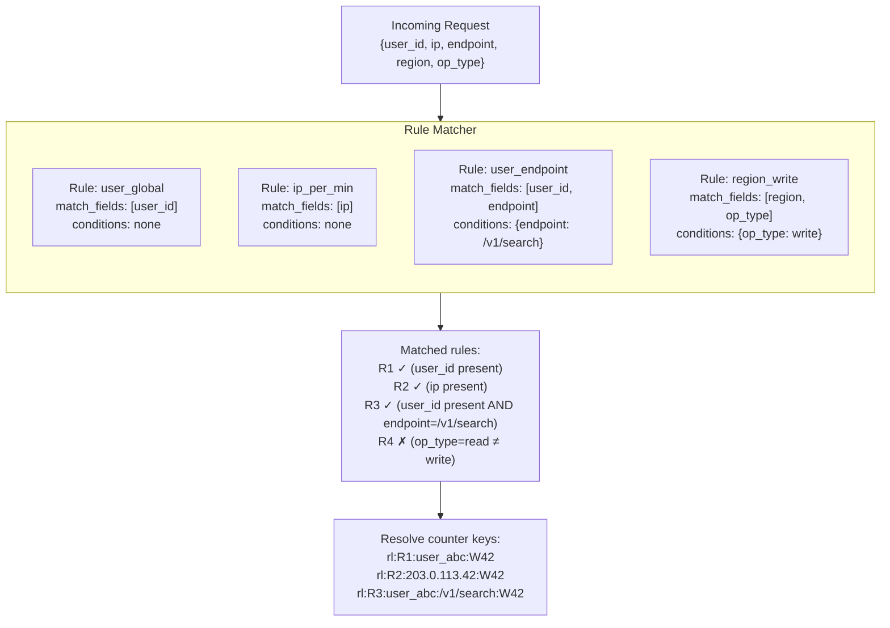
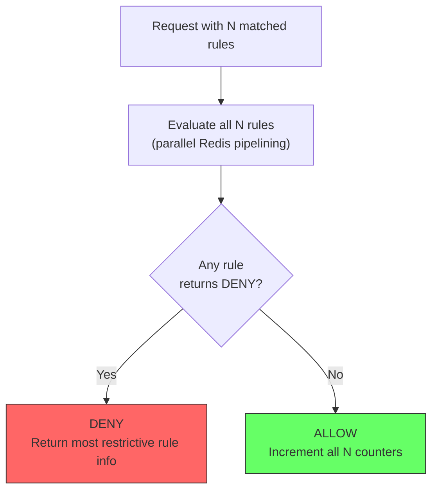
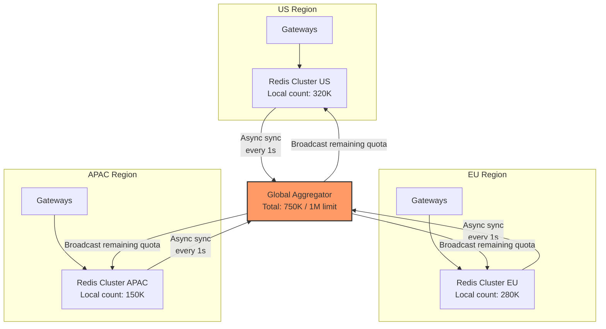
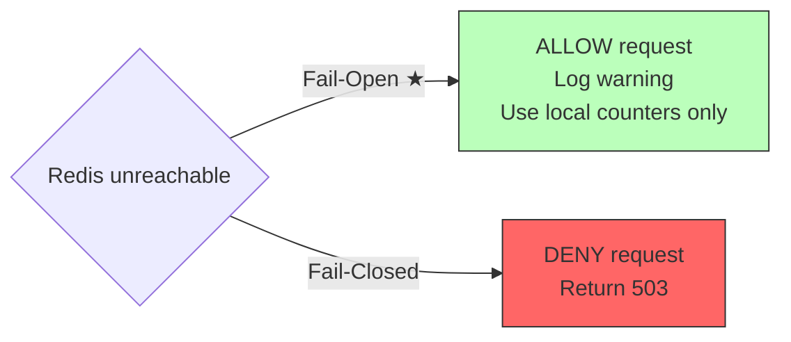

# System Design: Distributed Rate Limiter

Design a production-grade **distributed rate limiter** for a backend service at Google scale — capable of enforcing per-key limits across a fleet of application servers, and extensible to multi-field composite rules.

---

## Step 1: Requirements (0 – 5 min)

### Functional Requirements

| # | Requirement | Description |
|---|---|---|
| **F1** | **Single-Key Rate Limiting** | Limit requests by a single key — user ID, IP address, API key, or endpoint — with configurable thresholds (e.g., 100 req/min per user). |
| **F2** | **Multi-Field Composite Rules** | A single request carries multiple fields (user ID, IP, endpoint, region, operation type). Different rate-limit rules may apply to different fields or *combinations* of fields independently. |
| **F3** | **Rule Configuration** | Operators define rules declaratively (e.g., "user X: 1000 req/min on endpoint /search"). Rules can be added, updated, and deleted at runtime without redeployment. |
| **F4** | **Accept / Reject Decision** | For each inbound request, return an allow/deny decision plus standard rate-limit headers (`X-RateLimit-Limit`, `X-RateLimit-Remaining`, `X-RateLimit-Reset`). |
| **F5** | **Quota Reporting** | Callers can query their current usage against each applicable limit. |

**Explicitly out of scope:** DDoS mitigation at the network (L3/L4) layer, billing / metering, abuse detection / ML-based anomaly scoring.

### Non-Functional Requirements

| Attribute | Target |
|---|---|
| **Scale** | 10M+ QPS globally (Google-scale API gateway fronting all services) |
| **Latency** | Rate-limit check must add **< 2ms p99** to request latency |
| **Availability** | 99.99% — the limiter must never be a single point of failure |
| **Consistency** | **Near-exact** under normal conditions; **best-effort** under partition — allow slight over-admission rather than false rejections |
| **Fail-Open** | If the rate-limit backend is unreachable, **allow** the request (fail-open). Never block legitimate traffic because the limiter itself is down. |
| **Multi-Region** | Work across globally distributed data centers with per-region and global limits. |

> [!IMPORTANT]
> **The core design tension**: Accuracy (exact counting) requires centralized state, but centralization kills latency and availability at 10M QPS. Every design choice in this document navigates this tension.

---

## Step 2: Capacity Estimation (5 – 10 min)

### Throughput

```
Global QPS           = 10,000,000 requests/sec
Rate-limit checks    = 10M QPS (one check per inbound request, minimum)
With multi-field rules: each request may trigger 3–5 rule evaluations
Effective rule-check QPS = 10M × 4 (avg) = 40M rule-checks/sec
```

### State Size

```
Unique rate-limit keys (active in any window):
  Users:      100M active users
  IPs:        50M unique IPs / day
  Endpoints:  ~1,000
  Composite:  User × Endpoint ≈ 100M × 10 hot endpoints = 1B combinations (but sparse)
  
Active counters (keys with traffic in current window):
  At any given second: ~20M active counter keys
  
Per-counter state:
  Sliding window log: ~64 bytes (key + count + window timestamps)
  Total active state: 20M × 64 bytes ≈ 1.28 GB
```

> [!TIP]
> 1.28 GB fits comfortably in-memory on a single Redis node. But 10M QPS cannot be served by a single Redis instance (~100K–300K ops/sec per node). We need a **sharded cluster** of 50–100 nodes, or a fundamentally different architecture.

### Network

```
Per rate-limit check payload: ~200 bytes (key + rule ID + timestamp)
Ingress: 40M checks/sec × 200 bytes = 8 GB/s
```

This is substantial. **Co-locating** rate-limit state with the application server (local counters + periodic sync) dramatically reduces network traffic.

---

## Step 3: High-Level Design (10 – 18 min)

### Architecture Diagram



### Where Does the Rate Limiter Live?



| Option | Latency | Accuracy | Operational Complexity |
|---|---|---|---|
| **In-process library** | ~0.01ms (local memory) | Low (per-instance only) | Low |
| **API Gateway middleware** | ~0.5ms (local + sync) | High (centralized sync) | Medium |
| **Standalone service** | ~2–5ms (network hop) | Highest (single source of truth) | High |

**Decision**: **Hybrid — API Gateway middleware with local counters + periodic central sync.** This gives us sub-millisecond local decisions with near-exact global accuracy via background synchronization to a Redis cluster.

### Core API Contracts

#### 1. Check Rate Limit (Internal — called per request)

```http
POST /v1/ratelimit/check
Headers:
  X-Request-ID: <UUID>
Request Body:
  {
    "descriptors": [
      {"key": "user_id",   "value": "user_abc"},
      {"key": "ip",        "value": "203.0.113.42"},
      {"key": "endpoint",  "value": "/v1/search"},
      {"key": "region",    "value": "us-east"},
      {"key": "op_type",   "value": "read"}
    ]
  }
Response: 200 OK
  {
    "overall_decision": "ALLOW",
    "rule_results": [
      {
        "rule_id": "rule_user_global",
        "key": "user_id:user_abc",
        "decision": "ALLOW",
        "limit": 1000,
        "remaining": 842,
        "reset_at": "2026-05-28T17:01:00Z"
      },
      {
        "rule_id": "rule_ip_per_min",
        "key": "ip:203.0.113.42",
        "decision": "ALLOW",
        "limit": 500,
        "remaining": 312,
        "reset_at": "2026-05-28T17:01:00Z"
      },
      {
        "rule_id": "rule_user_endpoint",
        "key": "user_id:user_abc:endpoint:/v1/search",
        "decision": "ALLOW",
        "limit": 100,
        "remaining": 67,
        "reset_at": "2026-05-28T17:01:00Z"
      }
    ]
  }
```

When **any** rule returns `DENY`, the overall decision is `DENY` (logical AND — most restrictive wins).

#### 2. Configure Rate Limit Rule (Admin API)

```http
POST /v1/ratelimit/rules
Headers:
  Authorization: Bearer <admin-JWT>
Request Body:
  {
    "rule_id": "rule_user_search",
    "description": "Per-user search rate limit",
    "match": {
      "fields": ["user_id", "endpoint"],
      "endpoint_value": "/v1/search"
    },
    "key_template": "user_id:{user_id}:endpoint:/v1/search",
    "limit": {
      "requests": 100,
      "window": "1m",
      "algorithm": "sliding_window_counter"
    },
    "action": "DENY",
    "priority": 10
  }
Response: 201 Created
```

#### 3. Query Current Usage

```http
GET /v1/ratelimit/usage?key=user_id:user_abc
Response: 200 OK
  {
    "key": "user_id:user_abc",
    "rules": [
      {"rule_id": "rule_user_global", "used": 158, "limit": 1000, "window": "1m", "reset_at": "..."},
      {"rule_id": "rule_user_search", "used": 33, "limit": 100, "window": "1m", "reset_at": "..."}
    ]
  }
```

### Response Headers (RFC 6585 / draft-ietf-httpapi-ratelimit-headers)

When a request is rate-limited, the API Gateway injects:

```http
HTTP/1.1 429 Too Many Requests
X-RateLimit-Limit: 100
X-RateLimit-Remaining: 0
X-RateLimit-Reset: 1716922860
Retry-After: 23
```

---

## Step 4: Deep Dive — Algorithms, Scaling & Trade-Offs (18 – 38 min)

### Deep Dive 1: Rate Limiting Algorithms

This is the foundation. There are four major algorithms, each with distinct trade-offs:

#### Algorithm 1: Fixed Window Counter

```
Window: [T₀, T₀+60s)  →  counter = 0
Each request: counter++
If counter > limit: REJECT

Timeline:
|-------- Window 1 --------|-------- Window 2 --------|
0         30         60         90         120
          ^^^50 req^^^  ^^^50 req^^^
          (All 100 requests arrive at the boundary)
```

**Problem — Boundary Burst**: A user sends 50 requests at second 59 and 50 more at second 61. Both pass (each window sees only 50), but 100 requests arrive in a 2-second span — **2× the intended rate**.

| Pros | Cons |
|---|---|
| Trivial to implement: single counter per key | Boundary burst allows 2× the limit at window edges |
| O(1) memory per key | Abrupt counter resets cause traffic spikes |
| Fast: single `INCR` operation | |

**Redis implementation:**

```lua
-- Fixed Window Counter (Lua script for atomicity)
local key = KEYS[1]
local limit = tonumber(ARGV[1])
local window = tonumber(ARGV[2])  -- seconds

local current = redis.call("INCR", key)
if current == 1 then
    redis.call("EXPIRE", key, window)
end

if current > limit then
    return 0  -- DENY
else
    return 1  -- ALLOW
end
```

---

#### Algorithm 2: Sliding Window Log

Maintain a **sorted set of timestamps** for every request from each key. On each new request, remove timestamps outside the window, count remaining entries.

```
Window size: 60s     Limit: 5 req/min

Sorted set for user_abc:
  [T-80, T-55, T-30, T-20, T-10, T-5]
                 ↓ Remove expired (T-80, T-55)
  [T-30, T-20, T-10, T-5]  →  count=4  →  ALLOW (4 < 5)
  Add T-0:
  [T-30, T-20, T-10, T-5, T-0]  →  count=5
```

| Pros | Cons |
|---|---|
| **Exact** — no boundary burst problem | O(N) memory per key (stores every timestamp) |
| Smooth, precise rate enforcement | Expensive at high QPS: 10K req/sec/key = 600K entries per minute |

**Redis implementation:**

```lua
-- Sliding Window Log (Lua script)
local key = KEYS[1]
local limit = tonumber(ARGV[1])
local window = tonumber(ARGV[2])  -- milliseconds
local now = tonumber(ARGV[3])

-- Remove expired entries
redis.call("ZREMRANGEBYSCORE", key, 0, now - window)

-- Count current entries
local count = redis.call("ZCARD", key)

if count >= limit then
    return 0  -- DENY
end

-- Add current request
redis.call("ZADD", key, now, now .. ":" .. math.random(1000000))
redis.call("PEXPIRE", key, window)

return 1  -- ALLOW
```

**Verdict**: Too memory-heavy for Google scale. A user making 1000 req/min stores 1000 sorted set entries. With 20M active keys, that's 20 billion entries — **not feasible**.

---

#### Algorithm 3: Sliding Window Counter (★ Recommended)

A hybrid that combines the **memory efficiency** of fixed windows with the **smoothness** of sliding windows. Use two adjacent fixed-window counters and interpolate.

```
Current time: T = 75s into the minute
Previous window [0, 60): count_prev = 40
Current window [60, 120): count_curr = 15

Overlap ratio = (60 - (75 - 60)) / 60 = 45/60 = 0.75

Weighted count = count_prev × 0.75 + count_curr
               = 40 × 0.75 + 15
               = 30 + 15 = 45

If limit = 50: ALLOW (45 < 50)
```



| Pros | Cons |
|---|---|
| O(1) memory per key (just 2 counters) | ~0.003% error rate (Cloudflare measurement) — practically exact |
| Smooth — no boundary burst | Slightly more complex than fixed window |
| Fast: 2 `GET` + 1 `INCR` | |

**Redis implementation:**

```lua
-- Sliding Window Counter (Lua script — atomic)
local key_prev = KEYS[1]        -- "rl:{key}:{prev_window_id}"
local key_curr = KEYS[2]        -- "rl:{key}:{curr_window_id}"
local limit = tonumber(ARGV[1])
local window = tonumber(ARGV[2])       -- window size in seconds
local now = tonumber(ARGV[3])          -- current epoch seconds

local window_id = math.floor(now / window)
local window_start = window_id * window
local elapsed = now - window_start
local weight_prev = (window - elapsed) / window

local count_prev = tonumber(redis.call("GET", key_prev) or "0")
local count_curr = tonumber(redis.call("GET", key_curr) or "0")

local weighted = math.floor(count_prev * weight_prev) + count_curr

if weighted >= limit then
    return {0, limit - weighted, window_start + window}  -- DENY, remaining, reset
end

-- Increment current window
redis.call("INCR", key_curr)
redis.call("EXPIRE", key_curr, window * 2)  -- keep for 2 windows

return {1, limit - weighted - 1, window_start + window}  -- ALLOW, remaining, reset
```

**This is the algorithm we use for Part 1 and Part 2.**

---

#### Algorithm 4: Token Bucket

A bucket holds up to `B` tokens. Tokens are added at a fixed rate `R` tokens/sec. Each request consumes 1 token. If the bucket is empty, reject.

```
Bucket: capacity=10, refill_rate=2/sec

Time 0:   tokens=10   → Request arrives → tokens=9  (ALLOW)
Time 0.5: tokens=10   → (refilled 1, capped at 10)
Time 5:   tokens=10   → Burst of 10 requests → tokens=0  (all ALLOW)
Time 5.5: tokens=1    → Request arrives → tokens=0  (ALLOW)
Time 5.5: tokens=0    → Request arrives → DENY
```

| Pros | Cons |
|---|---|
| Allows controlled bursts (up to bucket capacity) | Two parameters to tune (rate + burst) — more complex for operators |
| Smooth long-term rate | Burst capacity can be confusing ("my limit is 100/min but I got 150 through?") |
| Used by AWS API Gateway, Stripe | |

**Lazy refill implementation** (no background timer needed):

```lua
-- Token Bucket (Lua script — lazy refill)
local key = KEYS[1]
local capacity = tonumber(ARGV[1])     -- max tokens (burst size)
local refill_rate = tonumber(ARGV[2])  -- tokens per second
local now = tonumber(ARGV[3])          -- current time (ms precision)
local cost = tonumber(ARGV[4]) or 1    -- tokens consumed per request

-- Get current state
local data = redis.call("HMGET", key, "tokens", "last_refill")
local tokens = tonumber(data[1]) or capacity
local last_refill = tonumber(data[2]) or now

-- Calculate refill
local elapsed = (now - last_refill) / 1000  -- seconds
local new_tokens = math.min(capacity, tokens + elapsed * refill_rate)

-- Try to consume
if new_tokens >= cost then
    new_tokens = new_tokens - cost
    redis.call("HMSET", key, "tokens", new_tokens, "last_refill", now)
    redis.call("PEXPIRE", key, math.ceil(capacity / refill_rate) * 1000 + 1000)
    return {1, math.floor(new_tokens)}  -- ALLOW, remaining
else
    -- Calculate wait time until enough tokens
    local wait_ms = math.ceil((cost - new_tokens) / refill_rate * 1000)
    redis.call("HMSET", key, "tokens", new_tokens, "last_refill", now)
    redis.call("PEXPIRE", key, math.ceil(capacity / refill_rate) * 1000 + 1000)
    return {0, wait_ms}  -- DENY, retry_after_ms
end
```

---

#### Algorithm Comparison Matrix

| | Fixed Window | Sliding Log | Sliding Window Counter | Token Bucket |
|---|---|---|---|---|
| **Memory / key** | O(1) — 1 counter | O(N) — N timestamps | O(1) — 2 counters | O(1) — 2 fields |
| **Accuracy** | Poor (2× burst) | Exact | ~99.997% | Exact (different semantics) |
| **Burst handling** | Allows 2× at boundary | No burst allowed | Minimal burst (~0.003%) | Configurable burst (capacity param) |
| **Redis ops / check** | 1 INCR | 1 ZREMRANGEBYSCORE + 1 ZCARD + 1 ZADD | 2 GET + 1 INCR | 1 HMGET + 1 HMSET |
| **Best for** | Simple, low-stakes limits | Strict compliance (finance) | **General-purpose (★ default)** | APIs with burst tolerance |

**Decision**: **Sliding Window Counter** as the default. **Token Bucket** offered as an opt-in alternative for rules that need explicit burst configuration.

---

### Deep Dive 2: Distributed Architecture — The Hybrid Model

At 10M QPS, a pure centralized Redis check per request is infeasible:

$$\text{Redis cluster throughput} \approx 100 \text{ nodes} \times 200\text{K ops/sec} = 20\text{M ops/sec}$$

This *could* work but puts enormous pressure on the Redis cluster and adds 1–2ms per request. Instead, we use a **two-tier hybrid** model:



#### How Local Quota Splitting Works

If a global limit is 1000 req/min and there are 10 gateway instances, each instance gets a **local quota share**:

$$\text{Local quota} = \frac{\text{Global limit}}{\text{Num instances}} = \frac{1000}{10} = 100 \text{ req/min per instance}$$

**Problem**: Traffic is rarely evenly distributed. User A's requests may all hit gateway instance 3.

**Solution — Adaptive quota redistribution:**

1. Every sync cycle (100ms), each gateway reports its usage delta to Redis.
2. Redis returns the **global consumed count**.
3. Each gateway calculates its share of the **remaining global budget**:

$$\text{New local quota}_i = \frac{\text{Global remaining}}{\text{Num active instances}} \times \text{load\_factor}_i$$

Where `load_factor_i` is proportional to the instance's recent traffic share — hot instances get a larger slice.

```
Sync Cycle Example (10 gateways, limit=1000/min):

Gateway 1: used 150 locally → reports delta=150 to Redis
Gateway 2: used 20 locally  → reports delta=20 to Redis
...
Redis global count = 580 (sum of all deltas)
Global remaining = 1000 - 580 = 420

Gateway 1 (hot): gets 420 × (150/580) = 109 local quota
Gateway 2 (cold): gets 420 × (20/580) = 14 local quota
```

#### Trade-Off: Sync Frequency

| Sync Interval | Accuracy | Network Cost | Over-admission Risk |
|---|---|---|---|
| 10ms | ~99.9% | Very high (100 req/sec/instance) | Negligible |
| **100ms (★)** | **~99%** | **Moderate (10 req/sec/instance)** | **Up to ~1% over-limit** |
| 1s | ~90% | Low | Up to ~10% over-limit |
| 5s | ~70% | Minimal | Significant over-admission |

**Decision**: **100ms sync interval**. At Google scale, 1% over-admission (allowing 1010 instead of 1000 requests) is acceptable. The alternative (strict centralized check per request) adds unacceptable latency.

---

### Deep Dive 3: Data Model

#### Rule Configuration Schema (PostgreSQL)

```sql
CREATE TABLE rate_limit_rules (
    id              VARCHAR(64)   PRIMARY KEY,
    description     VARCHAR(256),
    
    -- Matching: which request fields this rule applies to
    match_fields    TEXT[]        NOT NULL,       -- e.g., ['user_id', 'endpoint']
    match_conditions JSONB,                       -- e.g., {"endpoint": "/v1/search"} (optional static match)
    
    -- Key template: how to construct the counter key from request fields
    key_template    VARCHAR(512)  NOT NULL,       -- e.g., "user_id:{user_id}:endpoint:{endpoint}"
    
    -- Limit configuration
    algorithm       VARCHAR(32)   NOT NULL DEFAULT 'sliding_window_counter',
    max_requests    INT           NOT NULL,       -- e.g., 100
    window_seconds  INT           NOT NULL,       -- e.g., 60
    burst_capacity  INT,                          -- only for token_bucket algorithm
    
    -- Behavior
    action          VARCHAR(16)   NOT NULL DEFAULT 'DENY',  -- DENY, LOG_ONLY, THROTTLE
    priority        INT           NOT NULL DEFAULT 0,        -- higher = evaluated first
    
    -- Metadata
    is_active       BOOLEAN       DEFAULT TRUE,
    created_at      TIMESTAMPTZ   DEFAULT NOW(),
    updated_at      TIMESTAMPTZ   DEFAULT NOW()
);

CREATE INDEX idx_rules_active ON rate_limit_rules (is_active) WHERE is_active = TRUE;
```

#### Counter State (Redis — sharded by key hash)

```
Key format:    "rl:{rule_id}:{resolved_key}:{window_id}"
Value:         Integer counter
TTL:           2 × window_seconds (auto-cleanup)

Examples:
  "rl:rule_user_global:user_abc:28634521"          → 158
  "rl:rule_ip_per_min:ip_203.0.113.42:28634521"   → 42
  "rl:rule_user_search:user_abc:/v1/search:28634521" → 33
```

For **token bucket** rules:

```
Key format:    "rl:tb:{rule_id}:{resolved_key}"
Value:         Hash { tokens: float, last_refill: epoch_ms }
TTL:           capacity / refill_rate + buffer
```

#### Rule Distribution (Push-Based)

Rules are few (~thousands) and rarely change. We push them to all gateway instances:



1. Admin creates/updates a rule → written to PostgreSQL.
2. A CDC (Change Data Capture) event is published to Kafka topic `rate-limit-rule-updates`.
3. All gateway instances consume the event and update their **in-memory rule cache**.
4. On gateway startup, bootstrap full rule set from PostgreSQL (cold start).

**Latency for rule propagation**: < 1 second (Kafka consumer lag).

---

### Deep Dive 4: Part 2 — Multi-Field Composite Rules

This is the extension the problem asks for. A single request carries:

```json
{
  "user_id": "user_abc",
  "ip": "203.0.113.42",
  "endpoint": "/v1/search",
  "region": "us-east",
  "op_type": "read"
}
```

And multiple rules may apply:

| Rule ID | Key Template | Limit | Window |
|---|---|---|---|
| `rule_user_global` | `user_id:{user_id}` | 1000 req/min | 60s |
| `rule_ip_per_min` | `ip:{ip}` | 500 req/min | 60s |
| `rule_user_endpoint` | `user_id:{user_id}:endpoint:{endpoint}` | 100 req/min | 60s |
| `rule_region_write` | `region:{region}:op_type:write` | 50 req/sec | 1s |
| `rule_global_endpoint` | `endpoint:{endpoint}` | 100K req/min | 60s |

#### Rule Matching Engine

For each inbound request, the gateway must determine **which rules apply**. This is a matching problem:



**Matching algorithm (per request):**

```python
def match_rules(request_fields: dict, all_rules: list[Rule]) -> list[MatchedRule]:
    matched = []
    for rule in all_rules:
        if not rule.is_active:
            continue
        
        # Check: does the request have all required fields?
        if not all(f in request_fields for f in rule.match_fields):
            continue
        
        # Check: do static conditions match?
        if rule.match_conditions:
            if not all(request_fields.get(k) == v 
                       for k, v in rule.match_conditions.items()):
                continue
        
        # Resolve the counter key by substituting field values
        counter_key = rule.key_template.format(**request_fields)
        matched.append(MatchedRule(rule=rule, counter_key=counter_key))
    
    return sorted(matched, key=lambda m: m.rule.priority, reverse=True)
```

With ~1000 rules and simple field matching, this runs in **< 0.1ms** on a modern CPU. For much larger rule sets (10K+), build a **trie/index by field combination** for O(1) lookup.

#### Multi-Rule Decision Logic

When multiple rules match, what's the accept/reject decision?



**Semantics: Logical AND (most restrictive wins).** A request is only allowed if ALL applicable rules allow it.

**Optimization — Short-circuit evaluation:** Evaluate rules by priority order. If a high-priority rule denies, skip remaining checks. But we must still report all limits in response headers for transparency.

#### Atomic Multi-Rule Check

If a request matches 3 rules, we must check and increment all 3 atomically. Otherwise, a denied request might increment some counters but not others (phantom consumption).

**Solution: Redis pipeline with Lua script.**

```lua
-- Multi-rule atomic check (single Lua script, single Redis call)
-- KEYS: [key1, key2, key3, ...]  (counter keys for each matched rule)
-- ARGV: [limit1, limit2, limit3, ..., window, now, num_rules]

local num_rules = tonumber(ARGV[#ARGV])
local window = tonumber(ARGV[#ARGV - 2])
local now = tonumber(ARGV[#ARGV - 1])
local results = {}
local all_allowed = true

-- Phase 1: CHECK all rules (read-only)
for i = 1, num_rules do
    local key_prev = KEYS[i * 2 - 1]
    local key_curr = KEYS[i * 2]
    local limit = tonumber(ARGV[i])

    local window_start = math.floor(now / window) * window
    local elapsed = now - window_start
    local weight = (window - elapsed) / window

    local count_prev = tonumber(redis.call("GET", key_prev) or "0")
    local count_curr = tonumber(redis.call("GET", key_curr) or "0")
    local weighted = math.floor(count_prev * weight) + count_curr

    if weighted >= limit then
        all_allowed = false
    end

    results[i] = {weighted, limit}
end

-- Phase 2: INCREMENT only if ALL rules allow
if all_allowed then
    for i = 1, num_rules do
        local key_curr = KEYS[i * 2]
        redis.call("INCR", key_curr)
        redis.call("EXPIRE", key_curr, window * 2)
    end
end

return {all_allowed and 1 or 0, cjson.encode(results)}
```

> [!IMPORTANT]
> **Shard locality problem**: If the 3 counter keys hash to different Redis shards, a single Lua script cannot span multiple shards. Solutions:
> 1. **Hash tags**: Force all counters for the same request to the same shard using Redis hash tags: `{user_abc}:rule1`, `{user_abc}:rule2`. But this only works if all rules share a common key field.
> 2. **Pipeline + compensate**: Issue parallel checks to different shards. If any denies, skip increment on all. Slight race window (another request might squeeze in between check and increment), but acceptable at 1% tolerance.
> 3. **Local decision + async sync**: Use the hybrid local counter model — all rule checks happen in local memory with periodic sync. No cross-shard atomicity needed.

**Decision**: Option 3 (local counters + async sync) for hot-path performance. Option 2 (pipeline + compensate) as a fallback for rules requiring strict centralized accuracy.

---

### Deep Dive 5: Sharding the Counter Store

#### Redis Cluster Topology

```
Redis Cluster: 64 shards (128 nodes with replication)

Hash slot assignment: CRC16(key) mod 16384 → slot → shard

Each shard handles:
  Keys: ~300K active counters
  QPS: ~600K ops/sec (with local counter pre-aggregation)
  Memory: ~20 MB
```

#### Key Design for Even Distribution

Counter key format determines shard distribution:

```
Good:  "rl:{rule_id}:{user_id}:{window_id}"
       → CRC16 distributes evenly across user IDs

Bad:   "rl:{rule_id}:{endpoint}:{window_id}"
       → Only ~1000 unique endpoints → hot shard problem
```

For **endpoint-level** or **region-level** rules (low cardinality keys), use a **scatter-gather** approach:
- Shard the counter by appending a sub-bucket: `rl:rule_ep:/v1/search:{shard_id}:{window_id}` with 16 sub-buckets.
- Increment a random sub-bucket on each request.
- Sum all 16 sub-buckets when checking the limit.

```
/v1/search counter = sum of:
  rl:rule_ep:/v1/search:0:W42 = 6,250
  rl:rule_ep:/v1/search:1:W42 = 6,180
  ...
  rl:rule_ep:/v1/search:15:W42 = 6,320
  Total ≈ 100,000
```

This is the **sharded counter** pattern (identical to how Google's Zanzibar handles hot keys).

---

### Deep Dive 6: Multi-Region Rate Limiting

For **global limits** (e.g., "API key X: 1M req/hour worldwide"), we must aggregate counts across regions.

#### Architecture: Regional Counters + Global Aggregation



**Approach: Quota splitting with periodic reconciliation.**

1. Global limit of 1M/hour is split across regions proportional to their traffic: US=40%, EU=35%, APAC=25%.
2. Each region enforces its local quota independently (no cross-region latency in the hot path).
3. Every 1 second, regions report their consumed count to a global aggregator.
4. The aggregator redistributes remaining quota based on actual usage.

**Over-admission risk**: Between sync cycles, the system may admit up to `num_regions × sync_interval × per_region_rate` extra requests. At 1s sync: ~3 × 1s × 300K/3600 ≈ 250 extra requests per cycle — negligible against a 1M limit.

---

### Deep Dive 7: Failure Handling

#### Fail-Open vs Fail-Closed



**Decision: Fail-open.** The rate limiter exists to protect the backend, not to block users. If the counter store is down:

1. **Local counters continue operating** — each gateway enforces its local quota share independently.
2. Accuracy degrades (each gateway thinks it owns the full quota) but the system remains available.
3. When Redis recovers, gateways sync and accuracy restores within one sync cycle (100ms).

**Circuit breaker on Redis calls:**
- After 3 consecutive Redis failures in 1s → trip breaker → skip Redis for 5s → retry.
- During open-circuit: pure local rate limiting (accuracy ~80%, still useful).

#### Handling Clock Skew

Sliding window counters depend on timestamps. In a distributed system, clocks may drift.

| Approach | Description |
|---|---|
| **NTP sync** | All servers use NTP with drift < 50ms. Sufficient for 1-second windows. |
| **Server-assigned timestamps** | The Redis Lua script uses `redis.call("TIME")` for the authoritative clock. All gateways defer to Redis's clock. |
| **Window granularity** | Use window sizes ≥ 1 minute. Clock skew of 50ms on a 60s window = 0.08% error — negligible. |

**Decision**: Use `redis.call("TIME")` in Lua scripts for authoritative timestamps. For local counters, NTP-synced server clocks are sufficient.

#### Handling Hot Keys

A single celebrity user or viral endpoint can create a hot key that overwhelms one Redis shard.

**Mitigations:**

1. **Local counter absorption**: The hybrid model already absorbs most hot-key traffic locally. Only deltas (not per-request checks) hit Redis.
2. **Counter sharding** (described above): Split hot keys into N sub-buckets across shards.
3. **Priority-based shedding**: If a single key exceeds 10× its limit, short-circuit locally without consulting Redis at all (the answer is obviously DENY).

---

## Step 5: Resilience, Security & Observability (38 – 43 min)

### Security Considerations

| Threat | Mitigation |
|---|---|
| **Limiter bypass via IP spoofing** | Use `X-Forwarded-For` only from trusted proxies. Validate source IP at L4 before rate limiting. |
| **Key enumeration** | Admin/usage APIs require authentication. Rate-limit the rate-limiter's own admin API. |
| **Rule injection** | Admin API requires strong AuthZ (RBAC). Rule changes are audited and require approval for production rules. |
| **Resource exhaustion of counter store** | TTL on all keys (auto-expire). Max key length validation. Reject rules with absurdly large windows (>24h). |
| **Distributed denial via key flooding** | Cap the number of unique keys per rule. If a rule generates >1M unique keys/hour, alert and auto-disable. |

### Observability

| Metric | Description | Alert Threshold |
|---|---|---|
| **Allow/Deny ratio** | Per-rule accept vs reject rate | Sudden spike in denials > 50% (possible misconfiguration) |
| **Redis sync latency p99** | Time for gateway ↔ Redis sync cycle | > 500ms (sync degradation) |
| **Local-vs-global drift** | Difference between local count and global count | > 20% sustained (sync may be failing) |
| **Rule evaluation latency** | Time to match + evaluate all rules per request | > 1ms p99 (rule set too large or inefficient) |
| **Counter store memory** | Redis cluster memory utilization | > 70% (need to scale or tune TTLs) |
| **Fail-open events** | Number of requests allowed due to Redis unreachability | Any non-zero triggers warning |

**Distributed tracing**: Inject rate-limit decision metadata into the request context (as headers or trace attributes):
- `X-RateLimit-Decision: ALLOW`
- `X-RateLimit-Rules-Evaluated: 3`
- `X-RateLimit-Latency-Us: 450`

This allows downstream services and observability platforms to correlate rate-limiting behavior with request outcomes.

### Graceful Degradation Ladder

```
Level 0: Normal — Hybrid local + Redis sync (100ms)
Level 1: Redis slow — Extend sync to 1s, increase local quota tolerance
Level 2: Redis degraded — Circuit breaker open, pure local limiting
Level 3: Redis down — Fail-open, log all decisions, alert on-call
Level 4: Overload — Activate emergency global kill-switch via config push
```

---

## Step 6: Wrap-Up & Quantitative Review (43 – 45 min)

### Architecture Summary

| Requirement | How Addressed |
|---|---|
| **10M QPS globally** | Hybrid local counters (sub-ms decisions) + periodic Redis sync (100ms). No per-request remote call on hot path. |
| **< 2ms p99 latency** | In-process rule matching + local counter check = ~0.1ms. Redis sync happens asynchronously in background. |
| **99.99% availability** | Fail-open design. Local counters continue functioning even with total Redis outage. |
| **Multi-field composite rules** | Rule matcher evaluates all applicable rules per request. Atomic multi-rule check via Lua script or local counters. Logical AND (most restrictive wins). |
| **Near-exact accuracy** | Sliding window counter algorithm (~99.997% accuracy). Hybrid sync at 100ms intervals (~99% global accuracy). |
| **Multi-region** | Regional counter stores with quota splitting. Global aggregator redistributes remaining quota every 1s. |
| **Dynamic rule configuration** | PostgreSQL → Kafka CDC → in-memory rule cache on all gateways. Sub-second propagation. |

### Key Design Decisions Recap

| Decision | Why |
|---|---|
| **Sliding Window Counter** over Token Bucket | Simpler to reason about for operators ("100 requests per minute" is unambiguous). Token Bucket offered as opt-in. |
| **Hybrid local+central** over pure centralized | 10M QPS cannot tolerate per-request Redis round-trip. Local counters absorb 99% of checks. |
| **Fail-open** over fail-closed | A rate limiter that blocks legitimate users when it itself is unhealthy is worse than no rate limiter. |
| **100ms sync interval** | Balances accuracy (~99%) with network overhead. Tunable per deployment. |
| **Logical AND** for multi-rule | Security-first: the most restrictive rule always wins. Prevents rule misconfiguration from accidentally allowing excessive traffic. |

### Patterns Used

| Pattern | Where Applied |
|---|---|
| **[Core: Caching](../Core_Concepts/04-caching.md)** | Local in-memory rule cache, local counter cache with write-behind sync |
| **[Core: Consistent Hashing](../Core_Concepts/06-consistent-hashing.md)** | Redis cluster key distribution across shards |
| **[Tech: Redis](../Key_Technologies/01-redis.md)** | Counter store, Lua scripts for atomic operations, pub/sub for rule updates |
| **[Tech: Kafka](../Key_Technologies/03-kafka.md)** | CDC-based rule propagation to all gateway instances |
| **[Pattern 02: Contention](../Patterns/02_dealing_with_contention.md)** | Hot key mitigation via counter sharding (scatter-gather) |