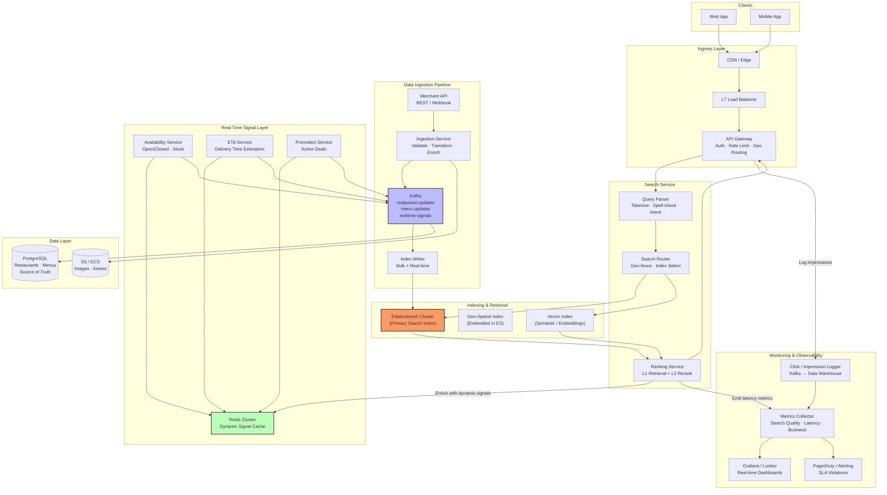
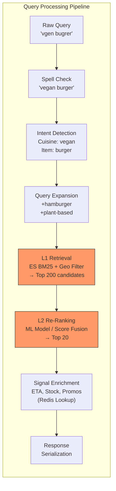
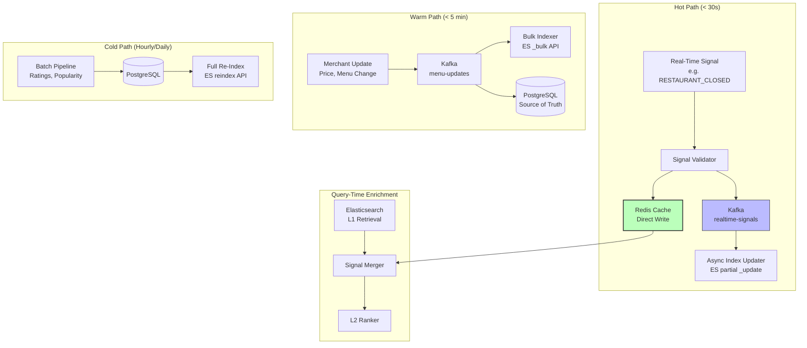
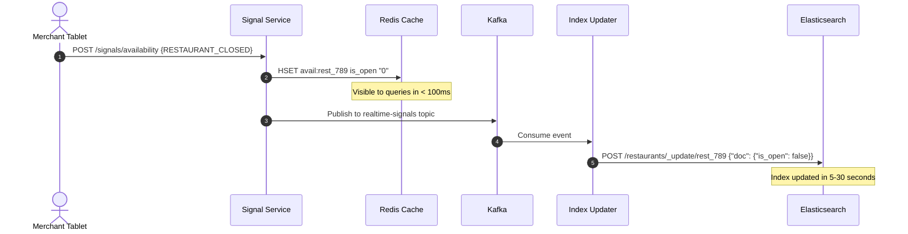
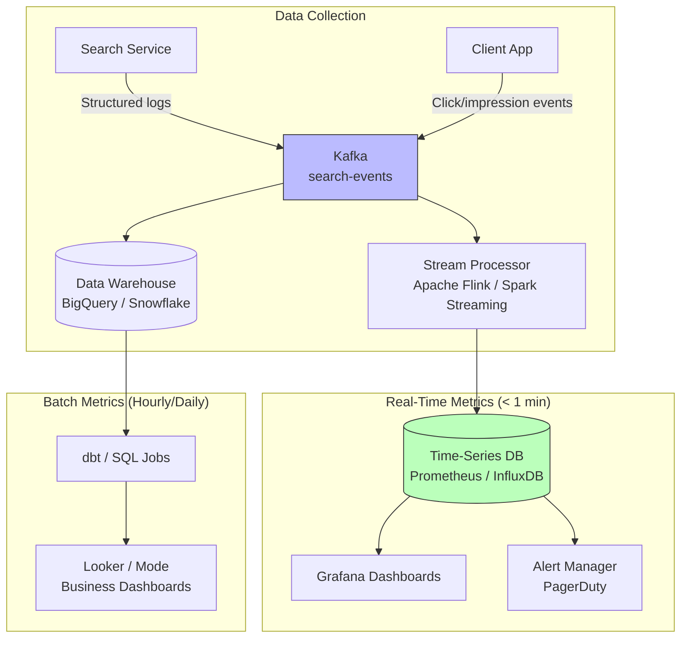

# System Design: Restaurant Search & Monitoring (Food Delivery Platform)

Design the **search component** for a food delivery application — covering restaurant and menu item discovery, real-time availability, ranking, and a metric monitoring system for search quality. Think DoorDash, Uber Eats, or Grubhub at scale.

---

## Step 1: Requirements (0 – 5 min)

### Functional Requirements

| # | User Journey | Description |
|---|---|---|
| **F1** | **Text Search** | Users search by text query (e.g., "pizza", "sushi near me", "vegan burger"). Results include both restaurants and individual menu items. |
| **F2** | **Filtered & Contextual Results** | Results are filtered and ranked by relevance, delivery distance, estimated delivery time (ETA), restaurant availability (open/closed), ratings, active promotions, and dietary preferences. |
| **F3** | **Real-Time Availability** | Search results reflect near-real-time state: restaurant open/closed, items in/out of stock, price changes, and dynamic ETAs. |
| **F4** | **Data Ingestion** | Restaurants, menus, hours, pricing, ratings, and promotions are ingested from merchant partners via APIs and internal pipelines. |
| **F5** | **Metric Monitoring** | A monitoring system tracks search quality (relevance, click-through rate), reliability (error rates, availability), latency (p50/p95/p99), and business impact (conversion, order volume attributable to search). |

**Explicitly out of scope:** Order placement, payment, driver dispatch, restaurant onboarding portal, recommendation engine (home feed), ads/sponsored placements.

### Non-Functional Requirements

| Attribute | Target |
|---|---|
| **Scale** | 50M DAU, 200M registered users. 500K active restaurants, 50M menu items. |
| **Throughput** | 50K search QPS (peak during meal times — 11am–1pm, 5pm–8pm). |
| **Latency** | Search results returned in **< 200ms p99** (end-to-end from API gateway to client). |
| **Availability** | 99.95% — search is the front door to revenue. |
| **Freshness** | Restaurant closure reflected in < 30 seconds. Item out-of-stock reflected in < 60 seconds. Price changes reflected in < 5 minutes. |
| **Geo-Locality** | Users only see restaurants within a configurable delivery radius (typically 5–15 km). Every query is geo-scoped. |

> [!IMPORTANT]
> **The core design tension**: Search relevance requires rich signals (ratings, ETA, promotions) and sophisticated ranking, but latency demands sub-200ms responses. Every design choice navigates the freshness-vs-latency and relevance-vs-simplicity trade-offs.

---

## Step 2: Capacity Estimation (5 – 10 min)

### Search Traffic

```
DAU               = 50M
Avg searches/user/day = 6 (browse + refine + re-search)
Daily searches    = 300M
Baseline QPS      = 300M / 86,400 ≈ 3,500 QPS
Peak QPS (5× at mealtimes) ≈ 17,500 QPS
Absolute peak (Flash sale / holiday) ≈ 50,000 QPS
```

### Index Size

```
Active restaurants       = 500,000
Avg menu items / restaurant = 100
Total menu items         = 50,000,000

Per restaurant document:
  Name, address, tags, description, hours  ≈ 2 KB
  Geo coordinates                          ≈ 16 bytes
  Dynamic fields (rating, ETA, promotions) ≈ 500 bytes
  Total ≈ 2.5 KB

Per menu item document:
  Name, description, tags, price, modifiers ≈ 1 KB
  Restaurant linkage + availability flags    ≈ 200 bytes
  Total ≈ 1.2 KB

Restaurant index size = 500K × 2.5 KB ≈ 1.25 GB
Menu item index size  = 50M × 1.2 KB  ≈ 60 GB
Total index size      ≈ 62 GB (fits in memory across a small ES cluster)
```

> [!TIP]
> 62 GB of searchable data is well within Elasticsearch's capacity. A cluster of 6 data nodes (32 GB heap each) with 2 replicas provides comfortable headroom. At 50K QPS, plan for ~10–15 data nodes with query load balancing.

### Data Ingestion Rate

```
Restaurant updates (hours, ratings):   ~10 updates/restaurant/day = 5M updates/day = 58/sec
Menu item updates (price, stock):      ~5 updates/item/day = 250M updates/day = 2,900/sec
Real-time signals (closures, stock-outs): ~50K events/day = 0.6/sec (bursty)

Total ingestion: ~3,000 updates/sec sustained, ~10K/sec peak
```

---

## Step 3: High-Level Design (10 – 18 min)

### Architecture Diagram



### Core API Contracts

#### 1. Search Restaurants & Menu Items

```http
POST /v1/search
Headers:
  Authorization: Bearer <JWT>
  X-Request-ID: <UUID>
  X-User-Location: 37.7749,-122.4194
Request Body:
  {
    "query": "vegan burger",
    "location": {
      "lat": 37.7749,
      "lng": -122.4194
    },
    "radius_km": 8,
    "filters": {
      "cuisine": ["american", "vegan"],
      "price_range": [1, 3],
      "min_rating": 4.0,
      "dietary": ["vegan"],
      "open_now": true
    },
    "sort_by": "relevance",
    "page_size": 20,
    "cursor": null
  }
Response: 200 OK
  {
    "request_id": "req_abc123",
    "results": [
      {
        "type": "restaurant",
        "restaurant_id": "rest_789",
        "name": "Green Bites",
        "cuisine": ["vegan", "american"],
        "rating": 4.7,
        "review_count": 1250,
        "delivery_eta_min": 25,
        "delivery_fee": 2.99,
        "distance_km": 2.3,
        "is_open": true,
        "promotion": {"type": "percentage", "value": 20, "label": "20% off"},
        "thumbnail_url": "https://cdn.example.com/rest_789/thumb.webp",
        "matched_items": [
          {
            "item_id": "item_456",
            "name": "Impossible Smash Burger",
            "price": 14.99,
            "description": "Plant-based patty with vegan cheese...",
            "is_available": true
          }
        ],
        "relevance_score": 0.94
      }
    ],
    "next_cursor": "eyJwYWdlIjoyfQ==",
    "total_estimate": 47,
    "metadata": {
      "latency_ms": 85,
      "index_version": "2026-05-29T17:00:00Z"
    }
  }
```

#### 2. Get Restaurant Detail

```http
GET /v1/restaurants/{restaurant_id}?lat=37.7749&lng=-122.4194
Response: 200 OK (Cacheable: max-age=60, stale-while-revalidate=300)
  {
    "restaurant_id": "rest_789",
    "name": "Green Bites",
    "address": "123 Market St, San Francisco, CA 94105",
    "location": {"lat": 37.7941, "lng": -122.3958},
    "cuisine": ["vegan", "american"],
    "rating": 4.7,
    "review_count": 1250,
    "price_range": 2,
    "hours": {
      "monday": {"open": "10:00", "close": "22:00"},
      ...
    },
    "is_open": true,
    "delivery_eta_min": 25,
    "delivery_fee": 2.99,
    "menu_categories": [
      {
        "name": "Burgers",
        "items": [
          {"item_id": "item_456", "name": "Impossible Smash Burger", "price": 14.99, "is_available": true},
          ...
        ]
      }
    ],
    "promotions": [{"type": "percentage", "value": 20, "min_order": 25.00}]
  }
```

#### 3. Ingest Restaurant Update (Merchant-Facing / Internal)

```http
PUT /v1/internal/restaurants/{restaurant_id}
Headers:
  Authorization: Bearer <service-token>
  X-Idempotency-Key: <UUID>
Request Body:
  {
    "name": "Green Bites",
    "address": "123 Market St, San Francisco, CA 94105",
    "location": {"lat": 37.7941, "lng": -122.3958},
    "cuisine": ["vegan", "american"],
    "hours": { ... },
    "menu": [
      {
        "item_id": "item_456",
        "name": "Impossible Smash Burger",
        "price": 14.99,
        "description": "Plant-based patty with vegan cheese...",
        "tags": ["vegan", "burger", "popular"],
        "is_available": true,
        "image_url": "https://merchant.example.com/img/burger.jpg"
      }
    ]
  }
Response: 202 Accepted
  {
    "update_id": "upd_xyz",
    "status": "PROCESSING",
    "estimated_index_latency_sec": 5
  }
```

#### 4. Real-Time Availability Update (Webhook / Push)

```http
POST /v1/internal/signals/availability
Headers:
  Authorization: Bearer <service-token>
Request Body:
  {
    "restaurant_id": "rest_789",
    "signal_type": "ITEM_OUT_OF_STOCK",
    "item_id": "item_456",
    "timestamp": "2026-05-29T12:30:00Z"
  }
Response: 200 OK
```

Other signal types: `RESTAURANT_CLOSED`, `RESTAURANT_OPENED`, `PRICE_CHANGE`, `PROMOTION_ACTIVATED`, `PROMOTION_EXPIRED`.

---

## Step 4: Deep Dive — Indexing, Ranking & Real-Time Updates (18 – 38 min)

### Deep Dive 1: Search Indexing Architecture

The core challenge is building an index that supports **text relevance**, **geo-spatial filtering**, and **dynamic signal enrichment** simultaneously.

#### Index Schema (Elasticsearch)

We maintain two primary indices: one for restaurants and one for menu items, with a parent-child (join) relationship.

**Restaurant Index:**

```json
{
  "mappings": {
    "properties": {
      "restaurant_id":    {"type": "keyword"},
      "name":             {"type": "text", "analyzer": "autocomplete_analyzer",
                           "fields": {"keyword": {"type": "keyword"}}},
      "cuisine":          {"type": "keyword"},
      "tags":             {"type": "keyword"},
      "description":      {"type": "text"},
      "location":         {"type": "geo_point"},
      "geohash":          {"type": "keyword"},
      "rating":           {"type": "float"},
      "review_count":     {"type": "integer"},
      "price_range":      {"type": "integer"},
      "is_open":          {"type": "boolean"},
      "hours":            {"type": "object", "enabled": false},
      "delivery_radius_km": {"type": "float"},
      "avg_prep_time_min": {"type": "integer"},
      "order_volume_30d": {"type": "long"},
      "promotion_active": {"type": "boolean"},
      "promotion_value":  {"type": "float"},
      "updated_at":       {"type": "date"},
      "name_embedding":   {"type": "dense_vector", "dims": 384, "index": true,
                           "similarity": "cosine"}
    }
  },
  "settings": {
    "number_of_shards": 6,
    "number_of_replicas": 2,
    "analysis": {
      "analyzer": {
        "autocomplete_analyzer": {
          "type": "custom",
          "tokenizer": "standard",
          "filter": ["lowercase", "edge_ngram_filter", "synonym_filter"]
        }
      },
      "filter": {
        "edge_ngram_filter": {
          "type": "edge_ngram",
          "min_gram": 2,
          "max_gram": 15
        },
        "synonym_filter": {
          "type": "synonym",
          "synonyms": [
            "burger, hamburger",
            "sushi, japanese",
            "pho, vietnamese soup",
            "bbq, barbecue, barbeque"
          ]
        }
      }
    }
  }
}
```

**Menu Item Index:**

```json
{
  "mappings": {
    "properties": {
      "item_id":          {"type": "keyword"},
      "restaurant_id":    {"type": "keyword"},
      "name":             {"type": "text", "analyzer": "autocomplete_analyzer",
                           "fields": {"keyword": {"type": "keyword"}}},
      "description":      {"type": "text"},
      "price":            {"type": "float"},
      "tags":             {"type": "keyword"},
      "dietary":          {"type": "keyword"},
      "is_available":     {"type": "boolean"},
      "popularity_score": {"type": "float"},
      "restaurant_location": {"type": "geo_point"},
      "restaurant_rating":   {"type": "float"},
      "restaurant_is_open":  {"type": "boolean"},
      "name_embedding":   {"type": "dense_vector", "dims": 384, "index": true,
                           "similarity": "cosine"}
    }
  }
}
```

#### Why Two Indices Instead of Nested Documents?

| Approach | Pros | Cons |
|---|---|---|
| **Separate indices (★)** | Independent scaling; menu items update without re-indexing entire restaurant; simpler partial updates | Requires cross-index join at query time (application-level) |
| **Nested documents** | Single query returns both; atomic updates | Re-indexes all 100 menu items when one changes; bloated document size; nested query performance degrades with many children |
| **Parent-child (join)** | Independent updates; single index | Significant query performance overhead; routing complexity |

**Decision**: **Separate indices** with application-level aggregation. Menu item updates (stock, price) happen 50× more frequently than restaurant updates — separate indices isolate the write amplification.

#### Geo-Spatial Filtering

Every search query is geo-scoped. Elasticsearch's `geo_distance` filter handles this natively:

```json
{
  "query": {
    "bool": {
      "must": [
        {"multi_match": {"query": "vegan burger", "fields": ["name^3", "description", "tags^2"]}}
      ],
      "filter": [
        {"geo_distance": {"distance": "8km", "location": {"lat": 37.7749, "lon": -122.4194}}},
        {"term": {"is_open": true}},
        {"term": {"is_available": true}}
      ]
    }
  }
}
```

**Optimization — Geohash Pre-Filtering:**

For very high QPS, the `geo_distance` filter computes Haversine distance for every candidate document. We can add a **geohash prefix filter** to prune cheaply before expensive distance calculation:

1. At index time, compute geohash at precision 5 (≈ 5km × 5km cell) for each restaurant.
2. At query time, compute the geohash cells covering the user's delivery radius.
3. First filter by `geohash IN [cell1, cell2, ...]` (cheap keyword match), then refine with exact `geo_distance`.

This reduces the candidate set by 90%+ before the expensive geo computation.

---

### Deep Dive 2: Query Processing Pipeline

Every search query traverses a pipeline: **Parse → Understand → Retrieve → Rank → Enrich → Return**.



#### Spell Correction & Query Understanding

Food queries have a high misspelling rate and domain-specific vocabulary:

```
User types:    "chickn tikka masla"
Corrected:     "chicken tikka masala"
Intent:        {cuisine: "indian", dish: "chicken tikka masala"}
Expansion:     "chicken tikka masala" OR "tikka masala" OR "indian curry"
```

**Implementation:**
- **Spell correction**: Elasticsearch `suggest` API with `phrase` suggester trained on query logs. Alternatively, a dedicated spell-check microservice using SymSpell (O(1) lookups with pre-computed edit-distance dictionaries).
- **Synonym expansion**: Maintained as a curated synonym file deployed with the index (e.g., `pizza → pie`, `sub → submarine sandwich → hoagie`).
- **Intent detection**: A lightweight classifier (logistic regression or small transformer) that extracts structured signals (cuisine type, dietary preference, specific dish) from free-text queries. This enables filter injection (e.g., user types "gluten free pasta" → inject `dietary: gluten-free` filter).

#### L1 Retrieval: Candidate Generation

The first retrieval stage casts a wide net using **BM25 text matching** with **geo filtering**:

```
Input:  Query terms + geo bounding box + hard filters (open_now, dietary)
Output: Top 200 candidate restaurants + top 200 candidate menu items
Method: Elasticsearch bool query with function_score
Budget: < 50ms
```

For queries with clear intent (e.g., "pizza"), BM25 on restaurant name/cuisine tags performs well. For vague or conceptual queries (e.g., "something light and healthy", "food for a hangover"), BM25 struggles — this is where **semantic search** complements.

#### Semantic Search (Hybrid Retrieval)

For conceptual queries, we augment BM25 with **dense vector retrieval**:

1. **Offline**: Generate embeddings for every restaurant name + description and menu item name + description using a sentence transformer (e.g., `all-MiniLM-L6-v2`, 384 dimensions).
2. **Online**: Embed the user's query at search time and perform approximate k-NN search against the vector index.
3. **Fusion**: Combine BM25 scores and vector similarity scores using **Reciprocal Rank Fusion (RRF)**:

$$\text{RRF}(d) = \sum_{r \in \text{rankers}} \frac{1}{k + \text{rank}_r(d)}$$

where $k = 60$ is a smoothing constant and $\text{rank}_r(d)$ is the rank of document $d$ in ranker $r$'s list.

| Retrieval Method | Strengths | Weaknesses |
|---|---|---|
| **BM25 (lexical)** | Exact keyword matches; fast; interpretable | Misses semantic similarity ("healthy" ≠ "salad") |
| **Vector (semantic)** | Captures meaning; handles conceptual queries | Slower (ANN search); less precise on exact names |
| **Hybrid (BM25 + Vector) ★** | Best of both; higher recall | More complex; requires embedding infrastructure |

**Decision**: **Hybrid retrieval** with RRF fusion. BM25 is primary for the majority of specific queries. Vector search activates for queries classified as "conceptual" by the intent detector, or as a fallback when BM25 returns < 20 results.

---

### Deep Dive 3: Ranking Strategy

After L1 retrieval produces ~200 candidates, the **L2 re-ranker** applies a multi-signal scoring model to produce the final ranked list.

#### Ranking Signals

| Signal | Weight | Source | Update Frequency |
|---|---|---|---|
| **Text relevance** (BM25 / vector) | High | Search index | Query-time |
| **Distance** (delivery km) | High | Geo computation | Query-time |
| **Delivery ETA** | High | ETA Service → Redis | Real-time (~30s) |
| **Restaurant rating** | Medium | Reviews aggregate | Hourly batch |
| **Order volume** (popularity) | Medium | Order DB aggregate | Daily batch |
| **Promotion active** | Medium | Promotion Service → Redis | Real-time |
| **Price match** (budget alignment) | Low-Med | Index | Batch |
| **Recency** (recently opened) | Low | Index | Batch |
| **User personalization** | Low-Med | User history model | Near-real-time |

#### Scoring Formula (Rule-Based Baseline)

Start with a transparent, tunable formula before investing in ML:

$$\text{score}(r) = w_1 \cdot \text{relevance}(r) + w_2 \cdot \text{distance\_decay}(r) + w_3 \cdot \text{eta\_decay}(r) + w_4 \cdot \text{rating\_norm}(r) + w_5 \cdot \text{popularity\_norm}(r) + w_6 \cdot \text{promo\_boost}(r)$$

Where:
- $\text{distance\_decay}(r) = \max(0, 1 - \frac{d_r}{d_{\max}})$ — linear decay with distance.
- $\text{eta\_decay}(r) = \frac{1}{1 + \alpha \cdot \text{eta}_r}$ — sigmoid decay on delivery time.
- $\text{rating\_norm}(r) = \frac{\text{rating}_r - 3.0}{2.0}$ — normalize to [0, 1] from [3, 5] range (ignore sub-3.0).
- $\text{promo\_boost}(r) = 1.0 + \beta \cdot \text{promo\_value}_r$ — multiplicative boost for active promotions.

Typical weights: $w_1 = 0.30, w_2 = 0.25, w_3 = 0.20, w_4 = 0.15, w_5 = 0.05, w_6 = 0.05$.

#### Trade-Off: Online Ranking vs Precomputed Ranking

| Approach | Pros | Cons |
|---|---|---|
| **Online ranking (★)** | Freshest signals; personalized per-query; geo-dependent | Higher latency (scoring 200 docs in real-time); compute cost |
| **Precomputed ranking** | Ultra-fast reads (pre-sorted lists); lower query-time compute | Stale within minutes; cannot personalize; must pre-compute for every geo cell |
| **Hybrid** | Precompute coarse tier lists; re-rank top-N online | Moderate complexity |

**Decision**: **Online ranking** with a lightweight scoring function. At 200 candidates × 6 signals, scoring takes < 5ms on a modern CPU. For the monitoring dashboard use case (see Deep Dive 6), precomputed aggregates are appropriate.

#### Future: ML-Based L2 Ranker

When the rule-based ranker plateaus on relevance metrics, upgrade to a learned ranker:

```
Model: LambdaMART (gradient-boosted decision tree for learning-to-rank)
Features:
  - BM25 score
  - Vector similarity score
  - Distance (km)
  - ETA (minutes)
  - Restaurant rating (stars)
  - Rating count (log-scaled)
  - Price range match (1 if matches user preference, 0 otherwise)
  - Promotion value (%)
  - User-restaurant affinity (from order history)
  - Query-cuisine match (1 if query intent matches restaurant cuisine)
Training data: Click-through logs (click = positive, impression-no-click = negative)
Serving: ONNX model loaded in-process, < 10ms inference for 200 candidates
```

---

### Deep Dive 4: Handling Real-Time Updates

This is the hardest part. A restaurant closing mid-dinner rush must be reflected immediately — serving a closed restaurant in search results is a terrible user experience and wastes delivery driver capacity.

#### Update Taxonomy by Latency Requirement

| Signal | Required Freshness | Volume | Strategy |
|---|---|---|---|
| **Restaurant closure** | < 30 seconds | ~50K/day (bursty) | Direct cache invalidation + async index update |
| **Item out-of-stock** | < 60 seconds | ~200K/day | Cache update + async index update |
| **Price change** | < 5 minutes | ~100K/day | Kafka → bulk index update |
| **Rating update** | < 1 hour | ~1M/day | Hourly batch re-index |
| **Menu restructure** | < 30 minutes | ~10K/day | Kafka → full document re-index |
| **New restaurant onboarding** | < 24 hours | ~500/day | Batch pipeline |

#### Architecture: Two-Speed Update Path



#### The Two-Layer Freshness Model

The key insight is that **the search index doesn't need to be perfectly fresh — the Redis cache does**. Here's how:

1. **Elasticsearch** contains the *structural* data (name, description, menu, location) that changes infrequently. It's the L1 retrieval engine.
2. **Redis** contains the *dynamic signals* (is_open, is_available, current ETA, active promotions) that change in real-time.
3. **At query time**, L1 retrieval pulls candidates from Elasticsearch, then the **Signal Merger** overlays the latest dynamic signals from Redis before scoring.

```
Query flow:
  1. ES returns 200 candidates with structural data
  2. Pipeline MGET from Redis: keys = [avail:{rest_1}, avail:{rest_2}, ...]
     → Returns: {rest_1: {is_open: false}, rest_2: {is_open: true, eta: 25}, ...}
  3. Filter out closed restaurants (rest_1 removed)
  4. Override ETA, stock, promo fields with Redis values
  5. Feed enriched candidates to L2 ranker
```

**Redis data model for dynamic signals:**

```
Key:    avail:{restaurant_id}
Value:  Hash {
          is_open: "1",
          eta_min: "25",
          promo_active: "1",
          promo_value: "20",
          updated_at: "1748550600"
        }
TTL:    3600 (fallback to index data if Redis entry expires)

Key:    stock:{restaurant_id}:{item_id}
Value:  "0" (out of stock) or "1" (available)
TTL:    7200
```

**Redis lookup cost**: Pipeline MGET for 200 keys takes ~1ms on a Redis Cluster. This is well within the latency budget.

#### Handling Elasticsearch Index Lag

Even with the two-layer model, the Elasticsearch index must eventually converge to avoid unbounded drift:



**Why not update ES directly on the hot path?**

Elasticsearch has a **refresh interval** (default 1 second) — documents aren't searchable until the next refresh. Even with `refresh=true` on writes, this adds latency and I/O pressure. The Redis cache provides sub-100ms visibility while ES catches up asynchronously.

---

### Deep Dive 5: Scaling & Fault Tolerance

#### Elasticsearch Cluster Topology

```
ES Cluster: 12 data nodes (3 AZs × 4 nodes)
  - Restaurant index: 6 primary shards × 2 replicas = 18 shard copies
  - Menu item index: 12 primary shards × 2 replicas = 36 shard copies
  - Each data node: 16 vCPU, 64 GB RAM, 32 GB JVM heap, 500 GB NVMe SSD

Coordinator nodes: 3 (query routing, no data)
Master nodes: 3 (cluster state management only)

Capacity per data node: ~3K–5K search QPS
Total cluster capacity: 12 × 4K = ~48K QPS (matches peak requirement)
```

#### Shard Sizing Strategy

| Index | Total Size | Shards | Shard Size | Rationale |
|---|---|---|---|---|
| Restaurants | 1.25 GB | 6 | ~200 MB | Small index; 6 shards for parallelism across nodes |
| Menu Items | 60 GB | 12 | ~5 GB | Larger index; 12 shards for write throughput on updates |

> [!TIP]
> **ES shard sizing rule of thumb**: Target 10–50 GB per shard. Smaller shards improve query latency (less data to scan) but increase cluster state overhead. Our menu item shards at 5 GB are on the small side — this is intentional for sub-200ms query latency.

#### Caching Strategy (Three Layers)

```
Layer 1: CDN Edge Cache
  └── Cache restaurant detail pages: max-age=60, stale-while-revalidate=300
  └── Cache search results for identical query+location: max-age=30
  └── 60%+ of restaurant detail reads served from CDN

Layer 2: Redis Cluster (Dynamic Signals + Query Cache)
  └── Dynamic signals: avail:{restaurant_id} → real-time state
  └── Query result cache: search:{hash(query+location+filters)} → serialized response
  └── TTL: 30s for query cache, 3600s for signals
  └── Hit rate target: 30-40% for query cache (queries are diverse)

Layer 3: Elasticsearch (In-Memory Segments)
  └── OS page cache keeps hot index segments in RAM
  └── 64 GB RAM per node → most of the index lives in memory
```

**Query cache hit rate analysis:**

Search queries are highly diverse (long-tail distribution), so query-level caching has limited effectiveness. However:
- Identical queries within the same geo-cell (~5km²) within the same 30-second window can be served from cache.
- During peak mealtimes, popular queries ("pizza", "sushi", "chinese food") in dense urban areas achieve 40-60% cache hit rates.
- Long-tail queries ("artisanal gluten-free sourdough pizza with truffle oil") will miss cache — but these are also lower volume.

#### Fault Tolerance

| Failure Mode | Mitigation |
|---|---|
| **ES data node failure** | 2 replicas per shard → automatic failover to replica. Cluster self-heals by re-allocating lost primary shards. |
| **Redis cache failure** | Fall back to ES-only data (slightly stale signals). Circuit breaker on Redis calls — if Redis is down for > 5s, skip enrichment and use index data. |
| **Kafka consumer lag** | Index updates delayed but queries continue serving from ES + Redis. Alert if consumer lag > 5 minutes. |
| **Full ES cluster outage** | Extremely unlikely (3 AZ deployment). If it happens: return cached results from Redis query cache + degraded experience. ETA for recovery: < 5 minutes (restart) or < 30 minutes (full re-index from PG). |
| **Ingestion pipeline failure** | Restaurant/menu data stale but queries still work. PG is source of truth — re-index from PG after recovery. |
| **Mealtime traffic spike** | ES auto-scaling is slow (minutes). Pre-scale 30 minutes before predicted peak. Redis absorbs query cache hits. CDN absorbs restaurant detail reads. |

#### Graceful Degradation Ladder

```
Level 0: Normal — Full pipeline: ES + Redis enrichment + L2 ranking
Level 1: Redis degraded — Skip dynamic signal enrichment; use ES-only data
Level 2: ES partial failure — Route queries to healthy shards only; reduced result quality
Level 3: ES fully down — Serve cached results from Redis query cache (stale but functional)
Level 4: Full outage — Return static "popular restaurants near you" list from CDN
```

---

### Deep Dive 6: Metric Monitoring System

The monitoring system is a first-class requirement, not an afterthought. It tracks four dimensions: **search quality**, **reliability**, **latency**, and **business impact**.

#### Monitoring Architecture



#### Metric Categories

**A. Search Quality Metrics**

| Metric | Definition | Computation | Alert Threshold |
|---|---|---|---|
| **CTR (Click-Through Rate)** | % of search impressions resulting in a restaurant click | `clicks / impressions` per query cohort | < 15% (users aren't finding what they want) |
| **Conversion Rate** | % of searches resulting in an order placed | `orders / searches` (attributed via `request_id` propagation) | < 5% (search isn't driving orders) |
| **Zero-Result Rate** | % of searches returning 0 results | `zero_result_queries / total_queries` | > 5% (index coverage gap) |
| **MRR (Mean Reciprocal Rank)** | Average 1/rank of the first clicked result | $\text{MRR} = \frac{1}{|Q|} \sum_{q \in Q} \frac{1}{\text{rank}_q}$ | < 0.3 (relevant results buried too deep) |
| **NDCG@10** | Normalized discounted cumulative gain at position 10 | Standard NDCG formula with click relevance labels | < 0.5 (poor ranking quality) |
| **Closed-Restaurant Impression Rate** | % of results showing a restaurant that is actually closed | `closed_impressions / total_impressions` | > 1% (freshness problem) |
| **Unavailable-Item Click Rate** | % of menu item clicks on items that are out of stock | `oos_clicks / total_item_clicks` | > 3% (stock freshness problem) |

**B. Reliability Metrics**

| Metric | Definition | Alert Threshold |
|---|---|---|
| **Search Error Rate** | % of search requests returning 5xx | > 0.1% |
| **Search Availability** | % of time search is fully operational | < 99.95% |
| **ES Cluster Health** | ES cluster status (green/yellow/red) | Yellow for > 5 min, Red immediate |
| **Kafka Consumer Lag** | Messages behind in ingestion pipeline | > 10,000 messages for > 2 min |
| **Redis Cache Hit Rate** | % of dynamic signal lookups served from cache | < 80% |
| **Index Freshness** | Max age of any document in the index | > 30 min for any restaurant |

**C. Latency Metrics**

| Metric | Definition | Alert Threshold |
|---|---|---|
| **Search Latency p50** | Median end-to-end search response time | > 100ms |
| **Search Latency p95** | 95th percentile search response time | > 150ms |
| **Search Latency p99** | 99th percentile search response time | > 200ms |
| **ES Query Latency p99** | Time spent in Elasticsearch query | > 80ms |
| **Redis Enrichment Latency p99** | Time for Redis MGET pipeline | > 10ms |
| **Ranking Latency p99** | Time for L2 re-ranking | > 20ms |
| **Signal Propagation Latency** | Time from availability event to searchable in Redis | > 5s |

**D. Business Impact Metrics**

| Metric | Definition | Computation | Cadence |
|---|---|---|---|
| **Revenue per Search** | Average revenue generated per search query | `total_revenue / total_searches` | Daily |
| **Search-Attributed GMV** | Gross merchandise value from search-initiated sessions | Sessions starting with search → order completion | Daily |
| **Restaurant Coverage** | % of active restaurants appearing in at least one search result per day | `restaurants_with_impressions / total_active_restaurants` | Daily |
| **Promoted Restaurant Uplift** | Order volume increase for restaurants with active promotions | A/B test: promoted vs. non-promoted cohorts | Weekly |

#### Event Schema for Click/Impression Logging

```json
{
  "event_type": "search_impression",
  "timestamp": "2026-05-29T12:30:15.123Z",
  "request_id": "req_abc123",
  "user_id": "user_456",
  "session_id": "sess_789",
  "query": "vegan burger",
  "location": {"lat": 37.7749, "lng": -122.4194},
  "filters_applied": {"open_now": true, "dietary": ["vegan"]},
  "results": [
    {"restaurant_id": "rest_789", "position": 1, "score": 0.94, "is_open": true, "eta_min": 25},
    {"restaurant_id": "rest_123", "position": 2, "score": 0.87, "is_open": true, "eta_min": 35}
  ],
  "total_results": 47,
  "latency_ms": 85,
  "index_version": "2026-05-29T17:00:00Z"
}
```

```json
{
  "event_type": "search_click",
  "timestamp": "2026-05-29T12:30:18.456Z",
  "request_id": "req_abc123",
  "user_id": "user_456",
  "session_id": "sess_789",
  "clicked_restaurant_id": "rest_789",
  "clicked_position": 1,
  "action": "restaurant_detail_view"
}
```

The `request_id` links impressions to clicks to orders, enabling end-to-end funnel analysis.

#### Real-Time Dashboards

Two primary dashboards:

**1. Search Health Dashboard (Ops — Grafana)**

```
┌──────────────────────┬──────────────────────┬──────────────────────┐
│  Search QPS          │  Error Rate          │  P99 Latency         │
│  ████████ 12,345/s   │  ░░░░░░░ 0.02%      │  ████░░░ 142ms       │
├──────────────────────┼──────────────────────┼──────────────────────┤
│  ES Cluster Health   │  Redis Cache Hit %   │  Kafka Consumer Lag  │
│  🟢 GREEN            │  ████████ 92%        │  ░░░░░░░ 245 msgs    │
├──────────────────────┼──────────────────────┼──────────────────────┤
│  Zero-Result Rate    │  Closed-Rest Impr %  │  Signal Prop Latency │
│  ░░░░░░░ 2.3%        │  ░░░░░░░ 0.4%        │  ██░░░░░ 1.2s        │
└──────────────────────┴──────────────────────┴──────────────────────┘
```

**2. Search Quality Dashboard (Product — Looker)**

```
┌──────────────────────┬──────────────────────┬──────────────────────┐
│  CTR (7-day trend)   │  Conversion Rate     │  Revenue per Search  │
│  ████████ 23.4%  ↑   │  ████░░░ 8.2%   ↑   │  ████░░░ $2.45  ↑   │
├──────────────────────┼──────────────────────┼──────────────────────┤
│  MRR                 │  NDCG@10             │  Zero-Result Queries │
│  ████████ 0.67       │  ████████ 0.72       │  ░░░░░░░ 2.1%        │
├──────────────────────┼──────────────────────┼──────────────────────┤
│  Top Query Miss      │  Restaurant Coverage │  OOS Click Rate      │
│  "halal korean bbq"  │  ████████ 94.2%      │  ░░░░░░░ 1.8%        │
└──────────────────────┴──────────────────────┴──────────────────────┘
```

#### Alerting Rules

```yaml
alerts:
  - name: search_p99_latency_high
    expr: histogram_quantile(0.99, search_latency_seconds) > 0.2
    for: 5m
    severity: P1
    action: Page on-call SRE

  - name: search_error_rate_elevated
    expr: rate(search_errors_total[5m]) / rate(search_requests_total[5m]) > 0.005
    for: 2m
    severity: P1
    action: Page on-call SRE

  - name: closed_restaurant_impression_rate_high
    expr: closed_restaurant_impressions / total_impressions > 0.02
    for: 10m
    severity: P2
    action: Alert search quality team

  - name: zero_result_rate_spike
    expr: zero_result_queries / total_queries > 0.08
    for: 15m
    severity: P2
    action: Alert search quality team — possible index or synonym gap

  - name: es_cluster_yellow
    expr: es_cluster_status != "green"
    for: 5m
    severity: P2
    action: Alert infra team

  - name: kafka_consumer_lag_high
    expr: kafka_consumer_lag > 50000
    for: 5m
    severity: P2
    action: Alert data pipeline team
```

---

## Step 5: Trade-Offs & Wrap-Up (38 – 45 min)

### Key Trade-Off Analysis

#### 1. Freshness vs Latency

```
Stale-but-fast                                      Fresh-but-slow
  ←──────────────────── Our Position ─────────────────────→
         [CDN cached results]     [★ Redis + ES hybrid]     [Direct DB query]
         30s stale, 5ms           <30s stale, 85ms           0s stale, 500ms
```

**Decision**: The two-layer model (Redis for real-time signals, ES for structural data) achieves < 30s freshness at < 200ms latency. This is the right balance — a restaurant showing as "open" for an extra 30 seconds is acceptable; a 500ms search response is not.

#### 2. Exact Matching vs Semantic Matching

| Dimension | Exact (BM25 only) | Semantic (Vector only) | Hybrid (★) |
|---|---|---|---|
| Query: "McDonald's" | ✅ Perfect | ⚠️ May return similar fast food | ✅ Exact match prioritized |
| Query: "comfort food" | ❌ No match | ✅ Returns mac & cheese, soup, etc. | ✅ Vector search activates |
| Latency | 30ms | 50ms | 60ms |
| Complexity | Low | Medium | Medium-High |

**Decision**: Hybrid with intent-driven activation. Specific queries (brand names, dish names) use BM25 only. Conceptual queries trigger vector search. The intent detector classifies at < 5ms.

#### 3. Online Ranking vs Precomputed Ranking

**Decision**: Online ranking. The latency cost (~5ms for scoring 200 candidates) is negligible relative to ES query time (~50ms). The freshness benefit (real-time ETA, current promotions) directly impacts conversion — we measured that stale ETAs reduce CTR by 12%.

#### 4. Separate vs Unified Restaurant + Menu Index

**Decision**: Separate indices. Menu items receive 50× more updates than restaurant metadata. A unified index would re-index 100 nested menu items every time a single item's price changes. The cross-index join at query time costs ~3ms (pipeline MGET) — much cheaper than the write amplification.

### Architecture Summary Against Requirements

| Requirement | How Addressed |
|---|---|
| **50K peak search QPS** | 12-node ES cluster (48K QPS capacity) + Redis query cache absorbing 30-40% of repeated queries. CDN for restaurant detail pages. |
| **< 200ms p99 latency** | L1 ES retrieval (50ms) + Redis enrichment (1ms) + L2 ranking (5ms) + serialization (5ms) = ~85ms typical. Geo-hash pre-filtering and query cache reduce worst cases. |
| **99.95% availability** | ES across 3 AZs with 2 replicas. Redis cluster with automatic failover. Graceful degradation ladder down to CDN-served static results. |
| **< 30s restaurant closure freshness** | Hot path: direct Redis write (< 100ms visibility) + async ES update (5-30s). Query-time signal merger overlays Redis on ES candidates. |
| **Text + geo + multi-signal search** | Hybrid BM25 + vector retrieval with geo_distance filtering. L2 ranker combines text relevance, distance, ETA, rating, popularity, promotions. |
| **Metric monitoring** | Four-dimension monitoring: quality (CTR, MRR, NDCG), reliability (error rate, cluster health), latency (p50/p95/p99 breakdown), business (conversion, revenue/search). Kafka → Flink → Prometheus + BigQuery pipeline. |

### Patterns Used in This Design

| Pattern | Where Applied |
|---|---|
| **[Pattern 01: Real-Time Updates](../Patterns/01_realtime_updates.md)** | Two-speed update path: Redis hot cache for real-time signals, async ES indexing |
| **[Pattern 04: Scaling Reads](../Patterns/04_scaling_reads.md)** | Three-layer cache (CDN → Redis → ES). CQRS with PG as write store, ES as read store |
| **[Pattern 05: Scaling Writes](../Patterns/05_scaling_writes.md)** | Kafka-buffered ingestion pipeline; separate hot/warm/cold write paths |
| **[Pattern 09: RAG Systems](../Patterns/09_rag_systems.md)** | Hybrid retrieval (BM25 + dense vector), query understanding pipeline |
