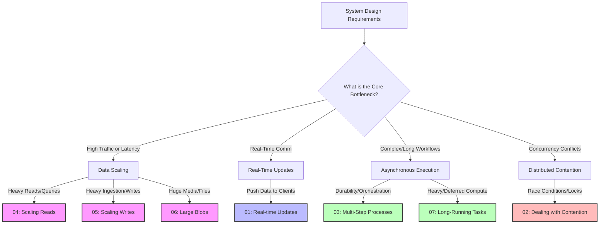

# Deep System Design & Architectures

Welcome to the **Deep System Design** repository. This is an advanced, production-grade guide designed for software engineers, system architects, and technical leaders who want to master system design with both **breadth and depth**. 

Here, we move away from superficial high-level explanations and instead focus on rigorous, deep-dive architectural blueprints, detailed database lock structures, and real-world system behavior patterns under load.

---

## 🚀 The System Design Patterns Framework

We have built a premium **Pattern Matching Framework** located in the [Patterns](./Patterns/README.md) directory. 

Instead of memorizing monolithic system templates (like "Design Netflix" or "Design WhatsApp"), this framework helps you decompose any complex system into **7 core recurring architectural patterns**. Master these patterns, and you can solve almost any system design bottleneck.

### 🧭 Navigation Map: The 7 Core Patterns

Click on any pattern below to jump directly into its dedicated technical deep-dive, including interactive **Mermaid flowcharts/sequence diagrams**, exact database schema considerations, and performance trade-off matrices:

| Pattern | Architectural Challenge | Real-World Use Cases |
| :--- | :--- | :--- |
| 📡 **[Pattern 01: Real-Time Updates](./Patterns/01_realtime_updates.md)** | Pushing events to active clients with ultra-low latency. | Chat apps, live dashboards, ride tracking. |
| ⚡ **[Pattern 02: Dealing with Contention](./Patterns/02_dealing_with_contention.md)** | Preventing race conditions and locking over hot resources. | Flash sales, seat booking, ticket booking, ad click counters. |
| ⚙️ **[Pattern 03: Multi-Step Processes](./Patterns/03_multi_step_processes.md)** | Coordinating distributed sagas and ensuring durable workflow execution. | E-commerce checkouts, payment processing, ingestion pipelines. |
| 📖 **[Pattern 04: Scaling Reads](./Patterns/04_scaling_reads.md)** | Optimizing systems with high read-to-write ratios (e.g., $10^5:1$). | Social media feeds, search engines, catalog lookups. |
| ✍️ **[Pattern 05: Scaling Writes](./Patterns/05_scaling_writes.md)** | Absorbing high-throughput write streams and high-ingestion bursts. | IoT sensor streaming, clickstream analysis, log aggregation. |
| 📦 **[Pattern 06: Large Blobs](./Patterns/06_large_blobs.md)** | Storing, chunking, and serving massive media files without database strain. | Video streaming (HLS/DASH), CDN caching, pre-signed S3 uploads. |
| ⏳ **[Pattern 07: Long-Running Tasks](./Patterns/07_long_running_tasks.md)** | Offloading CPU/memory heavy computations from main API request threads. | Video transcodes, PDF compilers, bulk email workers, ML processing. |

---

## 🎯 How to Use this Repository

1. **Start with the [Patterns Master Index](./Patterns/README.md)**: Understand the "Pattern Matching" philosophy and learn how to identify which of the 7 bottlenecks apply to your systems.
2. **Deep-Dive into Specific Patterns**: Read the structured files under `/Patterns` to master the technical nuances, failover states, and trade-off matrices.
3. **Draft Systems Under These Architectures**: When proposing a new service or reviewing an existing architecture, run your design through the "Resilience Guardrails" and "Edge Case" questions provided at the end of each pattern file.

---

## 🛡️ Security & Scalability by Default
Every pattern described herein is framed through the lens of:
*   **Security by Default**: Least privilege access patterns, TLS encryption for stateful sockets, secure pre-signed URLs, and webhook signatures.
*   **Production Resiliency**: Exponential backoff with random jitter, Dead-Letter Queues (DLQ), write buffers, database sharding strategies, and idempotency guarantees.

