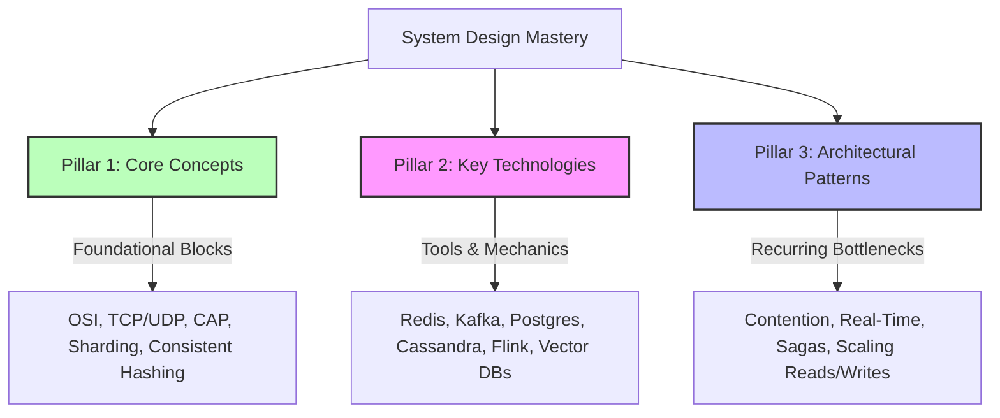
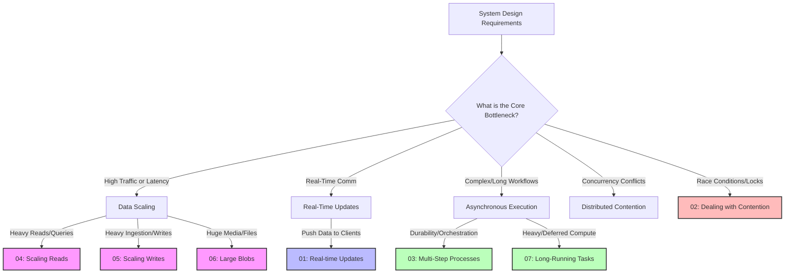

# Deep System Design & Architectures: The Masterclass

Welcome to the **Deep System Design & Architectures** repository. This is an advanced, production-grade guide designed for software engineers, system architects, and technical leaders who want to master backend engineering, security, and distributed systems at a **Staff+ level**.

Instead of superficial high-level descriptions or memorized monolithic system templates (like "Design Netflix" or "Design Uber"), this guide is built on **three unified pillars of system design mastery**.

---

## 🏛️ The Three Pillars of System Design

A Staff+ engineer does not memorize solutions; they compose them from first principles, key tools, and architectural patterns:

---

## 📘 Pillar 1: Core Concepts (The Building Blocks)

Master the fundamental distributed systems principles and networking layers that govern all modern software architectures.

| # | Core Concept | Architectural Focus | Key Highlights |
|---|---|---|---|
| **01** | **[Networking Essentials](./Core_Concepts/01-networking-essentials.md)** | Network plumbing & protocols | OSI layers, TCP vs UDP, HTTP/2/3, gRPC, mTLS, L4/L7 load balancers, connection draining |
| **02** | **[API Design](./Core_Concepts/02-api-design.md)** | Robust client-server contracts | REST vs GraphQL, idempotency keys, cursor pagination, rate-limiting algorithms, Postel's Law |
| **03** | **[Data Modeling](./Core_Concepts/03-data-modeling.md)** | System storage & state representation | SQL vs NoSQL, schema design, soft deletes, optimistic locking, event sourcing, AI agent schemas |
| **04** | **[Caching](./Core_Concepts/04-caching.md)** | Sub-millisecond read optimization | Cache layers, Redis Sentinel vs Cluster, Cache Stampede, Hot Keys, Read-Your-Own-Writes |
| **05** | **[Sharding](./Core_Concepts/05-sharding.md)** | Horizontal database scaling | Shard key selection, logical vs physical sharding, live database migration using `gh-ost` |
| **06** | **[Consistent Hashing](./Core_Concepts/06-consistent-hashing.md)** | Elastic ring-based routing | Hash ring mechanics, virtual nodes, replication factor, Cassandra/DynamoDB partition routing |
| **07** | **[CAP Theorem](./Core_Concepts/07-cap-theorem.md)** | High-availability vs consistency math | CP vs AP systems, PACELC theorem (including MongoDB/Postgres), quorum consistency (`W + R > N`) |
| **08** | **[Database Indexing](./Core_Concepts/08-db-indexing.md)** | Search & query optimizations | B-Tree vs LSM-Tree, covering & partial indexes, planner stats, pgvector HNSW/IVF-PQ indexing |
| **09** | **[Numbers to Know](./Core_Concepts/09-numbers-to-know.md)** | Quantitative reasoning | Latency comparison numbers (NVMe, SSD, Network), p99 vs p50, memory bandwidth for LLM inference |
| **10** | **[Security Fundamentals](./Core_Concepts/10-security-fundamentals.md)** | System protection & compliance | JWT security pitfalls, OAuth2/PKCE, Secrets management, injection attacks, DDoS mitigation, PII isolation |

---

## 🛠️ Pillar 2: Key Technologies (The Tools of the Trade)

Understand the internal mechanics, write/read paths, edge cases, and specific trade-offs of the most common production systems.

| # | Technology | Primary Role in System Design | Deep Dive Focus |
|---|---|---|---|
| **01** | **[Redis](./Key_Technologies/01-redis.md)** | In-memory cache, locks, & speed | Data structures, Sentinel vs Cluster, hot keys, Redlock vs ZooKeeper, Redis Streams |
| **02** | **[Elasticsearch](./Key_Technologies/02-elasticsearch.md)** | Full-text search & text analytics | Inverted index, mappings, shards & segments, sync patterns (Dual-write vs CDC) |
| **03** | **[Kafka](./Key_Technologies/03-kafka.md)** | Event streaming & message backbone | Partitioning, consumer groups, delivery guarantees, CDC, dead-letter queues |
| **04** | **[API Gateway](./Key_Technologies/04-api-gateway.md)** | Ingress routing, safety, & rate limits | Request lifecycle, canary deployments, circuit breakers, BFF pattern, AI/LLM gateways |
| **05** | **[Cassandra](./Key_Technologies/05-cassandra.md)** | Extreme write scale wide-column DB | Partition keys vs clustering keys, LSM compaction, tunable consistency quorum, write path |
| **06** | **[DynamoDB](./Key_Technologies/06-dynamodb.md)** | Serverless key-value / document DB | Single-table design, GSI/LSI, DynamoDB Streams, partition splits, on-demand pricing |
| **07** | **[PostgreSQL](./Key_Technologies/07-postgresql.md)** | Default relational OLTP database | MVCC concurrency, PgBouncer pooling, replication lag, pgvector, Citus sharding, TimescaleDB |
| **08** | **[Apache Flink](./Key_Technologies/08-flink.md)** | Stateful stream processing engine | Sliding/Tumbling windows, event time vs processing time, watermarks, exactly-once guarantees |
| **09** | **[ZooKeeper](./Key_Technologies/09-zookeeper.md)** | Distributed consensus & coordination | ZAB protocol, hierarchical znodes, leader election, distributed locking, ZooKeeper vs etcd |
| **10** | **[Time Series Databases](./Key_Technologies/10-time-series-databases.md)** | Metrics, monitoring, & IoT logging | Columnar storage, compression (Gorilla), ClickHouse/Prometheus, retention policies, downsampling |
| **11** | **[Structures for Big Data](./Key_Technologies/11-data-structures-big-data.md)** | Probabilistic algorithms for scale | Bloom filters, Count-Min Sketch, HyperLogLog, MinHash/LSH, Skip Lists, Merkle Trees |
| **12** | **[Vector Databases](./Key_Technologies/12-vector-databases.md)** | Semantic search & RAG storage | ANN search, HNSW graph structures, IVF-PQ quantization, pgvector, hybrid search, rerankers |

---

## 🚀 Pillar 3: Architectural Patterns (The Pattern Matching Framework)

Instead of trying to memorize dozens of complete application blueprints, master the **7 core architectural patterns** that cover 95% of all system design interview bottlenecks.

Go directly to a pattern's deep dive using the quick links below:

| # | Architectural Pattern | Core Bottleneck Addressed | Real-World Application |
|---|---|---|---|
| **01** | **[Real-Time Updates](./Patterns/01_realtime_updates.md)** | Pushing events to active clients with ultra-low latency | Chat apps (WhatsApp), live stock tickers, GPS location tracking (Uber) |
| **02** | **[Dealing with Contention](./Patterns/02_dealing_with_contention.md)** | Managing race conditions and concurrent write access | Flash sales, seat/ticket reservations (Ticketmaster), distributed locks |
| **03** | **[Multi-Step Processes](./Patterns/03_multi_step_processes.md)** | Orchestrating multi-service sagas and durable workflows | E-commerce checkout, payment streams, user onboarding |
| **04** | **[Scaling Reads](./Patterns/04_scaling_reads.md)** | Optimizing heavy read traffic (e.g., $10^5:1$ reads to writes) | Social feeds (Twitter), static asset CDNs, CQRS denormalization |
| **05** | **[Scaling Writes](./Patterns/05_scaling_writes.md)** | Absorbing intense, bursty write streams | IoT sensor telemetry, web clickstreams, chat log logging |
| **06** | **[Large Blobs](./Patterns/06_large_blobs.md)** | Managing, storing, & streaming massive binary files | Video playback (Netflix HLS/DASH), direct pre-signed S3 uploads |
| **07** | **[Long-Running Tasks](./Patterns/07_long_running_tasks.md)** | Offloading heavy synchronous work from API gateway threads | Video transcoding, PDF compile queues, massive bulk email pipelines |

Learn how to compositionally apply these patterns in the **[Patterns Master Index](./Patterns/README.md)**.

---

## 🧠 Integration Example: Composing the Three Pillars

In a Staff+ interview, you do not use these pillars in isolation; you **weave them together** to form a highly resilient architecture.

**Scenario**: *"Design a global, highly concurrent ticket-booking platform like Ticketmaster."*
1. **Detect the Patterns (Pillar 3)**:
   - *Requirement*: "Millions of users trying to book the same hot concert seat simultaneously." $\rightarrow$ **[Pattern 02: Dealing with Contention](./Patterns/02_dealing_with_contention.md)**.
   - *Requirement*: "Fulfilling a reservation involves reserve seat $\rightarrow$ charge payment $\rightarrow$ assign ticket $\rightarrow$ send receipt email." $\rightarrow$ **[Pattern 03: Multi-Step Processes](./Patterns/03_multi_step_processes.md)**.
2. **Apply the Core Concepts (Pillar 1)**:
   - Protect the payment ledger with **[CAP Theorem](./Core_Concepts/07-cap-theorem.md)** CP guarantees and sequential consistency.
   - Scale seat views globally using **[Caching](./Core_Concepts/04-caching.md)** with a write-behind strategy.
3. **Deploy the Key Technologies (Pillar 2)**:
   - Handle the initial high-concurrency seat reservation in-memory using **[Redis Lua scripts](./Key_Technologies/01-redis.md)**.
   - Guarantee order fulfillment durability using **[Kafka distributed event streaming](./Key_Technologies/03-kafka.md)**.
   - Model transactional accounts using **[PostgreSQL MVCC and advisory locks](./Key_Technologies/07-postgresql.md)**.

---

## 🛡️ Resilience & Security by Default

Every design choice detailed across these three pillars has been vetted for:
*   **Security First**: Zero trust networking, token-based session safety (OAuth2/PKCE), and transport-level safety (mTLS).
*   **Production Resiliency**: End-to-end backpressure, Dead-Letter Queues (DLQ), write-ahead logging (WAL), partition-key planning, and connection draining grace periods.
